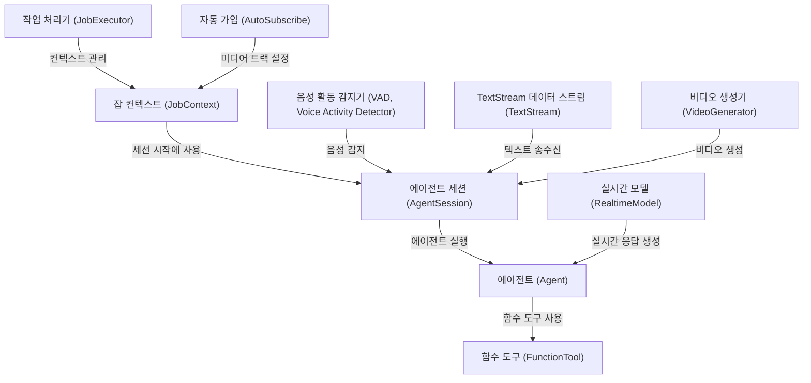
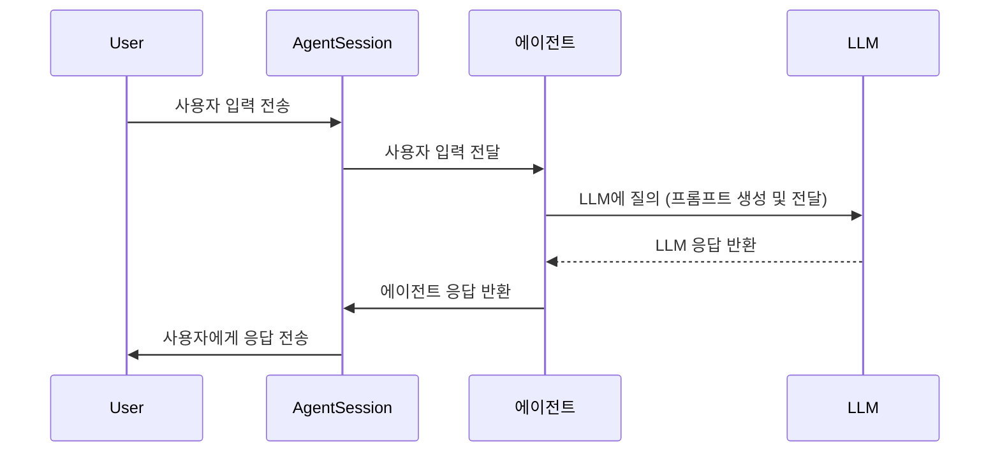

## 개요: agents-main

이 프로젝트는 **에이전트**를 사용하여 실시간 음성 및 텍스트 기반 대화를 자동화하는 것을 목표로 합니다. *작업 컨텍스트*를 통해 필요한 정보에 접근하고, *에이전트 세션*에서 다양한 도구를 활용하여 사용자와 상호 작용하며, *작업 처리기*가 이러한 작업들을 효율적으로 실행합니다. 궁극적으로 사용자에게 더욱 편리하고 지능적인 서비스를 제공하는 것을 목표로 합니다.

<br>



### Chapters

1. 에이전트 (Agent) 
2. [에이전트 세션 (AgentSession)](/livekit/102-Livekit/)
3. [잡 컨텍스트 (JobContext)](/livekit/103-Livekit/)
4. [작업 처리기 (JobExecutor)](/livekit/104-Livekit/)
5. [TextStream 데이터 스트림 (TextStream)](/livekit/105-Livekit/)
6. [음성 활동 감지기 (VAD, Voice Activity Detector)](/livekit/106-Livekit/)
7. [실시간 모델 (RealtimeModel)](/livekit/107-Livekit/)
8. [함수 도구 (FunctionTool)](/livekit/108-Livekit/)
9. [비디오 생성기 (VideoGenerator)](/livekit/109-Livekit/)
10. [자동 가입 (AutoSubscribe)](/livekit/110-Livekit/)

<br>


## Chapter 1: 에이전트 (Agent)

가상 비서가 되어 보세요! 이 튜토리얼에서는 `agents-main` 프로젝트의 핵심 개념인 에이전트(Agent)에 대해 알아봅니다. 마치 영화 속 배우처럼, 에이전트는 여러분의 프로젝트에서 다양한 역할을 수행할 수 있는 강력한 도구입니다.

### 1.1 에이전트가 왜 필요할까요?

여러분이 온라인 쇼핑몰을 운영한다고 상상해 보세요. 고객 문의에 24시간 답변해 주는 가상 상담원이 필요할 겁니다. 이 상담원은 상품 정보를 검색하고, 주문 상태를 확인하며, 자주 묻는 질문에 답변할 수 있어야 합니다.

이 모든 기능을 직접 코딩하는 대신, 에이전트를 사용하면 훨씬 쉽고 효율적으로 구현할 수 있습니다. 에이전트는 여러분이 정의한 규칙과 목표에 따라 자율적으로 작업을 수행하는 "스마트 캐릭터"와 같습니다.

### 1.2 에이전트란 무엇일까요?

에이전트(Agent)는 다음과 같이 정의할 수 있습니다.

*   **가상 캐릭터:** 대화에 참여하고, 사용자에게 응답하며, 작업을 수행하는 가상의 존재입니다.
*   **LLM(대규모 언어 모델) 활용:** LLM과 같은 도구를 사용하여 텍스트를 생성하고, 질문에 답변하며, 명령을 실행합니다.
*   **목표 지향적:** 특정 목표와 지침을 가지고 있으며, 이를 달성하기 위해 노력합니다.

쉽게 말해, 에이전트는 여러분의 프로젝트에서 특정 작업을 수행하도록 설계된 똑똑한 도우미입니다.

### 1.3 에이전트의 핵심 개념

에이전트를 이해하기 위한 몇 가지 중요한 개념을 살펴봅시다.

1.  **지침 (Instructions):** 에이전트가 따라야 할 규칙과 목표를 정의합니다. "당신은 친절한 고객 지원 상담원입니다."와 같은 문장이 될 수 있습니다. 이는 에이전트의 행동 방식을 결정하는 중요한 요소입니다.

2.  **도구 (Tools):** 에이전트가 사용할 수 있는 기능 또는 API입니다. 예를 들어, 상품 정보를 검색하거나, 주문을 처리하는 도구를 제공할 수 있습니다.

3.  **대화 컨텍스트 (Chat Context):** 에이전트와 사용자 간의 대화 기록입니다. 이전 대화 내용을 기억하고, 일관성 있는 답변을 제공하는 데 사용됩니다.

4.  **LLM (Large Language Model):** 에이전트가 텍스트를 생성하고 이해하는 데 사용하는 핵심 엔진입니다. OpenAI의 GPT 모델과 같은 것들이 있습니다.

### 1.4 간단한 에이전트 만들기

이제 간단한 에이전트를 만들어 보겠습니다. 다음 코드는 "당신은 도움이 되는 비서입니다."라는 지침을 가진 에이전트를 생성합니다.

```python
from livekit.agents import Agent

class MyAgent(Agent):
    def __init__(self) -> None:
        super().__init__(
            instructions="You are a helpful assistant.",
        )
```

위 코드는 `Agent` 클래스를 상속받아 `MyAgent` 클래스를 정의합니다. `__init__` 메서드에서 `instructions` 매개변수를 사용하여 에이전트의 지침을 설정합니다. 이 경우 에이전트는 "도움이 되는 비서" 역할을 수행하게 됩니다.

### 1.5 에이전트 사용하기

에이전트를 사용하려면 먼저 [에이전트 세션 (AgentSession)](/livekit/102-Livekit)을 생성해야 합니다. 에이전트 세션은 에이전트가 작업을 수행하는 환경을 제공합니다.

다음 코드는 에이전트 세션을 생성하고, 에이전트를 시작하는 방법을 보여줍니다.

```python
from livekit.agents import AgentSession
from livekit.plugins import openai

async def entrypoint(ctx): # JobContext context
    session = AgentSession()
    await session.start(
        agent=MyAgent(),
        llm=openai.LLM(model="gpt-4o-mini"), # OpenAI 모델 사용
    )
```

위 코드에서 `AgentSession` 클래스를 사용하여 에이전트 세션을 생성합니다. `session.start()` 메서드를 호출하여 에이전트를 시작하고, 사용할 LLM을 지정합니다. 여기서는 OpenAI의 `gpt-4o-mini` 모델을 사용합니다. `JobContext` (자세한 내용은 [잡 컨텍스트 (JobContext)](/livekit/103-Livekit) 에서 다룹니다)는 에이전트가 실행되는 환경에 대한 정보를 제공합니다.

이 코드를 실행하면 에이전트가 시작되고, 사용자의 입력에 응답할 준비가 됩니다.

### 1.6 에이전트 내부 동작

에이전트는 어떻게 작동할까요? 다음은 에이전트가 사용자의 입력에 응답하는 과정을 간략하게 보여주는 시퀀스 다이어그램입니다.



1.  **사용자 입력:** 사용자가 에이전트 세션에 입력을 보냅니다.
2.  **입력 전달:** 에이전트 세션은 사용자 입력을 에이전트에게 전달합니다.
3.  **LLM 질의:** 에이전트는 사용자 입력과 현재 대화 컨텍스트를 사용하여 LLM에 질의합니다. (프롬프트 엔지니어링)
4.  **LLM 응답:** LLM은 에이전트에게 응답을 반환합니다.
5.  **응답 반환:** 에이전트는 LLM 응답을 에이전트 세션에 반환합니다.
6.  **사용자에게 응답:** 에이전트 세션은 사용자에게 응답을 보냅니다.

이 과정에서 에이전트는 LLM을 사용하여 사용자의 질문에 답변하고, 작업을 수행합니다.

### 1.7 코드 살펴보기

`livekit-agents/livekit/agents/voice/agent.py` 파일에서 `Agent` 클래스의 구현을 확인할 수 있습니다.

```python
class Agent:x
    def __init__(
        self,
        *,
        instructions: str,
        chat_ctx: NotGivenOr[llm.ChatContext | None] = NOT_GIVEN,
        tools: list[llm.FunctionTool] | None = None,
        ...
    ) -> None:
        self._instructions = instructions
        self._tools = tools.copy() + find_function_tools(self)
        self._chat_ctx = chat_ctx.copy(tools=self._tools) if chat_ctx else ChatContext.empty()
        ...
```

위 코드는 `Agent` 클래스의 생성자를 보여줍니다. `instructions`, `tools`, `chat_ctx`와 같은 매개변수를 사용하여 에이전트의 행동 방식을 설정할 수 있습니다. `self._instructions` 에 에이전트의 지침이 저장되고, `self._tools` 에 사용 가능한 도구들이 저장됩니다. 대화 컨텍스트 또한 `self._chat_ctx`에 저장되어 에이전트가 이전 대화 내용을 기억할 수 있도록 합니다.

### 1.8 결론

이 튜토리얼에서는 에이전트(Agent)의 기본 개념과 사용법에 대해 알아보았습니다. 에이전트는 LLM을 활용하여 다양한 작업을 수행할 수 있는 강력한 도구입니다. 이제 [에이전트 세션 (AgentSession)](/livekit/102-Livekit)에 대해 자세히 알아보고, 에이전트를 더욱 효과적으로 사용하는 방법을 배워봅시다.


---

Generated by [AI Codebase Knowledge Builder](https://github.com/The-Pocket/Tutorial-Codebase-Knowledge)