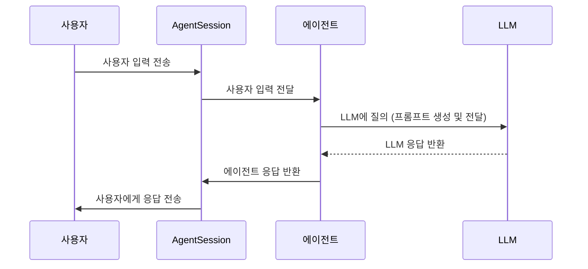

## Chapter 2: 에이전트 세션 (AgentSession)

지난 [에이전트 (Agent)](/livekit/101-Livekit) 튜토리얼에서는 에이전트의 기본 개념과 간단한 에이전트를 만드는 방법에 대해 알아보았습니다. 이제 에이전트가 실제로 작업을 수행하는 환경인 **에이전트 세션 (AgentSession)**에 대해 자세히 알아볼 차례입니다.

### 2.1 왜 에이전트 세션이 필요할까요?

여러분이 영화 감독이라고 상상해 보세요. 배우(에이전트)에게 역할을 부여하고, 촬영 장비(STT, LLM, TTS 등)를 준비하고, 촬영 스케줄을 관리해야 합니다. 에이전트 세션은 바로 이 "촬영 스케줄 관리" 역할을 합니다.

예를 들어, 24시간 고객 지원 에이전트를 구축한다고 가정해 봅시다. 에이전트가 고객의 음성을 텍스트로 변환(STT)하고, 질문에 답변하기 위해 LLM을 사용하고, 답변을 음성으로 출력(TTS)해야 합니다. 이 모든 과정을 **에이전트 세션**이 관리합니다. 에이전트 세션은 에이전트의 생명주기를 관리하고, 필요한 도구를 연결하여 사용자(고객)와 에이전트 간의 원활한 대화를 가능하게 합니다.

### 2.2 에이전트 세션이란 무엇일까요?

**에이전트 세션 (AgentSession)**은 에이전트의 전체 라이프사이클을 관리하는 컨테이너입니다. 마치 배우의 연기 세션과 같아서, 다음과 같은 중요한 역할을 수행합니다.

1.  **도구 연결:** 음성 입력 처리(STT), 텍스트 생성(LLM), 음성 출력(TTS) 등 다양한 도구를 연결하여 에이전트가 사용할 수 있도록 합니다.

2.  **흐름 조율:** 오디오 및 텍스트 흐름을 조율하여 에이전트가 사용자와 자연스럽게 대화할 수 있도록 합니다.

3.  **상태 추적:** 에이전트의 상태(예: 대기 중, 응답 중)와 대화 내용을 추적하여 일관성 있는 응답을 제공합니다.

4.  **이벤트 처리:** 에이전트의 상태 변화, 사용자 입력, 시스템 오류 등 다양한 이벤트를 처리합니다.

쉽게 말해, 에이전트 세션은 에이전트가 작업을 수행하는 "무대"와 같습니다. 에이전트 세션이 없으면 에이전트는 제대로 작동할 수 없습니다.

### 2.3 에이전트 세션의 핵심 개념

에이전트 세션을 이해하기 위한 몇 가지 중요한 개념을 살펴봅시다.

1.  **시작 (Start):** 에이전트 세션을 시작하는 것은 무대를 여는 것과 같습니다. 에이전트와 필요한 도구를 연결하고, 초기 설정을 수행합니다.

2.  **종료 (Close):** 에이전트 세션을 종료하는 것은 막을 내리는 것과 같습니다. 모든 연결을 끊고, 리소스를 해제합니다.

3.  **입력 (Input):** 사용자의 음성, 텍스트, 비디오 등 에이전트에게 전달되는 모든 정보입니다.

4.  **출력 (Output):** 에이전트가 생성하는 음성, 텍스트, 비디오 등 사용자에게 전달되는 모든 정보입니다.

5.  **상태 (State):** 에이전트의 현재 상태 (예: 초기화 중, 듣는 중, 응답 중)를 나타냅니다.

### 2.4 에이전트 세션 사용하기

이제 에이전트 세션을 사용하여 에이전트를 시작하고, 사용자의 입력에 응답하는 방법을 알아봅시다. [에이전트 (Agent)](/livekit/101-Livekit) 튜토리얼에서 사용했던 간단한 에이전트를 사용하겠습니다.

```python
from livekit.agents import AgentSession
from livekit.plugins import openai

async def entrypoint(ctx): # JobContext context
    session = AgentSession()
    await session.start(
        agent=MyAgent(),  # 이전 챕터에서 정의한 에이전트
        llm=openai.LLM(model="gpt-4o-mini"), # OpenAI 모델 사용
    )
```

위 코드는 에이전트 세션을 생성하고, 에이전트를 시작하는 방법을 보여줍니다.

*   `session = AgentSession()`: 에이전트 세션 객체를 생성합니다. 마치 영화 촬영을 위한 스케줄러를 생성하는 것과 같습니다.
*   `await session.start(...)`: 에이전트 세션을 시작합니다. `agent` 매개변수에는 사용할 에이전트 객체를 전달하고, `llm` 매개변수에는 사용할 LLM (Large Language Model) 객체를 전달합니다. 에이전트, LLM, 그리고 다른 필요한 도구들을 "무대"에 올리는 과정이라고 생각하면 됩니다.  `JobContext` (자세한 내용은 [잡 컨텍스트 (JobContext)](/livekit/103-Livekit) 에서 다룹니다)는 에이전트가 실행되는 환경에 대한 정보를 제공합니다.

이 코드를 실행하면 에이전트가 시작되고, 사용자의 입력에 응답할 준비가 됩니다. 에이전트는 지정된 LLM을 사용하여 텍스트를 생성하고, 사용자의 질문에 답변합니다.

### 2.5 간단한 텍스트 기반 에이전트 예제

`examples/other/text_only.py` 파일을 살펴보겠습니다. 이 예제는 텍스트 입력과 텍스트 출력만 사용하는 간단한 에이전트를 보여줍니다.

```python
import logging

from dotenv import load_dotenv

from livekit.agents import (
    Agent,
    AgentSession,
    JobContext,
    RoomInputOptions,
    RoomOutputOptions,
    WorkerOptions,
    cli,
)
from livekit.plugins import openai

logger = logging.getLogger("text-only")
logger.setLevel(logging.INFO)

load_dotenv()


class MyAgent(Agent):
    def __init__(self) -> None:
        super().__init__(
            instructions="You are a helpful assistant.",
        )


async def entrypoint(ctx: JobContext):
    await ctx.connect()

    session = AgentSession()
    await session.start(
        agent=MyAgent(),
        llm=openai.LLM(model="gpt-4o-mini"),
        # note that no TTS or STT are needed here
        room=ctx.room,
        room_input_options=RoomInputOptions(text_enabled=True, audio_enabled=False),
        room_output_options=RoomOutputOptions(transcription_enabled=True, audio_enabled=False),
    )


if __name__ == "__main__":
    cli.run_app(WorkerOptions(entrypoint_fnc=entrypoint))
```

이 코드에서 주목해야 할 부분은 다음과 같습니다.

*   `RoomInputOptions(text_enabled=True, audio_enabled=False)`: 텍스트 입력을 활성화하고, 오디오 입력을 비활성화합니다.
*   `RoomOutputOptions(transcription_enabled=True, audio_enabled=False)`: 텍스트 출력을 활성화하고, 오디오 출력을 비활성화합니다.

이 설정을 통해 에이전트는 오직 텍스트를 통해서만 사용자와 소통할 수 있습니다.  `generate_reply()` 함수를 통해 입력을 제공하고, `session.on("conversation_item_added", ev)` 이벤트를 통해 에이전트의 출력을 받을 수 있습니다.

### 2.6 에이전트 세션 내부 동작

에이전트 세션은 어떻게 작동할까요? 다음은 에이전트 세션이 에이전트를 시작하고, 사용자의 입력에 응답하는 과정을 간략하게 보여주는 시퀀스 다이어그램입니다.



1.  **사용자 입력:** 사용자가 에이전트 세션에 입력을 보냅니다. 마치 관객이 배우에게 대사를 전달하는 것과 같습니다.
2.  **입력 전달:** 에이전트 세션은 사용자 입력을 에이전트에게 전달합니다.
3.  **LLM 질의:** 에이전트는 사용자 입력과 현재 대화 컨텍스트를 사용하여 LLM에 질의합니다. 에이전트는 LLM에게 질문을 던지고, LLM은 그 질문에 대한 답변을 제공합니다.
4.  **LLM 응답:** LLM은 에이전트에게 응답을 반환합니다.
5.  **응답 반환:** 에이전트는 LLM 응답을 에이전트 세션에 반환합니다.
6.  **사용자에게 응답:** 에이전트 세션은 사용자에게 응답을 보냅니다. 마치 배우가 관객에게 연기를 보여주는 것과 같습니다.

### 2.7 코드 살펴보기

`livekit-agents/livekit/agents/voice/agent_session.py` 파일에서 `AgentSession` 클래스의 구현을 확인할 수 있습니다.

```python
class AgentSession(rtc.EventEmitter[EventTypes], Generic[Userdata_T]):
    def __init__(
        self,
        *,
        turn_detection: NotGivenOr[TurnDetectionMode] = NOT_GIVEN,
        stt: NotGivenOr[stt.STT] = NOT_GIVEN,
        vad: NotGivenOr[vad.VAD] = NOT_GIVEN,
        llm: NotGivenOr[llm.LLM | llm.RealtimeModel] = NOT_GIVEN,
        tts: NotGivenOr[tts.TTS] = NOT_GIVEN,
        mcp_servers: NotGivenOr[list[mcp.MCPServer]] = NOT_GIVEN,
        userdata: NotGivenOr[Userdata_T] = NOT_GIVEN,
        allow_interruptions: bool = True,
        discard_audio_if_uninterruptible: bool = True,
        min_interruption_duration: float = 0.5,
        min_interruption_words: int = 0,
        min_endpointing_delay: float = 0.5,
        max_endpointing_delay: float = 6.0,
        max_tool_steps: int = 3,
        video_sampler: NotGivenOr[_VideoSampler | None] = NOT_GIVEN,
        loop: asyncio.AbstractEventLoop | None = None,
    ) -> None:
        super().__init__()
        # ... (생략) ...
```

위 코드는 `AgentSession` 클래스의 생성자를 보여줍니다. `stt`, `llm`, `tts`와 같은 매개변수를 사용하여 에이전트 세션에 필요한 도구를 설정할 수 있습니다. 이러한 도구들은 에이전트가 작업을 수행하는 데 필요한 "장비"와 같습니다. 예를 들어, `stt`는 음성을 텍스트로 변환하는 "마이크" 역할을 하고, `tts`는 텍스트를 음성으로 변환하는 "스피커" 역할을 합니다.  `llm` 은 에이전트의 "두뇌" 역할을 합니다.

```python
    async def start(
        self,
        agent: Agent,
        *,
        room: NotGivenOr[rtc.Room] = NOT_GIVEN,
        room_input_options: NotGivenOr[room_io.RoomInputOptions] = NOT_GIVEN,
        room_output_options: NotGivenOr[room_io.RoomOutputOptions] = NOT_GIVEN,
    ) -> None:
        """Start the voice agent.
        ...
        """
        async with self._lock:
            if self._started:
                return

            self._agent = agent
            self._update_agent_state("initializing")

            # ... (생략) ...
```

위 코드는 `start` 메서드를 보여줍니다. `agent` 매개변수에는 사용할 에이전트 객체를 전달합니다. `start` 메서드는 에이전트를 초기화하고, 필요한 도구를 연결하고, 에이전트의 상태를 "listening"으로 변경합니다. 이 모든 과정은 에이전트가 작업을 수행할 준비를 마치는 것을 의미합니다.

### 2.8 결론

이 튜토리얼에서는 에이전트 세션 (AgentSession)의 기본 개념과 사용법에 대해 알아보았습니다. 에이전트 세션은 에이전트의 전체 라이프사이클을 관리하고, 필요한 도구를 연결하여 사용자와 에이전트 간의 원활한 대화를 가능하게 하는 중요한 역할을 수행합니다. 이제 [잡 컨텍스트 (JobContext)](/livekit/103-Livekit)에 대해 자세히 알아보고, 에이전트를 더욱 효과적으로 사용하는 방법을 배워봅시다.


---

Generated by [AI Codebase Knowledge Builder](https://github.com/The-Pocket/Tutorial-Codebase-Knowledge)