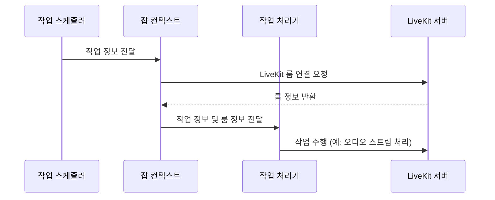

## Chapter 3: 잡 컨텍스트 (JobContext)

지난 [에이전트 세션 (AgentSession)](/livekit/102-Livekit) 튜토리얼에서는 에이전트가 실제로 작업을 수행하는 환경인 에이전트 세션에 대해 알아보았습니다. 이번 장에서는 작업(Job)을 실행하는 데 필요한 모든 정보를 담고 있는 **잡 컨텍스트 (JobContext)**에 대해 자세히 알아볼 것입니다.

### 3.1 잡 컨텍스트는 왜 필요할까요?

가상 비서가 호텔 예약을 도와주는 시나리오를 생각해 봅시다. 비서는 방 정보를 확인하고, 예약 가능 여부를 확인하고, 예약을 진행해야 합니다. 이 모든 작업은 호텔 예약 시스템에 접근하고, 사용자 인증 정보를 사용하고, 작업의 진행 상황을 추적하는 등 다양한 정보가 필요합니다.

**잡 컨텍스트 (JobContext)**는 이러한 모든 정보를 한 곳에 모아두는 역할을 합니다. 마치 레스토랑의 주방과 같아서, 작업에 필요한 모든 재료(인증 정보, 방 정보, 프로세스 상태 등)를 정리해 둡니다. 작업 처리기는 이 컨텍스트를 통해 LiveKit 서버와 상호 작용하고, 로깅을 수행하며, 작업 관련 설정을 관리합니다.

### 3.2 잡 컨텍스트란 무엇일까요?

**잡 컨텍스트 (JobContext)**는 작업을 실행하는 데 필요한 모든 정보를 담고 있는 중앙 집중식 저장소입니다. 에이전트가 작업을 수행하는 데 필요한 모든 도구와 정보를 담고 있는 "작업 공간"이라고 생각하면 됩니다.

잡 컨텍스트의 핵심 개념은 다음과 같습니다.

1.  **작업 정보 (Job Information):** 작업의 ID, 이름, 속성 등 작업에 대한 기본적인 정보를 담고 있습니다.
2.  **룸 (Room):** 에이전트가 참여하고 있는 LiveKit 룸에 대한 정보를 담고 있습니다. [에이전트 세션 (AgentSession)](/livekit/102-Livekit)에서 에이전트가 연결된 룸입니다.
3.  **에이전트 (Agent):** 작업을 수행하는 에이전트에 대한 정보를 담고 있습니다.
4.  **설정 (Configuration):** 작업 실행에 필요한 설정을 담고 있습니다.
5.  **프로세스 (Process):** 작업이 실행되는 프로세스에 대한 정보를 담고 있습니다. (스레드 또는 별도 프로세스)
6.  **로깅 (Logging):** 작업 실행 중 발생하는 로그를 기록하는 데 사용됩니다.

### 3.3 잡 컨텍스트 사용하기

잡 컨텍스트는 작업 처리기의 엔트리포인트 함수에 인자로 전달됩니다. 예를 들어, 다음과 같은 코드를 생각해 볼 수 있습니다.

```python
from livekit.agents import JobContext

async def entrypoint(ctx: JobContext):
    # ctx를 사용하여 작업 수행
    await ctx.connect()
    print(f"룸 이름: {ctx.room.name}")
```

위 코드에서 `entrypoint` 함수는 `JobContext` 객체인 `ctx`를 인자로 받습니다. `ctx`를 사용하여 LiveKit 룸에 연결하고, 룸 이름을 출력할 수 있습니다.

### 3.4 예제: 룸 정보 가져오기

다음은 잡 컨텍스트를 사용하여 룸 정보를 가져오는 간단한 예제입니다.

```python
from livekit.agents import JobContext

async def entrypoint(ctx: JobContext):
    await ctx.connect()
    room_name = ctx.room.name
    print(f"현재 룸 이름은 {room_name} 입니다.")
```

위 코드는 `ctx.room.name`을 사용하여 현재 룸의 이름을 가져옵니다. 룸에 연결된 후에는 룸의 다른 속성들(예: 참여자 목록)에도 접근할 수 있습니다.

**입력:** 없음 (LiveKit 서버에서 작업이 시작될 때 자동으로 컨텍스트가 제공됩니다.)

**출력:** "현재 룸 이름은 $\[룸 이름\]$ 입니다."

#### 3.5 예제: 사용자 정의 로깅

잡 컨텍스트를 사용하면 작업 실행 중 발생하는 로그를 쉽게 기록할 수 있습니다.

```python
import logging
from livekit.agents import JobContext

logger = logging.getLogger("my-agent")

async def entrypoint(ctx: JobContext):
    await ctx.connect()
    ctx.log_context_fields = {"job_id": ctx.job.id}
    logger.info("작업 시작!")
```

위 코드는 `ctx.log_context_fields`를 사용하여 로그에 작업 ID를 추가합니다. 이렇게 하면 로그를 분석할 때 특정 작업과 관련된 로그를 쉽게 찾을 수 있습니다.  모든 logger 호출은 자동으로 해당 `job_id` 필드를 갖게 됩니다.

**입력:** 없음 (LiveKit 서버에서 작업이 시작될 때 자동으로 컨텍스트가 제공됩니다.)

**출력:** 로그 파일에 "작업 시작!" 메시지와 함께 작업 ID가 기록됩니다.

### 3.6 잡 컨텍스트 내부 동작

잡 컨텍스트는 어떻게 작동할까요? 다음은 잡 컨텍스트가 작업 처리기에게 정보를 제공하는 과정을 간략하게 보여주는 시퀀스 다이어그램입니다.



1.  **작업 스케줄러:** LiveKit 서버는 작업을 스케줄링하고 작업에 대한 정보를 잡 컨텍스트에 전달합니다.
2.  **LiveKit 룸 연결 요청:** 잡 컨텍스트는 LiveKit 서버에 연결하여 룸 정보를 가져옵니다.
3.  **작업 정보 및 룸 정보 전달:** 잡 컨텍스트는 작업 정보와 룸 정보를 작업 처리기에게 전달합니다.
4.  **작업 수행:** 작업 처리기는 잡 컨텍스트에서 받은 정보를 사용하여 작업을 수행합니다 (예: 오디오 스트림 처리, LLM 호출).

### 3.7 코드 살펴보기

`livekit-agents/livekit/agents/job.py` 파일에서 `JobContext` 클래스의 구현을 확인할 수 있습니다.

```python
class JobContext:
    def __init__(
        self,
        *,
        proc: JobProcess,
        info: RunningJobInfo,
        room: rtc.Room,
        on_connect: Callable[[], None],
        on_shutdown: Callable[[str], None],
        inference_executor: InferenceExecutor,
    ) -> None:
        self._proc = proc
        self._info = info
        self._room = room
        self._on_connect = on_connect
        self._on_shutdown = on_shutdown
        ...
```

위 코드는 `JobContext` 클래스의 생성자를 보여줍니다. `proc`, `info`, `room`, `on_connect`, `on_shutdown` 등의 매개변수를 사용하여 잡 컨텍스트를 초기화합니다.

*   `proc`: 작업이 실행되는 프로세스에 대한 정보를 담고 있습니다.
*   `info`: 작업의 ID, 이름, 속성 등 작업에 대한 기본적인 정보를 담고 있습니다.
*   `room`: 에이전트가 참여하고 있는 LiveKit 룸에 대한 정보를 담고 있습니다.
*   `on_connect`: 룸 연결 시 호출되는 콜백 함수입니다.
*   `on_shutdown`: 작업 종료 시 호출되는 콜백 함수입니다.

```python
    @property
    def room(self) -> rtc.Room:
        """The Room object is the main interface that the worker should interact with.
        ...
        """
        return self._room
```

위 코드는 `room` 속성을 보여줍니다. `room` 속성을 통해 LiveKit 룸 객체에 접근할 수 있습니다. 작업 처리기는 이 룸 객체를 사용하여 오디오 스트림을 처리하고, 참여자 목록을 관리하고, 다른 LiveKit API를 호출할 수 있습니다.

### 3.8 결론

이 튜토리얼에서는 **잡 컨텍스트 (JobContext)**의 기본 개념과 사용법에 대해 알아보았습니다. 잡 컨텍스트는 작업을 실행하는 데 필요한 모든 정보를 한 곳에 모아두는 중앙 집중식 저장소입니다. 작업 처리기는 이 컨텍스트를 통해 LiveKit 서버와 상호 작용하고, 로깅을 수행하며, 작업 관련 설정을 관리합니다.

다음 장에서는 [작업 처리기 (JobExecutor)](/livekit/104-Livekit)에 대해 자세히 알아보고, 작업을 실제로 수행하는 방법을 배워봅시다.


---

Generated by [AI Codebase Knowledge Builder](https://github.com/The-Pocket/Tutorial-Codebase-Knowledge)