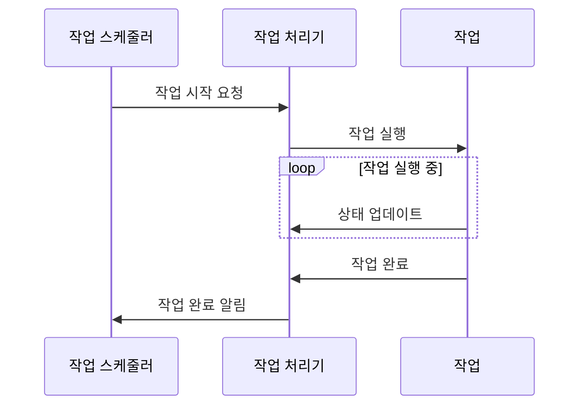

## Chapter 4: 작업 처리기 (JobExecutor)

지난 [잡 컨텍스트 (JobContext)](/livekit/103-Livekit) 튜토리얼에서는 작업 실행에 필요한 모든 정보를 담고 있는 잡 컨텍스트에 대해 알아보았습니다. 이제 작업을 실제로 실행하는 **작업 처리기 (JobExecutor)**에 대해 알아볼 차례입니다.

### 4.1 작업 처리기는 왜 필요할까요?

여러분이 레스토랑을 운영한다고 상상해 보세요. 손님이 주문을 하면 주방장이 주문을 받아 요리를 시작합니다. 주방장은 레시피(코드)를 읽고, 재료(데이터)를 준비하고, 요리 도구(라이브러리)를 사용하여 음식을 만듭니다. **작업 처리기 (JobExecutor)**는 바로 이 주방장의 역할을 합니다.

구체적으로, 음성 비서가 사용자의 음성 명령을 처리하여 음악을 재생하는 기능을 생각해 봅시다. 이 때, 작업 처리기는 다음 역할을 수행합니다.

1.  **작업 시작:** "음악 재생" 명령을 받으면 작업을 시작합니다.
2.  **작업 실행:** 음악 재생 코드를 실행하고, 필요한 음악 파일을 로드합니다.
3.  **작업 상태 관리:** 음악 재생 상태(재생 중, 일시 정지, 정지)를 관리합니다.
4.  **오류 처리:** 음악 파일이 없거나 재생 오류가 발생하면 오류를 처리합니다.

작업 처리기는 이처럼 작업을 실행하고, 상태를 관리하며, 오류를 처리하는 모든 과정을 담당합니다.

### 4.2 작업 처리기란 무엇일까요?

**작업 처리기 (JobExecutor)**는 작업(Job)을 실제로 실행하는 역할을 담당하는 핵심 구성 요소입니다. 마치 공장의 로봇 팔처럼, 스레드 또는 프로세스 내에서 작업을 실행하고, 작업의 상태를 관리하며, 오류를 처리합니다.

작업 처리기의 핵심 개념은 다음과 같습니다.

1.  **작업 실행 (Job Execution):** 작업 처리기는 주어진 작업을 실행합니다. 이는 코드를 실행하고, 데이터를 처리하고, 외부 서비스와 통신하는 것을 포함할 수 있습니다.
2.  **상태 관리 (State Management):** 작업 처리기는 작업의 상태(예: 실행 중, 완료, 실패)를 추적합니다.
3.  **오류 처리 (Error Handling):** 작업 처리기는 작업 실행 중 발생하는 오류를 감지하고 처리합니다. 오류를 기록하고, 작업을 다시 시도하거나, 사용자에게 알림을 보낼 수 있습니다.
4.  **격리 (Isolation):** 작업 처리기는 작업을 격리된 환경에서 실행하여 다른 작업에 영향을 미치지 않도록 합니다. 이는 스레드, 프로세스 또는 컨테이너를 사용하여 구현할 수 있습니다.

### 4.3 작업 처리기 사용하기

`agents-main` 프로젝트에서 `JobExecutor`는 추상 인터페이스입니다. 실제 구현체는 스레드 기반(`ThreadJobExecutor`) 또는 프로세스 기반(`ProcJobExecutor`)으로 제공됩니다. 이 두 가지 구현체는 작업을 실행하는 방식에 차이가 있지만, `JobExecutor` 인터페이스를 통해 동일한 방식으로 사용할 수 있습니다.

다음은 간단한 예제 코드입니다. 먼저, `JobExecutor` 인터페이스를 정의합니다. (실제 코드가 아닙니다. 이해를 돕기 위한 예시입니다.)

```python
class JobExecutor:
    def start(self, job):
        """작업을 시작합니다."""
        pass

    def stop(self, job):
        """작업을 중지합니다."""
        pass

    def get_status(self, job):
        """작업 상태를 반환합니다."""
        pass
```

이제 `ThreadJobExecutor`를 사용하여 작업을 실행하는 방법을 보여드리겠습니다. (실제 코드가 아닙니다. 이해를 돕기 위한 예시입니다.)

```python
# ThreadJobExecutor 예시 (가상 코드)
executor = ThreadJobExecutor()
job = create_job("음악 재생", music_file="my_music.mp3") # 음악 재생 작업을 생성
executor.start(job) # 작업을 시작
status = executor.get_status(job) # 작업 상태를 확인
print(f"작업 상태: {status}") # 작업 상태 출력 (예: 실행 중)
```

위 코드는 `ThreadJobExecutor` 인스턴스를 생성하고, `start()` 메서드를 호출하여 작업을 시작합니다. `get_status()` 메서드를 호출하여 작업 상태를 확인할 수 있습니다.

**입력:** 작업 객체 (예: "음악 재생" 작업, 음악 파일 정보 포함)

**출력:** 작업 상태 (예: "실행 중", "완료", "오류")

### 4.4 작업 실행 흐름

작업 처리기는 다음과 같은 흐름으로 작업을 실행합니다.



1.  **작업 시작 요청:** 작업 스케줄러는 작업 처리기에게 작업을 시작하도록 요청합니다.
2.  **작업 실행:** 작업 처리기는 작업을 실행합니다.
3.  **상태 업데이트:** 작업은 작업 처리기에게 주기적으로 상태를 업데이트합니다.
4.  **작업 완료:** 작업이 완료되면 작업 처리기에게 알립니다.
5.  **작업 완료 알림:** 작업 처리기는 작업 스케줄러에게 작업 완료를 알립니다.

### 4.5 작업 처리기 내부 동작

이제 `agents-main` 프로젝트에서 `JobExecutor`의 내부 동작을 살펴보겠습니다. `JobExecutor`는 추상 인터페이스이며, 실제 구현체는 `ThreadJobExecutor`와 `ProcJobExecutor`입니다.

### 4.6 스레드 기반 작업 처리기 (ThreadJobExecutor)

`ThreadJobExecutor`는 작업을 스레드 내에서 실행합니다. 스레드를 사용하면 프로세스 컨텍스트 전환 비용 없이 작업을 병렬로 실행할 수 있습니다. `livekit-agents/livekit/agents/ipc/job_thread_executor.py` 파일을 참조하십시오.

다음은 `ThreadJobExecutor`의 핵심 코드입니다.

```python
from livekit.agents.ipc import job_proc_lazy_main

class ThreadJobExecutor: # (일부 코드 생략)
    def __init__(self, ...):
        # ...
        self._thread = threading.Thread(
            target=job_proc_lazy_main.thread_main, # 실제 작업 실행 함수
            args=(targs,),
            name="job_thread_runner",
        )

    async def start(self) -> None:
        self._thread.start() # 스레드 시작
```

위 코드는 `ThreadJobExecutor`가 스레드를 생성하고, `job_proc_lazy_main.thread_main` 함수를 스레드에서 실행하는 것을 보여줍니다. `thread_main` 함수는 [잡 컨텍스트 (JobContext)](/livekit/103-Livekit)를 사용하여 작업을 실행하고, 작업 상태를 관리합니다.

### 4.7 프로세스 기반 작업 처리기 (ProcJobExecutor)

`ProcJobExecutor`는 작업을 별도의 프로세스 내에서 실행합니다. 프로세스를 사용하면 메모리 격리 및 오류 격리를 제공할 수 있습니다. 한 작업에서 오류가 발생하더라도 다른 작업에 영향을 미치지 않습니다. `livekit-agents/livekit/agents/ipc/job_proc_executor.py` 파일을 참조하십시오.

다음은 `ProcJobExecutor`의 핵심 코드입니다.

```python
from livekit.agents.ipc import job_proc_lazy_main

class ProcJobExecutor: # (일부 코드 생략)
    def __init__(self, ...):
        # ...
        self._process = self._mp_ctx.Process(  # type: ignore
            target=job_proc_lazy_main.proc_main, args=(proc_args,), name="job_proc" # 실제 작업 실행 함수
        )

    async def start(self) -> None:
        self._process.start() # 프로세스 시작
```

위 코드는 `ProcJobExecutor`가 프로세스를 생성하고, `job_proc_lazy_main.proc_main` 함수를 프로세스에서 실행하는 것을 보여줍니다. `proc_main` 함수는 [잡 컨텍스트 (JobContext)](/livekit/103-Livekit)를 사용하여 작업을 실행하고, 작업 상태를 관리합니다.

### 4.8 공통 로직

`ThreadJobExecutor`와 `ProcJobExecutor`는 모두 `job_proc_lazy_main` 모듈의 `thread_main` 또는 `proc_main` 함수를 사용하여 작업을 실행합니다. 이 함수들은 다음과 같은 공통적인 로직을 수행합니다.

1.  **잡 컨텍스트 생성:** [잡 컨텍스트 (JobContext)](/livekit/103-Livekit)를 생성하여 작업 실행에 필요한 모든 정보를 담습니다.
2.  **작업 초기화:** 작업에 필요한 리소스를 초기화합니다.
3.  **작업 실행:** 작업을 실제로 실행합니다.
4.  **오류 처리:** 작업 실행 중 발생하는 오류를 처리합니다.
5.  **작업 종료:** 작업이 완료되면 리소스를 해제합니다.

### 4.9 결론

이 튜토리얼에서는 작업 처리기 (JobExecutor)의 기본 개념과 사용법에 대해 알아보았습니다. 작업 처리기는 작업을 실제로 실행하고, 상태를 관리하며, 오류를 처리하는 핵심 구성 요소입니다.  이제 [TextStream 데이터 스트림 (TextStream)](/livekit/105-Livekit)에 대해 자세히 알아보고, 텍스트 데이터를 효율적으로 처리하는 방법을 배워봅시다.


---

Generated by [AI Codebase Knowledge Builder](https://github.com/The-Pocket/Tutorial-Codebase-Knowledge)