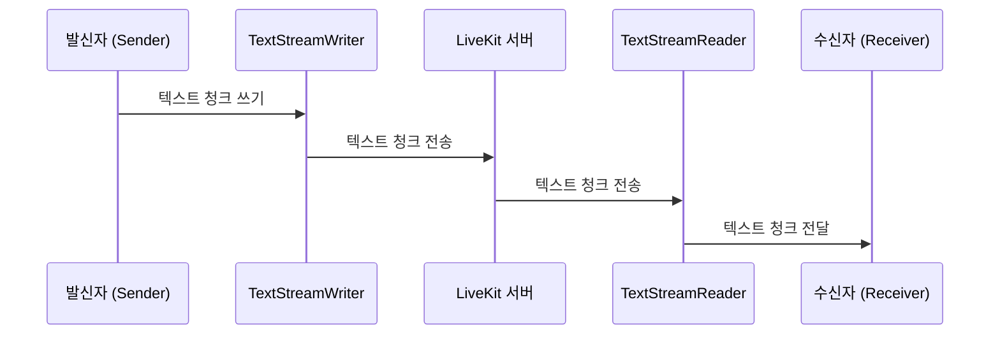

## Chapter 5: TextStream 데이터 스트림 (TextStream)

지난 [작업 처리기 (JobExecutor)](/livekit/104-Livekit) 튜토리얼에서는 작업을 실제로 실행하는 작업 처리기에 대해 알아보았습니다. 이제 텍스트 데이터를 실시간으로 효율적으로 전송하고 처리하는 데 사용되는 **TextStream 데이터 스트림 (TextStream)**에 대해 알아볼 차례입니다.

### 5.1 왜 TextStream이 필요할까요?

실시간 자막을 제공하는 서비스를 만든다고 상상해 보세요. 음성이 텍스트로 변환되는 즉시 사용자에게 표시되어야 합니다. 전체 텍스트를 기다렸다가 한 번에 보내는 대신, 텍스트 조각들을 실시간으로 전송하여 사용자 경험을 향상시키고 싶을 겁니다.

**TextStream**은 바로 이 문제를 해결합니다. TextStream은 텍스트 데이터를 실시간으로 전송하는 파이프라인과 같습니다. 마치 영화 자막처럼 텍스트 데이터를 청크(chunk) 단위로 쪼개어 전송하므로, 수신 측에서 즉시 내용을 확인할 수 있습니다. 이는 챗봇이나 실시간 번역과 같이 실시간성이 중요한 애플리케이션에 매우 유용합니다.

### 5.2 TextStream이란 무엇일까요?

**TextStream 데이터 스트림 (TextStream)**은 텍스트 데이터를 실시간으로 전송하기 위한 추상화입니다. 마치 수도 파이프라인처럼 데이터를 지속적으로 흘려보낼 수 있습니다.

TextStream의 핵심 개념은 다음과 같습니다.

1.  **텍스트 청크 (Text Chunk):** TextStream을 통해 전송되는 텍스트 데이터의 작은 조각입니다. 예를 들어, "안녕하세요"라는 문장을 "안", "녕하", "세요"와 같이 나눌 수 있습니다.
2.  **텍스트 스트림 (Text Stream):** 텍스트 청크가 전송되는 채널입니다.
3.  **텍스트 스트림 작성기 (TextStream Writer):** 텍스트 스트림에 텍스트 청크를 쓰는 역할입니다. 데이터를 파이프라인에 넣는 사람이라고 생각하면 됩니다.
4.  **텍스트 스트림 리더 (TextStream Reader):** 텍스트 스트림에서 텍스트 청크를 읽는 역할입니다. 파이프라인에서 데이터를 꺼내는 사람입니다.
5.  **토픽 (Topic):** TextStream을 식별하는 데 사용되는 문자열입니다. 예를 들어, "lk.chat"이라는 토픽을 사용하여 채팅 메시지를 전송할 수 있습니다. 마치 주소를 사용하여 특정 파이프라인을 찾는 것과 같습니다.

### 5.3 TextStream 사용하기

TextStream을 사용하려면 먼저 `TextStreamWriter`를 사용하여 데이터를 쓰고, `TextStreamReader`를 사용하여 데이터를 읽어야 합니다.

다음은 간단한 예제 코드입니다.

```python
from livekit import rtc

# 텍스트 스트림 작성기 생성 (Creating a text stream writer)
writer = rtc.TextStreamWriter(topic="my_topic")

# 텍스트 청크 쓰기 (Writing text chunks)
await writer.write("안녕하세요")
await writer.write("!")

# 텍스트 스트림 닫기 (Closing the text stream)
await writer.close()
```

위 코드는 "my\_topic"이라는 토픽으로 TextStreamWriter를 생성하고, "안녕하세요"와 "!"라는 텍스트 청크를 씁니다. `write()` 메서드는 텍스트 청크를 스트림에 쓰는 데 사용됩니다. `close()` 메서드는 스트림을 닫는 데 사용됩니다.

**입력:** "안녕하세요!", "!" (텍스트 청크)

**출력:** 없음 (텍스트 청크는 TextStream을 통해 전송됩니다.)

이제 `TextStreamReader`를 사용하여 텍스트 청크를 읽는 방법을 보여드리겠습니다.

```python
from livekit import rtc

async def read_stream(reader: rtc.TextStreamReader):
    async for chunk in reader:
        print(f"수신된 청크: {chunk}")

# 룸에 텍스트 스트림 핸들러 등록 (Registering a text stream handler in a room)
room.register_text_stream_handler(topic="my_topic", handler=read_stream)
```

위 코드는 "my\_topic"이라는 토픽의 TextStreamReader를 등록하고, 스트림에서 텍스트 청크를 읽어 출력합니다. 텍스트 스트림 핸들러는 특정 토픽으로 전송된 텍스트 스트림을 처리하는 함수입니다. `room.register_text_stream_handler()`를 사용하여 룸에 텍스트 스트림 핸들러를 등록할 수 있습니다.

**입력:** "안녕하세요!", "!" (TextStream을 통해 전송된 텍스트 청크)

**출력:**
```
수신된 청크: 안녕하세요
수신된 청크: !
```

이 예제에서는 실시간으로 텍스트 청크가 수신되어 출력되는 것을 확인할 수 있습니다.

### 5.4 간단한 채팅 예제

`examples/other/chat-stream-receiver.py` 파일과 LiveKit Agents examples에서 TextStream의 사용 예시를 볼 수 있습니다.  `TextStreamPrinter` 클래스는 `rtc.TextStreamReader`에서 데이터를 읽고 CLI에 표시하는 역할을 합니다.

### 5.5 TextStream 내부 동작

TextStream은 어떻게 작동할까요? 다음은 TextStream을 사용하여 텍스트 데이터를 전송하는 과정을 간략하게 보여주는 시퀀스 다이어그램입니다.



1.  **텍스트 청크 쓰기:** 발신자는 `TextStreamWriter`를 사용하여 텍스트 청크를 씁니다.
2.  **텍스트 청크 전송:** `TextStreamWriter`는 텍스트 청크를 LiveKit 서버로 전송합니다.
3.  **텍스트 청크 전송:** LiveKit 서버는 텍스트 청크를 해당 토픽을 구독하는 모든 `TextStreamReader`에게 전송합니다.
4.  **텍스트 청크 전달:** `TextStreamReader`는 텍스트 청크를 수신자에게 전달합니다.

### 5.6 코드 살펴보기

`livekit-agents/livekit/agents/voice/room_io/room_io.py` 파일에서 `RoomIO` 클래스는 `rtc.TextStreamReader`를 사용하여 데이터를 읽고 처리하는 방법을 보여줍니다.  `_on_user_text_input` 함수를 통해 TextStreamReader를 등록하고, 텍스트를 읽는 부분을 확인해 볼 수 있습니다.

```python
 def _on_user_text_input(self, reader: rtc.TextStreamReader, participant_identity: str) -> None:
        if participant_identity != self._participant_identity:
            return

        participant = self._room.remote_participants.get(participant_identity)
        if not participant:
            logger.warning("participant not found, ignoring text input")
            return

        async def _read_text():
            text = await reader.read_all() # 여기서 데이터를 읽음

            if self._input_options.text_input_cb:
                text_input_result = self._input_options.text_input_cb(
                    self._agent_session,
                    TextInputEvent(text=text, info=reader.info, participant=participant),
                )
                if asyncio.iscoroutine(text_input_result):
                    await text_input_result

        task = asyncio.create_task(_read_text())
        self._tasks.add(task)
        task.add_done_callback(self._tasks.discard)
```

위 코드는 `_on_user_text_input` 함수가 `rtc.TextStreamReader`에서 텍스트 데이터를 읽는 방법을 보여줍니다. `reader.read_all()` 메서드는 스트림에서 모든 텍스트 데이터를 읽어 반환합니다. 이 데이터는 `TextInputEvent`로 래핑되어 에이전트 세션으로 전달됩니다.

### 5.7 결론

이 튜토리얼에서는 **TextStream 데이터 스트림 (TextStream)**의 기본 개념과 사용법에 대해 알아보았습니다. TextStream은 텍스트 데이터를 실시간으로 전송하는 데 유용한 추상화이며, 챗봇, 실시간 번역 등 다양한 애플리케이션에서 활용될 수 있습니다. 이제 [음성 활동 감지기 (VAD, Voice Activity Detector)](/livekit/106-Livekit)에 대해 자세히 알아보고, 음성 데이터를 효율적으로 처리하는 방법을 배워봅시다.


---

Generated by [AI Codebase Knowledge Builder](https://github.com/The-Pocket/Tutorial-Codebase-Knowledge)