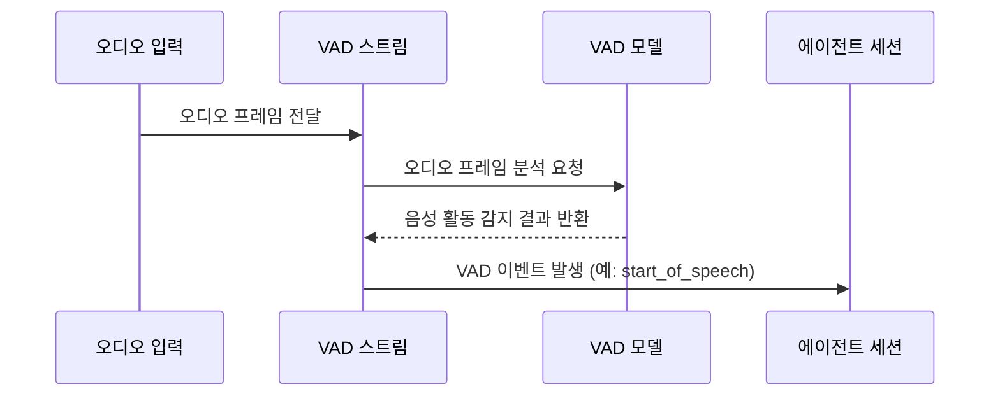

## Chapter 6: 음성 활동 감지기 (VAD, Voice Activity Detector)

지난 [TextStream 데이터 스트림 (TextStream)](/livekit/105-Livekit) 튜토리얼에서는 텍스트 데이터를 실시간으로 전송하는 TextStream에 대해 알아보았습니다. 이번 장에서는 음성 신호에서 사람의 목소리가 있는 구간을 찾아내는 **음성 활동 감지기 (VAD, Voice Activity Detector)**에 대해 자세히 알아볼 것입니다.

### 6.1 VAD는 왜 필요할까요?

여러분이 텔레마케팅 상담원 AI를 만들고 있다고 상상해 봅시다. 상담원이 조용히 듣고 있는 시간, 혹은 배경 소음이 많은 시간을 제외하고, 고객이 실제로 말하는 구간만 집중적으로 텍스트로 변환하고 싶을 겁니다. 불필요한 데이터를 처리하는 데 리소스를 낭비하고 싶지 않을 것입니다.

**음성 활동 감지기 (VAD)**는 바로 이 문제를 해결해 줍니다. VAD는 마치 음성 신호 필터와 같아서, 오디오 스트림에서 사람의 목소리가 포함된 부분만 정확하게 추출하여 노이즈나 침묵을 제거합니다. 이를 통해 STT(음성-텍스트 변환) 모델의 효율성을 높이고, 불필요한 연산을 줄일 수 있습니다. 마치 콘서트장에서 가수가 노래를 부르는 구간만 정확하게 잡아내는 마이크와 같습니다.

### 6.2 VAD란 무엇일까요?

**음성 활동 감지기 (VAD, Voice Activity Detector)**는 음성 신호가 존재하는 구간을 식별하는 기술입니다. 마치 '목소리 감지 센서'와 같습니다.

VAD의 핵심 개념은 다음과 같습니다.

1.  **음성 구간 (Speech Segment):** 사람의 목소리가 포함된 오디오 구간입니다.
2.  **비음성 구간 (Non-speech Segment):** 침묵, 배경 소음, 음악 등 사람의 목소리가 없는 오디오 구간입니다.
3.  **프레임 (Frame):** 오디오 신호를 분석하기 위해 나누는 작은 시간 단위입니다. 마치 영화의 한 장면과 같습니다.
4.  **임계값 (Threshold):** 음성/비음성을 판단하는 기준값입니다. 이 값을 기준으로 음성 활동 여부를 결정합니다.
5.  **VAD 이벤트 (VAD Event):** 음성 활동의 시작, 끝, 추론 완료 등의 상태 변화를 나타내는 이벤트입니다.

### 6.3 VAD 사용하기

`agents-main` 프로젝트에서 VAD를 사용하려면 VAD 객체를 생성하고, 오디오 프레임을 VAD 스트림에 전달해야 합니다. VAD는 오디오 프레임을 분석하여 음성 활동을 감지하고, VAD 이벤트를 발생시킵니다.

다음은 간단한 VAD 사용 예제 코드입니다.

```python
from livekit import rtc
from livekit.plugins import silero

# VAD 객체 로드 (Loading a VAD object)
vad = silero.VAD.load()

# VAD 스트림 생성 (Creating a VAD stream)
vad_stream = vad.stream()

# 오디오 프레임 생성 (Creating an audio frame)
frame = rtc.AudioFrame(
    data=bytes([0] * 960 * 2),  # 960 samples * 2 bytes (16-bit)
    sample_rate=48000,
    num_channels=1,
    samples_per_channel=960,
)

# 오디오 프레임 VAD 스트림에 전달 (Pushing an audio frame to the VAD stream)
vad_stream.push_frame(frame)

# VAD 이벤트 처리 (Processing VAD events)
async for event in vad_stream:
    print(f"VAD 이벤트 발생: {event.type}") # VAD event 발생 시 출력

# VAD 스트림 닫기 (Closing the VAD stream)
await vad_stream.aclose()
```

위 코드는 Silero VAD 모델을 로드하고, `push_frame()` 메서드를 사용하여 오디오 프레임을 VAD 스트림에 전달합니다.  `vad_stream`에서 VAD 이벤트를 비동기적으로 수신하여 출력합니다. 마지막으로, `aclose()` 메서드를 호출하여 VAD 스트림을 닫습니다.

**입력:** `frame` (오디오 프레임 데이터)

**출력:** "VAD 이벤트 발생: start\_of\_speech" 또는 "VAD 이벤트 발생: end\_of\_speech" 와 같은 VAD 이벤트

### 6.4 VAD 이벤트 종류

VAD는 다양한 종류의 이벤트를 발생시킬 수 있습니다. 주요 이벤트는 다음과 같습니다.

*   `start_of_speech`: 음성 구간이 시작되었음을 나타냅니다.
*   `end_of_speech`: 음성 구간이 종료되었음을 나타냅니다.
*   `inference_done`: VAD가 특정 오디오 프레임에 대한 추론을 완료했음을 나타냅니다.

### 6.5 에이전트 세션과의 통합

VAD는 [에이전트 세션 (AgentSession)](/livekit/102-Livekit)과 통합되어 사용될 수 있습니다. 에이전트 세션은 VAD를 사용하여 음성 활동을 감지하고, 음성 구간만 STT(음성-텍스트 변환) 모델에 전달하여 효율성을 높일 수 있습니다.

`examples/other/kokoro_tts.py` 예제에서는 VAD가 [에이전트 세션 (AgentSession)](/livekit/102-Livekit)과 함께 사용되는 방법을 확인할 수 있습니다. 이 예제에서는 Silero VAD를 사용하여 음성 활동을 감지하고, OpenAI 호환 Kokoro TTS 모델을 사용하여 텍스트를 음성으로 변환합니다.

```python
from livekit.agents import AgentSession
from livekit.plugins import openai, deepgram, silero

# ... (생략) ...

async def entrypoint(ctx):
    # ... (생략) ...

    session = AgentSession(
        vad=ctx.proc.userdata["vad"], # VAD 객체 전달
        llm=openai.LLM(model="gpt-4o-mini"),
        stt=deepgram.STT(model="nova-3", language="multi"),
        tts=openai.TTS(
            model="kokoro",
            voice="af_alloy",
            api_key="not-needed",
            base_url="http://localhost:8880/v1",
            response_format="wav",
        ),
    )

    # ... (생략) ...
```

위 코드에서 `AgentSession` 생성자에 `vad` 매개변수를 사용하여 VAD 객체를 전달합니다. 에이전트 세션은 이 VAD 객체를 사용하여 음성 활동을 감지하고, STT 모델에 전달할 오디오 구간을 결정합니다.

### 6.6 VAD 내부 동작

VAD는 어떻게 작동할까요? 다음은 VAD가 오디오 프레임을 분석하고, VAD 이벤트를 발생시키는 과정을 간략하게 보여주는 시퀀스 다이어그램입니다.



1.  **오디오 프레임 전달:** 오디오 입력 장치(예: 마이크)에서 오디오 프레임을 VAD 스트림으로 전달합니다.
2.  **오디오 프레임 분석 요청:** VAD 스트림은 오디오 프레임을 VAD 모델에게 전달하여 분석을 요청합니다.
3.  **음성 활동 감지 결과 반환:** VAD 모델은 오디오 프레임을 분석하고, 음성 활동 감지 결과를 VAD 스트림에게 반환합니다.
4.  **VAD 이벤트 발생:** VAD 스트림은 음성 활동 감지 결과를 기반으로 VAD 이벤트를 발생시킵니다 (예: `start_of_speech`, `end_of_speech`). 에이전트 세션은 이 이벤트를 수신하여 STT 모델을 시작하거나 중지하는 등의 작업을 수행합니다.

### 6.7 코드 살펴보기

`livekit-agents/livekit/agents/vad.py` 파일에서 `VAD` 클래스와 `VADStream` 클래스의 구현을 확인할 수 있습니다.

```python
class VAD(ABC, rtc.EventEmitter[Literal["metrics_collected"]]):
    def __init__(self, *, capabilities: VADCapabilities) -> None:
        super().__init__()
        self._capabilities = capabilities
        self._label = f"{type(self).__module__}.{type(self).__name__}"

    @property
    def capabilities(self) -> VADCapabilities:
        return self._capabilities

    @abstractmethod
    def stream(self) -> VADStream: ...
```

위 코드는 `VAD` 클래스의 기본 구조를 보여줍니다. `VAD` 클래스는 음성 활동 감지 모델의 추상적인 인터페이스를 정의합니다. `stream()` 메서드는 VAD 스트림을 생성하는 데 사용됩니다.

```python
class VADStream(ABC):
    # ... (생략) ...

    def push_frame(self, frame: rtc.AudioFrame) -> None:
        """Push some text to be synthesized"""
        self._check_input_not_ended()
        self._check_not_closed()
        self._input_ch.send_nowait(frame)

    # ... (생략) ...
```

위 코드는 `VADStream` 클래스의 `push_frame()` 메서드를 보여줍니다. 이 메서드는 오디오 프레임을 VAD 스트림에 전달하는 데 사용됩니다. VAD 스트림은 전달된 오디오 프레임을 분석하고, 음성 활동을 감지합니다.

### 6.8 결론

이 튜토리얼에서는 **음성 활동 감지기 (VAD, Voice Activity Detector)**의 기본 개념과 사용법에 대해 알아보았습니다. VAD는 음성 신호에서 사람의 목소리가 있는 구간을 찾아내는 중요한 기술이며, STT 모델의 효율성을 높이는 데 활용될 수 있습니다. 이제 [실시간 모델 (RealtimeModel)](/livekit/107-Livekit)에 대해 자세히 알아보고, 실시간으로 데이터를 처리하는 방법을 배워봅시다.


---

Generated by [AI Codebase Knowledge Builder](https://github.com/The-Pocket/Tutorial-Codebase-Knowledge)