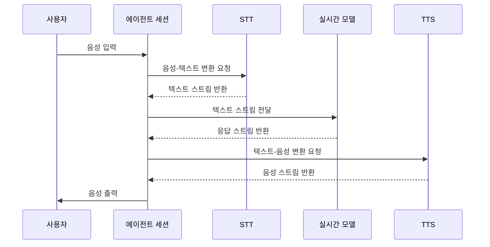

## Chapter 7: 실시간 모델 (RealtimeModel)

지난 [음성 활동 감지기 (VAD, Voice Activity Detector)](/livekit/106-Livekit) 튜토리얼에서는 음성 활동 감지기에 대해 알아보았습니다. 이번 장에서는 **실시간 모델 (RealtimeModel)**에 대해 자세히 알아볼 것입니다.

### 7.1 실시간 모델은 왜 필요할까요?

실시간 통역 서비스를 만든다고 상상해 보세요. 사용자가 말을 하면 즉시 번역된 텍스트 또는 음성이 나와야 합니다. 일반적인 LLM(대규모 언어 모델)은 전체 문장이 입력될 때까지 기다렸다가 응답을 생성하므로, 약간의 지연 시간이 발생합니다. 실시간 통역처럼 즉각적인 상호작용이 필요한 경우 사용자 경험을 저해할 수 있습니다.

**실시간 모델 (RealtimeModel)**은 이러한 문제를 해결합니다. 실시간 모델은 입력 데이터가 들어오는 즉시 응답을 생성하도록 설계되었습니다. 마치 실시간 통역사와 같아서, 사용자의 말을 듣는 즉시 텍스트로 변환하고, 번역하고, 답변을 생성하여 사용자에게 전달합니다. 대기 시간을 최소화하여 즉각적인 상호 작용을 가능하게 하므로, 실시간 음성 에이전트와 같은 애플리케이션에 적합합니다.

### 7.2 실시간 모델이란 무엇일까요?

**실시간 모델 (RealtimeModel)**은 실시간으로 데이터를 처리하고 응답을 생성하는 데 특화된 LLM(대규모 언어 모델)입니다. 핵심은 "실시간성"입니다. 마치 즉석 카메라처럼, 입력이 들어오면 즉시 결과물을 만들어냅니다.

실시간 모델의 핵심 개념은 다음과 같습니다.

1.  **스트리밍 처리 (Streaming Processing):** 데이터를 작은 조각(청크)으로 나누어 순차적으로 처리합니다. 전체 데이터를 한 번에 처리하는 대신, 데이터가 들어오는 대로 즉시 처리합니다. 마치 컨베이어 벨트처럼, 데이터가 지나가는 대로 작업을 수행합니다.
2.  **낮은 지연 시간 (Low Latency):** 입력과 출력 사이의 지연 시간을 최소화합니다. 실시간 상호 작용이 가능하도록 빠른 응답 속도를 제공합니다.
3.  **음성 및 텍스트 지원 (Voice and Text Support):** 음성 입력과 텍스트 입력을 모두 처리할 수 있습니다. 사용자의 음성을 텍스트로 변환하거나, 텍스트를 음성으로 합성하는 기능을 제공합니다.
4.  **턴 관리 (Turn Management):** 대화의 턴(차례)을 관리하여 자연스러운 대화 흐름을 유지합니다. 누가 말하고 있는지, 언제 응답해야 하는지를 판단합니다.
5.  **중간 결과 (Intermediate Results):** 전체 처리 과정이 완료되기 전에도 부분적인 결과를 제공할 수 있습니다. 예를 들어, 실시간 번역에서 문장이 완성되기 전에 번역된 단어들을 먼저 보여줄 수 있습니다.

### 7.3 실시간 모델 사용하기

`agents-main` 프로젝트에서 실시간 모델을 사용하려면 `openai.realtime.RealtimeModel` 클래스를 사용합니다.

다음은 간단한 실시간 모델 사용 예제 코드입니다.

```python
from livekit.agents import AgentSession
from livekit.plugins import openai

# AgentSession 초기화 (Initializing AgentSession)
session = AgentSession(
    llm=openai.realtime.RealtimeModel(voice="alloy") # OpenAI 실시간 모델 사용
)
```

위 코드는 OpenAI의 실시간 모델인 "alloy" 음성을 사용하여 `AgentSession`을 초기화합니다. 실시간 모델을 `llm` 매개변수로 지정하여 에이전트가 실시간으로 응답을 생성하도록 설정합니다.

**입력:** 없음 (사용자 음성은 [에이전트 세션 (AgentSession)](/livekit/102-Livekit)을 통해 전달됩니다.)

**출력:** 에이전트가 사용자의 음성에 실시간으로 응답합니다. (실시간 음성 출력)

### 7.4 턴 관리 설정

실시간 모델은 턴 관리를 통해 자연스러운 대화 흐름을 유지할 수 있습니다. 턴 관리를 사용하려면 `turn_detection` 매개변수를 설정합니다.

```python
from livekit.agents import AgentSession
from livekit.plugins import openai
from livekit.plugins.turn_detector.english import EnglishModel

# AgentSession 초기화 (Initializing AgentSession)
session = AgentSession(
    turn_detection=EnglishModel(), # 영어 턴 감지 모델 사용
    llm=openai.realtime.RealtimeModel(
        voice="alloy",
        turn_detection=None, # OpenAI 턴 감지 기능 비활성화
    )
)
```

위 코드에서는 `EnglishModel`을 사용하여 영어 턴 감지를 활성화하고, OpenAI 실시간 모델의 턴 감지 기능을 비활성화합니다. 이렇게 하면 LiveKit의 턴 감지 모델을 사용하여 턴을 관리하고, 실시간 모델이 적절한 시점에 응답하도록 제어할 수 있습니다.

**입력:** 없음 (사용자 음성은 [에이전트 세션 (AgentSession)](/livekit/102-Livekit)을 통해 전달됩니다.)

**출력:** 에이전트가 사용자의 턴이 끝난 후 적절한 시점에 응답합니다. (자연스러운 대화 흐름)

### 7.5 실시간 모델 내부 동작

실시간 모델은 어떻게 작동할까요? 다음은 실시간 모델이 음성 입력을 처리하고 응답을 생성하는 과정을 간략하게 보여주는 시퀀스 다이어그램입니다.



1.  **음성 입력:** 사용자가 음성 입력을 제공합니다.
2.  **음성-텍스트 변환:** [에이전트 세션 (AgentSession)](/livekit/102-Livekit)은 STT(Speech-to-Text) 모델을 사용하여 음성을 텍스트로 변환합니다. 텍스트 스트림이 생성됩니다.
3.  **텍스트 스트림 전달:** 에이전트 세션은 텍스트 스트림을 실시간 모델에 전달합니다.
4.  **응답 스트림 반환:** 실시간 모델은 텍스트 스트림을 기반으로 응답을 생성하고, 응답 스트림을 에이전트 세션에 반환합니다.
5.  **텍스트-음성 변환:** 에이전트 세션은 TTS(Text-to-Speech) 모델을 사용하여 응답 스트림을 음성으로 변환합니다. 음성 스트림이 생성됩니다.
6.  **음성 출력:** 에이전트 세션은 음성 스트림을 사용자에게 출력합니다.

### 7.6 코드 살펴보기

`livekit-agents/livekit/plugins/openai/realtime.py` 파일에서 `RealtimeModel` 클래스의 구현을 확인할 수 있습니다.

```python
class RealtimeModel(LLM): # LLM 상속
    def __init__(
        self,
        *,
        voice: str,
        api_key: NotGivenOr[str] = NOT_GIVEN,
        base_url: NotGivenOr[str] = NOT_GIVEN,
        turn_detection: NotGivenOr[TurnDetectionOptions | None] = NOT_GIVEN,
        input_audio_transcription: NotGivenOr[InputAudioTranscriptionOptions | None] = NOT_GIVEN,
        ...
    ) -> None:
        super().__init__(...)
        self._voice = voice
        self._turn_detection = turn_detection
        self._input_audio_transcription = input_audio_transcription
```

위 코드는 `RealtimeModel` 클래스의 생성자를 보여줍니다. `voice` 매개변수를 사용하여 사용할 음성을 지정하고, `turn_detection` 매개변수를 사용하여 턴 관리 옵션을 설정할 수 있습니다. `input_audio_transcription`를 사용하여 입력 오디오 변환 옵션을 설정할 수 있습니다. 이 클래스는 [에이전트 (Agent)](/livekit/101-Livekit)가 사용하는 `LLM`을 상속받습니다.

```python
    async def generate_reply(self, prompt: str, *, chat_context: ChatContext) -> AsyncIterable[str]:
        # ... (생략) ...

        async for chunk in self._stream_complete(resp):
            yield chunk
```

위 코드는 `generate_reply` 메서드의 일부를 보여줍니다. 이 메서드는 프롬프트와 대화 컨텍스트를 기반으로 응답을 생성하고, 응답 스트림을 반환합니다. 실시간 모델은 이 메서드를 통해 실시간으로 응답을 생성합니다.

### 7.7 결론

이 튜토리얼에서는 **실시간 모델 (RealtimeModel)**의 기본 개념과 사용법에 대해 알아보았습니다. 실시간 모델은 낮은 지연 시간으로 데이터를 처리하고 응답을 생성하는 데 특화된 LLM이며, 실시간 음성 에이전트와 같은 애플리케이션에 적합합니다. 이제 [함수 도구 (FunctionTool)](/livekit/108-Livekit)에 대해 자세히 알아보고, 에이전트가 외부 함수를 호출하도록 하는 방법을 배워봅시다.


---

Generated by [AI Codebase Knowledge Builder](https://github.com/The-Pocket/Tutorial-Codebase-Knowledge)