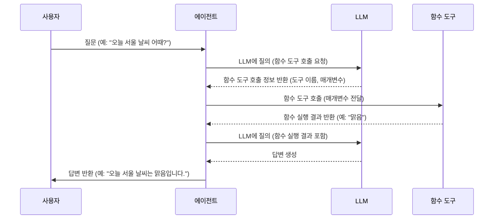

## Chapter 8: 함수 도구 (FunctionTool)

지난 [실시간 모델 (RealtimeModel)](/livekit/107-Livekit) 튜토리얼에서는 실시간 모델에 대해 알아보았습니다. 이번 장에서는 에이전트가 외부 함수를 호출할 수 있도록 하는 **함수 도구 (FunctionTool)**에 대해 자세히 알아보겠습니다.

### 8.1 함수 도구는 왜 필요할까요?

여러분이 날씨를 알려주는 챗봇을 만든다고 상상해 봅시다. 챗봇은 "오늘 서울 날씨 어때?"라는 질문을 받으면 외부 날씨 API를 호출하여 날씨 정보를 가져와야 합니다. LLM 자체는 날씨 정보를 알 수 없기 때문입니다.

**함수 도구 (FunctionTool)**는 바로 이 문제를 해결합니다. 함수 도구는 마치 에이전트에게 제공되는 "능력"과 같습니다. 에이전트는 함수 도구를 사용하여 날씨 정보를 검색하거나, 데이터베이스에 접근하거나, 계산을 수행하는 등 다양한 작업을 수행할 수 있습니다. LLM의 능력을 확장하여 단순한 텍스트 생성 이상의 복잡한 작업을 수행할 수 있도록 합니다. 마치 요리사가 칼, 냄비, 그릇과 같은 다양한 도구를 사용하여 요리를 만드는 것처럼, LLM은 함수 도구를 사용하여 다양한 작업을 수행할 수 있습니다.

### 8.2 함수 도구란 무엇일까요?

**함수 도구 (FunctionTool)**는 LLM(대규모 언어 모델)이 사용할 수 있는 외부 함수를 래핑한 것입니다. LLM이 특정 작업을 수행하기 위해 호출할 수 있는 "API"라고 생각하면 됩니다.

함수 도구의 핵심 개념은 다음과 같습니다.

1.  **함수 (Function):** 실제 작업을 수행하는 파이썬 함수입니다. 예를 들어, 날씨 정보를 가져오는 함수, 데이터베이스에 질의하는 함수 등이 있습니다.
2.  **이름 (Name):** 함수 도구를 식별하는 데 사용되는 문자열입니다. LLM은 이 이름을 사용하여 어떤 함수 도구를 호출할지 결정합니다.
3.  **설명 (Description):** 함수 도구의 기능을 설명하는 문자열입니다. LLM은 이 설명을 읽고 어떤 상황에서 함수 도구를 사용할지 판단합니다. 프롬프트 엔지니어링의 중요한 부분입니다.
4.  **매개변수 (Parameters):** 함수에 전달되는 입력 값입니다. 예를 들어, 날씨 정보를 가져오는 함수는 "도시 이름"을 매개변수로 받을 수 있습니다.
5.  **결과 (Result):** 함수가 실행된 후 반환되는 값입니다. 예를 들어, 날씨 정보를 가져오는 함수는 "맑음", "흐림", "비" 등의 날씨 정보를 반환할 수 있습니다.

### 8.3 함수 도구 사용하기

함수 도구를 사용하려면 먼저 함수를 정의하고, `function_tool` 데코레이터를 사용하여 함수 도구를 생성해야 합니다.

다음은 날씨 정보를 가져오는 함수 도구의 예제 코드입니다.

```python
from livekit.agents import function_tool

@function_tool
async def get_weather(location: str) -> str:
    """
    指定された場所の天気を取得します。

    Args:
        location: 天気を取得する場所。

    Returns:
        場所の天気情報。
    """
    # 실제 날씨 API를 호출하는 로직 (Replace with actual weather API call)
    weather = "맑음" # (예시)
    return f"{location}의 날씨는 {weather} 입니다."
```

위 코드는 `get_weather` 함수를 정의하고, `@function_tool` 데코레이터를 사용하여 함수 도구를 생성합니다. 데코레이터는 함수의 메타데이터(이름, 설명, 매개변수)를 추출하여 LLM이 사용할 수 있는 형태로 변환합니다. 함수의 독스트링(docstring)이 LLM에게 제공되는 설명이 됩니다.

**입력:** `location` (도시 이름, 예: "서울")

**출력:** "서울의 날씨는 맑음 입니다."

이제 에이전트가 함수 도구를 사용하도록 설정해 보겠습니다. 먼저, [에이전트 (Agent)](/livekit/101-Livekit) 클래스를 정의하고, `tools` 매개변수를 사용하여 함수 도구를 에이전트에 등록합니다.

```python
from livekit.agents import Agent
from livekit.agents import FunctionTool

class MyAgent(Agent):
    def __init__(self, tools: list[FunctionTool]) -> None:
        super().__init__(
            instructions="당신은 날씨를 알려주는 챗봇입니다.",
            tools=tools,
        )
```

위 코드에서 `MyAgent` 클래스를 정의하고, `tools` 매개변수를 사용하여 함수 도구 목록을 에이전트에 등록합니다. `instructions`는 에이전트의 역할을 정의합니다.

다음으로, [에이전트 세션 (AgentSession)](/livekit/102-Livekit)을 생성하고, 에이전트를 시작합니다.

```python
from livekit.agents import AgentSession
from livekit.plugins import openai

async def entrypoint(ctx): # JobContext context
    agent = MyAgent(tools=[get_weather])
    session = AgentSession()
    await session.start(
        agent=agent,
        llm=openai.LLM(model="gpt-4o-mini"),
    )
```

위 코드는 `MyAgent` 인스턴스를 생성하고, `get_weather` 함수 도구를 에이전트에 전달합니다. `session.start()` 메서드를 호출하여 에이전트를 시작하고, 사용할 LLM을 지정합니다.

이제 에이전트에게 "오늘 서울 날씨 어때?"라고 질문하면 에이전트는 `get_weather` 함수 도구를 호출하여 날씨 정보를 가져와 답변할 것입니다.

### 8.4 동적 도구 생성

`examples/voice_agents/dynamic_tool_creation.py` 파일에서 도구를 동적으로 생성하는 방법을 확인할 수 있습니다. 이 예제에서는 에이전트가 생성될 때 도구를 생성하거나, 에이전트가 생성된 후에 `agent.update_tools()` 메서드를 사용하여 도구를 업데이트하거나, `llm_node` 호출 시에만 임시 도구를 추가하는 방법을 보여줍니다.

```python
    async def llm_node(
        self, chat_ctx: ChatContext, tools: list[FunctionTool], model_settings: ModelSettings
    ):
        # Option 3: add temporal tools only for this call of llm_node
        async def _get_weather(location: str) -> str:
            return f"The weather in {location} is sunny."

        # modify the tools list in place
        tools.append(
            function_tool(
                _get_weather,
                name="get_weather",
                description="Get the weather in a specific location",
            )
        )

        return Agent.default.llm_node(self, chat_ctx, tools, model_settings)
```

위 코드는 `llm_node` 함수 내에서 `_get_weather` 함수 도구를 생성하고, `tools` 목록에 추가하는 방법을 보여줍니다. 이렇게 하면 해당 `llm_node` 호출 시에만 `_get_weather` 함수 도구를 사용할 수 있습니다.

### 8.5 함수 도구 내부 동작

함수 도구는 어떻게 작동할까요? 다음은 에이전트가 함수 도구를 호출하는 과정을 간략하게 보여주는 시퀀스 다이어그램입니다.



1.  **사용자 질문:** 사용자가 에이전트에게 질문을 합니다.
2.  **LLM 질의 (함수 도구 호출 요청):** 에이전트는 LLM에 질문을 전달하고, LLM은 질문을 분석하여 함수 도구를 호출해야 함을 판단합니다.
3.  **함수 도구 호출 정보 반환:** LLM은 에이전트에게 호출해야 할 함수 도구의 이름과 매개변수를 반환합니다.
4.  **함수 도구 호출:** 에이전트는 해당 함수 도구를 호출하고, 필요한 매개변수를 전달합니다.
5.  **함수 실행 결과 반환:** 함수 도구는 함수를 실행하고, 결과를 에이전트에게 반환합니다.
6.  **LLM 질의 (함수 실행 결과 포함):** 에이전트는 함수 실행 결과를 LLM에게 전달하고, LLM은 결과를 기반으로 답변을 생성합니다.
7.  **답변 반환:** 에이전트는 생성된 답변을 사용자에게 반환합니다.

### 8.6 코드 살펴보기

`livekit-agents/livekit/agents/llm.py` 파일에서 `FunctionTool` 클래스의 구현을 확인할 수 있습니다.

```python
from typing import Any, Callable, Coroutine

from pydantic import BaseModel, Field


class FunctionTool(BaseModel):
    name: str = Field(..., description="The name of the function to be called.")
    description: str = Field(..., description="A description of what the function does.")
    python_function: Callable[..., Coroutine[Any, Any, Any]] = Field(
        ..., description="The Python function to be called."
    )
    parameters: dict[str, Any] = Field(..., description="The parameters to pass to the function.")
```

위 코드는 `FunctionTool` 클래스의 구조를 보여줍니다. `name`, `description`, `python_function`, `parameters` 속성을 사용하여 함수 도구를 정의합니다.

`livekit-agents/livekit/agents/agent.py` 파일에서 에이전트가 함수 도구를 사용하는 방법을 확인할 수 있습니다. 에이전트는 `llm_node` 함수에서 LLM을 호출하고, LLM은 함수 도구를 호출해야 하는지 판단합니다.

### 8.7 결론

이 튜토리얼에서는 **함수 도구 (FunctionTool)**의 기본 개념과 사용법에 대해 알아보았습니다. 함수 도구는 에이전트가 외부 함수를 호출하여 LLM의 능력을 확장할 수 있도록 하는 중요한 메커니즘입니다. 이제 [비디오 생성기 (VideoGenerator)](/livekit/109-Livekit)에 대해 자세히 알아보고, 에이전트가 비디오를 생성하도록 하는 방법을 배워봅시다.


---

Generated by [AI Codebase Knowledge Builder](https://github.com/The-Pocket/Tutorial-Codebase-Knowledge)