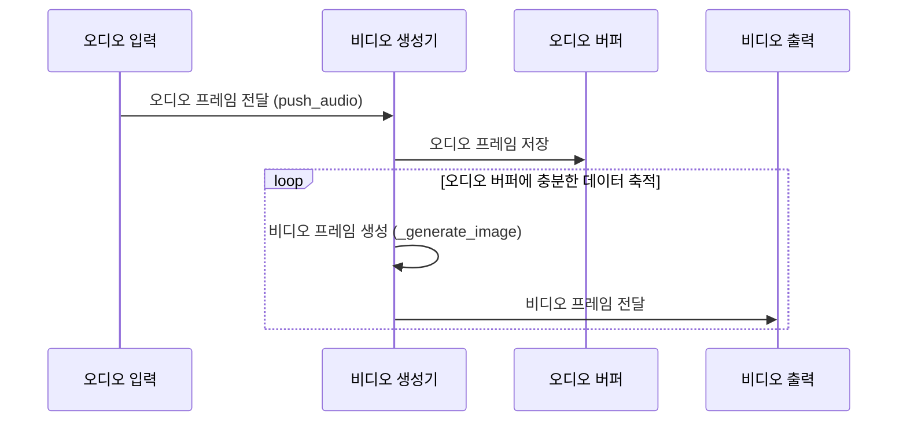

## Chapter 9: 비디오 생성기 (VideoGenerator)

지난 [함수 도구 (FunctionTool)](/livekit/108-Livekit) 튜토리얼에서는 에이전트가 외부 함수를 호출하는 데 사용하는 함수 도구에 대해 알아보았습니다. 이번 장에서는 오디오 데이터를 기반으로 비디오를 생성하는 데 사용되는 **비디오 생성기 (VideoGenerator)**에 대해 자세히 알아보겠습니다.

### 9.1 비디오 생성기는 왜 필요할까요?

여러분이 오디오 북 내용을 시각적으로 표현하는 아바타를 만들고 싶다고 상상해 보세요. 오디오 북의 내용을 듣는 동안 아바타의 입술이 말하는 내용과 동기화되어 움직이는 모습을 보여주는 것이죠. 텍스트만으로는 전달하기 어려운 감정이나 맥락을 시각적으로 표현하여 더욱 몰입감 있는 경험을 제공할 수 있습니다.

**비디오 생성기 (VideoGenerator)**는 바로 이 문제를 해결해 줍니다. 비디오 생성기는 마치 오디오에 맞춰 춤을 추는 화면과 같습니다. 오디오 데이터를 입력으로 받아 해당 오디오에 맞춰 비디오 프레임을 생성합니다. 오디오 데이터를 기반으로 립싱크된 아바타나, 오디오 파형 시각화, 감정 표현 등을 생성하여 시각적인 생동감을 더할 수 있습니다. 마치 음악 시각화 프로그램처럼 오디오에 맞춰 역동적인 화면을 만들어내는 것이죠.

### 9.2 비디오 생성기란 무엇일까요?

**비디오 생성기 (VideoGenerator)**는 오디오 데이터를 기반으로 비디오 프레임을 생성하는 추상 인터페이스입니다. 마치 오디오 입력을 비디오 출력으로 변환하는 "번역기"와 같습니다.

비디오 생성기의 핵심 개념은 다음과 같습니다.

1.  **오디오 프레임 (AudioFrame):** 오디오 데이터의 작은 조각입니다. 시간에 따라 샘플링된 오디오 신호의 값을 담고 있습니다. 마치 영화의 한 장면과 같습니다.
2.  **비디오 프레임 (VideoFrame):** 비디오 데이터의 작은 조각입니다. 이미지 데이터를 담고 있습니다. 립싱크 아바타의 경우, 얼굴 표정이나 입 모양이 담겨 있을 수 있습니다. 마치 그림책의 한 페이지와 같습니다.
3.  **오디오-비디오 동기화 (Audio-Video Synchronization):** 오디오와 비디오가 서로 일치하도록 하는 과정입니다. 아바타의 입 모양이 말하는 내용과 정확히 일치해야 합니다. 마치 영화의 더빙 작업과 같습니다.
4.  **버퍼링 (Buffering):** 오디오 데이터를 임시로 저장하는 과정입니다. 비디오 프레임을 생성하기 전에 충분한 오디오 데이터를 확보해야 합니다. 마치 요리사가 재료를 준비하는 과정과 같습니다.

### 9.3 비디오 생성기 사용하기

`agents-main` 프로젝트에서 비디오 생성기를 사용하려면 `VideoGenerator` 추상 클래스를 상속받아 사용자 정의 비디오 생성기를 구현해야 합니다.

다음은 오디오 파형을 시각적으로 표현하는 간단한 비디오 생성기 예제 코드입니다. 이는 `examples/avatar_agents/audio_wave/avatar_runner.py`에 있는 예제를 단순화한 것입니다.

```python
from livekit import rtc
from livekit.agents.voice.avatar import VideoGenerator, AudioSegmentEnd
import numpy as np

class AudioWaveGenerator(VideoGenerator):
    def __init__(self, audio_sample_rate, audio_channels, video_width, video_height):
        self.audio_sample_rate = audio_sample_rate
        self.audio_channels = audio_channels
        self.video_width = video_width
        self.video_height = video_height
        self.audio_buffer = np.zeros((0, self.audio_channels), dtype=np.int16) # 오디오 데이터 저장 버퍼

    async def push_audio(self, frame: rtc.AudioFrame | AudioSegmentEnd) -> None:
        # 오디오 프레임을 버퍼에 추가 (Append audio frame to buffer)
        if isinstance(frame, rtc.AudioFrame):
            audio_samples = np.frombuffer(frame.data, dtype=np.int16).reshape(
                -1, frame.num_channels
            )
            self.audio_buffer = np.concatenate([self.audio_buffer, audio_samples], axis=0)
        else:
            # AudioSegmentEnd 처리 (Handle AudioSegmentEnd)
            pass # 버퍼 초기화 등의 작업 수행

    async def __aiter__(self):
        while True:
            # 오디오 버퍼에서 데이터를 읽어 비디오 프레임 생성 (Read data from audio buffer and generate video frame)
            if len(self.audio_buffer) > 0:
                # 파형 시각화 로직 (Waveform visualization logic)
                image = self._generate_image(self.audio_buffer) # 비디오 프레임 생성

                # VideoFrame 생성 및 반환 (Create and return VideoFrame)
                video_frame = rtc.VideoFrame(
                    width=self.video_width,
                    height=self.video_height,
                    type=rtc.VideoBufferType.RGBA,
                    data=image.tobytes(),
                )
                yield video_frame
            else:
                # 오디오 버퍼가 비어있을 경우 대기 (Wait if audio buffer is empty)
                await asyncio.sleep(0.1)

    def _generate_image(self, audio_data: np.ndarray) -> np.ndarray:
        # 오디오 데이터를 기반으로 이미지를 생성하는 로직 (Logic to generate image based on audio data)
        # 여기서는 간단하게 흰색 배경에 오디오 파형을 그리는 예시 (Here's a simple example of drawing an audio waveform on a white background)
        image = np.zeros((self.video_height, self.video_width, 4), dtype=np.uint8)
        image.fill(255) # 흰색 배경

        # TODO: 오디오 파형을 이미지에 그리는 로직 추가 (Add logic to draw audio waveform on the image)
        return image
```

위 코드는 `AudioWaveGenerator` 클래스를 정의하고, `push_audio()` 메서드를 사용하여 오디오 프레임을 버퍼에 추가합니다. `__aiter__()` 메서드는 오디오 버퍼에서 데이터를 읽어 비디오 프레임을 생성하고 반환합니다. `_generate_image()` 메서드는 오디오 데이터를 기반으로 이미지를 생성하는 로직을 구현합니다.

**입력:** `rtc.AudioFrame` (오디오 프레임 데이터)

**출력:** `rtc.VideoFrame` (비디오 프레임 데이터) - 오디오 파형이 시각화된 이미지

### 9.4 AvatarRunner에 VideoGenerator 통합

`examples/avatar_agents/audio_wave/avatar_runner.py` 파일에서 `VideoGenerator`가 `AvatarRunner`에 통합되는 방법을 확인할 수 있습니다. `AvatarRunner`는 오디오 수신, 비디오 생성, 오디오-비디오 동기화를 관리하는 클래스입니다.

```python
from livekit.agents.voice.avatar import AvatarRunner, DataStreamAudioReceiver, AvatarOptions
# ... (생략) ...

async def main(room: rtc.Room):
    # ... (생략) ...

    avatar_options = AvatarOptions( # Option 설정
        video_width=1280,
        video_height=720,
        video_fps=30,
        audio_sample_rate=24000,
        audio_channels=1,
    )
    video_gen = AudioWaveGenerator(avatar_options) # 비디오 생성기 인스턴스화
    runner = AvatarRunner( # AvatarRunner 설정
        room,
        audio_recv=DataStreamAudioReceiver(room),
        video_gen=video_gen, # 비디오 생성기 전달
        options=avatar_options,
    )
    await runner.start()

    # ... (생략) ...
```

위 코드는 `AvatarOptions`를 설정하고, `AudioWaveGenerator` 인스턴스를 생성하여 `AvatarRunner`에 전달합니다. `AvatarRunner`는 `video_gen` 매개변수를 통해 전달된 비디오 생성기를 사용하여 비디오 프레임을 생성하고, 오디오와 동기화합니다.

### 9.5 비디오 생성기 내부 동작

비디오 생성기는 어떻게 작동할까요? 다음은 비디오 생성기가 오디오 프레임을 처리하고 비디오 프레임을 생성하는 과정을 간략하게 보여주는 시퀀스 다이어그램입니다.



1.  **오디오 프레임 전달:** 오디오 입력 장치(예: 마이크)에서 오디오 프레임을 비디오 생성기로 전달합니다. (`push_audio` 메서드 호출)
2.  **오디오 프레임 저장:** 비디오 생성기는 오디오 프레임을 오디오 버퍼에 저장합니다. 비디오 프레임 생성을 위해 오디오 데이터가 버퍼링됩니다.
3.  **비디오 프레임 생성:** 오디오 버퍼에 충분한 데이터가 축적되면 비디오 생성기는 오디오 데이터를 기반으로 비디오 프레임을 생성합니다. (`_generate_image` 메서드 호출) 이 단계에서 립싱크, 파형 시각화, 감정 표현 등의 로직이 수행됩니다.
4.  **비디오 프레임 전달:** 비디오 생성기는 생성된 비디오 프레임을 비디오 출력 장치(예: 화면)로 전달합니다.

### 9.6 코드 살펴보기

`livekit-agents/livekit/agents/voice/avatar/_types.py` 파일에서 `VideoGenerator` 추상 클래스의 정의를 확인할 수 있습니다.

```python
from abc import ABC, abstractmethod
from collections.abc import AsyncIterator
from typing import Literal

from livekit import rtc


class VideoGenerator(ABC):
    @abstractmethod
    async def push_audio(self, frame: rtc.AudioFrame) -> None:
        """Push an audio frame to the video generator"""

    @abstractmethod
    def __aiter__(
        self,
    ) -> AsyncIterator[rtc.VideoFrame | rtc.AudioFrame]:
        """Continuously stream out video and audio frames"""
```

위 코드는 `VideoGenerator` 추상 클래스의 핵심 메서드를 보여줍니다. `push_audio()` 메서드는 오디오 프레임을 비디오 생성기로 전달하는 데 사용됩니다. `__aiter__()` 메서드는 비디오 프레임을 생성하고 스트리밍하는 데 사용됩니다.

### 9.7 결론

이 튜토리얼에서는 **비디오 생성기 (VideoGenerator)**의 기본 개념과 사용법에 대해 알아보았습니다. 비디오 생성기는 오디오 데이터를 기반으로 비디오 프레임을 생성하는 데 유용한 추상화이며, 립싱크 아바타, 오디오 파형 시각화 등 다양한 애플리케이션에서 활용될 수 있습니다. 이제 [자동 가입 (AutoSubscribe)](/livekit/110-Livekit)에 대해 자세히 알아보고, 에이전트가 자동으로 필요한 트랙을 구독하도록 하는 방법을 배워봅시다.


---

Generated by [AI Codebase Knowledge Builder](https://github.com/The-Pocket/Tutorial-Codebase-Knowledge)