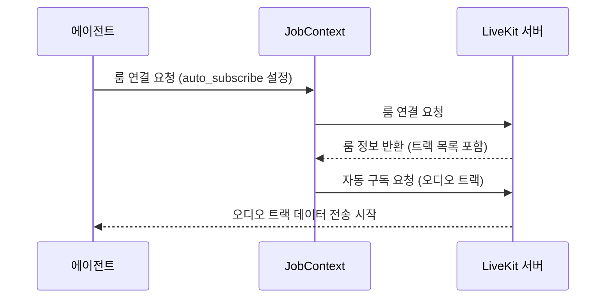

## Chapter 10: 자동 가입 (AutoSubscribe)

지난 [비디오 생성기 (VideoGenerator)](/livekit/109-Livekit) 튜토리얼에서는 오디오 데이터로 비디오를 만드는 방법에 대해 배웠습니다. 이번 장에서는 에이전트가 방에 들어올 때 필요한 미디어 트랙(오디오, 비디오)을 자동으로 구독하는 기능인 **자동 가입 (AutoSubscribe)**에 대해 알아보겠습니다.

### 10.1 자동 가입은 왜 필요할까요?

온라인 회의에 참여하는 여러 참가자를 모니터링하는 가상 회의 도우미를 만든다고 상상해 보세요. 이 도우미는 각 참가자가 말하는 내용을 듣고, 필요한 경우 화면을 볼 수 있어야 합니다. 하지만 모든 참가자의 모든 트랙을 *수동으로* 구독하는 것은 매우 번거롭고 비효율적입니다.

**자동 가입 (AutoSubscribe)**은 이 문제를 해결해 줍니다. 마치 유튜브 프리미엄 구독자가 광고 없이 동영상을 시청할 수 있도록 자동으로 설정하는 것처럼, 자동 가입은 에이전트가 방에 입장할 때 필요한 미디어 트랙을 자동으로 구독하도록 설정하여 개발자가 트랙을 수동으로 구독하는 번거로움을 덜어줍니다. 즉, 에이전트가 필요한 정보에 자동으로 "구독"하여 사용자가 일일이 설정할 필요가 없도록 하는 편리한 기능입니다. 마치 스마트폰을 켜면 자동으로 와이파이에 연결되는 것과 같습니다.

### 10.2 자동 가입이란 무엇일까요?

**자동 가입 (AutoSubscribe)**은 에이전트가 LiveKit 룸에 참여할 때 특정 트랙(오디오, 비디오)을 자동으로 구독하도록 설정하는 기능입니다. 마치 "자동 팔로우" 기능과 같습니다.

자동 가입의 핵심 개념은 다음과 같습니다.

1.  **오디오 전용 (AUDIO_ONLY):** 에이전트가 룸에 있는 모든 오디오 트랙을 자동으로 구독합니다. 비디오 트랙은 구독하지 않습니다.
2.  **비디오 전용 (VIDEO_ONLY):** 에이전트가 룸에 있는 모든 비디오 트랙을 자동으로 구독합니다. 오디오 트랙은 구독하지 않습니다.
3.  **오디오 및 비디오 (AUDIO_AND_VIDEO):** 에이전트가 룸에 있는 모든 오디오 및 비디오 트랙을 자동으로 구독합니다.
4.  **사용자 정의 (Custom):** 고급 사용자를 위한 옵션으로, 특정 트랙을 구독하기 위한 더 세밀한 제어를 제공합니다.

### 10.3 자동 가입 사용하기

`agents-main` 프로젝트에서 자동 가입을 사용하려면 `JobContext.connect()` 메서드를 호출할 때 `auto_subscribe` 매개변수를 설정합니다.

다음은 자동 가입을 사용하는 간단한 예제 코드입니다.

```python
from livekit.agents import JobContext, AutoSubscribe

async def entrypoint(ctx: JobContext):
    await ctx.connect(auto_subscribe=AutoSubscribe.AUDIO_ONLY)
    # 이제 에이전트는 룸에 있는 모든 오디오 트랙을 자동으로 구독합니다.
```

위 코드는 `ctx.connect()` 메서드를 호출할 때 `auto_subscribe=AutoSubscribe.AUDIO_ONLY`를 설정하여 에이전트가 룸에 있는 모든 오디오 트랙을 자동으로 구독하도록 지정합니다.

**입력:** 없음 (에이전트가 룸에 연결될 때 자동으로 트랙을 구독합니다.)

**출력:** 에이전트는 룸에 있는 모든 오디오 트랙을 구독하고, 오디오 데이터를 처리할 수 있습니다.

만약 비디오 트랙도 자동으로 구독하고 싶다면 다음과 같이 설정할 수 있습니다.

```python
from livekit.agents import JobContext, AutoSubscribe

async def entrypoint(ctx: JobContext):
    await ctx.connect(auto_subscribe=AutoSubscribe.AUDIO_AND_VIDEO)
    # 이제 에이전트는 룸에 있는 모든 오디오 및 비디오 트랙을 자동으로 구독합니다.
```

### 10.4 자동 가입을 이용한 트랜스크라이버 예제

`examples/other/transcription/transcriber.py` 파일에서는 자동 가입이 트랜스크라이버 에이전트에서 어떻게 사용되는지 확인할 수 있습니다.

```python
async def entrypoint(ctx: JobContext):
    logger.info(f"starting transcriber (speech to text) example, room: {ctx.room.name}")
    await ctx.connect(auto_subscribe=AutoSubscribe.AUDIO_ONLY)

    # ... (생략) ...
```

위 코드는 트랜스크라이버 에이전트가 오디오 트랙만 자동으로 구독하도록 설정합니다. 이렇게 하면 에이전트는 룸에 있는 참가자의 음성을 텍스트로 변환하고, 텍스트를 출력할 수 있습니다. 불필요한 비디오 트랙을 구독하지 않으므로 리소스를 절약할 수 있습니다.

### 10.5 자동 가입 내부 동작

자동 가입은 어떻게 작동할까요? 다음은 에이전트가 룸에 연결될 때 자동 가입이 트랙을 구독하는 과정을 간략하게 보여주는 시퀀스 다이어그램입니다.



1.  **룸 연결 요청:** 에이전트는 `JobContext`를 통해 룸에 연결을 요청하고, `auto_subscribe` 설정을 지정합니다.
2.  **룸 연결 요청:** `JobContext`는 LiveKit 서버에 룸 연결을 요청합니다.
3.  **룸 정보 반환:** LiveKit 서버는 룸 정보(트랙 목록 포함)를 `JobContext`에 반환합니다.
4.  **자동 구독 요청:** `JobContext`는 `auto_subscribe` 설정에 따라 필요한 트랙(예: 오디오 트랙)을 자동으로 구독하도록 LiveKit 서버에 요청합니다.
5.  **오디오 트랙 데이터 전송 시작:** LiveKit 서버는 에이전트에게 오디오 트랙 데이터를 전송하기 시작합니다. 이제 에이전트는 오디오 데이터를 수신하고 처리할 수 있습니다.

### 10.6 코드 살펴보기

`livekit-agents/livekit/agents/job.py` 파일에서 `JobContext` 클래스의 `connect()` 메서드의 구현을 확인할 수 있습니다.

```python
    async def connect(
        self,
        auto_subscribe: NotGivenOr[AutoSubscribe] = NOT_GIVEN,
    ) -> None:
        # ... (생략) ...

        if auto_subscribe is NOT_GIVEN or auto_subscribe == AutoSubscribe.AUDIO_AND_VIDEO:
            for track in self._room.remote_tracks.values():
                try:
                    if not track.is_subscribed:
                        await track.subscribe()
                except Exception as e:
                    logger.exception(f"could not subscribe to track {track.sid} - {e}")
        elif auto_subscribe == AutoSubscribe.AUDIO_ONLY:
            for track in self._room.remote_tracks.values():
                if track.kind == rtc.TrackKind.AUDIO and not track.is_subscribed:
                    try:
                        await track.subscribe()
                    except Exception as e:
                        logger.exception(f"could not subscribe to track {track.sid} - {e}")

        # ... (생략) ...
```

위 코드는 `connect()` 메서드가 `auto_subscribe` 설정에 따라 트랙을 자동으로 구독하는 방법을 보여줍니다. `AutoSubscribe.AUDIO_AND_VIDEO`가 설정된 경우 모든 트랙을 구독하고, `AutoSubscribe.AUDIO_ONLY`가 설정된 경우 오디오 트랙만 구독합니다.  `track.subscribe()`를 통해 트랙을 구독합니다.

### 10.7 결론

이 튜토리얼에서는 **자동 가입 (AutoSubscribe)**의 기본 개념과 사용법에 대해 알아보았습니다. 자동 가입은 에이전트가 룸에 연결될 때 필요한 트랙을 자동으로 구독하도록 설정하여 개발자가 트랙을 수동으로 구독하는 번거로움을 덜어주는 편리한 기능입니다. 자동 가입을 통해 에이전트 개발을 더욱 효율적으로 진행할 수 있습니다.

이제 앞으로 여러분은 `agents-main` 프로젝트의 다양한 기능을 사용하여 더욱 강력하고 유용한 에이전트를 만들 수 있을 것입니다. 축하합니다!


---

Generated by [AI Codebase Knowledge Builder](https://github.com/The-Pocket/Tutorial-Codebase-Knowledge)