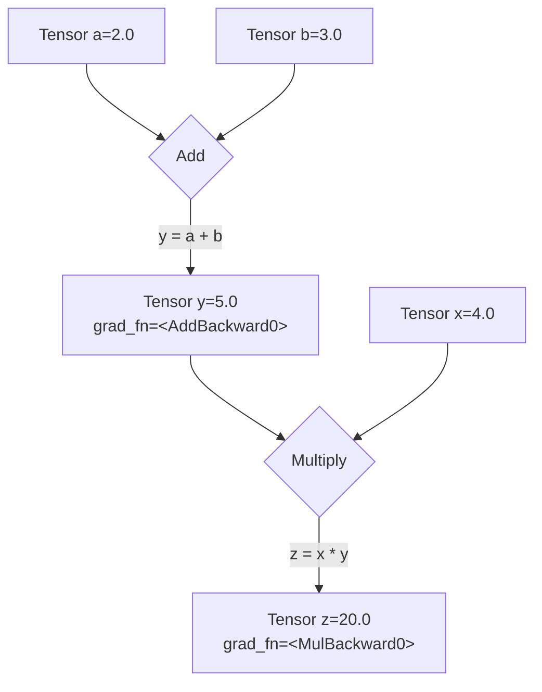

# **1시간만에 배우는 PyTorch**
- 출처: [PyTorch in 1 Hour](https://www.youtube.com/watchv=r1bquDz5GGA)

## 0. 들어가기 전

### 1. 배경
여러분은 PyTorch 코드를 본 적이 있을 겁니다. 아마도 연구 논문이나 튜토리얼에서요. `model.train()`, `loss.backward()`, `optimizer.step()` 같은 코드를 보셨을 겁니다. 그리고 그것들이 실제로 *무엇을 하는지* 궁금해하셨을 겁니다. 어쩌면 문서를 읽어보려고 시도했을 수도 있습니다. `nn.Module`, `torch.optim`, `computation graphs`와 같은 클래스의 벽에 부딪혔을 것입니다. 그것들은 불투명하고 마법 같은 블랙박스처럼 느껴졌을 것입니다.

### 2. 쉽게 이해하기
사실 그것들은 블랙박스가 아닙니다. 여러분이 이미 알고 있는 선형 대수와 미적분학을 위한 우아한 래퍼일 뿐입니다.

가장 간단한 모델부터 거대한 LLM에 이르기까지 전체 딥러닝 훈련 과정은 단 5단계 알고리즘에 불과합니다. 그게 다입니다. 다른 모든 것은 단지 구현 세부 사항일 뿐입니다.
*   `nn.Linear` 레이어는요? 그냥 `X @ W + b`입니다.
*   손실 함수는요? `torch.mean((y - y_hat)**2)`처럼 오류를 측정하는 공식일 뿐입니다.
*   마법 같은 `loss.backward()`는요? 그건 여러분의 오랜 친구인 연쇄 법칙(역전파)이 자동화된 것일 뿐입니다.
*   `optimizer.step()`은요? 그냥 경사 하강 업데이트 규칙입니다: `W -= learning_rate * W.grad`.

### 3. 쉽게 해결하기
이 가이드에서는 먼저 순수한 수학을 구현한 다음, PyTorch의 전문 도구를 사용할 것입니다.

수동으로 작업을 먼저 수행함으로써 도구가 존재하는 *이유*를 알게 될 것입니다. 순수한 수학을 구현하고 나면, 전문적인 코드는 명확해집니다—단지 여러분이 이미 구축한 것을 깔끔하고 강력하게 구성하는 방법일 뿐입니다.

### 4. 쉽게 접근하기
그리고 이 모든 것은 다음 5단계로 귀결됩니다.

이 5단계 루프를 마스터하면 간단한 회귀부터 최신 대규모 언어 모델에 이르기까지 모든 모델의 훈련 코드를 이해할 수 있습니다.

| 단계 | 개념 (수학) | 처음부터 (순수 텐서) | 전문적 (torch.nn) |
| ------ | ------ | ------ | ------ |
| **1. 예측** | 예측하기: <br> ŷ = f(X, θ) | y_hat = X @ W + b | y_hat = model(X) |
| **2. 손실 계산** | 오류 정량화: <br> L = Loss(ŷ, y) | loss = torch.mean((y_hat - y)**2) | loss = criterion(y_hat, y) |
| **3. 그래디언트 계산** | 손실의 기울기 찾기: <br> ∇_θ L | loss.backward() | loss.backward() |
| **4. 파라미터 업데이트** | 기울기를 따라 내려가기: <br> θ_t+1 = θ_t - η * ∇_θ L | W -= lr * W.grad | optimizer.step() |
| **5. 그래디언트 재설정** | 다음 루프를 위해 재설정. | W.grad.zero_() | optimizer.zero_grad() |


더욱이—이 루프는 보편적입니다. 1단계의 모델은 거대한 `Transformer`가 될 수 있고, 4단계의 옵티마이저는 `Adam`과 같은 fancier한 옵티마이저가 될 수 있지만, 근본적인 5단계 논리는 **절대 변하지 않습니다**.

이것은 비유가 아닙니다. LLM에 사용되는 `nn.Linear` 레이어는 여러분이 Part 2에서 만들 `X @ W + b` 연산과 *정확히 동일합니다*. `Transformer` 내부의 `Feed-Forward Network`는 여러분이 Part 4에서 만들 *정확히 동일한* 레이어 스택입니다. 여러분은 현대 AI의 문자 그대로의 근본적인 빌딩 블록을 배우고 있는 것입니다.
1시간 내로. 우리는 여러분의 이해를 바닥부터 구축할 것입니다. 순수한 수학, 실제 코드, 그리고 전문 도구로 가는 명확한 길을 보여드리겠습니다.

## 1. 핵심 데이터 구조 
*   PyTorch에 오신 것을 환영합니다! 데이터를 로드하는 것부터 복잡한 신경망을 정의하는 것까지 우리가 하는 모든 것은 하나의 핵심 객체인 `torch.Tensor`를 기반으로 구축될 것입니다.

*   텐서를 PyTorch 언어의 기본 빌딩 블록, 즉 기본 "명사"라고 생각해보십시오. 이것은 다차원 배열이며, `NumPy array`와 매우 유사하지만, 딥러닝을 위한 특별한 능력을 가지고 있으며, 우리는 이를 단계별로 잠금 해제할 것입니다.
이 섹션의 목표는 이 단 하나의 중요한 객체를 마스터하는 것입니다: 텐서를 생성하는 방법과 그 속성을 이해하는 방법입니다.

### 1.1. 텐서 생성의 세 가지 일반적인 패턴
텐서를 생성하는 방법은 여러 가지가 있지만, 일반적으로 어디서나 볼 수 있는 세 가지 일반적인 패턴으로 나뉩니다.

#### **패턴 1: 기존 데이터로부터 직접 생성**
이것이 가장 간단합니다. Python 숫자의 리스트를 가지고 있고, `torch.tensor()`를 사용하여 이를 PyTorch 텐서로 변환하려고 합니다.

```python
import torch

# Input: A standard Python list
data = [[1, 2, 3], [4, 5, 6]]
my_tensor = torch.tensor(data)

print(my_tensor)
```
**출력:**
```python
tensor([[1, 2, 3],
        [4, 5, 6]])
```

#### **패턴 2: 원하는 모양으로부터 생성**
모델을 구축할 때 매우 흔합니다. 가중치에 대한 정확한 값은 아직 모르지만, 필요한 차원(모양)은 알고 있습니다.
*   `torch.ones()` 또는 `torch.zeros()`: 텐서를 1 또는 0으로 채웁니다.
*   `torch.randn()`: 텐서를 표준 정규 분포에서 가져온 난수로 채웁니다. **이것은 모델의 가중치를 초기화하는 표준적인 방법입니다.**

```python
# Input: A shape tuple (2 rows, 3 columns)
shape = (2, 3)

# Create tensors with this shape
ones = torch.ones(shape)
zeros = torch.zeros(shape)
random = torch.randn(shape)

print(f"Ones Tensor:\n {ones}\n")
print(f"Zeros Tensor:\n {zeros}\n")
print(f"Random Tensor:\n {random}")
```

**출력:**
```python
Ones Tensor:
 tensor([[1., 1., 1.],
        [1., 1., 1.]])

Zeros Tensor:
 tensor([[0., 0., 0.],
        [0., 0., 0.]])

Random Tensor:
 tensor([[ 0.3815, -0.9388,  1.6793],
        [-0.3421,  0.5898,  0.3609]])
```

#### **패턴 3: 다른 텐서의 속성을 모방하여 생성**
종종 기존 텐서가 있고, *정확히 동일한 모양, 데이터 유형, 그리고 동일한 장치에 있는* 새로운 텐서를 생성해야 할 때가 있습니다. 이러한 속성들을 수동으로 복사하는 대신, PyTorch는 편리한 `_like` 함수들을 제공합니다.

```python
# Input: A 'template' tensor
template = torch.tensor([[1, 2], [3, 4]])

# Create new tensors with the same properties as the template
ones_like = torch.ones_like(template)
rand_like = torch.randn_like(template, dtype=torch.float) # dtype can be overridden

print(f"Template Tensor:\n {template}\n")
print(f"Ones_like Tensor:\n {ones_like}\n")
print(f"Randn_like Tensor:\n {rand_like}")
```

**출력:**
```python
Template Tensor:
 tensor([[1, 2],
        [3, 4]])

Ones_like Tensor:
 tensor([[1, 1],
        [1, 1]])

Randn_like Tensor:
 tensor([[-1.1713, -0.2032],
        [ 0.3391, -0.8267]])
```

### 1.2. 텐서 안에는 무엇이 있을까? 모양, 타입, 장치
모든 텐서는 메타데이터를 설명하는 속성을 가지고 있습니다. 여러분이 끊임없이 사용할 세 가지는 `.shape`, `.dtype`, `.device`입니다.

```python
# Let's create a tensor to inspect
tensor = torch.randn(2, 3)

print(f"Shape of tensor: {tensor.shape}")
print(f"Datatype of tensor: {tensor.dtype}")
print(f"Device tensor is stored on: {tensor.device}")
```

**출력:**
```python
Shape of tensor: torch.Size([2, 3])
Datatype of tensor: torch.float32
Device tensor is stored on: cpu
```

이것들을 분석해 봅시다:
*   **`.shape`**: 이것은 텐서의 차원을 설명하는 튜플입니다. `torch.Size()`은 2행 3열의 2D 텐서임을 알려줍니다. 이것은 모델 디버깅을 위한 가장 중요한 속성입니다. 모양 불일치는 PyTorch 오류의 #1 원인입니다.
*   **`.device`**: 이것은 텐서의 데이터가 물리적으로 저장되는 위치를 알려줍니다. 기본적으로 `cpu`에 있습니다. 호환되는 GPU가 있다면, 엄청난 속도 향상을 위해 GPU로 옮길 수 있습니다 (`.to("cuda")`).
*   **`.dtype`**: 이것은 텐서 내부 숫자의 데이터 유형을 설명합니다. 기본값이 `torch.float32`였다는 점에 주목하세요. 이것은 우연이 아니며, 매우 중요합니다.

**`dtype`에 대한 빠르고 중요한 참고 사항**
*   왜 `torch.float32`이고 일반 정수 (`int64`)가 아닐까요? 답은 **그래디언트**입니다.
딥러닝의 엔진인 경사 하강법은 모델의 가중치를 미세하고 연속적으로 조정함으로써 작동합니다. 이러한 조정은 소수점 숫자(예: -0.0012)이며, 부동 소수점 데이터 유형이 필요합니다. 데이터 유형이 정수만 허용한다면 매개변수를 3에서 3.001로 미세하게 변경할 수 없습니다.

**핵심 요약:**
*   모델 매개변수(가중치와 편향)는 **반드시** float 유형이어야 합니다 (`float32`가 표준입니다).
*   카테고리 또는 개수(예: 단어 ID)를 나타내는 데이터는 정수(`int64`)일 수 있습니다.


이제 `torch.Tensor`가 무엇인지, 그리고 세 가지 일반적인 패턴을 사용하여 텐서를 생성하는 방법을 알았습니다. 우리는 본질적으로 원재료에 대해 배웠습니다.
이제 이 간단한 데이터 컨테이너를 동적 학습 기계의 핵심 구성 요소로 바꾸는 가장 중요한 스위치를 살펴보겠습니다. 

## 2. Autograd의 엔진 
*   Part 1에서는 텐서가 숫자를 담는 컨테이너라는 것을 배웠습니다. 하지만 텐서의 진정한 힘은 자동 미분(automatic differentiation)을 의미하는 **Autograd**라는 시스템에서 나옵니다. 이것은 PyTorch에 내장된 그래디언트 계산기입니다.

*   텐서가 PyTorch의 "명사"라면, Autograd는 "신경계"입니다. 모든 연산을 연결하고 신호(그래디언트)가 시스템을 통해 역방향으로 흐르도록 하여 학습을 가능하게 합니다.
여기서 우리의 목표는 이 신경계를 활성화하는 *하나의 간단한 스위치*를 이해하는 것입니다.

### 2.1. "마법의 스위치": `requires_grad`
기본적으로 PyTorch는 텐서를 정적 데이터로 간주합니다. 텐서가 학습 가능한 매개변수(모델의 가중치 또는 편향과 같은)임을 알리려면, 해당 `requires_grad` 속성을 `True`로 설정해야 합니다.

이것은 모든 PyTorch 설정 중 가장 중요한 설정입니다. 이것은 Autograd에 다음과 같이 말합니다:

"이것은 내 모델이 학습할 매개변수입니다. 지금부터, 이 매개변수에 발생하는 모든 단일 연산을 추적하세요."

```python
# A standard data tensor (we don't need to calculate gradients for our input data)
x_data = torch.tensor([[1., 2.], [3., 4.]])
print(f"Data tensor requires_grad: {x_data.requires_grad}\n")

# A parameter tensor (we need to learn this, so we need gradients)
w = torch.tensor([[1.0], [2.0]], requires_grad=True)
print(f"Parameter tensor requires_grad: {w.requires_grad}")
```

**출력:**
```python
Data tensor requires_grad: False

Parameter tensor requires_grad: True
```

### 2.2. 계산 그래프: PyTorch가 기억하는 방법
`requires_grad=True`로 설정하면, PyTorch는 백그라운드에서 **계산 그래프**를 구축하기 시작합니다. 이를 모든 연산의 역사라고 생각하십시오. 그래디언트가 필요한 텐서에 연산을 수행할 때마다 PyTorch는 이 그래프에 새로운 노드를 추가합니다.
간단한 것을 만들어 봅시다. `y = a + b`일 때 `z = x * y`를 계산해 보겠습니다.

```python
# Three parameter tensors that we want to learn
a = torch.tensor(2.0, requires_grad=True)
b = torch.tensor(3.0, requires_grad=True)
x = torch.tensor(4.0, requires_grad=True)

# First operation: y = a + b
y = a + b

# Second operation: z = x * y
z = x * y

print(f"Result of a + b: {y}")
print(f"Result of x * y: {z}")
```

**출력:**
```python
Result of a + b: 5.0
Result of x * y: 20.0
```

수학은 간단합니다. 하지만 내부적으로 PyTorch는 a, b, x, y, z를 연결하는 그래프를 구축했습니다.

### 2.3. 내부 엿보기: `.grad_fn` 속성
이 그래프가 존재한다는 것을 어떻게 증명할 수 있을까요? `requires_grad` 텐서에 대한 연산의 결과인 모든 텐서에는 `.grad_fn`이라는 특수 속성이 있습니다. 이 속성은 텐서를 생성한 함수를 가리키는 "빵 부스러기"입니다.
이전 예제에서 텐서들을 검사해 봅시다.

```python
# z was created by multiplication
print(f"grad_fn for z: {z.grad_fn}")

# y was created by addition
print(f"grad_fn for y: {y.grad_fn}")

# a was created by the user, not by an operation, so it has no grad_fn
print(f"grad_fn for a: {a.grad_fn}")
```

**출력:**
```python
grad_fn for z: <MulBackward0 object at 0x10f7d3d90>
grad_fn for y: <AddBackward0 object at 0x10f7d3d90>
grad_fn for a: None
```

이것이 계산 그래프의 실질적인 증거입니다. PyTorch는 `z`가 곱셈(`MulBackward0`)에서 왔고 `y`가 덧셈(`AddBackward0`)에서 왔다는 것을 알고 있습니다. 나중에 그래디언트를 계산하도록 요청하면, 이 정보를 사용하여 연쇄 법칙을 사용하여 그래프를 역방향으로 추적할 것입니다.

### 2.4. 그래프 시각화
우리가 방금 만든 그래프는 다음과 같습니다. `grad_fn`은 각 새 텐서로 이어지는 "화살표"입니다.



이제 `requires_grad=True`를 설정하여 PyTorch의 "신경계"를 활성화하는 방법을 배웠습니다. 이를 통해 PyTorch는 계산 그래프를 구축하고 모든 연산의 역사를 기억할 수 있습니다.

우리는 도로망을 구축했습니다. 다음 부분에서는 일반적인 연산("동사")을 배우고, 학습을 가능하게 하기 위해 이러한 도로를 따라 그래디언트 신호가 역방향으로 흐르도록 하는 방법을 알아볼 것입니다. 

## 3. 기본 수학 및 감소 연산
*   텐서(명사)와 Autograd(신경계)가 있습니다. 이제 모델이 수행할 계산을 설명하기 위한 **연산**(동사)이 필요합니다. 딥러닝에서 이러한 연산의 대부분은 놀랍도록 간단합니다: 행렬 곱셈과 집계입니다.

*   우리의 목표는 이러한 핵심 동사와, 가장 중요하게는 이들이 작동하는 방식을 제어하는 중요한 `dim` 인수를 마스터하는 것입니다.

### 3.1. 수학 연산: `*` 대 `@`
이것은 초보자들이 가장 흔히 혼란스러워하는 부분입니다. PyTorch에는 두 가지 매우 다른 종류의 곱셈이 있습니다.

**1. 요소별 곱셈 (`*`)** :이 연산은 같은 위치에 있는 요소들을 곱합니다. 두 텐서를 겹쳐 놓고 해당 셀들을 곱하는 것과 같습니다. 텐서의 **모양은 같아야 합니다**.

```python
a = torch.tensor([[1, 2], [3, 4]])
b = torch.tensor([[10, 20], [30, 40]])

# Calculation: [[1*10, 2*20], [3*30, 4*40]]
element_wise_product = a * b

print(f"Tensor a:\n {a}\n")
print(f"Tensor b:\n {b}\n")
print(f"Element-wise Product (a * b):\n {element_wise_product}")
```

**출력:**
```python
Tensor a:
 tensor([[1, 2],
        [3, 4]])

Tensor b:
 tensor([[10, 20],
        [30, 40]])

Element-wise Product (a * b):
 tensor([[ 10,  40],
        [ 90, 160]])
```

**2. 행렬 곱셈 (`@`)** :이것은 선형 대수학의 표준 행렬 곱입니다. 이는 신경망의 모든 `Linear` 레이어의 핵심 연산입니다. `m1 @ m2`의 경우, `m1`의 열 수는 `m2`의 행 수와 같아야 합니다.

```python
m1 = torch.tensor([[1, 2, 3], [4, 5, 6]])   # Shape: (2, 3)
m2 = torch.tensor([[7, 8], [9, 10], [11, 12]]) # Shape: (3, 2)

# Calculation for the first element: (1*7) + (2*9) + (3*11) = 58
matrix_product = m1 @ m2 # Resulting shape: (2, 2)

print(f"Matrix 1 (shape {m1.shape}):\n {m1}\n")
print(f"Matrix 2 (shape {m2.shape}):\n {m2}\n")
print(f"Matrix Product (m1 @ m2):\n {matrix_product}")
```

**출력:**
```python
Matrix 1 (shape torch.Size([2, 3])):
 tensor([[1, 2, 3],
        [4, 5, 6]])

Matrix 2 (shape torch.Size([3, 2])):
 tensor([[ 7,  8],
        [ 9, 10],
        [11, 12]])

Matrix Product (m1 @ m2):
 tensor([[ 58,  64],
        [139, 154]])
```

### 3.2. 감소 연산
"감소(reduction)"는 텐서의 요소 수를 줄이는 모든 연산을 의미하며, 종종 요소들을 집계하여 수행합니다. 예를 들어 `sum()`, `mean()`, `max()`, `min()`이 있습니다.

```python
scores = torch.tensor([[10., 20., 30.], [5., 10., 15.]])

# By default, reductions apply to the entire tensor
total_sum = scores.sum()
average_score = scores.mean()

print(f"Scores Tensor:\n {scores}\n")
# Calculation: 10 + 20 + 30 + 5 + 10 + 15 = 90
print(f"Total Sum: {total_sum}")
# Calculation: 90 / 6 = 15
print(f"Overall Mean: {average_score}")
```

**출력:**
```python
Scores Tensor:
 tensor([[10., 20., 30.],
        [ 5., 10., 15.]])

Total Sum: 90.0
Overall Mean: 15.0
```

### 3.3. `dim` 인수: 가장 중요한 세부 사항
이것이 감소 연산이 강력해지는 지점입니다. `dim` 인수는 함수에 **축소할** 차원을 알려줍니다.
2D 텐서에 대한 간단한 규칙:
*   `dim=0`: **행**을 축소합니다 ("수직으로" 작동합니다 ⬇️).
*   `dim=1`: **열**을 축소합니다 ("수평으로" 작동합니다 ➡️).

`scores` 텐서(학생 2명, 과제 3개)를 사용하여 이를 살펴보겠습니다.

```python
scores = torch.tensor([[10., 20., 30.], [5., 10., 15.]])

# To get the sum FOR EACH ASSIGNMENT, we collapse the student dimension (dim=0)
# Calculation: [10+5, 20+10, 30+15]
sum_per_assignment = scores.sum(dim=0)

# To get the sum FOR EACH STUDENT, we collapse the assignment dimension (dim=1)
# Calculation: [10+20+30, 5+10+15]
sum_per_student = scores.sum(dim=1)

print(f"Original Scores:\n {scores}\n")
print(f"Sum per assignment (dim=0): {sum_per_assignment}")
print(f"Sum per student (dim=1):    {sum_per_student}")
```

**출력:**
```python
Original Scores:
 tensor([[10., 20., 30.],
        [ 5., 10., 15.]])

Sum per assignment (dim=0): tensor([15., 30., 45.])
Sum per student (dim=1):    tensor([60., 30.])
```

이 표는 정확히 어떤 일이 일어났는지 시각화합니다:

| scores | Assignment 1 | Assignment 2 | Assignment 3 | sum(dim=1) ➡️ |
| ------ | ------ | ------ | ------ | ------ |
| Student 1 | 10 | 20 | 30 | **60** |
| Student 2 | 5 | 10 | 15 | **30** |
| sum(dim=0) ⬇️ | **15** | **30** | **45** |  |

`dim` 인수를 마스터하는 것은 손실 함수 계산부터 어텐션 메커니즘 구현에 이르기까지 모든 것에 필수적입니다.

이제 계산 및 집계의 기본 어휘를 갖추었습니다. 행렬을 곱하는 방법과 특정 차원을 따라 결과를 합산하는 방법을 알게 되었습니다. 이제 데이터를 선택하고 조작하기 위한 더 고급 "동사"를 살펴보겠습니다. 

## 4. 고급 인덱싱 및 선택 프리미티브
*   기본 수학 연산이 PyTorch의 "동사"라면, 인덱싱 프리미티브는 "부사"와 "전치사"입니다—이를 통해 *어떤* 데이터를 매우 정확하게 동작시킬지 지정할 수 있습니다.
우리의 목표는 균일한 블록 선택에서 동적인 행별 조회에 이르기까지 점점 더 정교한 방식으로 데이터를 선택하는 방법을 배우는 것입니다.

### 4.1. 표준 인덱싱: 기본
이것은 Python 리스트나 NumPy와 마찬가지로 작동합니다. 전체 행이나 열과 같이 균일한 "블록" 데이터를 선택하는 데 사용됩니다.

```python
# A simple, easy-to-read tensor
x = torch.tensor([[0, 1, 2, 3],
                  [4, 5, 6, 7],
                  [8, 9, 10, 11]])

# Get the second row (at index 1)
row_1 = x[1]
print(f"Row 1: {row_1}\n")

# Get the third column (at index 2)
col_2 = x[:, 2]
print(f"Column 2: {col_2}\n")

# Get a specific element (row 1, column 3)
element_1_3 = x[1, 3]
print(f"Element at (1, 3): {element_1_3}")
```

**출력:**
```python
Row 1: tensor([4, 5, 6, 7])

Column 2: tensor([ 2,  6, 10])

Element at (1, 3): 7
```

### 4.2. 불리언 마스킹: 조건별 선택
정수 인덱스 대신, 불리언(True/False) 텐서를 사용하여 마스크가 True인 요소만 선택할 수 있습니다.

```python
x = torch.tensor([[0, 1, 2, 3], [4, 5, 6, 7]])

# Step 1: Create the boolean mask
mask = x > 3
print(f"The Boolean Mask (x > 3):\n {mask}\n")

# Step 2: Apply the mask to the tensor
selected_elements = x[mask]
print(f"Selected elements: {selected_elements}")
```

**출력:**
```python
The Boolean Mask (x > 3):
 tensor([[False, False, False, False],
        [ True,  True,  True,  True]])

Selected elements: tensor([4, 5, 6, 7])
```

**참고:** 불리언 선택은 항상 일치하는 값만 추출하므로 1D 텐서를 반환합니다.

### 4.3. 조건부 생성: `torch.where()`
이것은 삼항 `if/else` 문의 텐서 버전입니다. 조건에 따라 다른 두 텐서에서 값을 선택하여 **새로운 텐서**를 생성합니다. 구문은 `torch.where(condition, value_if_true, value_if_false)`입니다.

```python
x = torch.tensor([0, 1, 2, 3, 4, 5, 6, 7, 8, 9])

# Create a new tensor: if a value in x is > 4, use -1, otherwise use the original value
y = torch.where(x > 4, -1, x)

print(f"Original Tensor: {x}")
print(f"Result of where: {y}")
```

**출력:**
```python
Original Tensor: tensor([0, 1, 2, 3, 4, 5, 6, 7, 8, 9])
Result of where: tensor([ 0,  1,  2,  3,  4, -1, -1, -1, -1, -1])
```

### 4.4. "최고의" 항목 찾기 프리미티브
모델이 예측을 한 후, 종종 가장 높은 점수를 가진 항목을 찾아야 합니다.
*   `torch.argmax()`: 단일 최댓값의 **인덱스**를 찾습니다.
*   `torch.topk()`: k개의 가장 큰 **값과 그 인덱스**를 찾습니다.

```python
scores = torch.tensor([
    [10, 0, 5, 20, 1],  # Scores for item 0
    [1, 30, 2, 5, 0]   # Scores for item 1
])

# Find the index of the best score for each item
best_indices = torch.argmax(scores, dim=1)
# For row 0, max is 20 at index 3. For row 1, max is 30 at index 1.
print(f"Argmax indices: {best_indices}\n")

# Find the top 3 scores and their indices for each item
top_values, top_indices = torch.topk(scores, k=3, dim=1)
print(f"Top 3 values:\n {top_values}\n")
print(f"Top 3 indices:\n {top_indices}")
```

**출력:**
```python
Argmax indices: tensor([3, 1])

Top 3 values:
 tensor([[20, 10,  5],
        [30,  5,  2]])

Top 3 indices:
 tensor([[3, 0, 2],
        [1, 3, 2]])
```

### 4.5. 동적 조회 프리미티브: `torch.gather()`
이것은 가장 고급스럽고 강력한 선택 도구입니다.

**문제:** 표준 인덱싱은 *균일한* 선택(예: "모든 행에 대해 2열 가져오기")에 사용됩니다. 하지만 **각 행에 대해 다른 열**을 선택해야 한다면 어떨까요?
*   0번째 행에서 2열의 요소를 가져옵니다.
*   1번째 행에서 0열의 요소를 가져옵니다.
*   2번째 행에서 3열의 요소를 가져옵니다.

**해결책:** `torch.gather()`는 이러한 "동적 조회"를 위해 특별히 제작되었습니다. 각 행에서 어떤 요소를 가져올지 개인화된 목록 역할을 하는 인덱스 텐서를 제공합니다.

```python
data = torch.tensor([
    [10, 11, 12, 13],  # row 0
    [20, 21, 22, 23],  # row 1
    [30, 31, 32, 33]   # row 2
])

# Our "personalized list" of column indices to select from each row
indices_to_select = torch.tensor([[2], [0], [3]])

# Gather from `data` along dim=1 (the column dimension)
selected_values = torch.gather(data, dim=1, index=indices_to_select)

print(f"Selected Values:\n {selected_values}")
```

**출력:**
```python
Selected Values:
 tensor([[12],  # From row 0, we gathered the element at index 2
        [20],  # From row 1, we gathered the element at index 0
        [33]]) # From row 2, we gathered the element at index 3
```

이 단일의 최적화된 연산은 느린 Python for 루프를 피하고 많은 고급 모델 아키텍처의 초석이 됩니다.


이제 우리는 계산, 집계, 선택을 위한 강력한 동사 세트를 배웠습니다. 필요한 모든 도구를 갖추었습니다.
이제 이것들을 하나로 합칠 시간입니다. 신경망을 처음부터 구축해 봅시다. 


## 5. 순방향 전파 - 수동으로 예측하기
*   **"순방향 전파(Forward Pass)"**는 입력 데이터를 모델의 레이어를 *통과시켜* 출력, 즉 예측을 얻는 과정입니다. 이는 5단계 훈련 루프의 첫 번째 단계입니다.

*   **비유:** 순방향 전파를 모델의 "추측"이라고 생각해보십시오. 우리는 모델에 문제를 보여주고(입력 X), 모델은 현재 최선의 답변(예측 ŷ)을 제공합니다.
우리의 목표는 우리가 이미 배운 순수 텐서 연산만을 사용하여 간단한 선형 회귀 모델의 순방향 전파를 처음부터 구현하는 것입니다.

### 5.1. 모델: 간단한 선형 회귀
우리 모델의 역할은 하나의 입력 변수(x)와 하나의 출력 변수(y) 사이의 관계를 학습하는 것입니다. 선형 대수학의 공식이 우리의 청사진입니다:
ŷ = XW + b

여기서:
*   `X`는 우리의 입력 데이터입니다.
*   `W`는 **가중치** 매개변수입니다.
*   `b`는 **편향** 매개변수입니다.
*   `ŷ`("y-hat"으로 발음)는 우리 모델의 **예측**입니다.
우리의 목표는 ŷ가 실제 y에 최대한 가깝도록 최적의 `W`와 `b`를 찾는 것입니다.

### 5.2. 설정: 데이터 생성
실제 데이터셋이 없으므로, 합성 데이터셋을 생성해 봅시다. 명확한 패턴을 따르는 데이터를 생성한 다음, 우리 모델이 이를 학습할 수 있는지 확인해 볼 것입니다. 약간의 무작위 노이즈를 추가하여 `y = 2x + 1` 선을 따르는 데이터를 생성해 봅시다.

```python 
# We'll create a "batch" of 10 data points
N = 10
# Each data point has 1 feature
D_in = 1
# The output for each data point is a single value
D_out = 1

# Create our input data X
# Shape: (10 rows, 1 column)
X = torch.randn(N, D_in)

# Create our true target labels y by applying the "true" function
# and adding some noise for realism
true_W = torch.tensor([[2.0]])
true_b = torch.tensor(1.0)
y_true = X @ true_W + true_b + torch.randn(N, D_out) * 0.1 # Add a little noise

print(f"Input Data X (first 3 rows):\n {X[:3]}\n")
print(f"True Labels y_true (first 3 rows):\n {y_true[:3]}")
```

**출력:**
```python
Input Data X (first 3 rows):
 tensor([[-0.5186],
        [-0.2582],
        [-0.3378]])

True Labels y_true (first 3 rows):
 tensor([[-0.1030],
        [ 0.4491],
        [ 0.3340]])
```

### 5.3. 매개변수: 모델의 "두뇌"
이제 모델이 학습할 매개변수 `W`와 `b`를 생성합니다. 무작위 값으로 초기화합니다. 가장 중요하게도, PyTorch의 Autograd 엔진이 추적을 시작하도록 `requires_grad=True`를 설정합니다.

```python
# Initialize our parameters with random values
# Shapes must be correct for matrix multiplication: X(10,1) @ W(1,1) -> (10,1)
W = torch.randn(D_in, D_out, requires_grad=True)
b = torch.randn(1, requires_grad=True)

print(f"Initial Weight W:\n {W}\n")
print(f"Initial Bias b:\n {b}")
```

**출력:**
```python
Initial Weight W:
 tensor([[0.4137]], requires_grad=True)

Initial Bias b:
 tensor([0.2882], requires_grad=True)
```

우리 모델의 현재 "지식"은 가중치가 0.4137이고 편향이 0.2882라는 것입니다. 이것은 완전히 무작위하고 잘못되었지만, 시작점입니다.

### 5.4. 구현: 수학에서 코드로
이제 주요 이벤트입니다. 수학 공식 ŷ = XW + b를 단 한 줄의 PyTorch 코드로 직접 변환합니다.

```python
# Perform the forward pass to get our first prediction
y_hat = X @ W + b

print(f"Shape of our prediction y_hat: {y_hat.shape}\n")
print(f"Prediction y_hat (first 3 rows):\n {y_hat[:3]}\n")
print(f"True Labels y_true (first 3 rows):\n {y_true[:3]}")
```

**출력:**
```python
Shape of our prediction y_hat: torch.Size([10, 1])

Prediction y_hat (first 3 rows):
 tensor([[ 0.0737],
        [ 0.1812],
        [ 0.1485]], grad_fn=<AddBackward0>)

True Labels y_true (first 3 rows):
 tensor([[-0.1030],
        [ 0.4491],
        [ 0.3340]])
```

두 가지를 주목하십시오:
1.  `y_hat`의 모양이 `(10, 1)`로, `y_true`의 모양과 완벽하게 일치합니다. 이것은 매우 중요합니다.
2.  `y_hat`에는 `grad_fn=<AddBackward0>`가 있습니다. 이것은 Autograd가 작동하는 모습입니다! PyTorch는 이미 계산 그래프를 구축하여 `y_hat`이 행렬 곱셈 `X @ W`의 결과에 편향 `b`를 더하여 생성되었다는 것을 기억하고 있습니다.

예상대로, 우리의 초기 예측은 형편없습니다. 실제 레이블과는 거리가 멀습니다. 이는 우리의 `W`와 `b`가 무작위이기 때문입니다.
우리는 성공적으로 추측을 했습니다. 다음 논리적인 질문은: **우리의 추측이 얼마나 틀렸는지 정확히 어떻게 측정할까요?** 입니다

이것은 우리를 손실 함수 개념으로 직접 이끌어줍니다.


## 6.역방향 전파 - 그래디언트 계산하기
*   순방향 전파가 모델의 "추측"이었다면, 역방향 전파는 "사후 분석"입니다. 우리는 추측을 실제와 비교하고, 얼마나 틀렸는지 계산한 다음, 다음에 덜 틀리기 위해 *각 매개변수를 정확히 어떻게 변경해야 하는지* 결정합니다.
*   **비유:** 두 개의 손잡이(W와 b)로 깨끗한 신호(진짜 y)를 얻기 위해 복잡한 라디오를 조절한다고 상상해보세요. 순방향 전파는 현재의 잡음(y_hat)을 듣는 것입니다. 역방향 전파는 잡음을 줄이기 위해 각 손잡이(W.grad와 b.grad)를 어느 방향으로 돌려야 하는지 알아내는 것입니다.

*   우리의 목표는 모델의 오류를 정량화하고 Autograd의 마법을 사용하여 그래디언트—오류의 가장 가파른 상승 방향—를 계산하는 것입니다.

### 6.1. 오류 정의: 손실 함수
우리 예측이 얼마나 "틀렸는지"를 알려주는 단일 숫자가 필요합니다. 이것을 **손실(Loss)**이라고 합니다. 회귀의 경우 가장 일반적인 손실 함수는 **평균 제곱 오차(Mean Squared Error, MSE)**입니다.

공식은 간단합니다: `L = (1/N) * Σ(ŷ_i - y_i)²`

쉽게 말해서: "모든 데이터 포인트에 대해 예측과 실제 값의 차이를 찾고, 제곱한 다음, 이 모든 제곱된 차이의 평균을 취합니다."

Part 5의 `y_hat`을 사용하여 이를 PyTorch 코드로 직접 번역해 봅시다.

```python
# y_hat is our prediction from the forward pass
# y_true is the ground truth
# Let's calculate the loss manually
error = y_hat - y_true
squared_error = error ** 2
loss = squared_error.mean()

print(f"Prediction (first 3):\n {y_hat[:3]}\n")
print(f"Truth (first 3):\n {y_true[:3]}\n")
print(f"Loss (a single number): {loss}")
```

**출력:**
```python
Prediction (first 3):
 tensor([[ 0.0737],
        [ 0.1812],
        [ 0.1485]], grad_fn=<SliceBackward0>)

Truth (first 3):
 tensor([[-0.1030],
        [ 0.4491],
        [ 0.3340]])

Loss (a single number): 1.6322047710418701
```

이제 모델의 총 오류를 정량화하는 단일 숫자, 1.6322를 얻었습니다. 우리의 목표는 이 숫자를 가능한 한 작게 만드는 것입니다. 손실 텐서에도 `grad_fn`이 있다는 점에 주목하십시오. 이는 우리 매개변수에 대한 연산의 결과이기 때문입니다. 이것이 우리 계산 그래프의 뿌리입니다.

### 6.2. 마법의 명령어: `loss.backward()`
이것이 Autograd의 마법이 일어나는 곳입니다. 단 한 번의 명령으로, 우리는 PyTorch에게 순방향 전파 중에 구축한 전체 계산 그래프를 통해 손실에서 역방향으로 신호를 보내라고 지시합니다.

이 명령은 `requires_grad=True`인 모든 매개변수에 대한 손실의 그래디언트를 계산합니다. 우리의 경우, 다음을 계산할 것입니다:
*   `∂L/∂W` (우리 가중치 `W`에 대한 손실의 그래디언트)
*   `∂L/∂b` (우리 편향 `b`에 대한 손실의 그래디언트)

```python
# The backward pass
loss.backward()
```

**출력:** *(직접적인 출력은 없지만, 백그라운드에서 매우 중요한 일이 일어났습니다.)*

PyTorch는 이제 우리의 `W` 및 `b` 텐서에 대해 `.grad` 속성을 채웠습니다.

### 6.3. 결과 검사: `.grad` 속성
`.grad` 속성에는 이제 각 매개변수에 대한 그래디언트가 들어 있습니다. 이것이 "손잡이"를 어떻게 조정해야 하는지 알려주는 "신호"입니다.

```python
# The gradients are now stored in the .grad attribute of our parameters
print(f"Gradient for W (∂L/∂W):\n {W.grad}\n")
print(f"Gradient for b (∂L/∂b):\n {b.grad}")
```

**출력:**
```python
Gradient for W (∂L/∂W):
 tensor([[-1.0185]])

Gradient for b (∂L/∂b):
 tensor([-2.0673])
```

**이 그래디언트를 해석하는 방법:**
*   **`W.grad`는 -1.0185입니다:** 음수 부호가 핵심입니다. 이는 `W`를 *증가시키면* 손실이 *감소할* 것이라는 의미입니다. 그래디언트는 손실의 가장 가파른 *증가* 방향을 가리키므로, 우리는 반대 방향으로 움직이고자 할 것입니다.
*   **`b.grad`는 -2.0673입니다:** 마찬가지로, 이것은 `b`를 증가시키면 손실도 감소할 것임을 알려줍니다.

이제 모델을 개선하는 데 필요한 모든 것을 갖추었습니다:
1.  오류를 측정하는 방법(손실).
2.  오류를 줄이기 위해 매개변수 "손잡이"를 돌릴 정확한 방향(그래디언트).

분석을 완료했습니다. 마지막 단계는 이 정보에 실제로 *따라 행동하는 것*—가중치와 편향을 업데이트하는 것입니다.

이것은 훈련 과정의 핵심으로 이어집니다. 이제 **Part 7: 훈련 루프 - 경사 하강법 작동 방식**으로 넘어가겠습니다.

## 7. 훈련 루프 - 경사 하강법 처음부터 구현하기
*   이것이 전체 딥러닝 과정의 핵심입니다. **훈련 루프(Training Loop)**는 순방향 및 역방향 전파를 반복적으로 실행하여 모델의 매개변수를 점진적으로 업데이트하여 손실을 최소화합니다. 이 과정을 **경사 하강법(Gradient Descent)**이라고 합니다.

*   **비유:** 안개 낀 산(손실 풍경)에 서서 가장 낮은 계곡(최소 손실)으로 가고 싶다고 상상해 보세요. 우리는 전체 지도를 볼 수 없지만, 발밑의 경사(그래디언트)를 느낄 수 있습니다. 훈련 루프는 내리막길로 작은 발걸음을 내딛고, 다시 경사를 느끼고, 또 다른 발걸음을 내딛는 과정을 바닥에 도달할 때까지 반복하는 것입니다.

우리의 목표는 이 "단계별" 하강을 처음부터 구현하는 것입니다.

### 7.1. 알고리즘: 경사 하강법
경사 하강법의 핵심 업데이트 규칙은 맨 처음 약속되었고, 이제 우리는 드디어 그것을 구현할 수 있습니다:

$\theta_{t+1} = \theta_t - \eta \cdot \nabla_{\theta} L$

이를 수학에서 우리의 맥락으로 번역해 봅시다:
*   $\theta$: 우리의 모든 매개변수, `W`와 `b`를 나타냅니다.
*   $\eta$ (에타): **학습률(learning rate)**로, 우리가 얼마나 큰 발걸음을 내딛을지 제어하는 작은 숫자입니다.
*   $\nabla_{\theta} L$: 우리 매개변수에 대한 손실의 그래디언트로, 이제 `W.grad`와 `b.grad`에 있습니다.
따라서 우리 모델의 업데이트 규칙은 다음과 같습니다:
1. `W_new = W_old - learning_rate * W.grad`
2. `b_new = b_old - learning_rate * b.grad`

### 7.2. 루프: 모든 것을 하나로 모으기
지정된 에포크 수(한 에포크는 훈련 데이터를 한 번 완전히 통과하는 것) 동안 이 단계를 수행하는 for 루프를 작성해 봅시다.

루프 내부에 두 가지 새롭고 중요한 세부 사항을 추가할 것입니다:

1.  **`with torch.no_grad():`**: 가중치 업데이트 단계는 계산 그래프의 일부가 되어서는 *안 됩니다*. 그것은 "옵티마이저"(이 경우 우리)에 의한 외부 개입입니다. 우리는 이 블록으로 감싸서 PyTorch에게 "이 연산을 그래디언트 목적으로 추적하지 마세요"라고 알려줍니다.
2.  **`.grad.zero_()`**: 가중치를 업데이트한 후에는 그래디언트를 수동으로 0으로 재설정해야 합니다. 그렇게 하지 않으면, 다음 역방향 전파에서 계산된 그래디언트가 이전 그래디언트에 *추가될* 것이고, 이는 잘못된 것입니다.

```python
# Hyperparameters
learning_rate = 0.01
epochs = 100

# Let's re-initialize our random parameters
W = torch.randn(1, 1, requires_grad=True)
b = torch.randn(1, requires_grad=True)

print(f"Starting Parameters: W={W.item():.3f}, b={b.item():.3f}\n")

# The Training Loop
for epoch in range(epochs):
    ### STEP 1 & 2: Forward Pass and Loss Calculation ###
    y_hat = X @ W + b
    loss = torch.mean((y_hat - y_true)**2)

    ### STEP 3: Backward Pass (Calculate Gradients) ###
    loss.backward()

    ### STEP 4: Update Parameters (The Gradient Descent Step) ###
    # We wrap this in no_grad() because this is not part of the model's computation
    with torch.no_grad():
        W -= learning_rate * W.grad
        b -= learning_rate * b.grad

    ### STEP 5: Zero the Gradients ###
    # We must reset the gradients for the next iteration
    W.grad.zero_()
    b.grad.zero_()

    # Optional: Print progress
    if epoch % 10 == 0:
        print(f"Epoch {epoch:02d}: Loss={loss.item():.4f}, W={W.item():.3f}, b={b.item():.3f}")

print(f"\nFinal Parameters: W={W.item():.3f}, b={b.item():.3f}")
print(f"True Parameters:  W=2.000, b=1.000")
```

### 7.3. 모델 학습 과정 지켜보기
출력을 살펴봅시다. 학습이 일어나는 것을 문자 그대로 볼 수 있습니다.

**출력:**
```python
Starting Parameters: W=-0.369, b=0.485

Epoch 00: Loss=4.1451, W=-0.347, b=0.505
Epoch 10: Loss=1.0454, W=0.485, b=0.887
Epoch 20: Loss=0.2917, W=0.970, b=1.077
Epoch 30: Loss=0.1068, W=1.251, b=1.155
Epoch 40: Loss=0.0592, W=1.422, b=1.178
Epoch 50: Loss=0.0441, W=1.528, b=1.178
Epoch 60: Loss=0.0381, W=1.600, b=1.168
Epoch 70: Loss=0.0354, W=1.650, b=1.154
Epoch 80: Loss=0.0339, W=1.685, b=1.140
Epoch 90: Loss=0.0329, W=1.711, b=1.127

Final Parameters: W=1.731, b=1.115
True Parameters:  W=2.000, b=1.000
```

이 표는 딥러닝에서 가장 아름다운 것입니다. 우리는 다음을 볼 수 있습니다:
1.  **손실(Loss)**이 4.1451에서 0.0329로 꾸준히 감소하고 있습니다. 모델이 덜 틀리고 있습니다.
2.  **가중치 `W`**가 무작위 초기값(-0.369)에서 실제 값 2.0으로 이동하고 있습니다.
3.  **편향 `b`**가 무작위 초기값(0.485)에서 실제 값 1.0으로 이동하고 있습니다.
성공했습니다! 우리는 순수한 PyTorch 텐서와 Autograd를 사용하여 전체 경사 하강 알고리즘을 처음부터 성공적으로 구현했습니다. 우리는 학습하는 기계를 만들었습니다.

이 "처음부터" 접근 방식은 메커니즘에 대한 깊은 통찰력을 제공했습니다. 하지만 이는 또한 장황하고 오류가 발생하기 쉽습니다. 만약 50개의 레이어가 있다면 어떨까요? 각 매개변수를 수동으로 업데이트하고 그래디언트를 0으로 만드는 것은 악몽일 것입니다.

이것이 바로 PyTorch가 전문적인 추상화를 제공하는 이유입니다. 미리 만들어진 레이어를 살펴보면서 이러한 추상화를 탐색해 봅시다. **Part 8: 전문 빌딩 블록 - `torch.nn` 레이어**로 넘어가겠습니다.

## 8. 전문 빌딩 블록 - `torch.nn` 레이어

*   수동으로 가중치(`W`)와 편향(`b`)을 생성하고 관리하는 것은 기본적인 이해에는 좋지만, 확장성이 없습니다. 모델이 더 복잡해질수록 매개변수를 구성하는 더 나은 방법이 필요합니다.
여기에 `torch.nn` 모듈이 등장합니다. 이는 사실상 모든 PyTorch 모델의 중추를 형성하는 미리 만들어진 레이어와 도구의 라이브러리입니다.

*   **비유:** 순수한 텐서가 점토와 같다면, `torch.nn` 레이어는 미리 만들어진 표준화된 `LEGO` 블록과 같습니다. 여전히 원하는 것을 무엇이든 만들 수 있지만, 과정이 더 빠르고, 더 견고하며, 이해하기 쉽습니다.

우리의 목표는 이 도구 키트에서 가장 필수적인 "블록", 특히 `LLM` 구축과 관련된 블록에 대해 배우는 것입니다.

### 8.1. 핵심 구성 요소: `nn.Linear`
`torch.nn.Linear` 레이어는 우리가 수동으로 수행했던 `X @ W + b` 연산을 정확히 수행합니다. 이는 선형 변환을 위한 `W` 및 `b` 텐서를 포함하고 우리를 대신하여 연산을 수행하는 컨테이너입니다.

이것이 우리의 수동 설정을 어떻게 대체하는지 봅시다.

```python
# The input to our model has 1 feature (D_in=1)
# The output of our model is 1 value (D_out=1)
D_in = 1
D_out = 1

# Create a Linear layer
linear_layer = torch.nn.Linear(in_features=D_in, out_features=D_out)

# You can inspect the randomly initialized parameters inside
print(f"Layer's Weight (W): {linear_layer.weight}\n")
print(f"Layer's Bias (b): {linear_layer.bias}\n")

# You use it just like a function. Let's pass our data X through it.
# This performs the forward pass: X @ W.T + b
# (Note: nn.Linear stores W as (D_out, D_in), so it uses a transpose)
y_hat_nn = linear_layer(X)

print(f"Output of nn.Linear (first 3 rows):\n {y_hat_nn[:3]}")
```

**출력:**
```python
Layer's Weight (W): Parameter containing:
tensor([[-0.9238]], requires_grad=True)

Layer's Bias (b): Parameter containing:
tensor([0.7699], requires_grad=True)

Output of nn.Linear (first 3 rows):
 tensor([[1.2494],
        [1.0089],
        [1.0827]], grad_fn=<SliceBackward0>)
```

`linear_layer.weight`와 `linear_layer.bias`가 `Parameter` 유형임을 주목하십시오. 이것은 `requires_grad=True`를 자동으로 가지는 특별한 종류의 텐서이며, PyTorch에게 "이것은 `nn.Module`에 속하는 매개변수입니다"라고 알려줍니다.

### 8.2. 비선형성 도입: 활성화 함수
선형 모델은 강력하지만 근본적인 한계가 있습니다: 여러 선형 레이어를 쌓는 것은 수학적으로 단일의 더 큰 선형 레이어를 갖는 것과 동일합니다. 이들은 선형 관계만 학습할 수 있습니다.
복잡하고 실제적인 패턴을 학습하려면 신경망은 이러한 선형 레이어 사이에 "꺾임" 또는 비선형성을 도입해야 합니다. 이것이 **활성화 함수**의 역할입니다.

가장 중요한 세 가지를 살펴보겠습니다.


#### 1.**`nn.ReLU` (Rectified Linear Unit)**
이것은 범용 신경망에서 가장 흔한 활성화 함수입니다. 그 규칙은 놀랍도록 간단합니다: 입력 x가 음수이면 출력은 0입니다. 입력 x가 양수이면 출력은 x입니다.
*   **공식:** `ReLU(x) = max(0, x)`
*   **동작:** 음수 활성화를 가진 뉴런을 "끕니다".
*   **학습 가능한 매개변수:** 없습니다. 고정된 수학 함수입니다.

```python
# Create a ReLU activation function layer
relu = torch.nn.ReLU()

# Let's create some sample data with positive and negative values
sample_data = torch.tensor([-2.0, -0.5, 0.0, 0.5, 2.0])

# Apply the activation
activated_data = relu(sample_data)

print(f"Original Data:      {sample_data}")
print(f"Data after ReLU:    {activated_data}")
```

**출력:**
```python
Original Data:      tensor([-2.0000, -0.5000,  0.0000,  0.5000,  2.0000])
Data after ReLU:    tensor([0.0000, 0.0000, 0.0000, 0.5000, 2.0000])
```

보시다시피, 모든 음수 입력은 0으로 고정되었고, 양수 입력은 변하지 않았습니다.


#### 2. **`nn.GELU` (Gaussian Error Linear Unit)**
이것은 고성능 모델, 특히 `BERT` 및 `GPT`와 같은 `Transformer`의 현대적인 표준입니다. `ReLU`의 더 부드러운 "확률적" 버전입니다. 0에서 딱 잘라 "끄는" 대신, 입력의 크기에 따라 부드럽게 가중치를 낮춥니다.

*   **공식:** 정확한 공식은 `GELU(x) = x * Φ(x)`이며, 여기서 `Φ(x)`는 표준 정규 분포의 누적 분포 함수(CDF)입니다. 일반적인 근사치는 다음과 같습니다: 

$ \text{GELU}(x) \approx 0.5x \left(1 + \tanh\left[\sqrt{\frac{2}{\pi}}\left(x + 0.044715x^3\right)\right]\right) $

*   **동작:** 큰 양수 값에 대해서는 `ReLU`처럼 작동하지만, 음수 값에 대해서는 0으로 부드럽게 구부러져 음수 입력에 대해서도 일부 그래디언트가 흐르도록 합니다.
*   **학습 가능한 매개변수:** 없습니다. 고정된 수학 함수입니다.

```python
# Create a GELU activation function layer
gelu = torch.nn.GELU()

# Use the same sample data
sample_data = torch.tensor([-2.0, -0.5, 0.0, 0.5, 2.0])

# Apply the activation
activated_data = gelu(sample_data)

print(f"Original Data:      {sample_data}")
print(f"Data after GELU:    {activated_data}")
```

**출력:**
```python
Original Data:      tensor([-2.0000, -0.5000,  0.0000,  0.5000,  2.0000])
Data after GELU:    tensor([-0.0455, -0.1545,  0.0000,  0.3455,  1.9545])
```

`ReLU`와 다른 점을 주목하십시오: 음수 입력이 0이 아니라 0으로 "압축"됩니다. 이 더 부드러운 동작은 최신 모델에서 더 나은 성능을 이끌어내는 것으로 나타났습니다.


#### 3.**`nn.Softmax`**
Softmax는 **분류 모델의 최종 출력 레이어**에서 거의 독점적으로 사용되는 특별한 활성화 함수입니다. 그 역할은 원시적이고 경계가 없는 점수 벡터(`logits`라고 불림)를 확률 분포로 변환하는 것입니다.

*   **공식:** 로짓 벡터 `z = [z_1, z_2, ..., z_K]`에 대해, i번째 요소의 Softmax는 다음과 같습니다: $$ \text{Softmax}(z_i) = \frac{e^{z_i}}{\sum_{j=1}^{K} e^{z_j}} $$

*   **동작:** 모든 로짓을 지수화(모두 양수로 만듦)한 다음, 모든 지수화된 로짓의 합으로 나누어 정규화합니다. 결과는 다음 조건을 만족하는 벡터입니다:
    1.  모든 요소는 0과 1 사이입니다.
    2.  모든 요소의 합은 1입니다.

*   **학습 가능한 매개변수:** **학습 가능한 매개변수가 없습니다**. 고정된 정규화 함수입니다. 모델은 Softmax에 공급되는 *로짓*을 조정하여 학습합니다.

```python
# Softmax must be told which dimension contains the scores to be normalized.
# For a batch of predictions, this is typically the last dimension (dim=-1 or dim=1).
softmax = torch.nn.Softmax(dim=-1)

# Let's create some sample logits for a batch of 2 items, with 4 possible classes
# A higher number means the model is more confident in that class.
logits = torch.tensor([
    [1.0, 3.0, 0.5, 1.5],  # Logits for item 1
    [-1.0, 2.0, 1.0, 0.0]   # Logits for item 2
])

# Apply the softmax
probabilities = softmax(logits)

print(f"Original Logits:\n {logits}\n")
print(f"Output Probabilities:\n {probabilities}\n")
print(f"Sum of probabilities for item 1: {probabilities[0].sum()}")
print(f"Sum of probabilities for item 2: {probabilities[1].sum()}")
```

**출력:**
```python
Original Logits:
 tensor([[ 1.0000,  3.0000,  0.5000,  1.5000],
        [-1.0000,  2.0000,  1.0000,  0.0000]])

Output Probabilities:
 tensor([[0.1150, 0.6558, 0.0543, 0.1749],
        [0.0263, 0.5855, 0.2155, 0.1727]])

Sum of probabilities for item 1: 1.0
Sum of probabilities for item 2: 1.0
```

항목 1의 출력을 살펴보십시오: 로짓 3.0이 단연코 가장 높았으며, Softmax 후에는 가장 높은 확률인 0.6558에 해당합니다. 이 함수는 모델의 원시 신뢰도 점수를 깔끔하고 해석 가능한 확률 분포로 변환했습니다.

### 8.3. LLM을 위한 필수 레이어
`torch.nn` 모듈에는 많은 레이어가 포함되어 있지만, 다음 세 가지는 모든 `Transformer` 기반 대규모 언어 모델을 위한 타협할 수 없는 빌딩 블록입니다. 이들을 이해하는 것은 `LLM`이 어떻게 구축되는지 상당 부분을 이해하는 것입니다.


#### 1. **`nn.Embedding`**
**개념:** 
*   컴퓨터는 단어를 이해하지 못합니다; 숫자를 이해합니다. 임베딩 레이어는 인간 언어와 모델의 내부 벡터 세계 사이의 다리 역할을 합니다. 이것은 각 단어(또는 토큰)가 조밀한 실수 벡터로 매핑되는 학습 가능한 조회 테이블 역할을 합니다. 핵심 아이디어는 훈련을 통해 모델이 유사한 의미를 가진 단어를 이 벡터 공간에서 더 가깝게 배치하도록 학습한다는 것입니다.

**수학:** 
*   이것은 복잡한 공식이 아니라 직접적인 조회입니다. `(vocab_size, embedding_dim)` 모양의 가중치 행렬 **`W`**가 있다면, 인덱스 i를 가진 토큰의 임베딩은 단순히 그 행렬의 i번째 행입니다. `Embedding(i) = W[i, :]`
**학습 가능한 매개변수:** 예. 전체 임베딩 행렬 **`W`**는 일반적으로 모델에서 가장 큰 단일 매개변수 세트이며, 역전파를 통해 훈련 중에 업데이트됩니다.

**코드:**
```python
# --- nn.Embedding ---
# Let's define a small vocabulary and embedding size
vocab_size = 10       # We have 10 unique words in our language
embedding_dim = 3     # Each word will be represented by a vector of size 3

# Create the embedding layer
embedding_layer = torch.nn.Embedding(num_embeddings=vocab_size, embedding_dim=embedding_dim)

# Input: A batch of tokenized sentences. Let's make a batch of 1 sentence with 4 words.
# The numbers are the integer IDs for each word in our vocabulary.
input_ids = torch.tensor([[1, 5, 0, 8]]) # Shape: (batch_size=1, sequence_length=4)

# Get the vectors for our sentence
word_vectors = embedding_layer(input_ids)

print(f"Embedding Layer's Weight Matrix (shape {embedding_layer.weight.shape}):\n {embedding_layer.weight.data}\n")
print(f"Input Token IDs (shape {input_ids.shape}):\n {input_ids}\n")
print(f"Output Word Vectors (shape {word_vectors.shape}):\n {word_vectors}")
```

**출력:**
```python
Embedding Layer's Weight Matrix (shape torch.Size([10, 3])):
 tensor([[-0.2621, -0.6277,  0.5184],  # Row 0
        [-0.4357, -0.2804, -0.1989],  # Row 1
        [-0.2117,  0.2210,  1.5999],  # Row 2
        [-0.6728, -0.1887,  1.3213],  # Row 3
        [-0.4328,  0.4285,  0.5066],  # Row 4
        [-0.0766,  0.2828, -1.1686],  # Row 5
        [-0.4708,  0.2523,  1.1925],  # Row 6
        [-0.1950, -1.7374,  0.9231],  # Row 7
        [-0.8872, -0.2113, -0.2291],  # Row 8
        [-0.1044, -1.0427,  1.3323]]) # Row 9

Input Token IDs (shape torch.Size([1, 4])):
 tensor([[1, 5, 0, 8]])

Output Word Vectors (shape torch.Size([1, 4, 3])):
 tensor([[[-0.4357, -0.2804, -0.1989],   # Vector corresponding to ID 1
         [-0.0766,  0.2828, -1.1686],   # Vector corresponding to ID 5
         [-0.2621, -0.6277,  0.5184],   # Vector corresponding to ID 0
         [-0.8872, -0.2113, -0.2291]]], grad_fn=<EmbeddingBackward0>)
```

**무슨 일이 일어나고 있는가:** 
*   출력 텐서의 모양은 `(1, 4, 3)`입니다. 4개의 입력 토큰 ID 각각에 대해, 레이어는 내부 가중치 행렬에서 해당하는 행을 찾아 3차원 벡터를 반환했습니다. 출력의 첫 번째 벡터가 가중치 행렬의 1행과 일치하고, 두 번째 벡터가 5행과 일치하는지 등을 확인할 수 있습니다.


#### 2. **`nn.LayerNorm` (레이어 정규화)**

**개념:** 
*   깊은 네트워크의 많은 레이어를 통해 데이터가 흐르면서 숫자의 스케일(활성화)이 폭발하거나 사라져 훈련이 불안정해질 수 있습니다. 레이어 정규화는 활성화를 다시 중앙으로 맞추고 스케일을 조정하여 훈련을 안정화하는 강력한 기술입니다. 다른 정규화 방법(예: `BatchNorm`)과 달리, *배치 내의 각 개별 데이터 샘플에 대해 독립적으로* 특성을 정규화합니다. 이것은 `LLM`에서 가변 길이 시퀀스에 완벽하게 적합합니다.

**수학:** 단일 데이터 샘플 내의 입력 벡터 **`x`**에 대해 LayerNorm은 다음 단계를 수행합니다:
1.  **`x`** 요소들의 평균 `μ`와 분산 `σ²`를 계산합니다. $$ \mu = \frac{1}{H}\sum_{i=1}^{H} x_i \quad \quad \sigma^2 = \frac{1}{H}\sum_{i=1}^{H} (x_i - \mu)^2 $$
2.  **`x`**를 평균이 0이고 분산이 1이 되도록 정규화합니다. 0으로 나누는 것을 피하기 위해 작은 `ε` (엡실론)이 수치적 안정성을 위해 추가됩니다. $$ \hat{x}_i = \frac{x_i - \mu}{\sqrt{\sigma^2 + \epsilon}} $$
3.  두 개의 학습 가능한 매개변수, **`γ`**(감마, 가중치)와 **`β`**(베타, 편향)를 사용하여 정규화된 출력을 스케일하고 이동합니다. $$ y_i = \gamma \hat{x}_i + \beta $$

**학습 가능한 매개변수:** 
*   예. **`γ`**와 **`β`**는 학습 가능합니다. 이들은 네트워크가 정규화된 활성화에 대한 최적의 스케일과 이동을 학습하도록 허용합니다. 심지어 작업에 필요하다면 정규화를 되돌리는 것도 학습할 수 있습니다.

**코드:**
```python
# --- nn.LayerNorm ---
# LayerNorm needs to know the shape of the features it's normalizing.
# Our word vectors from the embedding example have a feature dimension of 3.
feature_dim = 3
norm_layer = torch.nn.LayerNorm(normalized_shape=feature_dim)

# Input: A batch of feature vectors. Let's create one.
input_features = torch.tensor([[[1.0, 2.0, 3.0], [4.0, 5.0, 6.0]]]) # Shape (1, 2, 3)

# Apply the normalization
normalized_features = norm_layer(input_features)

# Let's check the mean and standard deviation of the output
output_mean = normalized_features.mean(dim=-1)
output_std = normalized_features.std(dim=-1)

print(f"Input Features:\n {input_features}\n")
print(f"Normalized Features:\n {normalized_features}\n")
print(f"Mean of each output vector (should be ~0): {output_mean}")
print(f"Std Dev of each output vector (should be ~1): {output_std}")
```

**출력:**
```python
Input Features:
 tensor([[[1., 2., 3.],
         [4., 5., 6.]]])

Normalized Features:
 tensor([[[-1.2247,  0.0000,  1.2247],
         [-1.2247,  0.0000,  1.2247]]], grad_fn=<NativeLayerNormBackward0>)

Mean of each output vector (should be ~0): tensor([[-0.0000, -0.0000]], grad_fn=<MeanBackward1>)
Std Dev of each output vector (should be ~1): tensor([[1.2247, 1.2247]], grad_fn=<StdBackward0>)
```

**무슨 일이 일어나고 있는가:** 
*   LayerNorm은 마지막 차원(크기 3인 특성 차원)에서 작동했습니다. 첫 번째 벡터에 대해 평균(2.0)과 표준 편차(~0.816)를 계산한 다음 $\[-1.22, 0.0, 1.22\]$로 정규화했습니다. 이 새로운 벡터는 이제 평균이 0이고 표준 편차가 1입니다(작은 부동 소수점 오차는 무시). 두 번째 벡터에 대해서도 동일한 독립적인 프로세스가 발생했습니다. 표준 편차가 1.2247인 것이 1이 아닌 이유는 모집단 표준 편차가 아닌 표본 표준 편차이기 때문입니다.


#### 3. **`nn.Dropout`**

**개념:** 
*   드롭아웃은 과적합을 방지하기 위한 간단하지만 놀랍도록 효과적인 정규화 기법입니다. 훈련 중에 각 순방향 전파에서 입력 텐서 요소의 일부를 무작위로 0으로 설정합니다. 이것은 네트워크가 중복된 표현을 학습하도록 강제하고 특정 뉴런에 너무 의존하지 않도록 합니다. 이는 팀이 무작위 멤버가 빠진 상태에서 연습하도록 강제하여 전체 팀을 더 견고하고 협력적으로 만드는 것과 같습니다.

**수학:** 
*   훈련 중, 입력 텐서의 각 요소 `x_i`에 대해: 
$$ y_i = \begin{cases} 0 & \text{with probability } p \\ \frac{x_i}{1-p} & \text{with probability } 1-p \end{cases} $$

`1 / (1-p)`로 스케일링하는 것은 중요합니다. 이는 출력의 예상 합이 입력의 합과 동일하게 유지되도록 보장하여, 후속 레이어가 드롭아웃이 켜져 있는지 꺼져 있는지에 따라 학습을 조정할 필요가 없게 합니다.

**학습 가능한 매개변수:** 
*   없습니다. 고정된 하이퍼파라미터 `p`에 의해 제어되는 무작위 과정입니다.

**코드:**
```python
# --- nn.Dropout ---
# Create a dropout layer that will zero out 50% of its inputs
dropout_layer = torch.nn.Dropout(p=0.5)

# Input: A simple tensor of ones so we can see the effect clearly.
input_tensor = torch.ones(1, 10) # Shape (1, 10)

# IMPORTANT: Dropout is only active during training. You must tell the layer
# it's in training mode with .train() or evaluation mode with .eval().
dropout_layer.train() # Activate dropout
output_during_train = dropout_layer(input_tensor)

dropout_layer.eval() # Deactivate dropout
output_during_eval = dropout_layer(input_tensor)

print(f"Input Tensor:\n {input_tensor}\n")
print(f"Output during training (randomly zeroed and scaled):\n {output_during_train}\n")
print(f"Output during evaluation (identity function):\n {output_during_eval}")
```

**출력:** (무작위 0의 위치는 다를 수 있습니다)
```python
Input Tensor:
 tensor([[1., 1., 1., 1., 1., 1., 1., 1., 1., 1.]])

Output during training (randomly zeroed and scaled):
 tensor([[0., 2., 2., 0., 0., 0., 2., 2., 0., 2.]])

Output during evaluation (identity function):
 tensor([[1., 1., 1., 1., 1., 1., 1., 1., 1., 1.]])
```

**무슨 일이 일어나고 있는가:**
*   훈련 중, 대략 절반(`p=0.5`)의 요소가 0으로 설정되었습니다. 나머지 요소는 1.0에서 2.0으로 스케일업되었습니다 (이는 `1.0 / (1 - 0.5)`입니다).
*   평가 중에는 드롭아웃 레이어가 "항등" 함수처럼 작동하여 입력을 변경 없이 통과시켰습니다. 이것은 중요합니다—여러분은 무작위로 비활성화된 네트워크가 아닌, 완전히 훈련된 네트워크를 사용하여 예측을 하고 싶을 것입니다.


이제 `torch.nn`이 제공하는 전문 `LEGO` 블록에 대해 깊이 있게 알아보았습니다. 이제 이들을 일관된 구조로 조립할 준비가 되었습니다. **Part 9: 모델 조립 및 전문 훈련 루프**로 넘어가겠습니다.

##  9. 모델 조립 및 전문 훈련 루프
*   Part 7에서는 우리의 "모델"은 단순히 느슨한 텐서(`W`, `b`)의 집합이었고, 훈련 루프는 수동의 단계별 절차였습니다. 이것은 지속 가능하지 않습니다. PyTorch는 이를 해결하기 위해 두 가지 핵심 추상화를 제공합니다: 모델 아키텍처를 구성하는 `nn.Module`과 최적화 프로세스를 자동화하는 `torch.optim`입니다.

*   **비유:** `nn.Linear`와 다른 레이어들이 `LEGO` 블록이라면, `nn.Module`은 **조립 설명서와 베이스 플레이트**입니다. 그것은 블록들을 어떻게 연결할지 정의하는 표준 구조를 제공합니다. `torch.optim`은 **숙련된 빌더**로, 지침(그래디언트)에 따라 블록(매개변수)을 정확히 조정하는 방법을 알고 있습니다.

*   우리의 목표는 전체 "처음부터" 코드를 깔끔하고 표준적이며 확장 가능한 PyTorch 스타일로 리팩터링하는 것입니다.

### 9.1. 모델 설계도: `nn.Module`
모든 PyTorch 모델은 `torch.nn.Module`을 상속하는 Python 클래스입니다. 이 기본 클래스는 중첩된 모든 레이어와 그 매개변수를 추적하는 것과 같은 방대한 기능을 제공합니다. 여러분은 단 두 가지 특별한 메서드만 정의하면 됩니다:

1.  `__init__(self)`: **생성자**. 이곳에서 모델이 사용할 모든 레이어(`nn.Linear`, `nn.ReLU` 등)를 **정의하고 초기화합니다**. 이 레이어들은 클래스의 속성(예: `self.layer1`)으로 저장됩니다.
2.  `forward(self, x)`: **데이터 흐름 관리자**. 이곳에서 입력 데이터 `x`가 `__init__`에서 정의한 레이어들을 *통과하는* 방식을 정의합니다. 레이어를 함수처럼 호출합니다. `model(input_data)`를 호출할 때 실행되는 것이 바로 `forward` 메서드입니다.

우리의 간단한 선형 회귀 모델을 이 전문적인 구조로 리팩터링해 봅시다.

```python
import torch.nn as nn

# Inherit from nn.Module
class LinearRegressionModel(nn.Module):
    def __init__(self, in_features, out_features):
        # Call the constructor of the parent class (nn.Module)
        super().__init__()
        # Define the single layer we will use
        self.linear_layer = nn.Linear(in_features, out_features)

    def forward(self, x):
        # Define the forward pass: just pass the input through our one layer
        return self.linear_layer(x)

# Instantiate the model
# D_in = 1 feature, D_out = 1 output
model = LinearRegressionModel(in_features=1, out_features=1)

# nn.Module automatically finds all the parameters for you!
print("Model Architecture:")
print(model)
print("\nModel Parameters:")
for name, param in model.named_parameters():
    print(f"{name}: {param.data}")
```

**출력:**
```python
Model Architecture:
LinearRegressionModel(
  (linear_layer): Linear(in_features=1, out_features=1, bias=True)
)

Model Parameters:
linear_layer.weight: tensor([[-0.5186]])
linear_layer.bias: tensor([0.4820])
```

얼마나 깔끔한지 보십시오! 모든 매개변수가 모델 객체 내부에 깔끔하게 정리되어 있습니다.

### 9.2. 옵티마이저: `torch.optim`
다음으로, 수동 가중치 업데이트 단계인 `W -= learning_rate * W.grad`를 대체합니다. `torch.optim` 라이브러리의 **옵티마이저**가 이 로직을 캡슐화합니다. 우리는 옵티마이저에게 모델의 매개변수를 관리하고 학습률을 제공합니다.

가장 일반적인 옵티마이저는 다음과 같습니다:
*   `optim.SGD`: 확률적 경사 하강법(Stochastic Gradient Descent). 이것이 우리가 수동으로 구현한 것과 정확히 같습니다.
*   `optim.Adam`: 더 고급적이고 적응형 옵티마이저로, 딥 뉴럴 네트워크 훈련을 위한 기본 선택인 경우가 많습니다. 각 매개변수에 대해 학습률을 개별적으로 조정합니다.

```python
import torch.optim as optim

# Hyperparameters
learning_rate = 0.01

# Create an Adam optimizer
# We pass model.parameters() to tell the optimizer which tensors it should manage.
optimizer = optim.Adam(model.parameters(), lr=learning_rate)

# We also use a pre-built loss function from torch.nn
loss_fn = nn.MSELoss() # Mean Squared Error Loss
```

### 9.3. 최종, 깔끔한 훈련 루프
이제 훈련 루프를 다시 작성할 수 있습니다. 다섯 가지 수동 단계는 세 가지 우아한 고급 명령으로 대체됩니다. 이것이 99%의 PyTorch 코드에서 볼 수 있는 보편적인 훈련 루프 패턴입니다.

**세 줄의 주문:**
1.  `optimizer.zero_grad()`: 모든 매개변수에 대한 수동 `.grad.zero_()`를 대체합니다.
2.  `loss.backward()`: 이전과 동일하게 모든 매개변수에 대한 그래디언트를 계산합니다.
3.  `optimizer.step()`: 선택된 옵티마이저(예: `Adam`)의 로직을 사용하여 모든 매개변수에 대한 수동 가중치 업데이트를 대체합니다.

```python
# The professional training loop
epochs = 100

for epoch in range(epochs):
    ### FORWARD PASS ###
    # Use the model to make a prediction
    y_hat = model(X)

    ### CALCULATE LOSS ###
    # Use our pre-built loss function
    loss = loss_fn(y_hat, y_true)

    ### THE THREE-LINE MANTRA ###
    # 1. Zero the gradients from the previous iteration
    optimizer.zero_grad()
    # 2. Compute gradients for this iteration
    loss.backward()
    # 3. Update the parameters
    optimizer.step()

    # Optional: Print progress
    if epoch % 10 == 0:
        # We can access the learned parameters through the model object
        w_learned = model.linear_layer.weight.item()
        b_learned = model.linear_layer.bias.item()
        print(f"Epoch {epoch:02d}: Loss={loss.item():.4f}, W={w_learned:.3f}, b={b_learned:.3f}")
```

**출력:** (초기 무작위 값은 다르지만 비슷하게 수렴합니다)

```python
Epoch 00: Loss=2.6515, W=-0.519, b=0.482
Epoch 10: Loss=1.7011, W=-0.219, b=0.582
Epoch 20: Loss=0.9706, W=0.117, b=0.678
Epoch 30: Loss=0.4805, W=0.456, b=0.767
Epoch 40: Loss=0.2078, W=0.768, b=0.846
Epoch 50: Loss=0.0886, W=1.031, b=0.912
Epoch 60: Loss=0.0435, W=1.238, b=0.963
Epoch 70: Loss=0.0270, W=1.391, b=1.000
Epoch 80: Loss=0.0221, W=1.499, b=1.025
Epoch 90: Loss=0.0210, W=1.571, b=1.042
```

우리는 동일한 결과—데이터의 기본 패턴을 찾는 학습 시스템—를 달성했지만, 이제 우리의 코드는 PyTorch 라이브러리에서 제공하는 표준화되고 최적화된 도구를 사용하여 구성되고 확장 가능합니다.

우리는 순수 텐서부터 전문적인 PyTorch 워크플로우까지 완전한 여정을 완료했습니다. 우리는 코드가 *무엇을 하는지* 뿐만 아니라 *왜* 그렇게 설계되었는지 이해합니다. 왜냐하면 "수동" 버전을 먼저 구축했기 때문입니다.

마지막 단계는 이 간단한 모델을 최첨단 거대 모델에 연결하는 것입니다. 이제 결론인 **Part 10: 큰 그림 - 우리 모델에서 `LLM`까지**로 넘어가겠습니다.


##  10. 큰 그림 - 우리 모델에서 `LLM`까지
*   우리는 긴 여정을 거쳐왔습니다. 간단한 `torch.Tensor`에서 시작하여 그래디언트를 수동으로 계산하고, 학습 기계를 처음부터 만들었습니다. 그런 다음, `nn.Module`과 `torch.optim` 같은 전문 도구를 사용하여 리팩터링했습니다.
여러분은 "이것은 장난감 선형 회귀 모델에는 좋지만, `GPT`나 `Llama`와 같은 거대하고 복잡한 대규모 언어 모델과는 어떻게 관련될까?"라고 생각할지도 모릅니다.

*   답은 간단합니다: **이것은 비유가 아닙니다. 여러분은 `LLM`을 훈련하는 데 사용되는 정확하고 근본적인 구성 요소와 보편적인 프로세스를 배웠습니다.**
우리 모델과 `LLM`의 차이는 종류의 차이가 아니라 **규모와 아키텍처**의 차이입니다.

### 10.1. 직접적인 연결: `Transformer`의 피드포워드 네트워크
`Transformer`(모든 현대 `LLM`의 아키텍처)의 모든 블록에는 **피드포워드 네트워크(Feed-Forward Network, FFN)**라는 하위 구성 요소가 포함되어 있습니다. 그 역할은 어텐션 메커니즘에 의해 정제된 정보를 처리하는 것입니다.

이 FFN은 어떻게 생겼을까요? 단순히 두 개의 레이어로 구성된 Multi-Layer Perceptron (MLP)입니다. 여러분은 이미 하나를 구축할 수 있는 모든 지식을 가지고 있습니다. 다음은 Part 8에서 배운 블록만을 사용하여 `nn.Module`로 작성된 표준 FFN 코드입니다.

```python
import torch.nn as nn

class FeedForwardNetwork(nn.Module):
    def __init__(self, embedding_dim, ffn_dim):
        super().__init__()
        # In an LLM, embedding_dim might be 4096, ffn_dim might be 11000
        
        # We use the LEGO bricks we already know:
        self.layer1 = nn.Linear(embedding_dim, ffn_dim)
        self.activation = nn.GELU()
        self.layer2 = nn.Linear(ffn_dim, embedding_dim)
        # We could add Dropout here as well

    def forward(self, x):
        # The data flow is exactly what you'd expect:
        x = self.layer1(x)
        x = self.activation(x)
        x = self.layer2(x)
        return x

# You can now read and understand this code perfectly.
# It's a direct application of what we learned in Parts 8 & 9.
```

수십억 개의 매개변수를 가진 모델 내부의 FFN은 문자 그대로 이렇게 간단합니다. 모델의 복잡성은 수십 개의 `Transformer` 블록을 쌓는 데서 오며, 각 블록은 FFN과 셀프 어텐션 메커니즘(`nn.Linear` 레이어로 자체 구축됨)을 포함합니다.

### 10.2. 규모의 감각
핵심 연산은 동일하지만, 텐서의 크기는 엄청납니다. 우리 선형 회귀 모델의 `W` 행렬을 `LLM`의 한 FFN 레이어에 있는 가중치 행렬과 비교해 봅시다.

| 매개변수 | 우리의 장난감 모델 | 일반적인 LLM (예: Llama 3 8B) |
| ------ | ------ | ------ |
| **모델** | LinearRegressionModel | Transformer |
| **레이어** | nn.Linear | nn.Linear (FFN 내부) |
| **가중치 행렬 `W` 모양** | (1, 1) | (4096, 14336) |
| **행렬 곱셈** | X @ W | X @ W |
| **총 매개변수** | 2 | ~8,000,000,000 |


연산은 동일합니다: `torch.matmul`. 유일한 차이점은 하나는 1x1 점곱이고, 다른 하나는 수억 개의 값이 관련된 행렬 곱셈이라는 점이며, 이것이 GPU가 필수적인 이유입니다.

### 10.3. 훈련의 보편적인 진실
가장 중요하게도, 2개의 매개변수 모델을 훈련하는 데 사용한 프로세스는 수십억 개의 매개변수를 가진 `LLM`을 훈련하는 데 사용되는 **정확히 동일한 프로세스**입니다. 5단계 논리는 보편적입니다.

여러분의 모델이 우리의 작은 `LinearRegressionModel`이든 거대한 `Transformer`이든, 훈련 루프는 동일합니다:

1.  **순방향 전파:** `y_hat = model(X)`
    *   우리의 경우: 단일 선형 레이어.
    *   `LLM`의 경우: 어텐션과 FFN을 각각 포함하는 수십 개의 `Transformer` 블록.
2.  **손실 계산:** `loss = loss_fn(y_hat, y_true)`
    *   우리의 경우: 평균 제곱 오차.
    *   `LLM`의 경우: 교차 엔트로피 손실(다음 토큰 예측용).
3.  **그래디언트 0으로 설정:** `optimizer.zero_grad()`
    *   동일합니다.
4.  **역방향 전파:** `loss.backward()`
    *   동일합니다. Autograd는 모델이 아무리 깊더라도 복잡성을 처리합니다.
5.  **매개변수 업데이트:** `optimizer.step()`
    *   동일합니다. 옵티마이저는 2개의 매개변수를 관리하든 80억 개의 매개변수를 관리하든 상관하지 않습니다.

### 끝
이 한 시간 동안, 우리는 가장 기본적인 요소인 단일 텐서에서부터 세계에서 가장 크고 복잡한 AI 모델을 구동하는 엔진을 이해하는 데까지 여정을 거쳤습니다.
딥러닝의 "마법"은 사라지고, 공학으로 대체되었습니다. 이제 여러분은 다음을 알고 있습니다:
*   모델은 레이어를 포함하는 `nn.Module`일 뿐입니다.
*   레이어는 수학적 연산을 수행하는 매개변수 텐서(`W`, `b`)를 위한 컨테이너일 뿐입니다.
*   학습은 Autograd가 계산한 그래디언트를 사용하여 해당 매개변수를 반복적으로 업데이트하는 과정일 뿐입니다.

이제 여러분은 엔진을 이해했습니다. 모델이 *어떻게* 학습하는지에서 *무엇을* 학습하는지로 나아갈 준비가 되었습니다—`Transformer` 자체의 아키텍처를 연구할 준비가 되었으며, 이를 현실로 만드는 PyTorch 도구와 원리에 대한 견고한 기반을 가지고 있습니다.