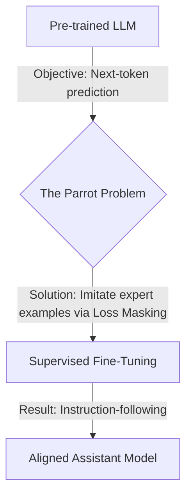

# 1. 지도 미세 조정(Supervised Fine-Tuning, SFT)

## 1. 문제점: 조수가 아닌 앵무새

ChatGPT나 Claude와 같은 모델을 사용해봤을 것입니다. 지시를 내리면 모델은 이를 따릅니다. 이러한 행동은 자연스럽게 느껴지지만, 이는 **신중하게 설계된 표면(facade)**입니다. 수조 개의 단어로 훈련된 근본적인 기본 모델(underlying base model)은 조수가 아닙니다. 그것은 강력하고 이질적인 **텍스트 완성 엔진(text-completion engine)**입니다. 이 모델의 유일한 목표는 통계적 정확도로 시퀀스에서 다음 단어를 예측하는 것입니다.

이러한 단일 목표가 **앵무새 문제(Parrot Problem)**를 만듭니다. 모델은 사용자 의도에 대한 개념 없이 **모방의 달인**이 됩니다.

Your Prompt:
> What is the primary cause of Earth's seasons? 
 
An Assistant's Expected Response:
> The primary cause of Earth's seasons is the tilt of the Earth's axis, which is about 23.5 degrees...

The Base Model's Likely Response:
>What is the primary cause of Earth's seasons? \\
A) The Earth's distance from the sun.\\
B) The tilt of the Earth's axis relative to its orbital plane.\\
C) The speed of the Earth's rotation.\\
D) Ocean currents and wind patterns.

예를 들어, 질문으로 프롬프트를 입력하면, 모델은 질문에 답하는 대신 그 텍스트를 다지선다형 질문 형식으로 만들며 텍스트를 계속 이어 나갔을 가능성이 높습니다. 왜냐하면 그 사전 훈련 데이터는 퀴즈와 테스트로 가득 차 있기 때문입니다. 순전히 통계적인 '다음 단어 예측' 관점에서 볼 때, 이는 해당 문장 시작에 대해 **가능성이 매우 높은 완성**입니다.

모델은 도움이 되지 않는 것이 아닙니다. 모델은 자신의 목표, 즉 **패턴을 완성하는 것**을 완벽하게 실행하고 있는 것입니다. 모델은 '사용자'나 '지시'라는 개념이 없습니다. 오직 텍스트만 볼 뿐입니다.

패턴을 완성하는 앵무새와 유용한 조수 사이의 이러한 격차는 **후처리(post-training)**라는 프로세스를 통해 좁혀집니다. 그 첫 번째이자 가장 중요한 단계가 바로 **지도 미세 조정(SFT)**입니다.

```python
import torch

def prepare_sft_batch(prompt: str, response: str, tokenizer):
    """
    This is the core engineering of SFT. It takes a prompt/response pair
    and creates the input_ids and the strategically masked labels.
    """
    # 1. Format the text with special tokens for conversation structure.
    prompt_part = f"<|user|> {prompt} <|end|> <|assistant|>"
    full_text = f"{prompt_part} {response} <|end|>"

    # 2. Tokenize to find the boundary for loss masking.
    # We only want to train the model on the assistant's response.
    prompt_ids = tokenizer.encode(prompt_part)
    mask_until_idx = len(prompt_ids)

    # 3. Tokenize the full conversation for model input.
    input_ids = tokenizer.encode(full_text)

    # 4. Create the labels tensor by cloning the input_ids.
    labels = torch.tensor(input_ids).clone()

    # 5. Apply the mask. This is the critical step.
    # We replace the prompt tokens in the labels with -100.
    labels[:mask_until_idx] = -100

    return {
        "input_ids": torch.tensor(input_ids),
        "labels": labels
    }
```

SFT의 전체 엔지니어링 과제는 단 하나의 영리한 데이터 변환 함수를 만드는 것으로 요약됩니다. PyTorch의 손실 함수는 -100 값을 무시하도록 하드코딩되어 있으므로, 이 레이블을 모델에 제공함으로써 우리는 모델에게 **" <\|assistant\|>를 볼 때, 전문가 응답을 생성하라"**는 한 가지를 배우도록 강제합니다.



이 데이터 변환이 왜 그렇게 효과적인지 이해하려면 먼저 변환이 적용되는 엔진을 완벽하게 이해해야 합니다. 다음 장에서는 사전 학습의 수학적 핵심인 교차 엔트로피 손실을 분석하여 앵무새가 애초에 어떻게 말하는 법을 배우는지 정확히 알아보겠습니다.

## 2. 사전 훈련의 엔진: 크로스 엔트로피 손실

모델에게 조수가 되도록 가르치기 전에, 우리는 먼저 모델이 어떻게 앵무새가 되었는지 이해해야 합니다. 기본 LLM의 방대한 지식은 **사전 훈련(pre-training)** 단계에서 단일하고 극도로 단순한 목표인 **다음 토큰 예측**에 대해 훈련되는 동안 단련됩니다. 모델은 고도로 정교한 패턴 완성 기계입니다.

이 기술을 가르치기 위해, 우리는 딥러닝 분류의 표준 주역인 **크로스 엔트로피 손실(Cross-Entropy Loss)**을 사용합니다.

크로스 엔트로피 손실은 모델이 정답에 대해 얼마나 **"놀랐는지(surprised)"** 측정하는 방법입니다. 모델이 정확한 다음 토큰에 높은 확률을 할당하면, 손실은 낮습니다 (놀람이 낮음). 매우 낮은 확률을 할당하면, 손실은 높습니다 (놀람이 높음). 수학적으로 이는 정확한 목표 토큰의 **음의 로그 확률(negative log-probability)**을 계산하는 것으로 단순화됩니다.

손으로 계산할 수 있는 최소한의 예를 통해 이를 구체적으로 설명해 보겠습니다.

단 여섯 단어의 어휘만 있는 작은 모델을 상상해 보세요.

*   **Vocabulary:** `{"<pad>": 0, "The": 1, "cat": 2, "sat": 3, "on": 4, "mat": 5}`
*   **Input Sequence (`input_ids`):** "The cat sat" -> `[1, 2, 3]`
*   **Target Sequence (`labels`):** "cat sat on" -> `[2, 3, 4]`

모델은 입력을 처리하여 각 위치에서 다음 단어로 나올 수 있는 단어 각각에 대한 원시 점수 벡터, 즉 **로짓**을 생성합니다. 모델이 다음과 같은 로짓을 생성했다고 가정해 보겠습니다.

| Position | Input Context | Model's Output Logits (for the next token) |
| :--- | :--- | :--- |
| 1 | `[1]` ("The") | `[0.1, 0.2, 2.0, 0.5, 0.3, 0.1]` |
| 2 | `[1, 2]` ("The cat") | `[0.1, 0.1, 0.2, 2.5, 0.4, 0.2]` |
| 3 | `[1, 2, 3]` ("The cat sat")| `[0.2, 0.1, 0.1, 0.3, 3.0, 0.5]` |

손실을 계산하기 위해 각 위치에 대해 세 단계를 수행합니다.
1. **소프트맥스:** 원시 로짓을 확률 분포로 변환합니다. $ \text{softmax}(z_i) = \frac{e^{z_i}}{\sum_j e^{z_j}} $.
2. **목표 확률 구하기:** 모델이 올바른 목표 토큰에 할당한 확률을 구합니다.
3. **손실 계산:** 해당 확률의 음의 자연 로그를 취합니다. $\text{손실} = -\log(P_{\text{target}})$.

단계별로 수학을 표에 채워 보겠습니다.

| Step | Input Context | Target Token | Model's Logits | Softmax Probabilities | Prob. of Target Token | Loss (-log P) |
| :-- | :--- | :--- | :--- | :--- | :--- | :--- |
| **1**| "The" | `cat` (idx 2) | `[0.1,..,**2.0**,..]` | `[0.08,..,**0.593**,..]` | `0.593` | `-log(0.593) = 0.522` |
| **2**| "The cat"| `sat` (idx 3) | `[0.1,..,**2.5**,..]` | `[0.07,..,**0.793**,..]` | `0.793` | `-log(0.793) = 0.232` |
| **3**| "The cat sat"| `on` (idx 4) | `[0.2,..,**3.0**,..]` | `[0.08,..,**0.773**,..]` | `0.773` | `-log(0.773) = 0.257` |
| | | | | **Total Loss (Average)** | | | **(0.522+0.232+0.257)/3 = 0.337** |

이 시퀀스의 최종 손실은 개별 토큰 손실의 **평균**인 **0.337**입니다. 이 단일 숫자는 최적화 프로그램에 모델이 전체 시퀀스에서 얼마나 잘못되었는지 알려주며, 역전파는 이 숫자를 사용하여 모델의 가중치를 조정합니다.

PyTorch에서 이 전체 프로세스는 단일하고 고도로 최적화된 함수로 처리됩니다. 

```python
import torch
import torch.nn.functional as F

# Our model's output logits. These are the *exact same numbers* from the table.
# Shape: (Batch, Time, Vocab_size) -> (1, 3, 6)
logits = torch.tensor([[
    [0.1, 0.2, 2.0, 0.5, 0.3, 0.1],  # Logits for predicting after "The"
    [0.1, 0.1, 0.2, 2.5, 0.4, 0.2],  # Logits for predicting after "The cat"
    [0.2, 0.1, 0.1, 0.3, 3.0, 0.5]   # Logits for predicting after "The cat sat"
]])

# The correct next tokens (our labels)
# Shape: (Batch, Time) -> (1, 3)
targets = torch.tensor([[2, 3, 4]]) # "cat", "sat", "on"

# F.cross_entropy expects (N, C) and (N,)
# So we reshape our tensors to squash the Batch and Time dimensions together.
logits_flat = logits.view(-1, logits.size(-1)) # Shape: (3, 6)
targets_flat = targets.view(-1)               # Shape: (3)

loss = F.cross_entropy(logits_flat, targets_flat)

print(f"Logits shape (original): {logits.shape}")
print(f"Logits shape (flattened): {logits_flat.shape}")
print(f"Targets shape (flattened): {targets_flat.shape}")
print(f"Calculated Loss: {loss.item():.3f}")
```
**Output:**
```
Logits shape (original): torch.Size([1, 3, 6])
Logits shape (flattened): torch.Size([3, 6])
Targets shape (flattened): torch.Size([3])
Calculated Loss: 0.337
```

이제 우리는 수학적 명확성을 가지고 앵무새 문제의 근원을 볼 수 있습니다. 모델의 유일한 목표는 인터넷의 방대한 텍스트 데이터셋에 대해 이 크로스 엔트로피 손실을 최소화하는 것입니다. 이것이 손실을 줄이는 가장 효과적인 방법이기 때문에, 모델은 **통계적 모방의 달인**이 되도록 가중치를 조정할 것입니다.

모델이 질문을 **"이해"**하는 것이 아닙니다. 데이터에 Q:...\\A:... 형식의 수많은 FAQ와 퀴즈가 포함되어 있기 때문에, 패턴을 완성하는 것이 가장 **"놀람"이 적은 경로**입니다. 모델의 훈련 목표가 **모방(mimicry)**이기 때문에 **앵무새**인 것입니다.

이 문제를 해결하려면 학습하는 데이터를 변경해야 합니다. 텍스트가 *있는 그대로*가 아니라, 우리가 *원하는* 텍스트의 모습을 보여줘야 합니다. 이것이 바로 지도 학습 미세 조정의 목표이며, 다음 장에서 이를 처음부터 구축할 것입니다.

## 3. SFT 해법: 전문가 모방의 이론

이전 장에서 우리는 사전 학습만으로는 강력하지만 목적이 없는 ‘앵무새’ 모델이 된다는 점을 확인했다. **Supervised Fine-Tuning(SFT)** 은 이 문제를 해결하는 첫 번째이자 가장 직접적인 방법이다. 핵심 아이디어는 단순하다. **지시를 잘 따르는 모델을 원한다면, 지시가 올바르게 수행된 고품질 데이터셋을 충분히 보여주면 된다.**

훈련 데이터의 **식단을 바꾼다**. 방대한 인터넷 텍스트 대신, `(prompt, response)` 쌍으로 구성된 잘 정리된 데이터셋을 사용한다. 이는 모델을 “세상 모든 책이 있는 도서관”에서 꺼내어, **전문가가 작성한 Q\&A 플래시카드** 중심의 학습과정으로 전환하는 것과 같다.

* **Prompt:** "Explain the concept of gravity to a 6-year-old in a short paragraph."
* **Response:** "Imagine the Earth is a giant magnet, but for everything! It's always gently pulling you and your toys down towards it. That's why when you jump, you always come back down. This special pulling power is called gravity!"

단순히 프롬프트와 응답을 따로 주어서는 안 된다. **언어 모델은 하나의 연속된 토큰 시퀀스만 이해**하며, **대화의 구조(누가 언제 말하는지)** 를 학습해야 한다.

이를 해결하기 위해 **특수 토큰**과 **채팅 템플릿**을 도입한다. 보편적으로 데이터는 다음과 같이 포맷된다:

```
<|user|>
{prompt}
<|end|>
<|assistant|>
{response}
<|end|>
```

즉 `(prompt, response)` 쌍을 하나의 문자열로 합친 뒤, 이를 `input_ids`로 토크나이즈한다.

**예시:**
`<|user|>\nExplain gravity...<|end|>\n<|assistant|>\nImagine the Earth...<|end|>`

이 템플릿 덕분에 모델은 **대화의 차례**를 배운다. `<|assistant|>` 토큰 뒤에는 자신이 도움되는 답변을 생성해야 함을 학습한다.

하지만 중요한 문제가 있다.이 전체 시퀀스를 2장에서 설명한 **다음 토큰 예측 목표**에 그대로 사용하면, 모델이 **사용자 프롬프트까지 예측**하도록 훈련된다.

**이것은 잘못이며 비효율적이다.** 우리는 모델이 **어시스턴트의 발화 부분만** 학습하길 원한다.

이를 위한 깔끔한 엔지니어링 기법이 **loss masking**이다.`labels` 텐서를 `input_ids` 복사본으로 만들고, **손실 계산을 무시할 토큰의 ID를 -100** 으로 바꾼다. PyTorch의 `CrossEntropyLoss` 는 이 값이 들어간 토큰은 완전히 무시한다.

간단한 토크나이즈 예시는 다음과 같다:

* `<|user|>` -> 6, `Explain` -> 7, `gravity` -> 8, `<|end|>` -> 9, `<|assistant|>` -> 10, `Gravity` -> 11, `is` -> 12, `a` -> 13, `force` -> 14

전체 시퀀스는 모델에 입력되고, `labels` 텐서는 어시스턴트 응답 부분만 실제 ID를 유지하고 나머지는 -100으로 마스킹된다.

| Token Text        | `input_ids` | `labels` | 손실 계산?  |
| :---------------- | :---------- | :------- | :------ |
| `<\|user\|>`      | 6           | -100     | **아니오** |
| `Explain`         | 7           | -100     | **아니오** |
| `gravity`         | 8           | -100     | **아니오** |
| `<\|end\|>`       | 9           | -100     | **아니오** |
| `<\|assistant\|>` | 10          | -100     | **아니오** |
| **`Gravity`**     | 11          | 11       | **예**   |
| **`is`**          | 12          | 12       | **예**   |
| **`a`**           | 13          | 13       | **예**   |
| **`force`**       | 14          | 14       | **예**   |
| **`<\|end\|>`**   | 9           | 9        | **예**   |

이렇게 하면 **전문가 응답을 올바르게 생성하는 능력**만을 기준으로 그래디언트가 계산된다. 즉, `<|user|> ... <|end|> <|assistant|>` 토큰 시퀀스를 보면 이어서 올 응답을 생성하라는 규칙을 배우는 것이다.

SFT 손실 함수는 사전 학습의 교차 엔트로피와 같지만, **응답 토큰만 평균**한다.

주어진 `(prompt, response)` 쌍 데이터셋 \$\mathcal{D}\_{\text{SFT}}\$ 에 대해 SFT의 목표는 다음과 같이 표현된다:

$$\mathcal{L}_{\text{SFT}}(\theta)$$
$$= - \mathbb{E}_{(x, y) \sim \mathcal{D}_{\text{SFT}}}$$
$$\left[ \sum_{t=1}^{|y|} \log P_{\theta}(y_t | x, y_{<t}) \right]$$

여기서

* \$P\_{\theta}(y\_t \| x, y\_{\<t})\$ 는 모델 \$\theta\$ 가 시점 \$t\$ 에서 올바른 토큰 \$y\_t\$ 에 부여한 확률
* 합 \$\sum\_{t=1}^{|y|}\$ 은 **프롬프트 \$x\$가 아닌 응답 \$y\$ 토큰에 대해서만** 계산
  이는 바로 우리가 설명한 **loss masking**을 수식으로 나타낸 것이다.

이로써 **Supervised Fine-Tuning의 이론**이 완성된다.우리가 왜 채팅 템플릿이 필요한지, 그리고 **loss masking이 핵심**인지를 이해했다.


## **4. SFT: PyTorch 구현**

이론을 살펴봤습니다. 대화를 채팅 템플릿으로 포맷하고 손실 마스킹을 사용하여 어시스턴트의 응답에 대해서만 훈련한다는 이론 말입니다. 이제 이 이론을 코드로 변환해보겠습니다.

SFT에서 주요 엔지니어링 작업은 훈련 루프가 아닙니다. 그것은 표준 PyTorch이기 때문입니다. 중요한 부분은 **데이터 콜레이션(data collation)**입니다. 즉, `(prompt, response)` 쌍의 배치를 받아서 모델에 필요한 `input_ids`와 `labels` 텐서로 변환하는 과정입니다.

명확성을 위해 작고 수작업으로 만든 어휘와 토크나이저를 사용하겠습니다. 이를 통해 외부 라이브러리에 얽매이지 않고 SFT 로직에만 완전히 집중할 수 있습니다.

```python
import torch

# 예제용 최소 토크나이저
class SimpleTokenizer:
    def __init__(self):
        self.vocab = {
            '<pad>': 0, 'The': 1, 'quick': 2, 'brown': 3, 'fox': 4,
            'jumps': 5, 'over': 6, 'lazy': 7, 'dog': 8,
            '<|user|>': 9, '<|assistant|>': 10, '<|end|>': 11,
            'What': 12, 'is': 13, 'a': 14, '?': 15
        }
        self.inv_vocab = {v: k for k, v in self.vocab.items()}

    def encode(self, text):
        # 구두점에 견고한 간단한 분할 기반 토크나이저
        tokens = text.replace('?', ' ?').split()
        return [self.vocab[t] for t in tokens]

    def decode(self, tensor):
        return " ".join([self.inv_vocab[i] for i in tensor.tolist()])

# 토크나이저 인스턴스 생성
tokenizer = SimpleTokenizer()

# 데이터의 샘플 배치 (딕셔너리 리스트)
# 참고: 단순화를 위해 응답의 길이는 같습니다.
sft_batch = [
    {"prompt": "The quick brown fox", "response": "jumps over the lazy dog"},
    {"prompt": "What is a dog ?", "response": "a lazy brown fox"},
]
```

이제 약속했던 핵심 로직입니다. 이 `sft_batch`를 받아서 마스크된 `labels` 텐서를 생성하는 함수를 작성하겠습니다. 이 함수는 3장의 이론을 단계별로 구현합니다.

```python
def sft_data_collator(batch, tokenizer):
    all_input_ids = []
    all_labels = []

    for example in batch:
        # 1. 채팅 템플릿으로 텍스트 포맷
        prompt_part = f"<|user|> {example['prompt']} <|end|> <|assistant|>"
        full_text = f"{prompt_part} {example['response']} <|end|>"

        # 2. 프롬프트 부분을 토크나이즈하여 마스킹 경계를 찾습니다.
        # 이는 손실 계산에서 무시할 토큰의 개수를 알려줍니다.
        prompt_ids = tokenizer.encode(prompt_part)
        mask_until_idx = len(prompt_ids)

        # 3. 모델 입력을 위해 전체 텍스트를 토크나이즈합니다.
        input_ids = tokenizer.encode(full_text)

        # 4. input_ids를 복제하여 레이블을 생성합니다.
        labels = torch.tensor(input_ids).clone()

        # 5. 마스크를 적용합니다. 이것이 핵심 SFT 트릭입니다.
        # 모든 프롬프트 토큰의 레이블을 -100으로 설정합니다.
        labels[:mask_until_idx] = -100

        all_input_ids.append(torch.tensor(input_ids))
        all_labels.append(labels)

    # 실제 구현에서는 모든 시퀀스를 동일한 길이로 패딩합니다.
    return {
        "input_ids": torch.stack(all_input_ids),
        "labels": torch.stack(all_labels)
    }

# 배치를 처리해봅시다
prepared_batch = sft_data_collator(sft_batch, tokenizer)
```

손실 마스킹이 작동하는 것을 보기 위해 준비된 배치를 출력해봅시다. 아래 표는 배치의 첫 번째 예제를 보여주며, 이론을 코드의 출력과 직접 연결합니다.

| 토큰 텍스트 | `input_ids` | `labels` | 손실 계산됨? |
| :--- | :--- | :--- | :--- |
| `<\|user\|>` | 9 | -100 | **아니오** |
| `The` | 1 | -100 | **아니오** |
| `quick` | 2 | -100 | **아니오** |
| `brown` | 3 | -100 | **아니오** |
| `fox` | 4 | -100 | **아니오** |
| `<\|end\|>` | 11 | -100 | **아니오** |
| `<\|assistant\|>`| 10 | -100 | **아니오** |
| **`jumps`** | 5 | 5 | **예** |
| **`over`** | 6 | 6 | **예** |
| **`the`** | 1 | 1 | **예** |
| **`lazy`** | 7 | 7 | **예** |
| **`dog`** | 8 | 8 | **예** |
| **`<\|end\|>`** | 11 | 11 | **예** |

코드가 이론을 완벽하게 실행했습니다. `labels` 텐서가 올바르게 마스크되어 어시스턴트의 응답에 대해서만 그라디언트가 계산되도록 보장합니다.

```python
print("--- Prepared Batch (First Example) ---")
print("Input IDs:", prepared_batch["input_ids"][0])
print("Labels:   ", prepared_batch["labels"][0])

# 디코딩해서 확인해봅시다
print("\n--- Decoded Labels (non-masked part) ---")
response_part = prepared_batch["labels"][0][prepared_batch["labels"][0] != -100]
print(f"Decoded: '{tokenizer.decode(response_part)}'")
```

데이터 준비의 어려운 작업이 끝났으므로, 실제 훈련 단계는 간단합니다. 단순히 `input_ids`와 `labels`를 모델에 전달하면 됩니다. 모델이 손실 계산에 `torch.nn.functional.cross_entropy`를 사용한다면 (모든 표준 트랜스포머 모델이 그렇습니다), `-100` 마스킹을 자동으로 처리합니다.

```python
# 'policy_model'이 우리의 LLM이고 'optimizer'가 AdamW 옵티마이저라고 가정합니다.
# 모델의 순전파는 (logits, loss)를 반환할 것으로 예상됩니다.
def sft_training_step(policy_model, optimizer, batch):
    policy_model.train()
    optimizer.zero_grad()

    # PyTorch의 cross_entropy가 -100 값의 레이블을 무시하기 때문에
    # 모델의 순전파가 자동으로 마스크된 손실을 계산합니다.
    outputs = policy_model(
        input_ids=batch["input_ids"],
        labels=batch["labels"]
    )
    loss = outputs.loss # Hugging Face 스타일 모델 출력을 가정

    loss.backward()
    optimizer.step()
    return loss.item()

# 개념적 사용법:
# loss_value = sft_training_step(my_gpt_model, my_optimizer, prepared_batch)
```

전체 SFT 파이프라인을 처음부터 성공적으로 구현했습니다. 모델에게 도움이 되는 응답이 *무엇*인지, 그리고 그것을 어떻게 생성하는지 가르쳤습니다. 앵무새가 어시스턴트가 되는 법을 배우고 있습니다.

하지만 이러한 직접 모방 방법에는 중요한 약점이 있습니다. 모든 "좋은" 응답이 동등하게 취급됩니다. 한 좋은 응답이 다른 응답보다 약간 더 좋거나, 더 자세하거나, 더 안전할 수 있다는 것을 모델에게 알려줄 방법이 없습니다. 모델에게 무엇을 말해야 하는지는 가르쳤지만, 어떻게 *판단*하는지는 가르치지 않았습니다.

마지막 장에서는 이러한 한계를 탐구하고 SFT가 더 넓은 정렬 영역에서 어디에 위치하는지 살펴보겠습니다.


## **5. 모방을 넘어서: SFT의 힘과 한계**

여정을 완료했습니다. 원시적이고 사전 훈련된 "앵무새"에서 시작하여, 지도 미세조정(Supervised Fine-Tuning)의 이론과 코드를 성공적으로 구현했습니다. 우리가 달성한 것과, 마찬가지로 중요한 것은 우리가 달성하지 못한 것이 무엇인지 요약해봅시다.

구조화된 채팅 템플릿과 손실 마스킹이라는 중요한 기법을 활용하여 모델의 행동을 근본적으로 변화시켰습니다. 우리 모델은 더 이상 단순한 패턴 완성 엔진이 아닙니다.

1. **대화 구조를 이해합니다:** 모델은 이제 `<|user|>`와 `<|assistant|>`의 역할을 인식하고, 어시스턴트 토큰 이후에 텍스트를 생성하는 것이 자신의 임무라는 것을 압니다.

2. **페르소나를 채택합니다:** SFT 데이터셋의 전문가가 작성한 응답의 스타일, 톤, 도움됨을 모방하는 법을 배웠습니다.

3. **지시를 따릅니다:** 훈련 데이터가 다루는 도메인 내에서, 모델은 이제 지시를 따르고, 질문에 답하고, 작업을 수행할 수 있습니다.

우리는 성공적으로 **견습 어시스턴트**를 만들었습니다. 규칙을 배웠고 보여준 작업을 복제할 수 있습니다. 이는 유용하고 안전한 AI 모델을 만드는 데 필수적인 첫 번째 단계입니다. SFT는 모든 현대적 정렬이 구축되는 기반입니다.

하지만 SFT에는 깊이 내재된 한계가 있습니다. 모든 "좋은" 답변을 동등하고 완벽하게 좋은 것으로 취급한다는 점입니다. 학습 과정은 이진적입니다 - 제공된 응답을 모방하고, 나머지 모든 것은 암묵적으로 틀린 것으로 간주합니다. 하지만 실제 세계는 뉘앙스와 "회색지대"로 가득합니다.

사용자 프롬프트를 고려해봅시다: "인쇄기의 영향을 요약하세요."

* **응답 A (좋음):** "1440년경 요하네스 구텐베르크가 발명한 인쇄기는 책의 대량 생산을 가능하게 했습니다. 이는 정보를 더 접근하기 쉽게 만들고 유럽 전역의 문해율을 높였습니다."

* **응답 B (더 좋음):** "구텐베르크의 인쇄기는 책의 비용을 대폭 낮춤으로써 지식을 민주화했습니다. 이는 새로운 아이디어의 빠른 확산을 가능하게 하고 종교 및 국가 당국의 정보 독점에 도전함으로써 르네상스, 종교개혁, 과학혁명을 촉진했습니다."

인간으로서 우리는 명확하게 선호도를 표현할 수 있습니다: **B가 A보다 좋습니다**. 더 통찰력 있고, 상세하며, 더 깊은 맥락을 제공합니다.

SFT 모델은 이러한 **상대적 선호도**를 학습할 수 없습니다.

* SFT 데이터셋에 A와 같은 응답만 포함되어 있다면, 모델은 사실적으로 정확하지만 기본적인 수준으로 학습할 것입니다.
* 데이터셋에 A와 B가 모두 포함되어 있다면, 모델은 두 스타일의 **평균**을 생성하는 법을 배워서 잠재적으로 일반적이 될 수 있습니다.
* B가 A보다 더 바람직한 출력이라는 것을 이해할 메커니즘이 없습니다. 보여준 것만 모방할 수 있습니다.

SFT는 모델에게 무엇을 *말해야* 하는지는 가르치지만, 여러 좋은 선택지 사이에서 어떻게 *판단*하거나 *선택*하는지는 가르치지 않습니다.

이러한 한계를 극복하기 위해 AI 정렬 분야는 **선호도 튜닝** 기법을 개발했습니다. 이러한 방법들은 단순한 모방을 넘어서 모델이 인간의 판단을 직접 이해하도록 가르칩니다.

이를 위해서는 새로운 종류의 데이터셋이 필요합니다: `(prompt, chosen_response, rejected_response)`.

모델에게 하나의 좋은 답변만 보여주는 대신, 두 개의 답변을 보여주고 어떤 것을 선호하는지 알려줍니다. **DPO(Direct Preference Optimization)**와 **RLHF(Reinforcement Learning from Human Feedback)** 같은 알고리즘은 이러한 선호도 데이터를 사용하여 모델을 추가로 미세조정합니다. 이들은 "선택된" 응답에는 더 높은 가능성을, "거부된" 응답에는 더 낮은 가능성을 할당하도록 학습하게 모델의 확률을 조정합니다.

SFT는 정렬 이야기의 끝이 아닙니다. 필수적인 첫 번째 장입니다. 원시 기본 모델을 일관성 있고 제어 가능한 것으로 변환하여, 더 정교한 선호도 튜닝을 위한 완벽한 시작점을 만듭니다.

이제 패턴을 모방하는 앵무새를 진정한 지시 따르는 어시스턴트로 변환하는 기본 기법을 이해했습니다. 이론, 수학, 코드를 모두 마스터했습니다. LLM 정렬의 전체 영역이 바로 여기서 시작됩니다.