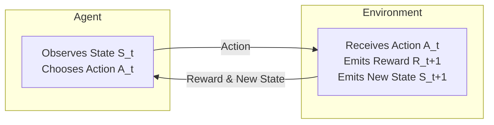
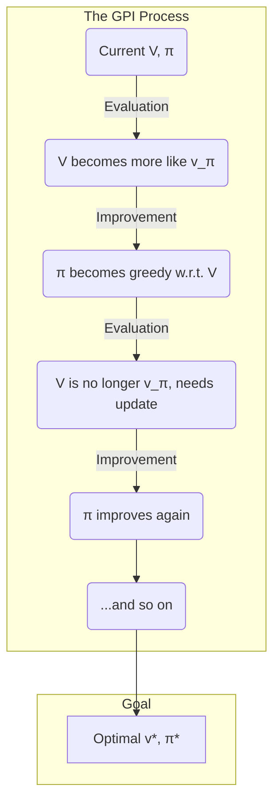
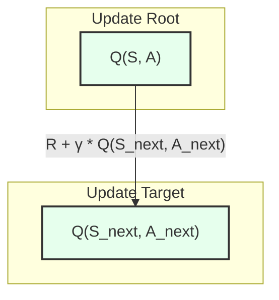
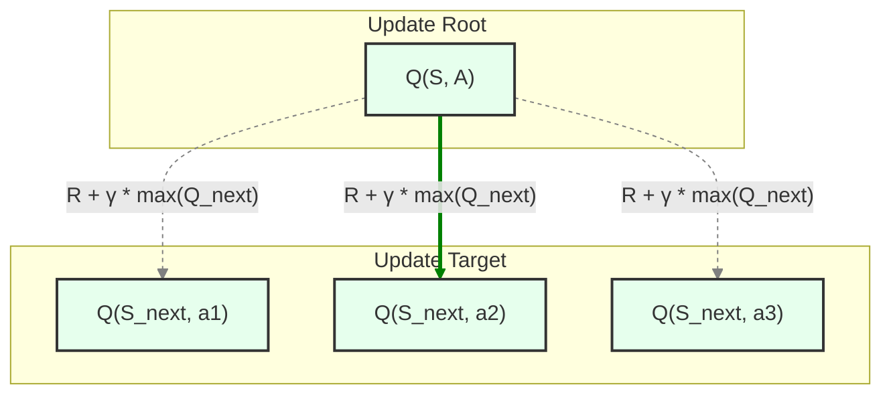
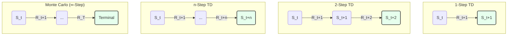
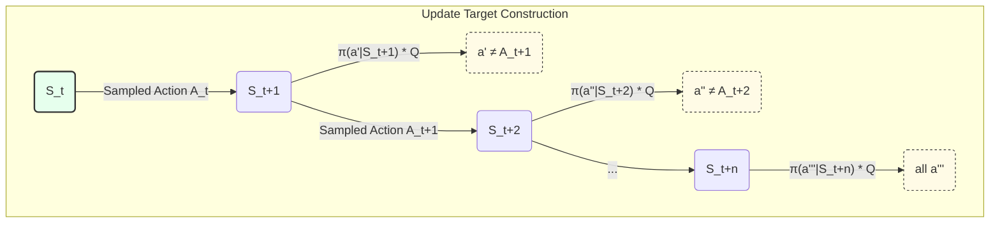

# 1.강화 학습: 다중-팔 밴딧 (Multi-Armed Bandits)

## 1. 핵심 아이디어 – 카지노 전략은 무엇인가?

시작하기 전에, 강화 학습(RL)을 다른 기계 학습 유형과 구분 짓는 핵심 아이디어를 이야기해 봅시다.

대부분의 경우, 기계를 가르칠 때 우리는 **지침**을 제공합니다. 이것을 *지도 학습*이라고 부릅니다. 수학 선생님이 정답(5 + 5 = 10)을 보여주고 암기하라고 하는 것과 같습니다. 피드백은 **지시적**입니다: "이것이 올바른 방법이다".

강화 학습은 다릅니다. 강화 학습은 **평가**로부터 배웁니다. 마치 비평가가 여러분의 공연을 지켜보는 것과 같습니다. 어떤 행동을 취한 후, 비평가는 그 행동이 얼마나 좋았거나 나빴는지 점수로만 알려줍니다. 무엇을 *했어야* 했는지 말해주지 않습니다. 피드백은 **평가적**입니다: "그것은 10점 만점에 7점이었다". 이것은 문제를 야기합니다: 최선의 행동을 찾기 위해서는 스스로 적극적으로 탐색해야 합니다.

좋은 행동을 찾아야 하는 이러한 필요성을, 명확하게 보여주는 고전적인 문제를 통해 탐구해 볼 것입니다.

### 1.1 k-Armed Bandit: 카지노 딜레마

카지노에 들어가서 k개의 슬롯 머신이 한 줄로 서 있는 것을 상상해 보세요. 우리 용어로는 이것이 **k-armed bandit**입니다. 각 머신(또는 "팔")은 여러분이 취할 수 있는 **행동**입니다.

*   여러분은 1000개와 같이 제한된 수의 토큰을 가지고 있습니다.
*   각 머신은 잭팟을 지급할 확률이 다르게 숨겨져 있습니다. 이 숨겨진 평균 지급액이 머신의 진정한 **가치**입니다.
*   여러분의 목표는 간단합니다: **가능한 한 가장 많은 돈을 가지고 나오는 것**입니다.

어떻게 플레이하시겠습니까? 이것은 단순한 수수께끼가 아니라, 강화 학습에서 가장 중요한 **탐색(Exploration) 대 활용(Exploitation)의 균형 문제**에 대한 완벽한 비유입니다.

### 1.2 문제의 형식화 (간단한 설명)

카지노 게임에 몇 가지 용어를 붙여봅시다.

*   **행동** a는 k개의 레버 중 어느 것을 당길지 선택하는 것입니다.
*   시점 t(예: 첫 번째 당김, t=1)에 선택하는 행동을 A_t라고 부릅니다.
*   그 당김으로부터 얻는 **보상**을 R_t라고 합니다.
*   각 행동 a는 참된 평균 보상을 가지며, 이를 **가치**라고 부르고 q*(a)로 표기합니다.

이 가치는 우리가 그 머신으로부터 평균적으로 얻을 것으로 **기대하는** 보상입니다. 
`q*(a) = E[R_t | A_t = a]`

평이한 영어로 이것은 " **행동 a의 진정한 가치는 그 행동을 선택했을 때 얻게 될 기대(평균) 보상이다** "를 의미합니다.

문제는? **여러분은 진정한 가치 q*(a)를 모른다는 것입니다!** 게임을 플레이하면서 그것들을 발견해야 합니다.

### 1.3 핵심 충돌: 탐색 대 활용

여기서 딜레마가 발생합니다. 토큰을 사용할 때마다 다음과 같은 선택에 직면합니다.

1.  **활용 (Exploitation):** 몇 대의 머신을 시도했고, 그중 하나가 다른 것들보다 더 많은 돈을 지불하는 것처럼 보입니다. 활용은 현재 지식에 기반하여 **지금 당장** 보상을 최대화하기 위해 그 머신을 계속 사용하는 것을 의미합니다.
2.  **탐색 (Exploration):** 의도적으로 다른 머신을 시도합니다—나빠 보이는 머신이거나 아직 시도하지 않은 머신입니다. 왜일까요? 현재 가장 좋아하는 머신보다 **더 좋을 수도 있기 때문입니다**. 여러분은 세상에 대한 지식을 향상시키기 위해 탐색하는 것입니다.

**충돌:** 하나의 토큰으로 탐색과 활용을 동시에 할 수는 없습니다. 잠재적으로 더 나쁜 머신을 탐색할 때마다, 현재 가장 좋아하는 머신에서 얻을 수 있는 보장된 괜찮은 보상을 포기하게 됩니다. 하지만 활용만 한다면, 괜찮은 머신에 갇혀서 옆에 있는 진정한 잭팟을 절대 발견하지 못할 수도 있습니다.

이것이 바로 **탐색-활용 딜레마**입니다. 이것은 강화 학습에서 가장 중요한 기초 개념이라고 할 수 있습니다. 이 균형을 잘 맞추는 좋은 전략을 찾는 것이 지능적인 에이전트를 만드는 핵심입니다.

다음 섹션에서는 이 문제를 해결하기 위한 간단하지만 결함이 있는 전략을 살펴보겠습니다.

## 2. 간단하지만 결함이 있는 전략 - "탐욕적인(Greedy)" 접근 방식

대부분의 사람들은 슬롯 머신 게임을 어떻게 할까요? 가장 간단한 전략은 "탐욕적"인 것입니다.

탐욕적인 전략은 두 가지 단계로 작동합니다.

1.  **추정 (Estimate):** 각 머신에서 얻은 보상의 실행 평균을 유지합니다.
2.  **활용 (Exploit):** 지금까지 평균이 가장 높은 머신의 레버를 항상 당깁니다.

이것은 합리적으로 들리죠? 수집한 데이터를 사용하여 매 단계에서 가장 수익성 있는 선택을 하는 것입니다.

행동 가치 추정 방법

머신의 진정한 가치 q*(a)를 모르기 때문에, 우리는 그것을 추정해야 합니다. 시점 t에서의 우리의 추정치를 **Q_t(a)**라고 부를 것입니다. 이것을 하는 가장 간단한 방법은 **표본 평균 방법(sample-average method)**입니다.

`Q_t(a) = (sum of rewards when action a was taken before time t) / (number of times action a was taken before time t)`

이것은 간단한 평균입니다. 만약 레버 1을 세 번 당겨서 5, 7, 3의 보상을 받았다면, 레버 1에 대한 추정 가치는 (5+7+3)/3 = 5가 됩니다.

### 2.1 탐욕적인 행동 선택 규칙

탐욕적인 규칙은 항상 추정 가치가 가장 높은 행동을 선택하는 것입니다.
`A_t = argmax_a Q_t(a)`

여기서 `argmax_a Q_t(a)`는 " **Q_t(a)의 값을 최대화하는 행동 a를 찾으시오** "를 의미합니다. 만약 두 머신이 최고치에서 동률을 이룬다면, 그중 하나를 무작위로 선택할 수 있습니다.

### 2.2 탐욕적인 전략이 실패하는 이유

탐욕적인 방법에는 치명적인 결함이 있습니다: **너무 빨리 판단하고 결코 뒤돌아보지 않습니다**. 가장 *최고의* 옵션이 아닐지라도, 처음으로 "충분히 좋은" 옵션을 찾으면 그것에 갇히게 됩니다.

최소한의 예시로 이것이 어떻게 작동하는지 봅시다.

**설정:**

*   3개의 팔을 가진 밴딧 문제.
*   진정한 (숨겨진) 가치는 다음과 같습니다.
    *   머신 1: q*(1) = 1 (고장난 것)
    *   머신 2: q*(2) = 5 (꽤 좋은 것)
    *   머신 3: q*(3) = 10 (진정한 잭팟!)
*   시작하려면 에이전트에게 데이터가 필요하므로, 각 머신을 한 번씩 시도한다고 가정합시다.

**게임:**

1.  **첫 번째 당김:** 에이전트가 **머신 1**을 시도합니다. 고장난 것이고 보상은 R_1 = 1입니다.
    *   우리의 추정치는 이제 Q(1) = 1입니다.
2.  **두 번째 당김:** 에이전트가 **머신 2**를 시도합니다. 운 좋게 보상은 R_2 = 7입니다.
    *   우리의 추정치는 이제 Q(2) = 7입니다.
3.  **세 번째 당김:** 에이전트가 **머신 3** (진정한 잭팟)을 시도합니다. 순전히 운이 나쁘게도, 이 한 번의 당김은 실망스러운 보상 R_3 = 4를 줍니다.
    *   우리의 추정치는 이제 Q(3) = 4입니다.

**함정:** 이 세 번의 당김 후에, 에이전트의 추정치는 다음과 같습니다.

*   Q(1) = 1
*   Q(2) = 7
*   Q(3) = 4

이제 탐욕적인 전략이 시작됩니다. 이 시점부터 에이전트는 어떤 머신을 선택할까요? 항상 argmax인 **머신 2**를 선택할 것입니다.

에이전트는 영원히 머신 2의 레버를 당길 것입니다. 머신 3으로 다시 돌아가지 않을 것입니다. 왜냐하면 한 번의 불운한 경험에 기반하여 머신 2가 더 좋다고 "믿기" 때문입니다. 에이전트는 최적이 아닌 행동을 활용하는 데 갇히게 되고 **진정한 잭팟 머신을 결코 발견하지 못할 것입니다**.

이것이 순수한 활용이 실패하는 이유입니다. 초기 추정이 틀렸을 경우를 대비하여 에이전트가 계속 탐색하도록 강제하는 방법이 필요합니다. 이것이 우리의 첫 번째 진정한 해결책으로 이어집니다.

## 3. 더 똑똑한 전략 - ε-탐욕적인 (Epsilon-Greedy) 방법

탐욕적인 전략은 너무 고집이 세서 실패했습니다. "충분히 좋은" 옵션을 찾으면 결코 뒤돌아보지 않았습니다. ε-탐욕적인("엡실론-그리디"로 발음) 방법은 매우 간단하고 영리한 규칙으로 이것을 해결합니다.

**핵심 아이디어:** "대부분의 경우 탐욕적으로 행동하지만, 가끔은 완전히 무작위적인 행동을 합니다."

저녁 식사할 식당을 고르는 것을 생각해 보세요.

*   **활용 (탐욕):** 여러분이 좋아하는 피자집에 갑니다. 왜냐하면 그곳이 좋다는 것을 알기 때문입니다.
*   **탐색 (무작위성):** 한 달에 한 번은 좋아하는 곳을 무시하고 구글 지도에서 무작위로 식당을 선택합니다. 끔찍한 곳에 갈 수도 있지만, 새로운 좋아하는 곳을 발견할 수도 있습니다!

이 작은 무작위성이 핵심입니다. 에이전트가 모든 옵션을 계속 탐색하도록 강제하여 갇히는 것을 방지합니다.

### 3.1 ε-탐욕적인 규칙

작동 방식은 다음과 같습니다. 우리는 **엡실론(ε)**이라고 불리는 작은 확률(일반적으로 0.1과 같은 값, 즉 10%)을 선택합니다.

매 시점마다 에이전트는 다음을 수행합니다.

1.  0과 1 사이의 무작위 숫자를 생성합니다.
2.  **만약 숫자가 ε보다 크다면:** **활용**합니다. 탐욕적인 방법과 마찬가지로 추정 가치가 가장 높은 행동을 선택합니다.
    *   이것은 1 - ε의 확률(예: 90%의 시간)로 발생합니다.
3.  **만약 숫자가 ε보다 작거나 같다면:** **탐색**합니다. 사용 가능한 **모든** 행동 중에서 완전히 무작위로, 동일한 확률로 행동을 선택합니다.
    *   이것은 ε의 확률(예: 10%의 시간)로 발생합니다.

### 3.2 ε-탐욕적인 방법이 작동하는 이유

이전 섹션의 "탐욕적인 함정"으로 돌아가 봅시다. 우리 에이전트는 머신 2의 레버를 영원히 당기는 데 갇혀 있었고, 머신 3이 진정한 잭팟이라는 것을 결코 깨닫지 못했습니다.

ε = 0.1인 ε-탐욕적인 에이전트는 이것을 어떻게 처리할까요?

*   **90%의 시간** 동안, 그것은 추정치(Q(1)=1, Q(2)=7, Q(3)=4)를 보고 탐욕적으로 **머신 2**를 선택할 것입니다.
*   **하지만 10%의 시간** 동안, 그것은 추정치를 무시하고 무작위로 머신을 선택할 것입니다. 이것은 머신 1, 머신 2 또는 **머신 3**을 선택할 기회가 있다는 것을 의미합니다.

결국, 그 10%의 기회는 에이전트가 **머신 3**을 다시 시도하게 만들 것입니다. 그리고 또 다시. 머신 3으로부터 더 많은 샘플을 얻을수록, 추정 가치 Q(3)은 그 불운했던 4에서 진정한 가치 10을 향해 천천히 상승할 것입니다.

Q(3)이 Q(2)보다 커지면, 에이전트의 "탐욕적인" 선택이 바뀔 것입니다! 이제 90%의 시간 동안, 그것은 **올바른** 잭팟 머신을 활용할 것입니다.

### 3.3 보장

이 방법의 장점은 엄청납니다. 장기적으로 플레이 횟수가 증가함에 따라 모든 머신이 여러 번 샘플링될 것입니다. 이 때문에 **큰 수의 법칙**은 우리의 추정 가치 Q_t(a)가 결국 진정한 가치 q*(a)로 수렴할 것이라고 말해줍니다.

이것은 에이전트가 결국 어떤 행동이 최선인지 알아내고 대부분의 시간 동안 그것을 선택할 것임을 보장합니다. "갇히는" 문제를 완전히 해결합니다. 이제 이것이 단계별 예시로 정확히 어떻게 작동하는지 봅시다.

## 4. 플레이해 봅시다! 단계별 진행

보는 것이 믿는 것입니다. ε-탐욕적인 에이전트의 "두뇌"가 업데이트되는 것을 지켜보기 위해 몇 번의 시도를 시뮬레이션해 볼 것입니다.

### 4.1 설정

*   **게임:** 3개의 팔을 가진 밴딧 문제.
*   **숨겨진 진실:** 진정한 평균 지급액(q*(a))은 다음과 같습니다.
    *   q*(1) = 2 (고장난 것)
    *   q*(2) = 6 (잭팟!)
    *   q*(3) = 4 (괜찮은 것)
    *   *에이전트는 이 숫자들을 모릅니다.*
*   **에이전트의 전략:** ε = 0.1 (탐색할 확률 10%)을 사용하는 ε-탐욕적.
*   **초기 상태:** 에이전트는 지식 없이 시작합니다. 각 팔에 대한 추정 가치(Q)와 당김 횟수(N)는 모두 0입니다.
    *   Q(1)=0, Q(2)=0, Q(3)=0
    *   N(1)=0, N(2)=0, N(3)=0

### 4.2  점진적 업데이트 공식

새로운 보상을 얻을 때마다 Q 값을 효율적으로 업데이트해야 합니다. 매번 처음부터 평균을 다시 계산하지 않을 것입니다. 대신 간단한 점진적 공식을 사용합니다.

행동 A를 선택하고 보상 R을 얻을 때.

1.  먼저, 해당 행동의 횟수를 증가시킵니다: N(A) = N(A) + 1.
2.  그런 다음, 이 공식으로 가치 추정치를 업데이트합니다:
    *   `Q(A) = Q(A) + (1/N(A)) * [R - Q(A)]`
    *   이는 "새로운 Q 값은 이전 Q 값에, 새로운 보상과 이전 Q 값의 차이(오차)를 N(A)로 나눈 값을 더한 것"을 의미합니다.

이것을 자세히 살펴봅시다.

*   `[R - Q(A)]`는 **오차**입니다: 새로운 보상과 우리가 기대했던 것 사이의 차이입니다.
*   우리는 이 오차를 수정하기 위해 1/N(A)의 "보폭"을 취합니다. 우리가 행동을 더 많이 샘플링할수록(N(A)가 커질수록), 보폭은 작아집니다. 이것은 우리의 추정치가 시간이 지남에 따라 더 안정적이고 단일 무작위 보상에 덜 영향을 받는다는 것을 의미합니다.

### 4.3 게임 시작


| Step (t) | Agent's Decision | Action (A_t) | Reward (R_t) | Agent's Updated Brain: N(a) and Q(a) |
| :--- | :--- | :--- | :--- | :--- |
| **Start** | --- | --- | --- | `N=(0,0,0)`, `Q=(0,0,0)` |
| **1** | All Qs are 0, must pick randomly. | **Arm 1** | `R=1` | `N=(1,0,0)`, `Q=(1, 0, 0)`<br>_`Q(1) = 0 + 1/1 * (1-0) = 1`_ |
| **2** | `argmax` is Arm 1. Roll is > 0.1 -> **EXPLOIT**. | **Arm 1** | `R=3` | `N=(2,0,0)`, `Q=(2, 0, 0)`<br>_`Q(1) = 1 + 1/2 * (3-1) = 2`_ |
| **3** | `argmax` is Arm 1. Roll is < 0.1 -> **EXPLORE**. Picks randomly. | **Arm 3** | `R=5` | `N=(2,0,1)`, `Q=(2, 0, 5)`<br>_`Q(3) = 0 + 1/1 * (5-0) = 5`_ |
| **4** | `argmax` is now Arm 3. Roll > 0.1 -> **EXPLOIT**. | **Arm 3** | `R=3` | `N=(2,0,2)`, `Q=(2, 0, 4)`<br>_`Q(3) = 5 + 1/2 * (3-5) = 4`_ |
| **5** | `argmax` is still Arm 3. Roll > 0.1 -> **EXPLOIT**. | **Arm 3** | `R=6` | `N=(2,0,3)`, `Q=(2, 0, 4.67)`<br>_`Q(3) = 4 + 1/3 * (6-4) = 4.67`_ |
| **6** | `argmax` is still Arm 3. Roll < 0.1 -> **EXPLORE**. Picks randomly. | **Arm 2** | `R=8` | `N=(2,1,3)`, `Q=(2, 8, 4.67)`<br>_`Q(2) = 0 + 1/1 * (8-0) = 8`_ |
| **7** | **`argmax` is now Arm 2!** Roll > 0.1 -> **EXPLOIT**. | **Arm 2** | `R=5` | `N=(2,2,3)`, `Q=(2, 6.5, 4.67)`<br>_`Q(2) = 8 + 1/2 * (5-8) = 6.5`_ |

### 4.4 계임 분석

이 짧은 시퀀스는 ε-탐욕적인 방법의 힘을 보여줍니다.
*   **초기 믿음:** 두 번의 당김 후에, 에이전트는 팔 1이 최고라고 생각했습니다 (Q(1)=2). 순전히 탐욕적인 에이전트라면 여기서 갇혔을 것입니다.
*   **탐색을 통한 발견:** **3단계**에서 무작위 탐색 행동은 에이전트가 팔 3을 시도하게 만들었습니다. 좋은 보상(R=5)을 얻었고, 최고의 팔에 대한 믿음이 바뀌었습니다.
*   **또 다른 발견:** 에이전트는 6단계까지 팔 3을 행복하게 활용하고 있었는데, 또 다른 무작위 탐색이 마지막으로 알 수 없었던 팔 2를 시도하게 만들었습니다. 매우 높은 보상(R=8)을 얻었고, 믿음이 다시 바뀌었습니다.
*   **진실에 가까워짐:** 단 7번의 당김 후에, 에이전트의 추정치는 Q=(2, 6.5, 4.67)입니다. 이것들은 진정한 가치 q*=(2, 6, 4)에 훨씬 더 가까워지고 있습니다. 이제 그것의 탐욕적인 선택은 올바르게 최고의 팔인 팔 2에 초점을 맞춥니다.

이것이 학습 과정입니다. 에이전트는 아무것도 모르는 상태에서 시작하여 믿음을 형성하고, 탐색을 사용하여 그 믿음을 도전하고 다듬습니다. 수천 단계에 걸쳐, 이 간단한 메커니즘은 에이전트가 환경에서 최선의 행동을 정확히 찾아낼 수 있도록 합니다.

## 5. 탐색을 위한 두 가지 "영리한 트릭"

ε-탐욕적인 방법은 간단하고 효과적이지만, 그 탐색은 *무작위적*입니다. 100번 시도한 머신을 탐색하든, 한 번도 만져보지 않은 머신을 탐색하든 신경 쓰지 않습니다. 탐색 방식을 더 똑똑하게 만들 수 있을까요? 예, 그렇습니다.

여기에 탐색 과정에 약간의 지능을 더하는 두 가지 인기 있는 기술이 있습니다.

### 5.1 낙관적인 초기 값: 긍정적인 사고의 힘

이것은 학습 초기에 탐색의 폭발을 장려하는 놀랍도록 간단한 트릭입니다.

**아이디어:** 가치 추정치 Q(a)를 0으로 초기화하는 대신, "터무니없이 낙관적인" 높은 숫자로 초기화합니다. 예를 들어, 어떤 머신에서든 얻을 수 있는 최대 보상이 10이라는 것을 안다면, 모든 초기 Q 값을 20으로 설정할 수 있습니다.

`Q_1(a) = 20` (모든 행동 a에 대해)

**작동 방식:**

1.  첫 번째 단계에서 모든 행동은 똑같이 놀라워 보입니다 (Q=20). 에이전트는 하나를 선택합니다, 예를 들어 팔 1.
2.  실제 보상을 받습니다, 예를 들어 R=5.
3.  에이전트는 추정치 Q(1)을 업데이트합니다. 새로운 Q(1)은 이제 20보다 훨씬 낮은 값이 될 것입니다.
4.  이제 에이전트는 옵션들을 다시 봅니다. 팔 1은 (여전히 20의 가치를 가지고 있다고 믿는) 다른 모든 팔들에 비해 "실망스러워" 보입니다.
5.  따라서 다음 차례에, 탐욕적인 에이전트는 자연스럽게 **다른** 팔을 선택할 것입니다.

이 과정은 계속됩니다. 팔이 시도될 때마다 그 가치는 낙관적인 최고치에서 떨어져 "실망스러워" 보이고, 에이전트가 아직 건드리지 않은 다른 모든 팔들을 시도하도록 장려합니다. 이것은 에이전트가 진정한 최선의 옵션에 정착하기 전에 모든 것을 최소한 몇 번 탐색하도록 유도하는 자체 수정 시스템입니다.

**핵심 요약:** 낙관적임으로써, 순전히 탐욕적인 에이전트가 탐색하도록 속임수를 씁니다.

### 5.2 상한 신뢰 경계 (UCB): "스마트 탐색" 방법

UCB는 더 정교한 접근 방식입니다. 그것은 핵심 질문을 다룹니다: 우리가 탐색할 것이라면, 어떤 팔을 시도하는 것이 **가장 유용한** 것일까요?

**아이디어:** 탐색하기에 가장 좋은 팔은 다음 두 가지를 모두 충족하는 팔입니다.

*   **잠재적으로 높은 가치** (현재 Q(a)가 높음).
*   **매우 불확실함** (많이 시도하지 않아서 Q(a)가 매우 틀릴 수 있음).

UCB는 이 두 가지 요소를 단일 점수로 결합합니다. Q(t)의 argmax를 단순히 선택하는 대신, 특수 공식의 argmax를 선택합니다.

`A_t = argmax_a [ Q_t(a) + c * sqrt(ln(t) / N_t(a)) ]`

이 공식은 다음과 같은 요소들로 구성됩니다.

*   `Q_t(a)`는 우리의 표준 가치 추정치입니다. 이것은 **활용** 부분입니다.
*   두 번째 부분인 `c * sqrt(ln(t) / N_t(a))`는 **탐색 보너스** 또는 **불확실성 항**입니다.
    *   `t`는 지금까지 총 당김 횟수입니다. `t`가 증가함에 따라 이 항은 천천히 증가하여 시간이 지남에 따라 탐색을 장려합니다.
    *   `N_t(a)`는 팔 `a`를 당긴 횟수입니다. 이것이 중요한 부분입니다: **`N_t(a)`가 증가할수록 불확실성 보너스는 줄어듭니다**.
    *   `c`는 탐색을 얼마나 선호하는지를 제어하는 상수입니다. `c`가 클수록 더 많이 탐색합니다.

**작동 방식:**

*   어떤 팔이 좋은 Q 값을 가지지만 여러 번 시도되었다면 (`N_t(a)`가 크다면), 그 불확실성 보너스는 작을 것입니다. 그것은 이미 알려진 양입니다.
*   어떤 팔이 평범한 Q 값을 가지지만 몇 번만 시도되었다면 (`N_t(a)`가 작다면), 그 불확실성 보너스는 매우 클 것입니다. 이것은 그 팔의 진정한 가치가 우리가 생각하는 것보다 훨씬 높을 수 있기 때문에 탐색을 위한 매력적인 후보가 됩니다.

UCB는 탐색과 활용의 균형을 자연스럽게 맞춥니다. 그것은 불확실한 팔을 선호하고, 그것들을 시도할수록 불확실성은 감소하며 Q 값은 더 중요해지기 시작합니다. ε-탐욕적인 방법의 무작위 접근 방식보다 더 지시적이고 종종 더 효율적인 탐색 방법입니다.

## 6. 그래서 무엇? 밴딧이 중요한 이유

우리는 k-armed bandit 문제에 대해 살펴보았고, 간단한 카지노 비유로 시작하여 그것을 해결하기 위한 여러 전략을 탐구했습니다. 그래서 핵심은 무엇일까요?

### 6.1 요약: 문제의 핵심

다중-팔 밴딧 문제는 실제 슬롯 머신에 관한 것이 아닙니다. 그것은 모든 강화 학습의 핵심 과제인 **탐색-활용 딜레마**의 단순화되고 순수한 버전입니다.

우리는 간단한 전략이 주요 결함을 가질 수 있음을 보았습니다.

*   **탐욕적인 (Greedy)** 방법은 갇히게 되어, 결코 뒤돌아보지 않기 때문에 최선의 옵션을 찾지 못합니다.

그리고 우리는 균형을 지능적으로 맞춰서 그것을 해결하는 방법을 보았습니다.

*   **ε-탐욕적인 (ε-Greedy)** 방법은 간단하고 견고한 해결책입니다. 대부분의 시간 동안 탐욕적으로 행동하지만, 작은 확률 ε로 무작위 탐색 행동을 취하여 결코 갇히지 않도록 합니다.
*   **낙관적인 초기 값 (Optimistic Initial Values)**은 순전히 탐욕적인 에이전트를 사용하지만 모든 것이 놀랍다고 가정하여 초기에 자연스러운 탐색을 장려하는 영리한 트릭입니다.
*   **상한 신뢰 경계 (UCB)**는 유망하고 매우 불확실한 행동을 우선시하여 전략적으로 탐색하는 더 정교한 방법입니다.

이러한 각 방법은 정보를 수집하는 (탐색하는) 동시에 가지고 있는 정보로 보상을 최대화하려는 (활용하는) 방법을 제공합니다.

### 6.2 실제 강화 학습으로의 연결

이 "밴딧" 프레임워크는 근본적인 구성 요소입니다. 동일한 원칙은 기술 및 실생활의 훨씬 더 복잡한 문제에도 적용됩니다.

*   **웹사이트 A/B 테스트:** 어떤 버전의 헤드라인이나 버튼 색상(행동)이 가장 많은 클릭(보상)을 얻을까요? 회사는 밴딧 알고리즘을 사용하여 다른 버전을 자동으로 탐색하고 가장 잘 작동하는 것을 빠르게 활용하여 실시간으로 사용자 참여를 최대화할 수 있습니다.
*   **임상 시험:** 의사들은 질병에 대한 가장 효과적인 치료법(행동)을 찾기를 원합니다. 각 환자의 결과는 보상입니다. 밴딧 알고리즘은 환자에게 현재 가장 잘 알려진 치료법을 제공하는 것(활용)과 훨씬 더 나을 수 있는 새롭고 실험적인 치료법을 시도하는 것(탐색) 사이의 균형을 맞추는 데 도움이 될 수 있으며, 장기적으로 더 많은 생명을 구할 수 있습니다.
*   **전체 RL 문제:** 지금까지 논의한 문제는 "비연관적"입니다. 즉, 최선의 행동은 항상 동일합니다. 하지만 최선의 행동이 **상황**이나 **맥락**에 따라 달라진다면 어떨까요?
    *   자율 주행 자동차의 경우, 최선의 행동(조향, 제동)은 상황(빨간불, 초록불, 보행자)에 따라 달라집니다.
    *   게임 AI의 경우, 최선의 움직임은 보드 상태에 따라 달라집니다.

이것을 **연관 검색(associative search)** 또는 **상황별 밴딧(contextual bandits)**이라고 부르며, 이것이 완전한 강화 학습 문제로 나아가는 다음 단계입니다. 에이전트는 전반적으로 가장 좋은 행동뿐만 아니라 **각 특정 상황에 대한** 가장 좋은 행동을 학습해야 합니다. 여기서 배운 ε-탐욕적 및 UCB와 같은 방법은 이러한 고급 AI의 핵심 의사 결정 구성 요소로 사용됩니다.

k-armed bandit 문제의 간단한 탐색-활용 균형 문제를 이해함으로써, 여러분은 복잡한 세상에서 학습하고 지능적으로 행동하기 위해 모든 강화 학습 에이전트가 해결해야 하는 본질적인 도전을 파악한 것입니다.

# 2. 강화 학습: 유한 마르코프 결정 과정

## 1. 거대한 도약 – 보상뿐 아니라 다음 단계를 고려하는 것

지난 장에서는 다중 슬롯 머신(Multi-Armed Bandit) 문제를 탐구했습니다. 이는 탐색(exploration)과 활용(exploitation) 사이의 핵심적인 긴장 관계를 이해하는 좋은 방법이었죠. 하지만 그것은 매우 단순했습니다. 우리가 취한 행동은 우리에게 보상을 주었고, 그것으로 끝이었습니다. 게임은 초기화되었습니다. 우리의 선택은 다음에 일어날 일에 영향을 미치지 않았습니다.

이제 우리는 전체 강화 학습 문제에 도전할 준비가 되었습니다. 여기서는 우리의 행동이 결과를 가져옵니다. 행동은 단순히 보상을 주는 것을 넘어, 미래를 위한 우리의 상황을 변화시킵니다. 이것이 바로 **순차적 의사결정(sequential decision-making)** 문제입니다.

> **비유:** 당신이 미로에 놓인 로봇이라고 상상해 보세요. 남, 북, 동, 서 방향으로 움직일 수 있습니다. 어떤 칸에는 치즈(+1 보상)가 있고, 어떤 칸에는 전기 충격(-1 보상)이 있으며, 대부분의 칸은 비어 있습니다(0 보상). 당신의 목표는 단지 **다음** 치즈 조각을 얻는 것이 아닙니다. 그것은 장기적으로 가장 많은 치즈를 얻고 충격을 피하는 경로를 미로에서 찾는 것입니다.

여기서 모든 행동은 두 가지 결과를 가집니다:
1.  즉각적인 **보상(reward)** (또는 페널티).
2.  **새로운 상황(new situation)** (미로의 다른 칸).

학습자(**에이전트(agent)**)와 그 세계(**환경(environment)**) 간의 이러한 상호작용의 반복은 강화 학습의 핵심입니다.

### 1.1 에이전트-환경 인터페이스

우리는 이 상호작용을 불연속적인 시간 단계(t = 0, 1, 2, ...)에서 반복적으로 발생하는 간단한 루프로 공식화할 수 있습니다.


**마르코프 결정 과정(Markov Decision Process, MDP)**을 형성하는 이 루프의 구성 요소를 살펴보겠습니다.

*   **상태(State) (S_t):** 시간 t에서 에이전트의 상황을 나타냅니다. 우리의 미로에서는 이것이 에이전트의 (x, y) 좌표가 될 것입니다.
*   **행동(Action) (A_t):** 에이전트가 가능한 행동 집합에서 선택하는 선택입니다. 우리의 미로 로봇에게는 {남, 북, 동, 서}가 행동입니다.
*   **보상(Reward) (R_{t+1}):** 환경이 에이전트에게 주는 숫자 피드백 신호입니다. 이는 에이전트의 마지막 행동이 얼마나 좋았는지 또는 나빴는지를 알려줍니다. 우리는 보상이 시간 t에 취한 행동의 결과임을 나타내기 위해 R_{t+1}을 사용합니다.

이러한 상호작용은 경험의 **궤적(trajectory)**을 생성합니다: S_0, A_0, R_1, S_1, A_1, R_2, S_2, ....

### 1.2 "기억 상실" 규칙 (마르코프 속성)

이 프레임워크는 한 가지 매우 중요하고 단순화하는 가정에 의존합니다: **마르코프 속성(The Markov Property)**.

> **마르코프 속성:** 현재가 주어지면 미래는 과거와 독립적입니다.

간단히 말해서, 이것은 **상태 S_t**가 미래에 대한 결정을 내리는 데 관련된 과거의 모든 정보를 포함한다는 의미입니다.

우리 미로 로봇으로 돌아가 봅시다. 상태가 (x, y) 좌표라면 마르코프 속성을 가집니다. 다음에 어디로 갈지 결정하기 위해 로봇이 알아야 할 모든 것은 현재 위치입니다. 그 위치에 **도달하기 위해** 어떤 경로를 취했는지—북쪽에서 왔는지, 아니면 지그재그로 움직였는지—는 다음 행동에 관련이 없습니다.

이것은 강력한 단순화입니다. 이는 에이전트가 전체 역사를 기억할 필요가 없다는 것을 의미합니다. 최적으로 행동하기 위해 현재 상태만 보면 됩니다. 이러한 속성을 가진 문제를 **마르코프 결정 과정(Markov Decision Process)**, 또는 **MDP**라고 부릅니다. 이 책의 나머지 부분에서는 우리의 모든 문제가 MDP라고 가정할 것입니다.

## 2. 목표 정의 – "승리"한다는 것은 무엇을 의미하는가?

에이전트의 비공식적인 목표는 장기적으로 가능한 한 많은 보상을 얻는 것입니다. 그러나 우리는 이를 공식적으로 정의해야 합니다. 미래 보상의 시퀀스: R_{t+1}, R_{t+2}, R_{t+3}, ...를 어떻게 합산할까요?

### 2.1 작업 유형

1.  **에피소드 작업(Episodic Tasks):** 이 작업들은 자연스러운 종료 지점이 있습니다. 체스 게임이나 미로 통과를 생각해 보세요. 행동, 상태, 보상의 시퀀스를 **에피소드(episode)**라고 합니다. 이러한 작업의 경우, 단순히 보상을 합산하여 총 **반환(Return)**을 얻을 수 있습니다. 시간 t에서의 반환 G_t는 다음과 같습니다. 여기서 T는 에피소드가 끝나는 최종 시간 단계입니다.\\
`G_t = R_{t+1} + R_{t+2} + ... + R_T`

2.  **지속적 작업(Continuing Tasks):** 이 작업들은 로봇이 막대를 균형 잡거나 전력망을 관리하는 것처럼 끝없이 계속되며 종료 지점이 없습니다. 여기에는 문제가 있습니다. 만약 에이전트가 모든 단계에서 +1 보상을 얻는다면, 총합은 무한대가 될 것입니다! 무한한 목표는 유용하지 않습니다 – 두 개의 다른 무한대를 비교하여 어느 것이 더 나은지 알 수 없습니다.

### 2.1 해결책: 할인(Discounting)

"무한 보상" 문제를 해결하기 위해 **할인(discounting)** 개념을 도입합니다. 핵심 아이디어는 간단합니다:

> **더 빨리 받은 보상이 나중에 받은 보상보다 더 좋습니다.**

우리는 이를 0과 1 사이의 숫자, **할인율(discount rate)** 또는 **감마(gamma, γ)**로 정량화합니다. k단계 후에 받을 보상은 γ^(k-1)으로 곱해집니다.
*   만약 γ = 0이면, 에이전트는 "근시안적"입니다. 오직 즉각적인 보상 R_{t+1}에만 관심을 가집니다.
*   γ가 1에 가까워질수록, 에이전트는 더 "원시안적"이 되어 미래 보상에 더 많은 관심을 가집니다.

지속적 작업의 경우, **할인된 반환(discounted return)**은 다음과 같이 정의됩니다.\\
`G_t = R_{t+1} + γ*R_{t+2} + γ²*R_{t+3} + ... = Σ_{k=0 to ∞} γ^k * R_{t+k+1}`

이 우아한 공식은 우리의 문제를 해결합니다. γ < 1이고 보상이 유한하다면, 이 무한 합은 항상 **유한한 숫자**입니다. 예를 들어, 보상이 항상 +1인 경우 반환은 1 / (1 - γ)입니다. 이는 에이전트에게 최대화하려고 노력할 수 있는 구체적이고 유한한 값을 제공합니다.

따라서 에이전트의 목표는 더 이상 단순히 "높은 점수를 얻는 것"이 아닙니다. 그것은 **기대 (할인) 반환을 최대화**하기 위해 행동을 선택하는 것입니다. 환경이 무작위적일 수 있으므로 우리는 최적의 **평균** 결과를 목표로 하기 때문에 "기대"라고 말합니다. 이 반환 G_t라는 단일 개념이 이후 모든 것의 기초입니다.

## 3. 에이전트의 "두뇌" – 정책과 가치 함수

우리는 환경에 놓인 에이전트가 장기 할인 반환(G_t)을 최대화하려고 노력하고 있음을 알고 있습니다. 하지만 무엇을 해야 할지 어떻게 결정할까요? 전략, 즉 "두뇌"가 필요합니다. 여기서 정책과 가치 함수가 등장합니다.

### 3.1  정책 (π): 에이전트의 규칙집

**정책(policy)**은 그리스 문자 **파이(π)**로 표시되며, 에이전트의 행동을 나타냅니다. 이는 에이전트에게 주어진 어떤 상태에서 어떤 행동을 취해야 할지 알려주는 규칙집입니다.
공식적으로, 정책 π는 상태에서 각 가능한 행동을 선택할 확률로의 매핑입니다. \\
`π(a|s) = P[A_t = a | S_t = s]`

간단히 말해: "**나는 상태 s에 있는데, 행동 a를 취할 확률은 얼마인가?**"
*   **결정론적 정책(deterministic policy)**은 각 상태에 대해 하나의 행동만 존재하며 100% 확률로 선택되는 단순한 경우입니다. "상태 S에 있다면 **항상** A를 수행하라."
*   **확률적 정책(stochastic policy)**은 더 일반적입니다. "상태 S에 있다면, 70% 확률로 행동 A를 취하고 30% 확률로 행동 B를 취하라."

강화 학습의 목표는 기대 반환을 최대화하는 정책 π를 찾는 것입니다. 그러나 정책을 개선하려면 먼저 정책이 얼마나 좋은지 측정할 방법이 필요합니다.

### 3.2 가치 함수(Value Functions): 내 전략은 얼마나 좋은가?

어떤 정책이 더 나은지 알아내려면 평가해야 합니다. 우리는 이것을 **가치 함수(value functions)**로 수행합니다. 가치 함수는 특정 지점에서 시작하여 특정 정책 π를 영원히 따른다면 얻게 될 기대 반환을 알려줍니다.

두 가지 주요 유형의 가치 함수가 있습니다:

**1. 상태-가치 함수 (v_π(s))**
이 함수는 "**이 상태에 있는 것이 얼마나 좋은가?**"라는 질문에 답합니다.
상태-가치 함수 v_π(s)는 상태 s에서 시작하여 정책 π를 따를 때 에이전트가 얻을 수 있는 기대 반환입니다.

`v_π(s) = E_π[G_t | S_t = s]`

여기서 E_π$\[...\]$는 "에이전트가 정책 π를 따른다고 가정할 때의 기대값"을 의미합니다.
*   만약 v_π(s)가 높다면, 이는 정책 π하에서 상태 s가 가치 있는 상태임을 의미합니다. 왜냐하면 높은 미래 보상으로 이어지기 때문입니다.

**2. 행동-가치 함수 (q_π(s, a))**
이 함수는 "**이 상태에서 특정 행동을 취하는 것이 얼마나 좋은가?**"라는 질문에 답한다.

행동-가치 함수 q_π(s, a) (종종 단순히 **Q-값**이라고 불림)는 상태 s에서 시작하여 특정 행동 a를 취한 다음, 그 시점부터 정책 π를 따를 때 에이전트가 얻는 기대 반환입니다.

`q_π(s, a) = E_π[G_t | S_t = s, A_t = a]`

* 만약 q_π(s, a)가 높다면, 이는 상태 s에 있을 때 a를 취하는 것이 좋은 행동임을 의미합니다 (이후 정책 π를 고수할 계획이라면).

이 두 함수는 대부분의 RL 알고리즘의 핵심입니다. 에이전트는 환경과 상호작용하고 얻는 보상을 사용하여 현재 정책에 대한 v_π(s) 및 q_π(s, a)의 추정치를 점진적으로 개선함으로써 학습합니다. 일단 좋은 추정치를 가지면, 이를 사용하여 정책을 개선할 수 있습니다. 이러한 **정책 평가(policy evaluation)**와 **정책 개선(policy improvement)**의 순환이 에이전트가 학습하는 방식입니다.

## 4. 비밀 소스 – 벨만 방정식

자, 우리는 정책 π(우리 에이전트의 규칙집)를 가지고 있으며, 그 가치 함수 v_π(s)를 찾고자 합니다. 이 "가치"를 실제로 어떻게 계산할까요? 한 상태에서 가능한 모든 미래 경로를 시뮬레이션할 수는 없습니다 – 그렇게 하려면 영원히 걸릴 것입니다.

해결책은 그 창시자 리처드 벨만(Richard Bellman)의 이름을 딴 아름다운 재귀적 아이디어에 있습니다. 이는 우리가 한 단계 미래만 보고도 상태의 가치를 찾을 수 있게 해줍니다.
> **핵심 아이디어:** 지금 있는 곳의 가치는 **얻을 수 있는 즉각적인 보상들의 평균**과, **다음에 착륙할 수 있는 곳들의 할인된 가치들의 평균**을 합한 것입니다.

이는 한 상태의 가치와 잠재적 다음 상태들의 가치 사이에 관계를 만듭니다. 이는 자기 일관성의 규칙으로, 모든 곳에 적용될 때 우리 정책의 진정한 장기적 가치를 드러냅니다.

### 4.1 단계별 안내: 세상에서 가장 단순한 미로

벨만 방정식을 이해하는 가장 좋은 방법은 구체적인 예를 통해 처음부터 만들어 보는 것입니다.

**설정:** 작은 2x2 격자 세계를 상상해 보세요.
*   **A**는 시작 칸입니다.
*   **D**는 목표(다이아몬드)입니다.
*   **C**는 용암 구덩이입니다.
*   **B**는 빈 칸입니다.

```
       +-------+-------+
       |   A   |   B   |
       +-------+-------+
       | C(Pit)| D(Goal)|
       +-------+-------+
```

**규칙:**
*   **상태 및 행동:** 상태는 {A, B, C, D}입니다. 행동은 {N, S, E, W}입니다.
*   **보상:** 목표 D에 도달하면 **+10**입니다. 구덩이 C에 빠지면 **-10**입니다. 다른 모든 이동은 **-1**의 비용이 듭니다 (속도를 장려하기 위함).
*   **종료:** 게임은 C 또는 D에서 **끝납니다**. 종료 상태의 가치는 항상 **0**입니다. 왜냐하면 미래 보상이 없기 때문입니다. 따라서 v(C) = 0이고 v(D) = 0입니다.
*   **할인 계수:** 우리는 **γ = 0.9**를 사용할 것입니다.

**정책 (π): "길 잃은 관광객"** 우리 에이전트는 완전히 무작위적입니다. 어떤 상태에서든 남, 북, 동, 서 중 하나를 동일한 확률로 선택합니다 (각각 25% 확률).

**우리의 임무:** 이 무작위 정책에 대한 v(A)와 v(B)의 실제 가치를 계산하는 것입니다.

### 4.2 벨만 논리: 한 번에 한 번의 이동

개별 이동의 가치는 간단하게 계산할 수 있습니다.

이동 가치 = $\[해당 이동에 대한 보상\] + γ * \[착륙할 칸의 가치\]$

이를 v(A) 계산에 적용해 봅시다. 상태 A에 있는 가치는 에이전트가 취할 수 있는 네 가지 가능한 이동의 가치들의 **평균**입니다.

`v(A) = 0.25 * Value(Move North from A)`\\
     `+ 0.25 * Value(Move South from A)`\\
     `+ 0.25 * Value(Move East from A)`\\
     `+ 0.25 * Value(Move West from A)`

이제 이 네 가지 이동 각각의 가치를 계산할 것입니다.

**1. A에서 북쪽으로 이동한 가치 계산**
*   **행동:** 북쪽.
*   **결과:** 벽에 부딪혀 A에 머무릅니다.
*   **보상:** -1 (한 걸음 내딛은 대가).
*   **다음 상태의 가치:** v(A).
*   **계산:** 북쪽 이동 가치 = -1 + 0.9 * v(A).

**2. A에서 서쪽으로 이동한 가치 계산**
*   **행동:** 서쪽.
*   **결과:** 벽에 부딪혀 A에 머무릅니다.
*   **보상:** -1.
*   **다음 상태의 가치:** v(A).
*   **계산:** 서쪽 이동 가치 = -1 + 0.9 * v(A).

**3. A에서 동쪽으로 이동한 가치 계산**
*   **행동:** 동쪽.
*   **결과:** 상태 B로 이동합니다.
*   **보상:** -1.
*   **다음 상태의 가치:** v(B).
*   **계산:** 동쪽 이동 가치 = -1 + 0.9 * v(B).

**4. A에서 남쪽으로 이동한 가치 계산**
*   **행동:** 남쪽.
*   **결과:** 구덩이(C)에 빠집니다.
*   **보상:** -10.
*   **다음 상태의 가치:** v(C) = 0 (종료 상태입니다).
*   **계산:** 남쪽 이동 가치 = -10 + 0.9 * v(C) = -10 + 0.9 * 0 = -10.

### 4.3 방정식 시스템 구축

이제 이 네 가지 값을 평균에 다시 대입하여 v(A)에 대한 전체 벨만 방정식을 작성할 수 있습니다:\\
`v(A) = 0.25 * [-1 + 0.9*v(A)]` (North)\\
     `+ 0.25 * [-1 + 0.9*v(A)]` (West)\\
     `+ 0.25 * [-1 + 0.9*v(B)]` (East)\\
     `+ 0.25 * [-10]`           (South)

이것이 상태 A에 대한 벨만 방정식입니다. v(A)가 v(B)에 의존하기 때문에 아직 풀 수 없습니다. 따라서 상태 B에 대해 전체 과정을 반복합니다.
*   **B에서 북쪽으로 이동:** 가치 = -1 + 0.9 * v(B).
*   **B에서 동쪽으로 이동:** 가치 = -1 + 0.9 * v(B).
*   **B에서 서쪽으로 이동:** 가치 = -1 + 0.9 * v(A).
*   **B에서 남쪽으로 이동:** 가치 = +10 + 0.9 * v(D) = +10.

v(B)에 대한 전체 벨만 방정식은 B에서 북쪽 이동(-1 + 0.9*v(B))의 0.25배, 동쪽 이동(-1 + 0.9*v(B))의 0.25배, 서쪽 이동(-1 + 0.9*v(A))의 0.25배, 그리고 남쪽 이동(+10)의 0.25배의 합으로 표현됩니다.

### 4.4 가치 해결

두 방정식에 대한 대수학을 단순화하면, 두 미지수를 가진 표준적인 두 개의 선형 방정식 시스템이 남습니다:
1.  v(A)는 v(A)와 v(B)의 항, 그리고 상수로 표현됩니다.
2.  v(B)는 v(A)와 v(B)의 항, 그리고 상수로 표현됩니다.

이것이 핵심 통찰입니다. 벨만 방정식은 답을 직접 주지 않습니다. 대신, **참이어야 하는 일련의 관계**를 제공합니다. 이 방정식 시스템을 풀면 (대입법, 행렬 대수학 또는 온라인 도구를 사용하여), 이러한 관계를 만족하는 유일한 해를 찾을 수 있습니다:

*   **v(A) ≈ -5.57**
*   **v(B) ≈ -2.14**

하지만 수천 개의 상태가 있다면 어떨까요? 수천 개의 선형 방정식 시스템을 한 번에 푸는 것은 계산상 매우 어렵습니다. 여기서 벨만 방정식의 진정한 힘이 나옵니다. 시스템을 한 번에 **모두** 풀 필요는 없습니다. 대신, 반복적인 접근 방식을 사용하여 해를 찾을 수 있습니다.
그리고 그 반복적인 접근 방식에는 이름이 있습니다: **동적 계획법(Dynamic Programming)**. 이것은 이 퍼즐을 우리를 위해 풀 수 있는 알고리즘들의 집합입니다. 우리는 단지 벨만 방정식을 업데이트 규칙으로 반복적으로 적용하면 되며, 이는 **정확한 답으로 수렴하는 것이 보장됩니다**.

어떻게 되는지 살펴봅시다.

## 5. 동적 계획법 – 반복적으로 퍼즐 풀기

**동적 계획법(Dynamic Programming, DP)**은 완전한 MDP를 해결하기 위한 우리의 첫 번째 주요 도구 상자입니다. 이는 최적 정책을 계산할 수 있는 알고리즘 집합을 의미하지만, 한 가지 큰 요구 사항이 있습니다: **환경에 대한 완벽한 모델을 가지고 있어야 합니다.** 이는 게임의 모든 규칙, 즉 전이 확률 $p(s',r\|s,a)$와 보상을 미리 알아야 한다는 의미.

DP의 핵심 아이디어는 벨만 방정식을 간단하고 반복 가능한 업데이트 단계로 바꾸는 것입니다. 우리는 작은 미로 예제를 재사용할 것이지만, 이 과정이 아무리 복잡하더라도 모든 MDP에 적용될 수 있음을 알게 될 것입니다.

DP 과정은 두 단계 사이의 춤으로 가장 잘 이해됩니다:
1.  **정책 평가(Policy Evaluation):** 우리는 정책(우리의 규칙집)을 취하고, 그 가치 함수 v_π를 계산하여 얼마나 좋은지 알아냅니다.
2.  **정책 개선(Policy Improvement):** 그 가치 함수를 사용하여 훨씬 더 나은 정책을 찾습니다.

이 두 단계를 반복함으로써, 우리는 최적의 해를 향해 점진적으로 나아갈 수 있습니다.

### 5.1  1단계: 반복적 정책 평가 (우리 정책은 얼마나 좋은가?)

에이전트가 무작위로 움직이는 "길 잃은 관광객" 정책으로 돌아가 봅시다. 우리는 v(A)와 v(B)를 찾고 싶습니다. 방정식 시스템을 한 번에 푸는 대신, 값을 반복적으로 찾아봅시다.

**방법:**
1.  임의의 초기 값으로 시작합니다. 예를 들어 v_0(A) = 0, v_0(B) = 0으로 설정합시다.
2.  모든 상태를 순회하며 벨만 방정식을 사용하여 값을 업데이트합니다. 이때, 새로운 값(v_{k+1})을 계산하기 위해 **이전 반복**(v_k)의 값을 사용합니다.
3.  값이 더 이상 변하지 않을 때까지 반복합니다.

**첫 두 번의 순회 과정을 살펴봅시다:**

**초기화 (k=0):** 
`v_0(A) = 0`
`v_0(B) = 0`

**첫 번째 순회 (k=1):** v_0 값을 사용하여 A와 B의 새 값을 다시 계산합니다.
*   **새로운 v_1(A) 계산:** 
    - A에서 북쪽, 서쪽 이동은 각각 -1 보상을 받고 A에 머무릅니다. 동쪽 이동은 -1 보상을 받고 B로 이동합니다. 남쪽 이동은 -10 보상을 받고 C에 빠집니다. 초기 가치 v_0(A)와 v_0(B)가 모두 0이므로, 각 경우의 다음 상태 가치에 0.9를 곱해도 0이 됩니다. 따라서 v_1(A)는 0.25 * (-1) + 0.25 * (-1) + 0.25 * (-1) + 0.25 * (-10) = -0.75 - 2.5 = **-3.25**가 됩니다.
*   **새로운 v_1(B) 계산:** 
    - B에서 북쪽, 동쪽 이동은 각각 -1 보상을 받고 B에 머무릅니다. 서쪽 이동은 -1 보상을 받고 A로 이동합니다. 남쪽 이동은 +10 보상을 받고 D로 이동합니다. 마찬가지로 v_0(A)와 v_0(B)가 0이므로, 다음 상태 가치 부분은 0이 됩니다. 따라서 v_1(B)는 0.25 * (-1) + 0.25 * (-1) + 0.25 * (-1) + 0.25 * (10) = -0.75 + 2.5 = **+1.75**가 됩니다.

**1회 순회 후:** v_1(A) = -3.25, v_1(B) = 1.75. 우리의 추정치가 향상되었습니다!

**두 번째 순회 (k=2):** 이제 방금 찾은 v_1 값을 사용하여 반복합니다.
*   **새로운 v_2(A) 계산:** 
    - v_1(A)와 v_1(B) 값을 다음 상태의 가치로 사용하여 v_2(A)를 계산합니다. A에서 북쪽과 서쪽으로 이동하면 각각 -1 보상과 0.9 * v_1(A)를, 동쪽으로 이동하면 -1 보상과 0.9 * v_1(B)를, 남쪽으로 이동하면 -10 보상과 0.9 * v_C(0)를 얻게 됩니다. 이들의 평균을 계산하면 대략 **-4.32**가 됩니다.
*   **새로운 v_2(B) 계산:** 
    - 마찬가지로 v_1(A)와 v_1(B) 값을 다음 상태의 가치로 사용하여 v_2(B)를 계산합니다. B에서 북쪽과 동쪽으로 이동하면 각각 -1 보상과 0.9 * v_1(B)를, 서쪽으로 이동하면 -1 보상과 0.9 * v_1(A)를, 남쪽으로 이동하면 +10 보상과 0.9 * v_D(0)를 얻게 됩니다. 이들의 평균을 계산하면 대략 **+1.81**이 됩니다.

이 작업을 계속하면, 값들은 이전에 찾았던 실제 답인 v(A)≈-5.57 및 v(B)≈-2.14로 수렴할 것입니다. 이 반복 과정은 **정책 평가(Policy Evaluation)**라고 불립니다.

### 5.2 2단계: 정책 개선 (더 잘할 수 있을까?)

좋습니다, "길 잃은 관광객" 정책이 나쁘다는 것을 알았습니다. 어떻게 개선할까요? 우리는 그 가치 함수를 사용하여 새롭고 더 똑똑한 **탐욕적(greedy)** 정책을 만듭니다.

**방법:**
1.  각 상태에 대해 가능한 모든 행동에 대해 한 단계 앞을 내다봅니다.
2.  각 행동에 대한 행동-가치 q(s,a)를 계산합니다.
3.  가장 높은 q 값을 가진 행동을 선택합니다. 이것이 우리의 새롭고 개선된 정책 π'입니다.

상태 A에 대해 이 작업을 해봅시다. 수렴된 값 v(A)=-5.57과 v(B)=-2.14를 사용합니다.
*   q(A, 북쪽) = 보상 + γ*v(A) = -1 + 0.9*(-5.57) = -6.01.
*   q(A, 서쪽) = 보상 + γ*v(A) = -1 + 0.9*(-5.57) = -6.01.
*   q(A, 동쪽) = 보상 + γ*v(B) = -1 + 0.9*(-2.14) = **-2.93** **(최고의 행동!)**.
*   q(A, 남쪽) = 보상 + γ*v(C) = -10 + 0.9*(0) = -10.00.

동쪽 행동이 가장 높은 가치를 가집니다. 따라서 상태 A에 대한 우리의 새롭고 개선된 정책은 π'(A) = 동쪽입니다. 우리는 모든 상태에 대해 이 작업을 수행하여 새로운 정책을 얻을 것입니다. **정책 개선 정리(Policy Improvement Theorem)**는 이 새로운 탐욕적 정책이 원래의 무작위 정책보다 더 좋거나 (또는 동등하다는 것을) 보장합니다.

## 6. 모든 것을 종합하기: 두 가지 주요 DP 알고리즘

이제 우리는 두 가지 기본적인 구성 요소인 **정책 평가**(정책의 가치를 찾는 것)와 **정책 개선**(가치 함수를 사용하여 더 나은 정책을 만드는 것)을 가졌습니다. 이 블록들을 다양한 방식으로 배열함으로써 동적 계획법의 두 가지 주요 알고리즘을 얻습니다.

### 6.1 알고리즘 1: 정책 반복 (참을성 있는, 2단계 접근 방식)

이 알고리즘은 가장 직관적인 경로를 따릅니다: 먼저 현재 전략이 얼마나 좋은지 정확히 파악한 다음, 그것을 더 좋게 만듭니다. 이것은 더 이상 개선될 수 없을 때까지 반복되는 2단계 춤입니다.

매우 세심한 과정이라고 생각하면 됩니다:
1.  **초기화:** 임의의 정책 π(예: 완전히 무작위적인 정책)로 시작합니다.
2.  **정책 평가 (E 단계):** 이것은 **완전한 내부 루프**입니다. 현재 정책 π를 취하고 그 가치 함수 v_π를 계산합니다. 이는 반복적인 정책 평가(상태를 순회하며 벨만 방정식을 반복적으로 적용)를 **가치 함수가 수렴하여 안정될 때까지** 계속 실행함으로써 수행됩니다. 이 단계는 계산 비용이 많이 들 수 있습니다.
3.  **정책 개선 (I 단계):** 이제 정확한 v_π를 가지고 있으므로, 모든 상태를 탐색하고 한 단계 앞을 내다봄으로써 최적의 행동을 찾습니다 (즉, v_π에 대해 탐욕적으로 행동합니다). 이는 새롭고 개선된 정책인 π'를 생성합니다.
4.  **반복:** 2단계로 돌아가지만, 이번에는 새로운 정책 π'를 평가합니다.

이 주기는 π₀ → (E) → v_π₀ → (I) → π₁ → (E) → v_π₁ → ... 와 같이 표현될 수 있으며, 정책이 개선 단계에서 더 이상 변하지 않을 때까지 계속됩니다. 그 시점에서 최적 정책 π\*와 그 최적 가치 함수 v\*를 찾은 것입니다.
*   **주요 특징:** 정책 반복은 항상 명시적인 정책을 유지하며, 가치 함수가 완전히 계산될 때까지 기다린 후 이를 개선합니다. 이는 철저하지만 평가 단계에 시간이 오래 걸리면 느릴 수 있습니다.

### 6.2 알고리즘 2: 가치 반복 (조급한, 결합된 접근 방식)

정책 반복의 평가 단계는 주요 병목 현상이 될 수 있습니다. v_π가 작은 개선을 하기 전에 **완전히 수렴할 때까지** 기다려야 할까요?

가치 반복은 "아니오"라고 명확히 답합니다. 이는 평가와 개선을 **단일의 강력한 업데이트 규칙**으로 결합하여 속도를 극적으로 높입니다.

이는 2단계 E -> I 루프가 **아닙니다**. 대신, 가치 반복은 **벨만 최적성 방정식(Bellman Optimality Equation)**을 업데이트로 반복적으로 적용하여 최적 가치 함수 v\*를 직접 계산합니다. 주요 루프 동안에는 명시적인 정책이 없습니다.

**가치 반복 업데이트 규칙:** \\
각 순회에서 모든 상태에 대해 모든 가능한 행동에 대한 **최대** 값을 취하여 그 가치를 업데이트합니다.
각 상태의 새로운 가치 v_{k+1}(s)는 '즉각적인 보상 + γ * v_k(다음 상태)'의 합 중 가능한 모든 행동(a)에 대해 최대값을 취한 것입니다.

`v_{k+1}(s) = max_a { Immediate Reward + γ * v_k(Next State) }`

이를 분석해 봅시다:
*   max_a 부분은 **정책 개선** 아이디어입니다. 이는 가장 좋은 행동을 탐욕적으로 선택하는 것입니다.
*   r + γv_k(s') 부분은 **정책 평가** 아이디어입니다. 이는 다음 상태의 가치를 기반으로 가치를 계산하는 것입니다.

가치 반복은 이들을 하나의 효율적인 단계로 통합합니다. 이는 상태의 가치를 업데이트할 때, 그 상태에서 취할 수 있는 최적의 행동을 즉시 가정합니다.

**과정:**
1.  **초기화:** 임의의 가치 함수 V(예: 모두 0)로 시작합니다.
2.  **가치 업데이트 루프:** 위의 가치 반복 규칙을 사용하여 모든 상태 s를 순회하며 그 가치 V(s)를 업데이트합니다.
3.  **반복:** 가치 함수가 반복 사이에 크게 변하지 않을 때까지 계속 순회하고 업데이트합니다.
4.  **최종 추출:** 루프가 완료되면 최적 가치 함수 v\*를 얻습니다. 여기에서 한 번의 최종 정책 개선 단계로 최적 정책 π\*를 쉽게 추출할 수 있습니다.\\

*   **주요 특징:** 가치 반복은 주요 루프 동안 명시적인 정책을 가지지 않습니다. 대신, 최적 가치 함수에 대한 추정치를 반복적으로 개선합니다. 이는 모든 단일 상태 업데이트마다 최적성을 향해 나아가기 때문에 정책 반복보다 훨씬 빠를 때가 많습니다.

## 7. 한계점, 큰 그림, 그리고 앞으로의 길

지금까지 우리는 동적 계획법(정책 반복과 가치 반복)이 놀라울 정도로 강력한 도구임을 보았습니다. 환경의 완벽한 모델이 주어지면, 그것은 절대적으로 최적의 정책을 찾는 것이 **보장됩니다**.

하지만 현실 세계에서는 그렇게 운이 좋은 경우가 거의 없습니다. DP는 두 가지 주요 한계점을 가지고 있으며, 이것이 모든 문제에 대한 최종 해답이 되는 것을 막습니다.

### 7.1 한계점1: 완벽한 지도가 필요합니다

DP 알고리즘은 "환경의 완벽한 모델"을 필요로 합니다. 이는 모든 전이 확률 $p(s',r\|s,a)$를 미리 알아야 한다는 의미입니다.

>**비유:** 이것은 비디오 게임을 시작하기도 전에, 모든 적의 공격 확률과 모든 보물 상자의 내용물을 포함하여 완벽하고 상세한 지도가 필요한 것과 같습니다.

간단한 보드 게임이나 시뮬레이션 환경에서는 이것이 가능합니다. 하지만 걷는 법을 배우는 실제 로봇이나 주식 거래를 배우는 프로그램의 경우, 이는 불가능합니다. 우리는 현실 세계에 대한 완전한 규칙집을 가지고 있지 않습니다.

### 7.2 한계점2: 차원의 저주

DP 알고리즘은 환경의 모든 단일 상태를 순회해야 합니다. 4개의 상태를 가진 우리의 2x2 미로에서는 이것이 쉽다.

이제 체스 게임을 생각해 봅시다. 가능한 보드 구성(상태)의 수는 10⁴⁷개가 넘는 것으로 추정됩니다. 바둑 게임은 10¹⁷⁰개가 넘는 상태를 가집니다.

우리 컴퓨터가 초당 백만 개의 상태를 업데이트할 수 있다 하더라도, 한 번의 순회를 완료하는 데 우주의 나이보다 더 오랜 시간이 걸릴 것입니다. 이것이 바로 **차원의 저주(curse of dimensionality)**입니다: 상태를 정의하는 변수의 수가 증가함에 따라 총 상태 수가 기하급수적으로 증가하여 모든 상태를 방문하는 것이 불가능해집니다.

이 두 가지 한계점은 DP가 필수적인 이론적 기반을 제공하지만, 대부분의 실제 문제에는 다른 방법이 필요하다는 것을 의미합니다.

### 7.3 큰 그림: 일반화된 정책 반복 (GPI)

이러한 한계점에도 불구하고, DP의 **근본적인 아이디어**는 거의 모든 강화 학습을 구동하는 엔진입니다. 이 일반적인 아이디어는 **일반화된 정책 반복(Generalized Policy Iteration, GPI)**이라고 불립니다.

GPI는 단일 알고리즘이 아니라 개념입니다. 이는 최적의 해를 찾기 위해 상호작용하는 두 가지 힘의 일반적인 과정을 설명합니다:
1.  **정책 평가 힘:** 이 과정은 가치 함수 V를 현재 정책 π와 일관되게 만들려고 노력합니다. 이는 V를 실제 v_π로 "끌어당깁니다".
2.  **정책 개선 힘:** 이 과정은 정책 π를 현재 가치 함수 V에 대해 탐욕적으로 만들려고 노력합니다. 이는 π를 V에 대한 최적 전략으로 "끌어당깁니다".

이 두 힘이 강철 구슬을 최적의 해로 끌어당긴다고 상상해 보세요:


이 두 과정은 서로 경쟁하는 것처럼 느껴질 수 있습니다. 정책을 더 좋게 만들면(개선) 새로운 정책에 대한 가치 함수가 부정확해집니다. 가치 함수를 업데이트하면(평가) 정책이 더 이상 최적이 아님을 드러낼 수 있습니다.

하지만 장기적으로는 **협력합니다**. 그것들은 지그재그로 오락가락하지만, 항상 둘 다 만족하는 한 지점으로 더 가까이 이동합니다: 즉, 정책이 자신의 가치 함수에 대해 탐욕적인 지점입니다. 이것이 정의상 최적의 해입니다.

*   **정책 반복**은 크고 완전한 단계를 취합니다. 평가 목표를 완전히 만족시킨 다음, 개선 목표를 완전히 만족시킵니다.
*   **가치 반복**은 더 작고, 얽혀 있는 단계를 취합니다.
*   더 발전된 알고리즘은 더 미세한 단계를 취할 수도 있습니다.

두 과정 모두 계속해서 진전을 이룬다면, 결국 최적의 해를 찾는 것이 보장됩니다. 이 GPI 프레임워크는 이후의 모든 것의 개념적 핵심입니다.

## 8. 요약 및 다음 단계

마르코프 결정 과정에 대해 배운 내용을 요약해 봅시다:
*   **문제:** MDP는 행동이 미래 결과(상태, 행동, 보상, 전이, 할인 계수)를 가져오는 순차적 의사결정 문제를 설명하기 위한 공식 언어를 제공합니다.
*   **목표:** 에이전트의 목표는 기대 장기 할인 **반환(G_t)**을 최대화하는 **정책(π)**을 찾는 것입니다.
*   **핵심 관계:** **벨만 방정식**은 상태의 가치와 이웃 상태의 가치 사이의 결정적인 연결 고리를 제공합니다.
*   **모델 기반 솔루션:** 환경의 모든 규칙(모델)을 알고 있다면, **동적 계획법**(정책 반복과 가치 반복)은 최적 정책과 가치 함수를 찾는 보장된 방법을 제공합니다.

그러나 우리가 확인한 가장 큰 한계점은 이것입니다: **완벽한 지도가 없을 때는 어떻게 될까요?**

이것이 강화 학습의 나머지 부분을 이끄는 질문입니다. 다음 장에서는 완벽한 정보의 세계를 떠나 **모델-프리(model-free)** 방법으로 들어갈 것입니다. 이들은 기본 규칙을 알 필요 없이 순수한 시행착오를 통해 환경에서 행동하는 최선의 방법을 학습할 수 있는 알고리즘입니다. 이것이 오늘날 가장 흥미로운 AI 혁신을 가능하게 하는 방법들입니다.

# 3. 강화 학습: 몬테카를로 방법으로 경험을 통한 학습

## 1. 다음 단계 - 지도를 사용하지 않는 학습
지난 장에서는 동적 계획법(DP)에 대해 살펴보았습니다. 동적 계획법은 환경에 대한 완벽한 모델, 즉 게임의 완전한 규칙을 가지고 있다면 어떤 문제든 해결할 수 있는 이론적 기반을 제공하는 강력한 도구였습니다.

> **비유:** 도시에서 최적의 경로를 찾으려 한다고 상상해 보세요. 동적 계획법 접근 방식은 모든 도로, 모든 신호등, 그리고 매 순간 모든 거리의 혼잡 가능성을 정확히 보여주는 완벽하고 실시간 위성 지도를 가지고 있는 것과 같습니다. 이러한 신과 같은 시야를 가지고 있다면 최적의 경로를 계산할 수 있습니다.

하지만 만약 그 지도가 없다면 어떨까요? 그냥 도시 한복판에 떨어져서 직접 해보면서 배워야 한다면요? 지금이 바로 그런 상황입니다. 우리는 지도를 버릴 것입니다. 더 이상 게임의 숨겨진 규칙과 확률을 안다고 가정하지 않습니다.

이것이 바로 **모델 기반(model-based)** 학습에서 **모델 없는(model-free)** 학습으로의 도약입니다. 우리는 규칙책을 참조하는 것이 아니라, 날것의 직접적인 **경험**으로부터 무엇을 해야 할지 배울 것입니다. 이를 위해 사용할 첫 번째 방법군은 **몬테카를로(Monte Carlo, MC) 방법**이라고 불립니다.

### 1.1 경주를 뛰면서 배우기
몬테카를로의 핵심 아이디어는 우리 모두가 자연스럽게 하는 일입니다: 무언가를 시도하고 어떤 일이 일어나는지 보면서 배우는 것입니다. "미끄러운 경주"라는 간단한 게임으로 이를 구체화해 봅시다.

**게임:** 1차원 트랙 위의 로봇을 상상해 보세요.
```
       +---+---+---+---+---+
       | S | A | B | C | G |
       +---+---+---+---+---+
```
*   로봇은 **S**에서 시작합니다.
*   목표는 골 지점인 **G**에 도달하는 것입니다.
*   로봇은 한 턴에 한 가지 행동을 할 수 있습니다: **왼쪽으로 이동(Move Left)** 또는 **오른쪽으로 이동(Move Right)**.
*   각 이동은 약간의 배터리(-1 보상)를 소모합니다. 목표에 도달하면 큰 보상(+10)을 받습니다.

**함정 (알 수 없는 규칙):** \\
트랙이 제대로 만들어지지 않았습니다. **C** 지점은 오른쪽으로 이동하려고 할 때 "미끄럽습니다".
*   로봇이 C 지점에 있고 **오른쪽으로 이동**을 선택하면, 50% 확률로 성공하여 G로 이동하지만, 50% 확률로 **미끄러져** 대신 **왼쪽으로** 이동하게 됩니다 (B 지점으로 돌아감).

중요한 것은, **우리 로봇은 이 규칙을 모른다는 것입니다**. 50/50 확률도 모릅니다. 로봇이 아는 것은 C 지점에서 오른쪽으로 이동하는 것이 때때로 예상대로 작동하지 않는다는 것뿐입니다. "지도"가 불완전합니다.

**어려운 선택**
우리 로봇은 C 지점에 있습니다. 무엇을 해야 할까요?
*   **옵션 1: 오른쪽으로 이동.** 이것은 목표로 가는 직행 경로입니다. 위험합니다. 성공하면 즉시 +10 보상을 받을 수 있지만, 실패하면 로봇이 B로 완전히 돌아가 시간과 배터리를 낭비하게 될 수 있습니다.
*   **옵션 2: 왼쪽으로 이동.** 이것은 어리석어 보이지만 안전합니다. 로봇은 왼쪽으로 B로 이동하고, 다시 왼쪽으로 A로 이동한 다음, 오른쪽, 오른쪽, 오른쪽으로 C로 이동하여 다시 운을 시험해 볼 수 있습니다.

두 가지 다른 사고방식을 가진 주체가 어떻게 접근하는지 봅시다:
*   **DP "모델 기반" 사고방식:**
    *   "이것을 해결하려면 모델이 필요해. C에서 오른쪽으로 이동할 때 미끄러질 정확한 확률은 얼마지? 10%? 50%? 90%? 그 숫자 없이는 내 함수가 불완전해. 옴짝달싹할 수 없어. 최적의 경로를 계산할 수 없어."
*   **몬테카를로 "경험 기반" 사고방식:**
    *   "미끄러질 확률은 몰라. 하지만 이 경주를 수천 번 뛰었고, 수첩에 기록해 두었지. 확인해 볼까... 좋아, 'C 지점에 있을 때' 페이지를 봐... 지난 100번 **오른쪽으로 이동**을 선택했을 때, 전체 경주의 평균 최종 점수는 **+2**였어. 지난 100번 **왼쪽으로 이동**을 선택했을 때, 평균 최종 점수는 **-5**였어. 음, +2가 -5보다 훨씬 낫네. 운을 시험해서 **오른쪽으로 이동**할 거야."

몬테카를로 접근 방식은 미끄러운 타일의 물리학을 알 필요가 없습니다. 단지 최종 결과를 관찰하고 평균적으로 가장 잘 작동한 전략에 따라 행동할 뿐입니다.

## 2. 몬테카를로 예측 - "내 전략은 얼마나 좋은가?"
그래서 우리는 경험을 통해 학습하는 로봇을 가지고 있습니다. 로봇은 **정책(π)**이라고 부르는 전략을 가지고 있습니다. 지금은 로봇이 매우 간단하고 고정된 정책을 따르고 있다고 가정해 봅시다: "어떤 지점에서든 50/50 무작위 확률로 $\[왼쪽으로 이동\] 또는 \[오른쪽으로 이동\]$을 선택한다".

이것은 아마 좋은 정책이 아닐 것이지만, 그것이 바로 요점입니다. 이를 개선하기 전에 먼저 얼마나 좋은지(또는 나쁜지) 정확히 파악해야 합니다. 이것이 바로 **예측 문제(prediction problem)**이며, **정책 평가(policy evaluation)**라고도 합니다. 현재 정책 하에서 각 상태 s에 대한 가치 v(s)를 찾고자 합니다.

동적 계획법에서는 벨만 방정식을 사용하여 이를 해결했습니다. 하지만 그것은 "지도"(전이 확률)를 필요로 했습니다. 몬테카를로에서는 접근 방식이 훨씬 더 직접적입니다.

>**몬테카를로 아이디어:** 상태의 가치는 단순히 그 상태에서 시작하여 얻는 보상의 평균입니다. v(s)를 찾으려면, s를 통과하는 많은 에피소드를 실행하고, 각 에피소드의 최종 점수(즉, **반환값(return)**)를 기록한 다음, 이를 평균하면 됩니다.

### 2.1 단계별 예시: B 지점의 가치 찾기
"미끄러운 경주" 게임을 계속 사용합시다.
```
       +---+---+---+---+---+
       | S | A | B | C | G |
       +---+---+---+---+---+
```

*   **정책(π):** 50% 확률 $\[왼쪽\]$, 50% 확률 $\[오른쪽\]$.
*   **보상:** 모든 이동에 -1, 골(G)에 도달하면 +10.
*   **미끄러운 규칙 (로봇은 모름):** C에서 오른쪽으로 이동하면 50% 확률로 미끄러져 대신 왼쪽으로 이동합니다.

**우리의 임무:** 상태 **B**에 있을 때의 가치를 찾습니다 (v(B)라고 부름).

우리는 데이터 없이 시작합니다. v(B)에 대한 우리의 노트 페이지는 비어 있습니다. 이제 무작위 정책을 따라 첫 번째 경주(첫 번째 에피소드)를 실행합니다.

**에피소드 1: 길고 구불구불한 길**\\
로봇은 S에서 시작하고 50/50 동전 던지기 결과 다음과 같은 궤적을 따릅니다: \\
`S → [오른쪽] → A → [오른쪽] → B → [오른쪽] → C → [오른쪽 (미끄러짐!)] → B → [왼쪽] → A → [오른쪽] → B → [오른쪽] → C → [오른쪽] → G`

에피소드가 끝났습니다! 로봇이 목표에 도달했습니다. 이제 가치 추정치를 업데이트합니다. 우리의 임무는 v(B)를 찾는 것입니다. 로봇은 두 번째 이동에서 B 지점을 처음 방문했습니다. **그 시점부터의** 최종 점수는 얼마였을까요?
*   B의 첫 방문부터의 부분 궤적은 다음과 같습니다: \\
`B → [오른쪽] → C → [오른쪽 (미끄러짐!)] → B → [왼쪽] → A → [오른쪽] → B → [오른쪽] → C → [오른쪽] → G`
*   이 부분 여정은 목표에 도달하는 데 6번의 이동이 걸렸습니다.
*   **B의 첫 방문으로부터의 반환값:** (6회 이동 * -1) + 10 = +4.

이 숫자 +4를 "B의 가치" 페이지에 기록합니다.
*   **v(B)에 대한 우리의 추정치:** 페이지에 있는 모든 숫자의 평균은 그냥 4입니다.

**에피소드 2: 행운의 기회**
새로운 에피소드를 실행합니다. 이번에는 동전 던지기 결과 훨씬 짧은 경로가 나옵니다: \\
`S → [오른쪽] → A → [오른쪽] → B → [오른쪽] → C → [오른쪽 (안 미끄러짐)] → G`

에피소드가 끝났습니다.
*   B의 첫 방문부터의 부분 궤적은 다음과 같습니다: \\
`B → [오른쪽] → C → [오른쪽] → G`
*   이 부분 여정은 2번의 이동이 걸렸습니다.
*   **B의 첫 방문으로부터의 반환값:** (2회 이동 * -1) + 10 = +8.

+8을 "B의 가치" 페이지에 추가합니다.
*   **v(B)에 대한 우리의 추정치:** 이제 {4, 8}이 있습니다. 평균은 (4 + 8) / 2 = 6입니다.

**에피소드 3: 또 다른 미끄러짐**
세 번째 에피소드는 다음과 같습니다: \\
`S → [오른쪽] → A → [오른쪽] → B → [오른쪽] → C → [오른쪽 (미끄러짐!)] → B → [오른쪽] → C → [오른쪽 (안 미끄러짐)] → G`
*   B의 첫 방문부터의 부분 궤적은 다음과 같습니다: \\
`B → [오른쪽] → C → [오른쪽 (미끄러짐!)] → B → [오른쪽] → C → [오른쪽] → G`
*   이 부분 여정은 4번의 이동이 걸렸습니다.
*   **B의 첫 방문으로부터의 반환값:** (4회 이동 * -1) + 10 = +6.

+6을 "B의 가치" 페이지에 추가합니다.
*   **v(B)에 대한 우리의 추정치:** 이제 {4, 8, 6}이 있습니다. 평균은 (4 + 8 + 6) / 3 = 6입니다.

단 세 번의 에피소드 만에, (무작위 정책 하에서) B 지점에 있을 때의 가치에 대한 우리의 추정치는 **6.0**입니다. 수천 번의 에피소드 동안 이를 계속한다면, 이 평균은 v(B)의 실제 가치로 수렴할 것입니다. 우리는 전체 정책을 평가하기 위해 모든 상태(S, A, C)에 대해 이 작업을 수행할 수 있습니다.

### 2.2 첫 방문(First-Visit) vs. 모든 방문(Every-Visit)
첫 번째 에피소드에서 로봇이 B 지점을 여러 번 방문했다는 것을 눈치챘을 것입니다. 우리는 **첫 번째** 방문으로부터의 반환값만 사용했습니다. 이것을 **첫 방문 MC 방법(First-Visit MC method)**이라고 합니다.

**모든 방문 MC 방법(Every-Visit MC method)**이라는 또 다른 옵션이 있습니다. 이 방법에서는 B 지점을 **모든** 방문으로부터의 반환값을 기록합니다. 에피소드 1에서 우리는 v(B) 목록에 세 개의 다른 숫자를 추가했을 것입니다.

두 가지 방법 모두 유효하며 충분한 에피소드가 주어진다면 실제 가치로 수렴할 것입니다. 단순화를 위해, 우리는 주로 첫 방문 방법을 중심으로 다룰 것입니다. 분석하기가 약간 더 쉽기 때문입니다.

이것이 몬테카를로 예측의 핵심입니다. 매우 간단하고 직관적인 과정입니다: 어떤 상황의 가치를 찾으려면, 그 상황을 여러 번 경험하고 결과를 평균하면 됩니다. 하지만 이 간단한 도구는 정책을 단순히 **평가**하는 것 이상을 원할 때 큰 한계가 있습니다. 우리는 정책을 **개선**하고 싶습니다. 그리고 이를 위해서는 중요한 변화를 주어야 합니다.

## 3. 행동 가치로의 결정적인 전환
2부에서 우리는 로봇에게 "50/50 무작위" 정책을 평가하는 방법을 성공적으로 가르쳤습니다. 이제 수천 번의 경주를 실행하고, 결과를 평균함으로써 트랙의 모든 상태에 대한 정확한 가치를 계산할 수 있습니다. 예를 들어, 많은 에피소드 후에 로봇은 목표에 가까운 상태가 더 가치 있다는 것을 논리적으로 배울 수 있습니다: \\
`v(A) = 3.0, v(B) = 5.0, v(C) = 7.0.`

이것은 훌륭합니다. 하지만 중요한 질문으로 이어집니다: **그래서 무엇인가요?**

C 지점이 B 지점보다 "낫다"는 것을 아는 것은 흥미롭지만, 로봇에게 어떤 상태에 있을 때 무엇을 **해야 할지** 직접적으로 알려주지는 않습니다. 로봇은 이러한 상태 가치를 어떻게 사용하여 정책을 개선할 수 있을까요?

### 3.1 모델 없는 함정
로봇을 B 지점에 놓아봅시다. 두 가지 선택이 있습니다: $[왼쪽으로 이동] 또는 [오른쪽으로 이동]$.
*   왼쪽으로 이동하는 것은 **아마도** A 지점으로 이어질 것입니다.
*   오른쪽으로 이동하는 것은 **아마도** C 지점으로 이어질 것입니다.
로봇은 v(A) = 3.0이고 v(C) = 7.0이라는 것을 알고 있습니다. 이 숫자를 보고 "더 가치 있는 C 지점으로 가기 위해 $[오른쪽으로 이동]$해야 한다"고 결론 내리는 것은 매우 유혹적입니다.

하지만 이 논리는 위험할 정도로 불완전합니다. DP 장을 기억하시나요? 행동의 가치는 단순히 도착하는 곳의 가치가 아니라, **즉각적인 보상**과 **도착하는 곳의 할인된 가치**를 더한 것입니다.

더 중요한 것은, 로봇은 **모델이 없다는 것**입니다. 지도가 없습니다! B에서 $[오른쪽으로 이동]하는$ 것이 C로 이끌 것이라고 확실히 알지 못합니다. C에서 50/50 미끄러짐 확률에 대해서도 전혀 모릅니다. p(s'\|s, a) 확률이 없습니다. 모델이 없다면 로봇은 동적 계획법에서 정책 개선에 필수적이었던 "한 단계 미리 보기(one-step lookahead)"를 수행할 수 없습니다.

>**비유:** 휴가를 계획하고 있다고 가정해 봅시다. 친구가 파리는 9/10의 도시(v(Paris) = 9)이고 로마는 7/10의 도시(v(Rome) = 7)라고 말해줍니다. 당신은 공항에 있습니다. 이 상태 가치 정보를 가지고 있습니다. 하지만 결정을 내리려면 **행동의** 가치를 알아야 합니다. 파리행 비행기 값은 얼마인가요? 직항인가요 아니면 긴 경유가 있나요? 목적지의 가치를 아는 것만으로는 충분하지 않습니다. 당신이 곧 착수할 전체 여정의 가치를 알아야 합니다.

### 3.2 해결책: 행동 가치(Q-value)를 직접 학습하기
**상태**에 있는 것이 얼마나 좋은지 배우는 대신, 그 상태에서 특정 **행동**을 취하는 것이 얼마나 좋은지 배워야 합니다. 이것을 **행동 가치(action-value)** 또는 더 흔히 **Q-가치(Q-value)**라고 부르며, q(s, a)로 나타냅니다.
*   v(s)는 "상태 s에서 시작하면 평균 최종 점수는 얼마인가요?"라고 답합니다.
*   q(s, a)는 "상태 s에서 시작하여 행동 a를 취한 다음, 그 시점부터 내 정책을 따른다면 평균 최종 점수는 얼마인가요?"라고 답합니다.

로봇이 이러한 Q-가치를 학습할 수 있다면, 정책을 개선하는 것은 믿을 수 없을 정도로 간단해집니다. B 지점에 있을 때, 로봇은 모델이 필요 없습니다. Q-가치 노트를 보기만 하면 됩니다:
*   q(B, $[왼쪽으로 이동]$) = 4.5
*   q(B, $[오른쪽으로 이동]$) = 6.2

선택은 분명합니다: $[오른쪽으로 이동]이$ 더 좋습니다! 최상의 정책을 찾으려면, 어떤 주어진 상태에서든 가장 높은 Q-가치를 가진 행동을 선택하기만 하면 됩니다.

### 3.3 Q-가치는 어떻게 학습하나요?
좋은 소식은 우리가 상태 가치를 계산한 것과 거의 정확히 같은 방식으로 Q-가치를 계산한다는 것입니다. **상태**를 방문한 후의 반환값을 평균하는 대신, 특정 **상태-행동 쌍**을 방문한 후의 반환값을 평균합니다.

2부의 에피소드로 돌아가 봅시다.

**에피소드 1 궤적:** \\
`S → [오른쪽] → A → [오른쪽] → B → [오른쪽] → C → ... → G (최종 반환값 = +2)`
*   (S, $[오른쪽]$) 쌍이 방문되었습니다. 이 시점부터의 반환값은 +2였습니다. +2를 q(S, $[오른쪽]$) 목록에 추가합니다.
*   (A, $[오른쪽]$) 쌍이 방문되었습니다. 이 시점부터의 반환값은 +3이었습니다. +3을 q(A, $[오른쪽]$) 목록에 추가합니다.
*   (B, $[오른쪽]$) 쌍이 방문되었습니다. 이 시점부터의 반환값은 +4였습니다. +4를 q(B, $[오른쪽]$) 목록에 추가합니다.
*   ...그리고 에피소드의 모든 상태-행동 쌍에 대해 마찬가지입니다.

이것을 반복함으로써 우리는 모든 q(s, a)에 대한 정확한 추정치를 점진적으로 구축합니다. v(s)에서 q(s, a)로의 이 간단한 전환이 모델 없는 에이전트에게 제어를 가능하게 하는 핵심입니다.

하지만 이 해결책은 즉시 새로운, 미묘한 문제를 야기합니다. 현재 Q-가치를 기반으로 한 우리의 정책이 B 지점에서 $[오른쪽으로 이동]이$ 최선의 행동이라고 말한다면, 우리는 **항상** $[오른쪽으로 이동]을$ 선택할 것입니다. 우리가 항상 $[오른쪽으로 이동]을$ 선택한다면, q(B, $[왼쪽]$)에 대한 우리의 추정치를 업데이트할 더 많은 데이터를 어떻게 얻을 수 있을까요? 만약 우리의 초기 추정치가 틀렸고 $[왼쪽으로 이동]이$ 사실은 훌륭한 움직임이었다면 어떨까요?

이것이 **탐색(Exploration) 대 활용(Exploitation)**이라는 고전적인 딜레마입니다. 최상의 정책을 찾으려면 모든 행동을 탐색해야 합니다. 하지만 높은 점수를 얻으려면 현재 최선이라고 생각하는 행동을 활용하고 싶습니다. 올바른 균형을 찾는 것이 몬테카를로 제어의 핵심입니다.

## 4. 몬테카를로 제어 - 최적 정책 찾기
우리의 목표는 모든 상태-행동 쌍에 대한 Q-가치(q(s,a))를 학습하는 것입니다. 그리고 주요 과제는 탐색-활용 딜레마라는 것을 확인했습니다. 이제 이러한 아이디어를 결합하여 아무런 지식 없이 시작하여 최적 정책을 발견할 수 있는 완전한 알고리즘을 만들 때입니다.

우리가 사용할 과정은 동적 계획법 장에서 보았던 것과 동일한 **일반화된 정책 반복(Generalized Policy Iteration, GPI)** "춤"입니다. 이것은 두 가지 반복 단계로 이루어진 루프입니다:

1.  **정책 평가(Policy Evaluation):** 현재 정책을 사용하여 게임을 플레이(에피소드 실행)하여 데이터를 수집하고 Q-가치 추정치를 정제합니다.
2.  **정책 개선(Policy Improvement):** 업데이트된 Q-가치를 살펴보고 정책을 탐욕적으로 만들어, 최신 지식을 기반으로 최상의 행동을 선택하게 합니다.

이것은 긍정적인 피드백 루프를 만듭니다. 더 나은 정책은 더 유용한 데이터를 수집하는 데 도움이 되고, 이는 더 나은 Q-가치로 이어지며, 이는 더욱 더 나은 정책으로 이어집니다.

### 4.1 "치트 코드"로 탐색 문제 해결하기: 탐색 시작(Exploring Starts)
이 과정을 작동시키기 위해서는 먼저 탐색 문제를 해결해야 합니다. 지금은 편리하지만 다소 비현실적인 가정인 **탐색 시작(Exploring Starts)**을 사용할 것입니다.

> **탐색 시작:** 우리가 실행하는 모든 새로운 에피소드에 대해, 우리는 항상 공식적인 시작 지점 'S'에서 시작하지 않습니다. 대신, 트랙의 **어떤** 상태(S, A, B, 또는 C)든 무작위로 선택하고, 또한 취할 **첫 번째 행동**($[왼쪽] 또는 [오른쪽]$)도 무작위로 선택합니다.
이것이 우리의 탐색 "치트 코드"입니다. 로봇이 모든 가능한 상태-행동 쌍을 시작점으로 시도하도록 강제하여, 많은 에피소드에 걸쳐 모든 가능성에 대한 데이터를 얻을 수 있도록 보장합니다.

### 4.2 단계별 진행: 최적의 경로 찾기
우리의 로봇이 처음부터 어떻게 학습하는지 지켜봅시다.

**초기화 (에피소드 1 전):** \\
로봇의 "뇌"(Q-테이블)는 완전히 비어 있습니다. 모든 Q-가치는 0입니다. 정책은 완전히 무작위입니다.

**에피소드 1: 첫 번째 데이터 포인트**
1.  **탐색 시작:** 에피소드는 무작위로 상태 **B**에서 시작하며, 첫 번째 행동은 **$[오른쪽]$**입니다.
2.  **에피소드 플레이:** 로봇은 시작 후 무작위 정책을 따릅니다.
    *   **궤적:** `B → [오른쪽] → C → [오른쪽 (미끄러짐!)] → B → [왼쪽] → A → [오른쪽] → B → [오른쪽] → C → [오른쪽 (안 미끄러짐)] → G`
3.  **Q-가치 업데이트 (평가):** 상태-행동 쌍에 대한 각 **첫 방문**에 대해, 그 시점부터의 반환값을 기록합니다.
    *   q(B, $[오른쪽]$): 반환값 = +4. 목록은 {4}. 평균 = 4.0.
    *   q(C, $[오른쪽]$): 반환값 = +5. 목록은 {5}. 평균 = 5.0.
    *   q(B, $[왼쪽]$): 반환값 = +6. 목록은 {6}. 평균 = 6.0.
    *   q(A, $[오른쪽]$): 반환값 = +7. 목록은 {7}. 평균 = 7.0.
4.  **정책 개선:** 정책을 탐욕적으로 업데이트합니다.
    *   **B에 대한 정책:** q(B, $[왼쪽]$)=6.0이 q(B, $[오른쪽]$)=4.0보다 낫습니다. **새 정책 π(B) = $[왼쪽]$**.
    *   **C에 대한 정책:** $[오른쪽]$에 대한 데이터만 있습니다. **새 정책 π(C) = $[오른쪽]$**.
    *   **A에 대한 정책:** $[오른쪽]$에 대한 데이터만 있습니다. **새 정책 π(A) = $[오른쪽]$**.

우리 로봇은 이제 매우 제한된 데이터를 기반으로 한 첫 번째, 거친 정책을 가지게 되었습니다. B에서 왼쪽으로 가는 것이 좋은 생각이라고 잘못 생각하고 있습니다.

**에피소드 2: 실수 수정**
1.  **탐색 시작:** 에피소드는 무작위로 상태 **C**에서 시작하며, 첫 번째 행동은 **$[왼쪽]$**입니다. 이것은 우리가 이전에 본 적 없는 새로운 쌍입니다.
2.  **에피소드 플레이:** 로봇은 C에서 시작 행동인 $[왼쪽]$을 취합니다. 그 이후의 모든 단계에서는 에피소드 1의 새로운 탐욕 정책을 따릅니다.
    *   **궤적:** `C → [왼쪽] → B → [왼쪽 (탐욕 정책)] → A → [오른쪽 (탐욕 정책)] → B → [오른쪽 (이번에는 무작위로 행동합니다. B에 대한 정책은 루프를 유발할 것이기 때문입니다)] → C → [오른쪽 (탐욕 정책)] → G`
    *   *(참고: 스마트 정책은 B → A → B와 같은 루프에 갇히는 것을 피하기 위해 작은 확률로 무작위 이동을 추가하는 경우가 많습니다. 곧 이를 공식화할 것입니다!)*
3.  **Q-가치 업데이트 (평가):** 이 에피소드는 새로운 반환값을 제공합니다.
    *   q(C, $[왼쪽]$): 시작부터의 반환값은 +4였습니다. 목록은 이제 {4}. 평균 = 4.0.
    *   q(B, $[왼쪽]$): 다시 방문했습니다. 이 시점부터의 반환값은 +5였습니다. 목록은 {6}이었고, 이제 {6, 5}. 평균 = 5.5.
    *   q(A, $[오른쪽]$): 다시 방문했습니다. 반환값은 +6이었습니다. 목록은 {7}이었고, 이제 {7, 6}. 평균 = 6.5.
    *   q(B, $[오른쪽]$): 다시 방문했습니다. 반환값은 +8이었습니다. 목록은 {4}였고, 이제 {4, 8}. 평균 = 6.0.
4.  **정책 개선:** 새롭고 더 정확한 Q-가치로 탐욕 정책을 재평가합니다.
    *   **C에 대한 정책:** q(C, $[왼쪽]$)=4.0 대 q(C, $[오른쪽]$)=5.0. 정책 π(C) = $[오른쪽]은$ 변경되지 않습니다.
    *   **B에 대한 정책:** 큰 변화! q(B, $[왼쪽]$)은 이제 5.5이지만, q(B, $[오른쪽]$)은 6.0입니다. 로봇은 이전 결론이 틀렸다는 것을 깨닫습니다. **새 정책 π(B) = $[오른쪽]$**.

이것이 GPI의 마법입니다! 로봇은 제한된 데이터를 기반으로 실수를 저질렀지만, 더 많은 경험을 수집함으로써 **스스로를 수정**했습니다.

**50,000번의 에피소드 후...** 

로봇은 이 평가 → 개선의 춤을 계속합니다. Q-가치 추정치는 점점 더 정확해집니다. 결국, 수렴하고 정책은 변경을 멈춥니다. 로봇은 진정한 최적 정책을 발견할 것입니다:

| 상태 | 최적 행동 | 이유? (로봇이 학습한 논리) |
| :----: | :----: | :--------------------------------: |
| **S** | [오른쪽] | 왼쪽으로 이동하면 벽에 부딪힌다. |
| **A** | [오른쪽] | 왼쪽으로 이동하면 목표에서 멀어진다. |
| **B** | [오른쪽] | 오른쪽으로 이동하면 목표에 더 가까워진다. |
| **C** | [오른쪽] | "때때로 미끄러지더라도, 한 번의 이동으로 목표에 도달하는 것은 평균적으로 위험을 감수할 가치가 매우 크다." |

이 전체 과정이 우리의 첫 번째 완전한, 모델 없는 제어 알고리즘입니다. 이제 "탐색 시작"이라는 치트 코드 없이 이를 어떻게 달성할 수 있는지 봅시다.

## 5. 온-정책(On-Policy) vs. 오프-정책(Off-Policy) - 두 가지 전략 이야기
지난 섹션에서 우리는 로봇의 최적 정책을 찾았습니다. 하지만 우리는 특별한 트릭인 **탐색 시작(Exploring Starts)**을 사용해야 했습니다. 우리는 마법처럼 각 경주를 어떤 지점에서든 시작하고 로봇이 어떤 초기 행동이든 취하도록 강제할 수 있다고 가정했습니다.

이것은 문제입니다. 현실 세계에서는 로봇을 특정 상황으로 순간 이동시켜 무슨 일이 일어나는지 볼 수 없습니다. 자율주행차는 항상 주차된 상태에서 시작합니다. 체스 게임은 항상 동일한 보드 설정에서 시작합니다. 로봇이 매번 처음부터 시작해야 하는 경우에도 모든 가능성을 탐색할 수 있는 방법이 필요합니다.

이것은 강화 학습에서 근본적인 갈림길로 이어집니다. 탐색 문제를 해결하기 위한 두 가지 주요 철학이 있으며, 이들은 두 가지 광범위한 알고리즘 범주를 정의합니다.

### 5.1 온-정책 학습: 당신이 사용하는 정책을 개선하기
첫 번째 접근 방식은 가장 간단합니다. 탐색해야 한다면, 탐색을 우리 정책의 일부로 만들면 됩니다!

**온-정책(On-Policy)** 학습에서는 에이전트가 의사 결정을 내리는 데 사용하는 **동일한** 정책을 개선합니다. 정책은 일반적으로 "부드러워서(soft)" 항상 단일 최상의 행동을 선택하지는 않습니다. 주로 활용하지만, 항상 작은 탐색 기회를 유지합니다.

이를 수행하는 가장 일반적인 방법은 **ε-탐욕적(epsilon-greedy) 정책**을 사용하는 것입니다. 이것은 매우 간단한 규칙입니다:

>**ε-탐욕적 규칙:** 
>*   높은 확률(1-ε라고 불림)로, 가장 좋은 Q-가치를 가진 행동을 선택합니다 (활용).
>*   작은 확률(ε라고 불림, 예를 들어 10%)로, Q-가치를 무시하고 완전히 무작위로 행동을 선택합니다 (탐색).

현재 Q-가치가 `q(B, [오른쪽]) = 6.0` 및 `q(B, [왼쪽]) = 5.5`인 B 지점의 로봇에 대해 이것이 어떻게 작동하는지 봅시다.
*   **시간의 90% (활용):** 로봇은 가치를 보고 $[오른쪽]을$ 선택합니다.
*   **시간의 10% (탐색):** 로봇은 가치를 무시하고 동전을 던져 "더 나쁜" 행동인 $[왼쪽]을$ 선택할 수도 있습니다.

작은 ε 확률로 항상 무작위로 무언가를 시도함으로써, 우리는 시간이 지남에 따라 **어떤** 행동에 대한 데이터 수집도 완전히 멈추지 않을 것임을 보장합니다. 우리는 항상 선택의 여지를 열어둘 것입니다.

>**비유:** 온-정책 학습은 자신의 음식을 맛보면서 요리를 배우는 것과 같습니다. 당신은 레시피(정책)를 가지고 있습니다. 당신은 그것을 따르지만, 때때로 무작위 향신료 한 꼬집을 추가합니다 (탐색). 당신은 결과물(반환값)을 맛보고 그 정보를 사용하여 레시피를 업데이트합니다. 당신은 적극적으로 사용하고 있는 레시피를 직접 개선하는 것입니다.

*   **목표:** 이러한 탐색 요소를 포함하면서도 가능한 최상의 정책을 찾는 것입니다. 당신은 단일하고 완벽한 탐욕적 경로를 찾는 것이 아니라, 최상의 "신중하게 모험적인" 경로를 찾는 것입니다.

### 5.1 오프-정책 학습: 두 가지 정책 이야기
두 번째 접근 방식은 더 미묘하고, 여러 면에서 더 강력합니다. 탐색 행위와 학습 행위를 완전히 분리합니다.

**오프-정책(Off-Policy)** 학습에서는 두 가지 다른 정책을 사용합니다:

1.  **행동 정책(b):** 이것은 에이전트가 실제로 움직이고 경험을 생성하는 데 사용하는 정책입니다. ε-탐욕적인 정책처럼 탐색적인 정책입니다. 그 역할은 돌아다니며 모든 것을 시도하는 것입니다.
2.  **목표 정책(π):** 이것은 에이전트가 **배우고자 하는** 정책입니다. 이것은 완벽하고 100% 탐욕적이며 최적의 정책일 수 있습니다. 우리가 따르지 않더라도 **알고 싶은** 것입니다.

에이전트는 모험적인 행동 정책을 따르지만, 수집한 데이터를 사용하여 완벽한 목표 정책에 대한 Q-가치를 업데이트합니다.

>**비유:** 오프-정책 학습은 포뮬러 1 챔피언이 되기 위해 배우는 학생 운전자와 같습니다.
>*   학생의 운전은 **행동 정책**입니다: 조심스럽고, 때때로 트랙을 이상하게 돌아서 무슨 일이 일어나는지 봅니다 (탐색).
>*   세계 챔피언의 완벽한 레이싱 라인은 **목표 정책**입니다: 결정론적이고, 공격적이며, 최적입니다.
학생은 챔피언이 코너를 도는 녹화본을 보고 완벽한 라인이 무엇인지 배웁니다. 그들은 자신의 운전이 여전히 조심스럽고 탐색적임에도 불구하고 "완벽한 경주"에 대한 정신적 모델을 업데이트하기 위해 이 지식을 사용합니다.

*   **목표:** 탐색의 필요성에 구애받지 않고, 진정한 최적 정책인 q*(s,a)에 대한 Q-가치를 학습하는 것입니다.

하지만 이것은 큰 질문을 제기합니다: 당신이 자신의 조심스러운 전략을 따르고 있는 동안, 챔피언의 공격적인 전략의 결과를 어떻게 배울 수 있을까요? 당신이 겪는 경험은 당신이 배우려는 정책과 일치하지 않습니다!

답은 행동 정책의 경험을 목표 정책과 관련되도록 **재가중치(re-weight)**하는 영리한 수학적 트릭이 필요하다는 것입니다. 이 트릭을 **중요도 샘플링(Importance Sampling)**이라고 부르며, 이것이 오프-정책 학습을 가능하게 하는 비밀 소스입니다.

## 6부: 오프-정책 학습의 비밀 소스: 중요도 샘플링
우리는 오프-정책 학습의 핵심 과제에 도달했습니다: 다른 탐색적인 **행동 정책(b)**을 사용하여 경험을 수집하는 동안, 우리의 이상적인 탐욕적 **목표 정책(π)**에 대해 어떻게 학습할 수 있을까요?

우리가 수집하는 경험은 편향되어 있습니다. 이 "오프-정책" 데이터를 사용하려면, 이 편향을 수학적으로 수정해야 합니다. 이것은 **중요도 샘플링**으로 수행됩니다. 엄격한 단계별 예시를 통해 이를 살펴보겠습니다.

### 6.1 설정: 하나의 일관된 규칙 세트
*   **트랙:** S <-> A <-> B <-> C <-> G.
*   **시작:** 모든 에피소드는 상태 **S**에서 시작합니다.
*   **목표:** 로봇이 **G**에 도달하면 에피소드가 종료됩니다.
*   **행동:**
    *   A에서 $[왼쪽으로 이동]하면$ S로 갑니다.
    *   S에서 $[왼쪽으로 이동]하면$ 벽에 부딪혀 S에 머무릅니다 (-1 보상 소모).
    *   C에서 $[오른쪽으로 이동]하면$ 50% 확률로 미끄러져 B로 이동합니다.

**정책:**\\
**1. 목표 정책(π) - 목표** 이것은 우리가 **배우고 싶어하는** 최적의 탐욕적 정책입니다. 결정론적이며 항상 오른쪽으로 이동하려고 합니다.
*   `π([오른쪽] | 어떤 상태) = 1.0`
*   `π([왼쪽] | 어떤 상태) = 0.0`

**2. 행동 정책(b) - 탐험가** 이것은 로봇이 **실제로** 사용하는 정책입니다. 간단하고 무작위적인 정책입니다.
*   `b([오른쪽] | 어떤 상태) = 0.5`
*   `b([왼쪽] | 어떤 상태) = 0.5`

**임무:** \\
우리의 목표는 `Q_π(A, [오른쪽])`의 실제 가치를 학습하는 것입니다. 이를 위해, **S**에서 시작하여 전체 에피소드를 실행하고, `(A, [오른쪽])` 쌍을 우연히 통과할 때마다 데이터를 사용합니다.

### 6.2 에피소드 1: 직행
우리 로봇은 S에서 시작하고, **행동 정책(b)**을 따라 다음과 같은 궤적을 생성합니다:

`S → [오른쪽] → A → [오른쪽] → B → [오른쪽] → C → [오른쪽 (안 미끄러짐)] → G`

이 에피소드는 우리가 관심 있는 상태-행동 쌍인 `(A, [오른쪽])`을 방문했습니다. 이제 에피소드를 **그 시점부터** 분석합니다.

**1단계: 관련 부분 궤적과 반환값(G)을 분리**
*   우리의 쌍에서 시작하는 부분 궤적은 다음과 같습니다:` A → [오른쪽] → B → [오른쪽] → C → [오른쪽] → G`
*   이것은 3번의 이동이 걸렸습니다. 상태 A로부터의 반환값 G는: (3 * -1) + 10 = +7.

**2단계: 부분 궤적에 대한 중요도 샘플링 비율(ρ) 계산** \\
`ρ = Π [π(행동 | 상태) / b(행동 | 상태)]`
*   `A → [오른쪽]의 경우`: `π/b = 1.0 / 0.5 = 2.0`
*  `B → [오른쪽]의 경우`: `π/b = 1.0 / 0.5 = 2.0`
*   `C → [오른쪽]의 경우`: `π/b = 1.0 / 0.5 = 2.0`
*   **총 ρ = 2.0 * 2.0 * 2.0 = 8.0**

**3단계: 중요도 샘플링된 반환값 계산** 수정된 반환값은` ρ * G = 8.0 * 7 = +56`입니다. `Q_π(A, [오른쪽])`에 대한 우리의 첫 번째 데이터 포인트는 크게 가중된 +56입니다.

### 6.3 에피소드 2: 미끄러운 우회
로봇은 S에서 새로운 에피소드를 시작합니다.
`S → [오른쪽] → A → [오른쪽] → B → [오른쪽] → C → [오른쪽 (미끄러짐!)] → B → [오른쪽] → C → [오른쪽] → G`

이 에피소드는 `(A, [오른쪽])`도 **방문했으므로**, 두 번째 데이터 포인트를 얻기 위해 이를 사용할 수 있습니다.

**1단계: 관련 부분 궤적과 반환값(G)을 분리**
*   부분 궤적: `A → [오른쪽] → B → [오른쪽] → C → [오른쪽(미끄러짐)] → B → [오른쪽] → C → [오른쪽] → G`
*   이것은 5번의 이동이 걸렸습니다. 상태 A로부터의 반환값 G는: (5 * -1) + 10 = +5.

**2단계: 중요도 샘플링 비율(ρ) 계산** \\
부분 궤적의 5가지 행동을 살펴봅니다. 5가지 모두 `[오른쪽]`이었습니다. 목표 정책은 항상 이 행동을 취했을 것이고(π=1.0), 행동 정책은 50% 확률을 가졌습니다(b=0.5).
*   `ρ = (1.0/0.5) * (1.0/0.5) * (1.0/0.5) * (1.0/0.5) * (1.0/0.5)`
*   **총 `ρ = 2^5 = 32.0`**

이 비율은 엄청납니다! 이 경로는 무작위 정책 하에서도 가능했지만, 탐욕적인 목표 정책을 **훨씬 더** 대표합니다. C에서의 미끄러짐은 단지 불운일 뿐이었습니다.

**3단계: 중요도 샘플링된 반환값 계산** 수정된 반환값은 `ρ * G = 32.0 * 5 = +160`입니다.

### 6.4 에피소드 3: 관련 없는 에피소드
로봇은 S에서 세 번째 에피소드를 시작합니다. 
`S → [오른쪽] → A → [왼쪽] → S → [왼쪽 (벽에 부딪힘)] → S → ... `
이 에피소드는 결국 목표에 도달하지만, A에서 첫 번째 행동이 `[왼쪽]`이었음을 주목하십시오. 이는 `(A, [오른쪽])` 쌍을 **포함하지 않았습니다**. 따라서, 이 에피소드 전체는 `Q_π(A, [오른쪽])`을 업데이트하는 목적상 무시됩니다.

### 6.5 알고리즘: 가중 중요도 샘플링
우리는 다른 에피소드가 매우 다른 중요도 샘플링 비율(ρ)을 가질 수 있다는 것을 보았습니다. 첫 번째 관련 에피소드는 ρ=8이었고, 두 번째는 훨씬 큰 ρ=32였습니다. 수정된 반환값(ρ*G)의 단순 평균은 불안정하고 큰 비율을 가진 희귀 이벤트에 쉽게 지배될 것입니다.

실용적이고 훨씬 더 안정적인 해결책은 **가중 평균(Weighted Average)**을 사용하는 것입니다. ρ가 높은 반환값은 더 큰 "중요도"를 가지므로 평균에 더 많이 기여하지만, 이전에 본 모든 중요도와 균형을 이룹니다.

이를 구현하기 위해, 우리가 배우고자 하는 각 상태-행동 쌍 (s, a)에 대해 두 개의 숫자를 추적합니다:
1.  **Q(s, a):** 가치에 대한 현재 최상의 추정치.
2.  **C(s, a):** 이 쌍을 방문한 에피소드에 대한 모든 중요도 샘플링 비율(ρ)의 누적 합계. C를 지금까지 이 쌍에 대해 수집한 총 "증거의 가중치"라고 생각하십시오.

이 방법을 사용하여 `Q(A, [오른쪽])`을 업데이트하는 예시를 다시 실행해 봅시다. `Q(A, [오른쪽]) = 0` 및 `C(A, [오른쪽]) = 0`으로 시작합니다.
*   **에피소드 1 후:** G = +7과 비율 ρ = 8.0을 관찰했습니다.
    1.  **누적 가중치 C 업데이트:** 새 비율을 합계에 추가합니다.\\
      `C(A, [오른쪽]) = C_old + ρ = 0 + 8.0 = 8.0.`
    2.  **Q-가치 업데이트:** 이전 Q-가치를 새 반환값 G로 조금씩 움직입니다. 움직이는 크기는 ρ / C입니다. \\
    `Q(A, [오른쪽]) = Q_old + (ρ / C) * [G - Q_old]` \\
    `Q(A, [오른쪽]) = 0 + (8.0 / 8.0) *  = 1.0 * 7 = 7.0.`

우리의 새 추정치는 `Q(A, [오른쪽]) = 7.0`입니다.
*   **에피소드 2 후:** G = +5와 비율 ρ = 32.0을 관찰했습니다.
    1.  **누적 가중치 C 업데이트:** \\
      `C(A, [오른쪽]) = C_old + ρ = 8.0 + 32.0 = 40.0. `
    2.  **Q-가치 업데이트:** 
    `Q(A, [오른쪽]) = Q_old + (ρ / C) * [G - Q_old] Q(A, [오른쪽]) = 7.0 + (32.0 / 40.0) * [5 - 7.0] Q(A, [오른쪽]) = 7.0 + 0.8 * [-2.0] Q(A, [오른쪽]) = 7.0 - 1.6 = 5.4.`

우리의 추정치는 이제 `Q(A, [오른쪽]) = 5.4`입니다.

이 업데이트가 훨씬 더 안정적이라는 점에 주목하십시오. 새롭고 분산이 높은 샘플(G=5, ρ=32)이 우리의 추정치를 7.0에서 낮췄지만, 완전히 압도하지는 않았습니다. 32/40 = 0.8이었던 (ρ / C) 항은 합리적인 학습률 역할을 했습니다. 더 많은 에피소드를 수집할수록 C는 더 커지고, 어떤 단일 새 에피소드의 영향은 점점 작아져, 우리의 추정치가 부드럽게 수렴할 수 있게 합니다.

## 7. 요약 및 앞으로의 길
우리는 몬테카를로 방법의 세계를 성공적으로 탐색했으며, 이는 지도 없이 학습하는 첫 번째 주요 단계였습니다. 여정을 요약하고 앞으로 나아갈 길을 살펴봅시다.

### 7.1 우리가 배운 것
*   **큰 아이디어: 경험을 통한 학습.** 환경의 완벽한 모델이 필요했던 동적 계획법과 달리, 몬테카를로(MC) 방법은 샘플 에피소드로부터 직접 학습합니다. 게임의 규칙을 알 필요가 없고, 게임을 플레이함으로써 학습합니다.
*   **핵심 메커니즘: 반환값 평균.** 상태 또는 상태-행동 쌍의 가치는 단순히 그 상태 또는 쌍을 통과한 모든 에피소드로부터의 최종 점수(반환값)의 평균입니다. 이것은 간단하고 직관적이며 강력한 아이디어입니다.
*   **제어의 핵심: Q-가치.** 정책을 단순히 평가하는 것에서 최적의 정책을 찾는 것으로 나아가기 위해, 우리는 상태 가치(v(s))에서 행동 가치(q(s,a))로 초점을 옮겼습니다. 각 행동에 대한 Q-가치를 학습하면 에이전트가 미리 내다볼 모델 없이도 정책을 개선할 수 있습니다.
*   **탐색 문제.** 우리는 최상의 정책을 찾기 위해 모든 행동을 시도해야 한다는 것을 보았습니다. 우리는 이를 해결하기 위한 두 가지 철학을 탐구했습니다:
    *   **온-정책 학습:** 탐색에 사용하는 것과 동일한 부드러운 (예: ε-탐욕적) 정책을 개선합니다.
    *   **오프-정책 학습:** 하나의 정책(행동 정책)을 사용하여 탐색하고, 다른 최적 정책(목표 정책)에 대해 학습하며, 데이터 수정에는 **중요도 샘플링**이라는 수학적 다리를 사용합니다.

### 7.2 함정: 긴 기다림
몬테카를로 방법은 엄청난 진전이지만, 한 가지 중요한 단점이 있습니다: **비효율적이고 학습 속도가 느립니다**.

그 이유는 MC 방법이 **에피소드가 끝날 때만** 지식을 업데이트하기 때문입니다. 에이전트는 무슨 일이 일어났는지 처리하고 그것으로부터 무언가를 배우기 전에 전체 게임을 처음부터 끝까지 플레이해야 합니다.

>**비유:** 긴 체스 게임을 하고 있다고 상상해 봅시다. 5턴에 기발하고 게임을 이기는 수를 두었습니다. 하지만 40턴에 어리석은 실수를 저질러 게임에서 졌습니다.

>몬테카를로 에이전트가 이 에피소드를 분석할 때, 최종 결과로 "패배"(-1 보상)를 봅니다. 그리고 그 부정적인 결과를 에피소드의 기록에 있는 **모든 상태-행동 쌍**에 할당할 것입니다. 여기에는 5턴의 기발한 움직임도 포함됩니다. 단순히 패배한 에피소드의 일부였다는 이유로 좋은 움직임에 잘못된 벌칙을 주는 것입니다.

이것은 두 가지 주요 결과를 낳습니다:
1.  **높은 분산:** 에피소드의 최종 결과는 매우 노이즈가 많을 수 있습니다. 게임 후반의 단 한 번의 행운이거나 불운한 행동이 반환값을 극적으로 변화시켜, 그 이전의 모든 행동에 오해의 소지가 있는 신호를 보낼 수 있습니다.
2.  **느린 학습:** 에피소드가 1,000단계 길이인 경우, 에이전트는 1,000번의 행동을 취하지만 한 번의 학습 신호만 얻습니다. 3단계에서 저지른 실수로부터 에피소드가 완전히 끝나기 전까지는 배울 수 없습니다. 이것은 경험의 엄청난 낭비입니다.

### 7.3 앞으로의 길: 두 세계의 장점
이러한 한계는 중요한 질문을 던집니다: **"두 세계의 장점을 모두 얻을 수 있을까?"**
*   동적 계획법처럼 **단계별로** 학습하여 실수로부터 즉시 배울 수 있을까?
*   몬테카를로처럼 모델 없이, 경험으로부터 직접 학습할 수 있을까?

답은 강력한 **"예"**입니다. 이 하이브리드 접근 방식은 **시간차(Temporal-Difference, TD) 학습**이라고 불리며, 강화 학습 전체에서 가장 중심적이고 중요한 아이디어라고 할 수 있습니다.

최종적이고 실제적인 반환값 G_t를 기다리는 대신, TD 방법은 한 단계를 진행하고 즉각적인 보상 R_{t+1}을 관찰한 다음, 착륙한 상태에 대한 현재 가치 V(S_{t+1})를 살펴봄으로써 나머지 여정의 가치를 **추정합니다**. 추정치를 다른 추정치를 기반으로 업데이트하는 이 과정을 **부트스트래핑(bootstrapping)**이라고 부르며, 이것이 빠르고 모델 없는 학습을 가능하게 하는 핵심입니다.

# 4. 시간차(Temporal-Difference, TD) 학습: 모든 단계에서 학습하기

## 1. **참을성 없는 학습자 – 기다림보다 나은 방법**

지난 장에서 우리는 **몬테카를로(Monte Carlo, MC) 방법**으로 큰 발전을 이루었습니다. 우리는 환경의 "지도"—즉 모델—를 버리고, 단순히 경주를 반복해서 실행하고 최종 점수를 평균하여 최적의 경로를 찾는 방법을 배웠습니다. 이것은 진정한 **모델-프리(model-free) 학습**의 첫 경험이었으며, 원시적인 경험으로부터 학습하는 강력한 접근 방식입니다.

하지만 몬테카를로 에이전트에게는 한 가지 특이한 점이 있습니다. 그것은 엄청나게 **참을성(patient)**이 강합니다. 경험으로부터 무엇이든 배우기 위해서는 처음부터 끝까지 전체 경주가 끝날 때까지 기다려야만 합니다. 최종 점수를 확인하고 나서야 경험으로부터 학습할 수 있습니다.

>**비유:** 긴 체스 게임을 배운다고 상상해 보세요. 5번째 수에서 승리를 위한 발판을 마련하는 멋진 수를 둡니다. 하지만 40번째 수에서 단순하고 어리석은 실수를 저질러 게임에서 지게 됩니다.
>
>**몬테카를로 에이전트**는 오직 최종 결과인 "패배"만 봅니다. 그리고 나서 5번째 수의 멋진 수를 포함하여 자신이 둔 *모든 수*를 패배 전략의 일부로 간주합니다. 좋은 수에 즉각적인 보상을 주거나 나쁜 수에 즉각적인 비난을 가하지 못합니다. 최종 결과를 기다려야만 하는데, 이는 매우 불확실하고 비효율적인 신호일 수 있습니다.

이러한 지연은 큰 단점입니다. 많은 실제 문제에서 에피소드는 매우 길거나(바둑 전체 게임처럼) 아예 끝나지 않을 수도 있습니다(데이터센터를 관리하는 로봇처럼). 끝까지 기다리는 것은 너무 느리거나 완전히 불가능합니다. 이것은 우리에게 질문을 던집니다: 더 잘할 수 있을까요? 우리가 실수할 때 *즉시* 배울 수 있을까요?

### 1.1 **목적지가 아닌 여정으로부터 학습하기**
집까지 운전하는 시간을 예측하는 간단한 작업을 다시 생각해 봅시다.

**몬테카를로 접근법 (참을성 있는 학습자):**
1.  사무실을 나섭니다. "지난 100번의 출퇴근을 바탕으로, 이번에는 **30분**이 걸릴 거야."라고 예측합니다.
2.  집까지 운전합니다. 예상치 못한 교통 체증에 갇히고, 느린 트럭 뒤에 갇히고, 마침내 집에 도착합니다.
3.  시계를 확인합니다. 실제로는 **43분**이 걸렸습니다.
4.  **학습:** 노트를 펼칩니다. "'사무실에 있을 때'의 예측은 30분이었지만, 실제 결과는 43분이었어. 내 추정치가 너무 낮았어."라고 생각합니다. '사무실에 있을 때'에 대한 추정치를 약간 올립니다. 학습은 여정이 완료된 *후에만* 일어납니다.

이 방법은 작동하지만 부자연스럽게 느껴집니다. 우리 인간은 그렇게 배우지 않습니다. 좀 더 현실적인 접근 방식을 생각해 봅시다.

**시간차(Temporal-Difference) 접근법 (참을성 없는 학습자):**
1.  사무실을 나섭니다. "이번에는 **30분**이 걸릴 거야."라고 예측합니다.
2.  5분 후, 차에 도착하여 비가 심하게 오기 시작한 것을 알아챕니다. 비가 오면 교통 체증이 심해진다는 것을 알고 있습니다. 초기 예측이 틀렸다는 것을 알기 위해 40분 더 기다릴 필요가 없습니다. *지금 당장* 믿음을 업데이트합니다.
3.  **학습, 1단계:** "좋아, *이* 새로운 상태('차 안에, 비가 오는 중')에서부터는 **35분**이 더 걸릴 거야."라고 예측합니다. 새로운 정보를 바탕으로 새롭고 더 나은 예측을 방금 형성했습니다. 총 시간에 대한 새로운 추정치는 5분 (경과) + 35분 (새 예측) = 40분입니다.
4.  이제 이전 예측과 새 예측을 즉시 비교할 수 있습니다. 원래 사무실에 있었을 때(5분 전) 30분짜리 여행이 될 것이라고 생각했습니다. 하지만 이제 한 단계가 지난 후에는 40분짜리 여행이 될 것이라고 믿습니다. 초기 추정치는 너무 낙관적이었습니다. 이 차이—이 **시간차(Temporal Difference)**—를 사용하여 '사무실에 있을 때'의 상태 가치를 *즉시* 업데이트할 수 있습니다.

이것이 **시간차(Temporal-Difference, TD) 학습**의 핵심 아이디어입니다. 최종 결과(`G_t`)를 기다리는 대신, 우리는 한 단계를 밟고, 즉각적인 보상(`R_{t+1}`)을 관찰하고, 우리가 도달한 상태의 가치(`V(S_{t+1})`)를 살펴봅니다. 이 새롭고 약간 더 많은 정보를 포함하는 가치를 사용하여 이전 추정치를 업데이트합니다.

TD 학습은 이전 방법들의 장점을 결합한 것입니다:
*   몬테카를로처럼, 환경에 대한 **모델 없이** 원시적인 경험으로부터 직접 학습합니다.
*   동적 계획(Dynamic Programming)처럼, 다른 학습된 추정치들을 기반으로 가치 추정치를 업데이트합니다 (**부트스트래핑(bootstrapping)**이라는 과정). 단계별로 학습합니다.

이는 목적지를 기다릴 필요 없이 여정의 모든 단계에서 학습할 수 있는 모델-프리 학습자입니다. 이제 이 참을성 없는 학습자가 실제로 어떻게 작동하는지 그 메커니즘을 살펴보겠습니다.

## 2. **TD의 핵심 – 추측에서 추측을 배우기**

그렇다면 이 "참을성 없는 학습자"는 어떻게 작동할까요? 그 비밀은 **부트스트래핑(bootstrapping)**이라는 개념에 있습니다. 복잡하게 들리지만, 아이디어는 간단합니다: **우리는 다른 추측을 사용하여 우리의 추측을 업데이트합니다.** 실제 최종 결과를 기다리는 대신, 미래에 대한 현재의 가장 좋은 추측을 사용하여 현재에 대한 우리의 추측을 개선합니다.

정확한 계산을 자세히 살펴봅시다. 몬테카를로 업데이트 규칙은 다음과 같았습니다:\\
`V(S_t) ← V(S_t) + α * [G_t - V(S_t)]` \\
`V(S_t)`는 현재 상태 `S_t`의 가치를 나타냅니다. 에이전트는 현재 상태 `S_t`의 가치를, **MC 타겟**인 `G_t`에 가깝게 조절하여 업데이트합니다. `G_t`는 해당 시점부터 에피소드 끝까지의 *실제* 총 보상입니다. `G_t`를 얻으려면 끝까지 기다려야 합니다.

시간차(Temporal-Difference) 방법, 특히 가장 간단한 버전인 **TD(0)**는 `G_t`에 대한 교묘하고 훌륭한 대체물을 사용합니다. 업데이트 규칙은 다음과 같습니다:
`V(S_t) ← V(S_t) + α * [R_{t+1} + γV(S_{t+1}) - V(S_t)]`

`V(S_t)`는 현재 상태 `S_t`의 가치를 나타냅니다.

대괄호 안의 부분을 분석해 봅시다. 이것이 TD 학습의 핵심입니다.
*   `R_{t+1}`: 방금 한 단계 후에 받은 즉각적인 보상입니다. 이것은 실제적이고 구체적인 정보입니다.
*   `γV(S_{t+1})`: *다음* 상태의 할인된 가치입니다. 이것이 "부트스트랩된" 부분입니다—실제 결과가 아니라, 새로운 위치에서 미래가 어떻게 보일지에 대한 우리의 *현재 추정치*입니다.

이 두 가지 (`R_{t+1}` + `γV(S_{t+1})`)의 조합을 **TD 타겟(TD Target)**이라고 부릅니다. 이는 `S_t`에 있는 것의 가치에 대한 에이전트의 새롭고 약간 더 많은 정보를 포함하는 추정치입니다.

전체 항 (`R_{t+1}` + `γV(S_{t+1})` - `V(S_t)`)을 **TD 에러(TD Error, δ_t)**라고 합니다. 이는 이전 추정치(`V(S_t)`)와 새롭고 더 나은 추정치(TD 타겟) 사이의 차이를 포착합니다. 에이전트는 이 오차 신호를 사용하여 이전 값을 업데이트하고, 불일치로부터 학습합니다.

### 2.1 **단계별 예시: 단순화된 걷기**

더 간단한 문제로 이를 구체화해 봅시다. 단 3개의 비-종료 상태(A, B, C)가 있는 선 위의 에이전트를 상상해 보세요.
```
       [Term 0] <--> A <--> B <--> C <--> [Term +1]
                            ^
                          Start
```

*   **규칙:** 에피소드는 상태 **B**에서 시작됩니다. 에이전트는 50% 확률로 왼쪽 또는 오른쪽으로 이동합니다.
*   **보상:** 왼쪽 끝에서 벗어나면 **0**의 보상을 받습니다. 오른쪽 끝에서 벗어나면 **+1**의 보상을 받습니다. 다른 모든 단계에서는 **0**의 보상을 받습니다. `γ=1`로 설정하겠습니다.
*   **참 값:** 각 상태의 참 값은 +1 목표에 도달할 확률입니다. 이 단순화된 세계에서 참 값은 다음과 같습니다.
    *   v(A) = 0.25
    *   v(B) = 0.5
    *   v(C) = 0.75

TD(0)가 어떻게 학습하는지 살펴봅시다. 우리는 모든 상태의 값을 중립적인 추측인 V(s) = 0.5로 초기화할 것입니다. 학습률 `α = 0.1`을 사용할 것입니다.


**초기 지식 상태:**
*   V(A) = 0.5
*   V(B) = 0.5
*   V(C) = 0.5

### 2.2 **에피소드 1: 짧고 불운한 걷기**
에피소드 경로는 B → A → Term(0)입니다.
1.  **1단계: B → A**
    *   에이전트는 `S_t=B`에 있고 `S_{t+1}=A`로 이동합니다. 보상은 `R=0`입니다.
    *   TD 에러 `δ = [R + V(A)] - V(B) = [0 + 0.5] - 0.5 = 0`입니다.
    *   A와 B의 값이 같으므로 "놀라움"이 없고 업데이트도 없습니다.
2.  **2단계: A → Term(0)**
    *   에이전트는 `S_t=A`에 있고 터미널 상태로 이동합니다. 보상은 `R=0`입니다.
    *   터미널 상태의 값은 항상 0입니다. `V(Term(0)) = 0`입니다.
    *   TD 에러 `δ = [R + V(Term(0))] - V(A) = [0 + 0] - 0.5 = -0.5`입니다.
    *   **V(A) 업데이트:** `V(A) ← V(A) + α*δ = 0.5 + 0.1*(-0.5) = 0.45`.

**에피소드 1 후 지식:**
*   V(A) = 0.45
*   V(B) = 0.5
*   V(C) = 0.5

### 2.3 **에피소드 2: 짧고 행운의 걷기**
에피소드 경로는 B → C → Term(+1)입니다.
1.  **1단계: B → C**
    *   `S_t=B`, `S_{t+1}=C`. 보상은 `R=0`입니다.
    *   TD 에러 `δ = [R + V(C)] - V(B) = [0 + 0.5] - 0.5 = 0`입니다.
    *   아직 업데이트가 없습니다.
2.  **2단계: C → Term(+1)**
    *   `S_t=C`, 터미널 상태로 이동합니다. 보상은 `R=+1`입니다.
    *   터미널 상태의 값은 `V(Term(+1))=0`입니다.
    *   TD 에러 `δ = [R + V(Term(+1))] - V(C) = [1 + 0] - 0.5 = 0.5`입니다.
    *   **V(C) 업데이트:** `V(C) ← V(C) + α*δ = 0.5 + 0.1*(0.5) = 0.55`.

**에피소드 2 후 지식:**
*   V(A) = 0.45
*   V(B) = 0.5
*   V(C) = 0.55

### 2.4 **에피소드 3: 더 흥미로운 걷기**
이제 마법을 볼 차례입니다. 에이전트는 A가 예상보다 약간 나쁘고 C가 약간 더 좋다는 것을 배웠습니다. 이것이 B에 대한 추정치에 어떻게 영향을 미치는지 봅시다.

에피소드 경로는 `B → C → B → A → Term(0)`입니다.
1.  **1단계: B → C**
    *   `S_t=B`, `S_{t+1}=C`. 보상은 `R=0`입니다.
    *   TD 에러 `δ = [R + V(C)] - V(B) = [0 + 0.55] - 0.5 = 0.05`입니다.
    *   **V(B) 업데이트:** `V(B) ← V(B) + α*δ = 0.5 + 0.1*(0.05) = 0.505`.
    *   **이것이 핵심 순간입니다!** 에이전트는 *에피소드 중간에* B의 값을 업데이트했습니다. 최종 결과가 나올 때까지 기다리지 않았습니다. C에 대한 새롭고 약간 더 정확한 추측(0.55)을 사용하여 B에 대한 추측을 개선했습니다. 이것이 바로 부트스트래핑이 작동하는 방식입니다.
2.  **2단계: C → B**
    *   `S_t=C`, `S_{t+1}=B`. 보상은 `R=0`입니다.
    *   TD 에러 `δ = [R + V(B)] - V(C) = [0 + 0.505] - 0.55 = -0.045`입니다.
    *   **V(C) 업데이트:** `V(C) ← V(C) + α*δ = 0.55 + 0.1*(-0.045) = 0.5455`.
3.  **3단계: B → A**
    *   `S_t=B`, `S_{t+1}=A`. 보상은 `R=0`입니다.
    *   TD 에러 `δ = [R + V(A)] - V(B) = [0 + 0.45] - 0.505 = -0.055`입니다.
    *   **V(B) 업데이트:** `V(B) ← V(B) + α*δ = 0.505 + 0.1*(-0.055) = 0.4995`.
4.  **4단계: A → Term(0)**
    *   `S_t=A`, `S_{t+1}=Term(0)`. 보상은 `R=0`입니다.
    *   TD 에러 `δ = [R + V(Term(0))] - V(A) = [0 + 0] - 0.45 = -0.45`입니다.
    *   **V(A) 업데이트:** `V(A) ← V(A) + α*δ = 0.45 + 0.1*(-0.45) = 0.405`.

**에피소드 3 후 지식:**
*   V(A) = 0.405 (참 값 0.25에 가까워지고 있음)
*   V(B) = 0.4995
*   V(C) = 0.5455 (참 값 0.75에 가까워지고 있음)

터미널 상태의 정보가 상태 공간을 통해 한 번에 한 단계씩 "되돌아" 오는 방식을 주목하세요. 모든 단계에서 학습할 수 있는 이러한 능력은 TD 학습을 몬테카를로보다 훨씬 더 효율적으로 만듭니다. 이것은 우리의 더 발전된 제어 알고리즘을 이끌어갈 원동력입니다.

## 3. **온-폴리시 제어 – 신중한 현실주의자 (SARSA)**

지난 부분에서 우리는 상태의 가치를 *예측하기* 위한 강력한 새 방법인 TD(0)를 개발했습니다. 많은 에피소드를 실행한 후, 우리 에이전트는 상태 A, B, C에 있는 것이 얼마나 좋은지 정확하게 추정할 수 있습니다.

이것은 훌륭하지만, 익숙한 문제로 돌아갑니다: **그래서요?**

상태 C가 상태 A보다 더 가치 있다는 것을 아는 것은 유용하지만, 에이전트에게 상태 B에 있을 때 무엇을 *해야 할지* 직접적으로 알려주지는 않습니다. 정책을 개선하기 위해 에이전트는 상태에서 특정 *행동*을 취하는 것의 가치를 알아야 합니다. 몬테카를로 장에서 배웠듯이, 우리는 상태-가치(V(s))에서 행동-가치(Q(s,a))로 초점을 옮겨야 합니다.

좋은 소식은 우리가 Q-값 학습에도 동일한 TD 학습 트릭을 적용할 수 있다는 것입니다. 상태 간의 전이를 학습하는 대신, 한 **상태-행동 쌍(state-action pair)**에서 다음으로의 전이를 학습할 것입니다.

이것이 우리의 첫 번째 TD 기반 제어 알고리즘으로 이어집니다. 작동 방식을 완벽하게 설명하는 약간 특이한 이름인 **SARSA**를 가지고 있습니다.

### 3.1 **이름의 의미는?**

SARSA라는 이름은 에이전트가 단일 업데이트를 수행하는 데 필요한 5가지 정보에서 유래했습니다. 이는 환경의 한 단계에서 발생하는 전체 이벤트 시퀀스입니다:
1.  당신은 한 **S**tate (S_t)에 있습니다.
2.  당신은 한 **A**ction (A_t)을 선택합니다.
3.  환경은 당신에게 **R**eward (R_{t+1})를 줍니다.
4.  당신은 새로운 **S**tate (S_{t+1})에 도달합니다.
5.  그리고 당신은 *다음* **A**ction (A_{t+1})을 선택합니다.

이 경험의 5중 조합인 **(S_t, A_t, R_{t+1}, S_{t+1}, A_{t+1})**이 SARSA가 학습하는 데 필요한 전부입니다.\\
업데이트 규칙은 TD(0) 규칙을 Q-값에 직접 적용한 것입니다. 우리는 단순히 모든 V(s)를 Q(s,a)로 대체합니다 :\\
`Q(S_t, A_t) ← Q(S_t, A_t) + α * [R_{t+1} + γQ(S_{t+1}, A_{t+1}) - Q(S_t, A_t)]` \\
`Q(S_t, A_t)`는 현재 상태 `S_t`에서 행동 `A_t`를 취하는 것의 가치를 나타냅니다.

TD 타겟은 이제 `R_{t+1} + γQ(S_{t+1}, A_{t+1})`입니다. 우리는 방금 얻은 보상과 우리가 취하기로 결정한 *다음* 행동의 가치를 기반으로 *이전* 행동의 가치를 업데이트하고 있습니다.

### 3.2 **신중한 현실주의자: SARSA가 "온-폴리시"인 이유**

업데이트 규칙을 자세히 살펴보세요. TD 타겟을 계산하기 위해 알고리즘은 `A_{t+1}`—다음 상태에서 실제로 취해질 행동—을 알아야 합니다. 이것은 결정적인 세부 사항입니다. 이는 SARSA가 학습하는 Q-값이 에이전트가 현재 따르고 있는 정책에 직접적인 영향을 받는다는 것을 의미합니다.

만약 에이전트가 입실론-탐욕(ε-greedy) 정책을 따르고 있다면(대부분 최적의 행동을 선택하지만 때로는 무작위로 탐색하는), Q-값은 이러한 현실을 반영할 것입니다. 예를 들어, "위험한" 최적 행동을 취하는 것이 때때로 엄청난 부정적 보상을 초래하는 탐색적 행동으로 이어진다면, 그 부정적 결과는 "위험한" 행동의 Q-값에 반영될 것입니다.

이것이 SARSA가 **온-폴리시(on-policy)** 알고리즘이라고 불리는 이유입니다. 그것은 *자신의 현재 정책을 고려하면서* 자신의 행동의 가치를 학습합니다. 그것은 "현실주의자"입니다—미래에도 약간 무작위적이고 탐색적일 것이라는 사실을 고려하여 자신의 행동이 얼마나 좋은지를 학습합니다. 그것은 자신의 신중하고 탐색적인 본성을 *감안할 때* 가장 잘 행동하는 방법을 찾습니다.
SARSA 업데이트는 백업 다이어그램으로 보면 간단한, 한 상태-행동 쌍에서 다음으로의 선형 체인처럼 보입니다.


SARSA는 안정적인 학습 방법을 제공하지만, 그 현실성은 때때로 한계가 될 수 있습니다. 탐색을 고려하고 싶지 않다면 어떨까요? 현재 행동이 어떻든 상관없이 진정한 최적 경로를 배우고 싶다면 어떨까요? 이를 위해서는 조금 더 낙관적이어야 합니다.

## 4. **오프-폴리시 제어 – 대담한 낙관주의자 (Q-학습)**

SARSA는 환상적인 알고리즘이지만, 그 "현실주의"에는 단점이 있습니다. 탐색을 포함하는 정책의 가치를 학습함으로써, 그것은 지나치게 신중할 수 있습니다. 탐색적 행동이 나쁜 결과로 이어질 작은 가능성이 있다는 이유만으로 매우 높은 보상을 가진 경로를 피할 수도 있습니다.

이것은 강력한 질문으로 이어집니다: 탐색 행위와 학습 행위를 분리할 수 있을까요? 우리 에이전트가 신중하게 행동하면서(새로운 것을 발견하기 위해)도, (마치 전혀 탐색하지 않는 것처럼) 진정한 최적의 탐욕적인 정책에 대해 학습할 수 있을까요?

대답은 '예'이며, 강화 학습의 가장 중요한 돌파구 중 하나인 **Q-학습(Q-learning)**에서 나옵니다.

### 4.1 **낙관적인 업데이트**

Q-학습은 **오프-폴리시(off-policy)** 알고리즘입니다. 그것은 행동하는 데 사용하는 정책과는 다른 정책을 개선합니다. 특히, 세상의 충분한 부분을 볼 수 있도록 탐색적 정책(예: ε-greedy)을 사용하면서도 최적의 탐욕적 정책을 개선합니다.

이를 위해 필요한 변화는 놀랍도록 작지만, 그 의미는 심오합니다. Q-학습 업데이트 규칙을 살펴보세요 :\\
`Q(S_t, A_t) ← Q(S_t, A_t) + α * [R_{t+1} + γ * max_a Q(S_{t+1}, a) - Q(S_t, A_t)]` \\
`Q(S_t, A_t)`는 현재 상태 `S_t`에서 행동 `A_t`를 취하는 것의 가치를 나타냅니다.

TD 타겟은 이제 `R_{t+1} + γ * max_a Q(S_{t+1}, a)`입니다.

이를 SARSA 타겟과 직접 비교해 봅시다:
*   **SARSA 타겟:** `R_{t+1} + γ * Q(S_{t+1}, **A_{t+1}**)`
*   **Q-학습 타겟:** `R_{t+1} + γ * **max_a** Q(S_{t+1}, a)`

차이는 미묘하지만 결정적입니다. SARSA는 자신의 정책이 선택한 *실제* 다음 행동 `A_{t+1}`의 값을 사용합니다. 반면에 Q-학습은 다음에 실제로 어떤 행동을 취할지에 신경 쓰지 않습니다. 그것은 다음 상태 `S_{t+1}`에서 가능한 모든 행동 `a`를 보고 **가장 좋은 가능한 행동**(max_a Q)의 값을 사용합니다.

이것은 Q-학습을 "대담한 낙관주의자"로 만듭니다. `Q(S, A)`의 값을 업데이트할 때, 그것은 이제부터 완벽하고 탐욕적인 정책만 따를 것이라는 가정 하에 그렇게 합니다. 그것의 ε-탐욕적인 행동 정책이 `S_{t+1}` 상태에서 실제로 "차선의" 탐색적 행동을 취할 수 있다는 사실을 완전히 무시합니다. 그것은 불완전하게 행동하면서도 완벽함의 가치에 대해 학습합니다.

Q-학습에 대한 백업 다이어그램은 이 최대(max) 연산을 반영합니다. 간단한 체인 대신, 가능한 모든 다음 행동을 보고 가장 좋은 것을 타겟으로 삼습니다.

(녹색 실선 화살표는 업데이트가 가능한 모든 다음 행동 중 최대값에 기반한다는 것을 나타냅니다.)

행동과 학습 사이의 이러한 분리는 발전된 강화 학습의 초석입니다. 하지만 어떤 접근 방식이 더 좋을까요? 신중한 현실주의자일까요, 아니면 대담한 낙관주의자일까요? 알아내려면, 그들의 철학이 다른 결과로 이어질 문제에서 그들을 직접 봐야 합니다.

## 5. **대결 – "절벽 걷기" 세상에서의 SARSA 대 Q-학습**

이제 우리는 두 가지 강력한 TD 제어 알고리즘을 갖게 되었습니다: 온-폴리시 현실주의자인 SARSA와 오프-폴리시 낙관주의자인 Q-학습. 차이점을 진정으로 이해하려면, 그들의 세계관이 근본적으로 다른 해결책으로 이끌 시험 사례가 필요합니다. 고전적인 "절벽 걷기(Cliff Walking)" 문제는 여기에 완벽합니다.

### 5.1 **환경**

에이전트가 시작 지점(S)에서 목표 지점(G)으로 이동해야 하는 격자 세계를 상상해 보세요.
```
       +---+---+---+---+---+---+---+---+---+---+---+---+
       |   |   |   |   |   |   |   |   |   |   |   |   |  <-- Top Row (Safe)
       +---+---+---+---+---+---+---+---+---+---+---+---+
       |   |   |   |   |   |   |   |   |   |   |   | G |  <-- Middle Row (Risky)
       +---+---+---+---+---+---+---+---+---+---+---+---+
       | S | C | C | C | C | C | C | C | C | C | C | C |  <-- Bottom Row (The Cliff)
       +---+---+---+---+---+---+---+---+---+---+---+---+
```
*   **행동:** 에이전트는 위(↑), 아래(↓), 왼쪽(←), 오른쪽(→)으로 이동할 수 있습니다.
*   **보상:** 모든 움직임은 약간의 비용이 들며, **-1**의 보상을 줍니다.
*   **함정:** 맨 아래 행 C는 절벽입니다. 에이전트가 절벽으로 발을 디디면, **-100**의 보상을 받고 S로 다시 보내집니다.

두 가지 주요 전략이 있습니다:
1.  **안전 전략:** 맨 위 행으로 올라가서 쭉 이동한 다음 목표 지점으로 내려옵니다. 이 경로는 더 길지만, 총 -13의 보상을 받습니다.
2.  **최적 전략:** 중간 행으로 올라가서 절벽 가장자리를 따라 직접 걷습니다. 이 경로는 가능한 가장 짧은 경로로, 총 -11의 보상을 받습니다. 하지만, 이것은 엄청나게 위험합니다.

우리의 ε-탐욕 정책에서는, 위험한 경로를 따르는 에이전트가 무작위로 아래로 이동하여 절벽에서 떨어질 수 있습니다. 우리 두 에이전트가 이 절충안을 어떻게 다루는지 봅시다.

### 5.2 **결과: 두 가지 매우 다른 해결책**

**1. Q-학습 에이전트 (대담한 낙관주의자)** 

Q-학습 에이전트의 최대 연산자는 탐색의 위험을 무시하고 가장 높은 보상 가능성에 집중하게 합니다. 그것은 마치 실수를 절대 하지 않을 것처럼, 진정한 최적 경로에 대한 Q-값을 학습합니다.
*   **결론:** Q-학습은 절벽 가장자리를 따라가는 가장 짧은 경로가 최선이라고 판단합니다. 이 정책은 기술적으로 최적이지만, *탐색을 포함하여* 이를 따르는 에이전트는 형편없이 수행할 것이며, 자주 절벽에서 떨어져 큰 페널티를 받을 것입니다.

**학습된 Q-학습 정책 (최적이지만 위험):** (화살표는 학습된 정책에 따라 각 칸에서 취해야 할 최적의 행동을 보여줍니다.)
```
       +---+---+---+---+---+---+---+---+---+---+---+---+
       |   |   |   |   |   |   |   |   |   |   |   |   |
       +---+---+---+---+---+---+---+---+---+---+---+---+
       | ^ | > | > | > | > | > | > | > | > | > | > | G |
       +---+---+---+---+---+---+---+---+---+---+---+---+
       | ^ | C | C | C | C | C | C | C | C | C | C | C |
       +---+---+---+---+---+---+---+---+---+---+---+---+
```

**2. SARSA 에이전트 (신중한 현실주의자)**

SARSA 에이전트는 탐색적 행동의 재앙적인 결과를 포함하여 실제 경험으로부터 학습합니다. 절벽 가장자리 경로에 대한 Q-값은 에이전트가 실수로 절벽에서 발을 디딜 때마다 -100의 페널티에 의해 "오염"됩니다.
*   **결론:** SARSA는 절벽을 따라가는 경로가 *탐색하는 에이전트에게는* 너무 위험하다고 학습합니다. 그것은 완벽한 세계에서는 객관적으로 더 나쁘지만, 실제로는 훨씬 더 안전하고 효과적인 정책을 찾습니다. 그것은 절벽을 완전히 피하기 위해 맨 위 행을 통한 더 긴 경로를 선택합니다.

**학습된 SARSA 정책 (차선책이지만 안전):**
```
       +---+---+---+---+---+---+---+---+---+---+---+---+
       | > | > | > | > | > | > | > | > | > | > | > | v |
       +---+---+---+---+---+---+---+---+---+---+---+---+
       | ^ |   |   |   |   |   |   |   |   |   |   | G |
       +---+---+---+---+---+---+---+---+---+---+---+---+
       | ^ | C | C | C | C | C | C | C | C | C | C | C |
       +---+---+---+---+---+---+---+---+---+---+---+---+
```
(참고: SARSA 정책의 경우, 에이전트는 중간 행을 완전히 피하는 법을 배웁니다. 일단 맨 위 행에 도달하면 끝까지 그곳에 머무릅니다.)

### 5.3 **핵심 요점**

이 예시는 온-폴리시와 오프-폴리시의 차이를 완벽하게 보여줍니다:
*   **Q-학습**은 "내가 하고 있는 탐색을 무시하고, 진정한 최적 정책의 가치는 무엇인가?"라는 질문에 답합니다. 그것은 최적의 경로를 찾지만, 탐색 비용이 크다면 학습 중에 불안정할 수 있습니다.
*   **SARSA**는 "나의 탐색 비용을 포함하여, 현재 정책의 가치는 무엇인가?"라는 질문에 답합니다. 그것은 계속 탐색할 것이라는 것을 *감안할 때* 가장 잘 행동하는 방법을 찾습니다.

어느 한 쪽이 엄격히 "더 좋다"고 할 수는 없습니다. 그것들은 두 가지 다른 작업을 위한 두 가지 다른 도구입니다. 이 차이점을 이해하는 것은 강화 학습을 마스터하는 데 중요한 단계입니다.

## 6. **앞으로 나아갈 길 – 한 단계 결정을 넘어서**

이번 장에서 우리는 엄청난 도약을 했습니다. 에피소드가 끝날 때만 학습하는 참을성 있는 몬테카를로 방법에서 훨씬 더 민첩한 시간차(Temporal-Difference, TD) 방법으로 나아갔습니다. 이것은 다음과 같은 알고리즘을 제공하는 중요한 단계였습니다:
*   **모델-프리(Model-Free):** 지도나 규칙서가 필요 없습니다.
*   **온라인(Online):** 모든 단계에서, 발생하는 즉시 학습합니다.
*   **부트스트래핑(Bootstrapping)에 기반:** "추측에서 추측을 배우는" 방식으로, 최종 결과를 기다릴 필요 없이 예측을 개선할 수 있습니다.

우리는 이 핵심 아이디어가 온-폴리시 현실주의자인 SARSA와 오프-폴리시 낙관주의자인 Q-학습이라는 두 가지 강력한 제어 알고리즘에서 나타나는 것을 보았습니다. "절벽 걷기" 예시는 그들의 학습된 행동이 얼마나 다를 수 있는지를 보여주었습니다.

하지만 모든 새로운 해결책은 새로운 질문을 드러냅니다. 우리의 TD 방법은 강력하지만, "근시안적"입니다—그것들은 추정치를 업데이트하기 위해 미래를 단 한 단계만 내다봅니다. 이것은 새로운 갈림길로 우리를 이끌고 있습니다.

### 6.1 **근시안 문제: 새로운 갈림길**

우리는 이제 모델-프리 학습의 두 가지 극단을 탐구했습니다:
1.  **몬테카를로 (참을성 있는 학습자):** 한쪽 끝에는 *진정한* 최종 반환 `G_t`를 기다리는 MC 방법이 있습니다. 이 가치 추정치는 **편향되지 않지만(unbiased)** (실제 결과이기 때문에), **높은 분산(high variance)**을 가질 수 있습니다. 게임 후반의 한 번의 운이 좋거나 나쁜 행동이 최종 점수를 극적으로 흔들 수 있으며, 그 전에 일어난 모든 행동에 노이즈가 많은 신호를 보냅니다.
2.  **TD(0) (참을성 없는 학습자):** 다른 한쪽 끝에는 `R_{t+1} + γV(S_{t+1})`의 *추정된* 값에 기반하여 업데이트하는 단일 단계 TD 방법이 있습니다. 이 업데이트는 단일하고 안정적인 단계에 기반하기 때문에 **낮은 분산(low variance)**을 가집니다. 그러나 특히 훈련 초기에 `V(S_{t+1})` 추정치가 부정확할 수 있으므로 **편향될(biased)** 수 있습니다.

이것은 고전적인 **절충(trade-off)**입니다. 우리는 정확하지만 노이즈가 많은 신호를 선호할까요, 아니면 안정적이지만 잠재적으로 편향된 신호를 선호할까요?

### 6.2 **첫 번째 나아갈 길: 중간 지점 찾기**

이러한 절충은 자연스럽게 다음 질문으로 이어집니다: **"이 두 극단 중 하나를 반드시 선택해야만 할까요?"** 한 단계 이상 앞을 내다볼 수는 있지만, 끝까지 기다릴 필요는 없다면 어떨까요? 우리의 여정에서 다음 논리적 단계는 몬테카를로와 TD 학습을 통합하는 방법을 탐색하는 것입니다. 우리는 미래를 n단계 앞까지 내다볼 수 있도록 "슬라이더"를 가진 알고리즘을 만들 수 있습니다. 이것은 편향-분산 절충을 제어하는 중요한 조절 장치를 제공하며 종종 훨씬 빠른 학습으로 이어집니다.

### 6.3 **두 번째 나아갈 길: 더 똑똑하게, 더 힘들지 않게 학습하기**

에이전트의 효율성을 향상시키는 또 다른 방법이 있습니다. 현재 우리 에이전트는 순전히 반응적입니다. 하나의 경험 조각을 얻기 위해 실제 세계에서 한 단계를 취합니다. 실제 세계 경험이 느리거나, 비싸거나, 위험하다면 이것은 이상적이지 않습니다.

이것은 또 다른 흥미로운 질문으로 이어집니다: **"에이전트가 움직임 사이에 *생각할* 수 있다면 어떨까요?"** 과거 경험을 사용하여 세상의 작고 내부적인 "지도" 또는 모델을 구축할 수 있을까요? 그런 다음 이 모델을 사용하여 미래 궤적을 "상상"하거나 "계획"하고, 실제 세계에서 비용이 많이 드는 단계를 밟을 필요 없이 시뮬레이션된 경험으로부터 학습할 수 있을까요? 이러한 종류의 **계획(planning)**을 직접 학습과 통합하는 것은 에이전트의 발전을 가속화하는 또 다른 강력한 방법입니다.

### 6.4 **최종 목적지: 스케일링 문제**

마지막으로, 큰 그림을 기억하는 것이 중요합니다. 지금까지 논의한 모든 방법—MC, TD, 그리고 그들의 고급 변형들—은 여전히 근본적인 가정을 공유합니다: 우리가 `V(s)` 또는 `Q(s,a)` 값을 큰 조회 테이블에 저장할 수 있다는 것입니다.

이것은 격자 퍼즐과 같은 작은 세계에서는 괜찮지만, 체스, 바둑 또는 비디오 입력으로 로봇을 제어하는 것과 같은 복잡한 문제에서는 불가능합니다. 가능한 상태의 수가 천문학적으로 많기 때문입니다. 이것이 **스케일링 문제(scaling problem)**이며, 이를 해결하는 것이 궁극적인 목표입니다. 해결책은 조회 테이블을 신경망과 같은 강력한 **함수 근사기(Function Approximators)**로 대체하여, 몇 가지 경험으로부터 가능한 모든 상황으로 일반화할 수 있도록 하는 것을 요구할 것입니다.

TD 학습을 통한 우리의 여정은 우리에게 근본적인 엔진을 제공했습니다. 앞으로의 튜토리얼에서는 이 엔진을 업그레이드하고, 개선하며, 궁극적으로 진정으로 기념비적인 도전 과제를 해결하기 위해 스케일링할 것입니다.

# 5. **n-단계 부트스트래핑: TD와 몬테카를로 사이의 최적점 찾기**

## 1. **학습의 스펙트럼 - 두 가지 극단을 넘어**

지금까지 우리는 두 가지 매우 다른 **모델 없는(model-free)** 학습 방식을 살펴보았습니다. 각각은 고유한 철학을 가지고 있습니다.

1.  **몬테카를로 학습자(매우 끈기 있는 학습자):** 이 에이전트는 궁극적인 순수주의자입니다. 에피소드 전체를 처음부터 끝까지 완료한 후에야 **진정한(true) 최종 보상(G_t)**을 계산합니다. 이 완전하고 실제적인 결과를 바탕으로 가치 추정치를 업데이트합니다. 이 접근 방식은 실제 최종 점수를 사용하기 때문에 **편향되지 않지만(unbiased)**, **높은 분산(high variance)**에 시달립니다. 긴 에피소드 끝의 우연한 행운이나 실수 한 번이 최종 점수를 극적으로 흔들 수 있으며, 그 전에 발생한 모든 상태와 행동에 매우 노이즈가 많은 학습 신호를 보낼 수 있습니다.

2.  **1-단계 TD 학습자(근시안적이고 참을성 없는 학습자):** 이 에이전트는 정반대입니다. 한 걸음 내딛고, 하나의 보상(R_{t+1})을 얻은 다음, 미래에 대한 **새로운 추측(V(S_{t+1}))**을 사용하여 이전 추정치를 즉시 업데이트합니다. 이것이 바로 **부트스트래핑(bootstrapping)**입니다. 이 접근 방식은 업데이트가 작고 안정적인 학습된 추정치에 기반하기 때문에 **낮은 분산(low variance)**을 가집니다. 그러나 특히 훈련 초기에 추측이 크게 부정확할 수 있으므로 **편향될(biased)** 수 있습니다.

이러한 상황은 우리에게 고전적인 **절충점(trade-off)**을 제시합니다. 정확하지만 노이즈가 많은 신호(MC)를 원할까요, 아니면 안정적이지만 잠재적으로 결함이 있는 신호(TD)를 원할까요?

여기서 다음과 같은 질문이 나옵니다: **이 두 가지 극단 중 하나를 반드시 선택해야만 할까요?** 절대적인 끝까지 기다리거나 한 단계만 앞을 내다보는 것 사이에 중간 지점은 없을까요?

### 1.1 **일기 예보관 비유**

우리의 직관을 기르기 위해, 모델을 개선하려는 일기 예보관을 상상해 봅시다. 그들의 목표는 월요일부터 시작하여 한 주 전체의 평균 날씨를 예측하는 것입니다.

*   **몬테카를로 예보관:** 월요일에 한 주 전체를 예측합니다. 그런 다음 기다립니다. 다음 주 일요일 저녁에 7일간의 날씨가 실제로 모두 일어난 후에야 완전하고 실제적인 데이터를 보고 이를 사용하여 "이 월요일과 같은 한 주"의 예측 모델을 업데이트합니다. 이것은 정확하지만 느리고, 토요일의 이상 고온 현상이 월요일 예측이 형편없었다고 불공평하게 생각하게 만들 수 있습니다.

*   **1-단계 TD 예보관:** 월요일에 한 주를 예측합니다. 화요일 아침에 월요일에 **실제로(actually)** 일어난 일을 봅니다. 이 단 하루의 실제 데이터와 나머지 주(화요일부터 일요일까지)에 대한 **새로운 추측**을 결합하여 원래의 월요일 모델을 즉시 업데이트합니다. 이것은 빠르지만, 여전히 추측에 불과한 또 다른 예보에 크게 의존합니다.

이제, 좀 더 합리적인 접근 방식을 고려해 봅시다.

*   **n-단계 예보관:** 월요일에 예측을 합니다. 며칠 기다립니다. 목요일 아침에 월요일, 화요일, 수요일의 **실제 날씨**를 봅니다. 이것은 상당한 양의 실제 데이터입니다. 그런 다음 이 3일간의 현실을 나머지 주(목요일부터 일요일까지)에 대한 **새로운, 업데이트된 예보**와 결합합니다. 이 현실과 추정치의 혼합을 사용하여 원래의 월요일 모델을 업데이트합니다.

이 세 번째 접근 방식은 더 강력하게 느껴집니다. 1단계 방식보다 더 많은 실제 정보를 사용하지만, 몬테카를로 방식처럼 에피소드 전체가 끝날 때까지 기다릴 필요가 없습니다. 이것은 균형을 이룹니다.

이것이 바로 **n-단계 부트스트래핑**의 아이디어입니다. 이것은 몬테카를로와 TD 방법을 일반화하여, 두 가지를 단일 스펙트럼의 두 끝점으로 만듭니다. n 값을 선택함으로써, 우리는 얼마나 많은 실제 경험 단계를 사용하여 우리 자신의 추정치로부터 부트스트래핑할 것인지를 정확하게 선택할 수 있는 "슬라이더" 또는 "다이얼"을 만들 수 있습니다. 이것은 **편향-분산 절충점(bias-variance trade-off)**을 제어하고, 많은 경우에 양 극단보다 훨씬 빠르게 학습할 수 있는 강력한 도구를 제공합니다.

## 2. **n-단계 반환(n-Step Return) - 현실과 기대를 혼합하기**

이제 직관을 얻었으니, 이 "슬라이더"가 어떻게 작동하는지 공식화해 봅시다. 모든 TD 방법의 핵심은 **업데이트 목표(update target)**입니다. 즉, 현재 추정치를 향해 조정하는 값입니다. n을 조정함에 따라 이 목표가 어떻게 변하는지 살펴보겠습니다.

먼저, 우리가 이미 알고 있는 목표들을 상기해 봅시다. G는 상태 S_t로부터의 목표 반환을 나타내는 데 사용하겠습니다.

*   **몬테카를로**의 경우, 목표는 전체 실제 반환입니다. 에피소드가 시간 T에 종료될 때까지의 모든 미래 할인된 보상(discounted rewards)의 합계입니다. 이것은 100% 현실입니다.\\
`G_t = R_{t+1} + γR_{t+2} + γ^2R_{t+3} + ... + γ^(T-t-1)R_T`
*   **1-단계 TD**의 경우, 목표는 첫 번째 보상과 다음 상태의 **추정된(estimated)** 가치를 더한 것입니다. 이것은 한 단계의 현실(R_{t+1}) 뒤에 100% 추정(V(S_{t+1}))이 따르는 것입니다.\\
`G_{t:t+1} = R_{t+1} + γV(S_{t+1})`

패턴은 명확합니다. **n-단계 반환**은 단순히 이 패턴을 확장합니다. 우리는 n 단계의 실제 관찰된 보상(real, observed rewards)을 취한 다음, n 단계 후에 도달하는 상태의 **할인된 추정 가치(discounted estimated value)**를 더합니다.

**n-단계 목표**는 다음과 같이 정의됩니다:
`G_{t:t+n} = R_{t+1} + γR_{t+2} + ... + γ^(n-1)R_{t+n} + γ^n V(S_{t+n})`

**n-단계 목표는 n단계 동안의 실제 관찰된 보상의 합과 n단계 이후 상태의 추정 가치를 할인하여 더한 것입니다**.

이 우아한 공식은 전체 알고리즘 스펙트럼을 정의합니다.
*   n=1이면, 1-단계 TD 목표를 얻습니다.
*   n이 매우 크면(구체적으로 n ≥ T-t), 합계는 끝까지의 모든 보상을 포함하고 에피소드가 종료되었기 때문에 V(S_{t+n}) 항은 0이 됩니다. 이것은 몬테카를로 목표를 제공합니다.
*   n이 2, 5, 10과 같은 중간 값이라면, 하이브리드 방법을 얻습니다.

이 스펙트럼은 백업 다이어그램으로 시각화할 수 있습니다. 음영 처리된 원은 우리가 부트스트래핑에 사용하는 추정치("추측")입니다.


상태 가치 V(S_t)에 대한 업데이트 규칙은 단순히 이 새로운 n-단계 목표를 사용합니다.\\
`V(S_t) ← V(S_t) + α * [G_{t:t+n} - V(S_t)]`

**V(S_t)의 업데이트는 새로운 n-단계 목표와 현재 V(S_t) 값의 차이에 학습률 α를 곱하여 현재 값에 더하는 방식으로 이루어집니다**.

### 2.1 **단계별 예시: 더 긴 시야의 이점**

더 긴 예측이 왜 훨씬 더 효율적인지 알아보기 위해 간단한 **무작위 보행(random walk)** 환경을 다시 살펴보겠습니다.
```
       [Term 0] <--> A <--> B <--> C <--> D <--> E <--> [Term +1]
```

*   **규칙:** 에이전트는 무작위로 왼쪽 또는 오른쪽으로 이동합니다.
*   **보상:** 오른쪽 끝 상태에 들어가면 +1, 다른 모든 전환에서는 0.
*   **설정:** 할인율 γ=1, 학습률 α=0.1로 설정합니다. 단순화를 위해 모든 비종료 상태의 가치는 V(s) = 0.5로 초기화합니다.

**에피소드 발생:** \\
에이전트가 상태 C에서 시작하여 목표까지 곧바로 운이 좋은 경로를 따랐다고 상상해 봅시다: C → D → E → Term(+1).

가장 첫 번째 상태인 C에 초점을 맞춰 봅시다. 이 에피소드 후에 V(C)에 대한 우리의 추정치를 어떻게 업데이트할까요? 경험을 되돌아보고 n의 다른 값들이 우리에게 무엇을 알려줄지 살펴보겠습니다.

상태 C로부터의 궤적은 다음과 같았습니다.
*   시작 상태는 C였습니다.
*   다음 상태 D로 이동하면서 보상 0을 받았습니다.
*   다음 상태 E로 이동하면서 보상 0을 받았습니다.
*   마지막으로 종료 상태(+1)에 도달하면서 보상 +1을 받았습니다. (종료 상태의 가치는 항상 0입니다).

다른 n 값들을 사용하여 V(C)에 대한 업데이트 목표를 계산해 봅시다.

*   **1-단계 반환 (n=1)**
    *   타겟 `G_{t:t+1} = R_{t+1} + γV(S_{t+1}) = 0 + 1 * V(D) = 0.5`.
    *   업데이트 : `V(C) ← 0.5 + 0.1 * (0.5 - 0.5) = 0.5`.
    *   **결과:** 변화 없음. 에이전트는 C에 대해 아무것도 학습하지 못했습니다. 왜냐하면 그 바로 옆 이웃인 D는 여전히 초기값이자 유익하지 않은 값인 0.5를 가지고 있었기 때문입니다.
*   **2-단계 반환 (n=2)**
    *   타겟 `G_{t:t+2} = R_{t+1} + γR_{t+2} + γ^2V(S_{t+2}) = 0 + 1*0 + 1^2*V(E) = 0.5`.
    *   엡데이트: `V(C) ← 0.5 + 0.1 * (0.5 - 0.5) = 0.5`.
    *   **결과:** 여전히 변화 없음! 두 단계 앞을 내다봐도 상태 E에 도달할 뿐이며, 이 상태 E 역시 유익하지 않은 초기값을 가지고 있습니다.
*   **3-단계 반환 (n=3)**
    *   타겟 `G_{t:t+3} = R_{t+1} + γR_{t+2} + γ^2R_{t+3} + γ^3V(S_{t+3})`
    *   타겟 = `0 + 1*0 + 1^2*(+1) + 1^3*V(Term) = 1 + 0 = 1`.
    *   업데이트: `V(C) ← 0.5 + 0.1 * (1 - 0.5) = 0.55`.
    *   **결과:** 성공! 3단계 반환은 에피소드 끝에서 실제 +1 보상을 "보기"에 충분히 길었습니다. 이 **실제(real)** 정보를 사용하여 V(C)에 대한 추정치를 즉시 업데이트할 수 있었고, C가 초기 추측보다 더 가치 있다는 것을 올바르게 식별했습니다.

이것이 바로 **n-단계 방법의 힘**입니다. 1-단계 TD로는 목표에서 얻은 보상 정보가 수많은 에피소드에 걸쳐 한 번에 한 상태씩 천천히 "전달(trickle back)"되어야 했을 것입니다. 하지만 더 큰 n을 사용함으로써, 우리는 그 보상을 훨씬 더 빠르게 전파할 수 있으며, 이는 **상당히 빠른 학습(significantly faster learning)**으로 이어집니다.

## 3. **n-단계 제어(n-Step Control) - 더 긴 시야로 행동하는 법 배우기**

지금까지 우리는 유연한 선행 탐색(lookahead)을 통해 상태의 가치(V(s))를 추정하는 강력한 **예측(prediction)** 방법을 개발했습니다. 하지만 항상 그렇듯이 예측은 절반의 싸움에 불과합니다. 우리의 궁극적인 목표는 에이전트가 보상을 극대화하기 위해 어떤 행동을 취해야 하는지 가르치는 **제어(control)**입니다.

이를 위해 우리는 상태-가치(V(s))에서 행동-가치(Q(s, a))로 초점을 옮겨야 합니다. 이것은 에이전트에게 특정 **상태(state)**에서 특정 **행동(action)**을 취하는 것이 얼마나 좋은지 알려줍니다.

좋은 소식은 n-단계 아이디어를 **온-정책(on-policy) 제어 알고리즘인 SARSA**에 직접 적용할 수 있다는 것입니다. 이것은 우리에게 **n-단계 SARSA**를 제공합니다. 그 논리는 우리가 방금 배운 것의 직접적인 확장입니다.

우리는 단순히 Q-값을 사용하여 n-단계 반환을 재정의합니다. n 단계 앞의 상태 가치인 V(S_{t+n})에서 부트스트래핑하는 대신, n 단계 앞의 **상태-행동 쌍(state-action pair)**의 가치인 Q(S_{t+n}, A_{t+n})에서 부트스트래핑합니다.

**n-단계 SARSA 목표**는 다음과 같습니다:\\
`G_{t:t+n} = R_{t+1} + γR_{t+2} + ... + γ^(n-1)R_{t+n} + γ^n Q(S_{t+n}, A_{t+n})`\\
**n-단계 SARSA 목표는 n단계 동안의 실제 관찰된 보상의 합과 n단계 이후 상태-행동 쌍의 Q-값을 할인하여 더한 것입니다**.

행동-가치 Q(S_t, A_t)에 대한 업데이트 규칙은 자연스럽게 이어집니다:\\
`Q(S_t, A_t) ← Q(S_t, A_t) + α * [G_{t:t+n} - Q(S_t, A_t)]`\\
**Q(S_t, A_t)의 업데이트는 새로운 n-단계 SARSA 목표와 현재 Q(S_t, A_t) 값의 차이에 학습률 α를 곱하여 현재 값에 더하는 방식으로 이루어집니다**.

이 목표가 A_{t+n}에 의존한다는 점에 주목하세요. 즉, 에이전트가 정책에 따라 n 단계 미래에 실제로 선택하는 행동입니다. 이것이 n-단계 SARSA가 여전히 고전적인 **온-정책(on-policy)** 방법인 이유입니다. 우리의 "신중한 현실주의자" 에이전트는 여전히 자신의 탐색 정책의 가치를 학습하지만, 이제 더 길고 유익한 실제 경험을 통해 그렇게 합니다. 그것은 덜 근시안적이지만, 여전히 현실적입니다.

### 3.1 **빠른 크레딧 할당(Rapid Credit Assignment)의 힘**

n-단계 제어의 진정한 마법은 정보를 빠르게 전파하는 능력에서 나옵니다. 이것을 구체적으로 설명해 봅시다. 모든 Q 값이 0에서 시작한다고 상상해 보세요. 목표 G는 큰 보상을 줍니다. 첫 번째 에피소드에서 에이전트는 우연히 10단계 여정 후에 목표를 찾습니다.

이 경로를 추상적으로 표현해 봅시다:\\
`S₀ --(A₀)--> S₁ --(A₁)--> S₂ ... S₉ --(A₉)--> S₁₀ (Goal!)`

S₀에서 시작하여 A₀ 행동을 취해 S₁에 도달하고, 이와 같이 10단계를 거쳐 최종적으로 S₁₀(목표!)에 도달합니다.

이 단 한 번의 성공적인 에피소드에서 각 알고리즘은 무엇을 학습할까요?

**1-단계 SARSA의 경우:** \\
알고리즘은 상태-행동 쌍을 한 번에 한 단계씩 업데이트합니다. S₈에서 A₈ 행동을 취하여 S₉에 도달한 후, A₉를 취하고 목표 S₁₀에 도달합니다. 이 시점에서 보상을 사용하여 Q(S₉, A₉)를 업데이트합니다. 그것이 전부입니다. Q(S₈, A₈)를 업데이트하려면, S₈를 방문하고 **이미 개선된 가치**를 가진 S₉로 이동하는 또 다른 에피소드가 필요할 것입니다. 목표로부터의 정보는 수많은 에피소드에 걸쳐 한 번에 한 상태씩 천천히 "전달(trickle back)"되어야 합니다.

**10-단계 SARSA의 경우:** \\
알고리즘의 기억은 훨씬 더 깁니다. 시작 상태 S₀에서 취한 첫 번째 행동 A₀에 대한 업데이트를 고려해 봅시다. 10-단계 알고리즘은 10개의 보상(R₁부터 R₁₀까지)의 전체 시퀀스를 수집한 다음, 끝에서 도달할 상태-행동 쌍 Q(S₁₀, A₁₀)의 Q-값에서 부트스트래핑합니다. S₁₀가 목표이기 때문에, 이 값은 큰 보상에 직접적으로 영향을 받습니다.

이 10-단계 목표는 Q(S₀, A₀)를 업데이트하는 데 사용됩니다. 단 한 번의 조치로, 경로 끝에서의 좋은 결과가 취해진 첫 번째 행동의 가치를 직접적으로 증가시켰습니다. Q(S₁, A₁)에도 동일한 논리가 적용되며, 이것은 9-단계 반환을 사용합니다. 이런 식으로 전체 경로가 동시에 크레딧을 얻습니다.

느린 정보 전달 대신, n-단계 학습은 성공적인 경로 전체를 한 번에 밝히는 **번개(flash of lightning)**와 같습니다. 이러한 긴 행동 연쇄에 크레딧을 할당하는 능력은 학습이 상태 공간을 통해 훨씬 더 효율적으로 퍼지게 하여, 좋은 정책을 찾는 데 극적인 속도 향상을 가져옵니다.

## 4. **오프-정책 난제(Off-Policy Conundrum): 중요도 샘플링 vs. 트리**

우리는 더 강력한 온-정책 학습자인 n-단계 SARSA를 성공적으로 만들었습니다. 이것은 더 빠르고 효율적입니다. 하지만 오프-정책 친구인 **Q-러닝**은 어떨까요? 오프-정책 알고리즘의 n-단계 버전을 만들 수 있을까요?

이것은 중요한 도전 과제로 이어집니다. 핵심 문제는 오프-정책 학습에서 에이전트가 하나의 정책(탐색적인 **행동(behavior) 정책 b**)을 따르면서 다른 정책(최적의 **목표(target) 정책 π**)에 대해 학습하려고 한다는 것입니다.

우리의 첫 번째 직관은 Q-러닝이 하는 것처럼 행동 정책 b에 따라 n 단계의 실제 행동을 취한 다음, 끝에서 최대(max) 연산을 사용하여 최적 정책 π를 대신하는 것일 수 있습니다.

하지만 이것만으로는 충분하지 않습니다. 최대 연산은 n-단계 시퀀스의 **끝**에서의 결정만 설명합니다. 경로 **중간**의 n-1개 행동은 우리가 학습하고자 하는 최적 정책 π가 아닌 탐색 정책 b에 의해 선택되었기 때문에 설명하지 못합니다. 경로 자체가 "오프-정책"입니다.

이 문제를 해결하기 위해, 한 정책에 의해 생성된 n-단계 궤적(trajectory)으로부터 학습하면서 다른 정책에 따라 평가하는 방법이 필요합니다. 이 문제에 대한 두 가지 주요 접근 방식이 있습니다.

### 4.1 **접근 방식 1: 보정 계수(Correction Factor) (중요도 샘플링)**

첫 번째 접근 방식은 "이 n-단계 여정이 목표 정책 하에서 발생했을 가능성은 얼마나 될까?"라고 묻는 것입니다. 그런 다음 이 가능성을 사용하여 업데이트를 "수정"할 수 있습니다. 이것은 **중요도 샘플링(Importance Sampling)**을 사용하여 수행됩니다.

아이디어는 전체 n-단계 시퀀스에 대한 가중치를 계산하는 것입니다. 이 가중치, 즉 **중요도 샘플링 비율(importance sampling ratio, ρ)**은 경로를 따라 각 행동을 취할 상대적 확률의 곱입니다.\\
`ρ_{t:t+n-1} = Π [ π(A_k | S_k) / b(A_k | S_k) ]` from `k=t` to `t+n-1`

간단히 설명하자면:
*   π(A_k | S_k)는 **목표** 정책(예: 그리디(greedy) 정책)이 행동 A_k를 취했을 확률입니다.
*   b(A_k | S_k)는 **행동** 정책(예: ε-그리디 정책)이 실제로 행동 A_k를 취했을 확률입니다.

우리는 n-단계 창의 모든 단계에 대해 이 비율을 계산하고 모두 곱합니다.
*   어떤 시점에서 에이전트가 그리디 목표 정책이 **절대** 취하지 않을 탐색적 행동을 취했다면 (π(A_k | S_k) = 0), 전체 비율 ρ는 0이 됩니다. 이 경험은 최적 정책과 관련이 없으므로 버려집니다.
*   그런 다음 업데이트를 수행하기 전에 이 비율 ρ를 n-단계 반환에 단순히 곱합니다.

**단점:** \\
이론적으로는 옳지만, 이 접근 방식은 매우 불안정할 수 있습니다. 행동 정책이 드문 탐색적 행동(매우 작은 b(A|S))을 취하면, 비율이 폭발하여 극도로 **높은 분산(high variance)**을 가진 업데이트로 이어질 수 있습니다. 단 한 번의 드문 사건이 Q-값에 거대하고 불안정한 변동을 일으켜 학습 속도를 종종 매우 느리게 만들 수 있습니다.

### 4.2 **접근 방식 2: 우아한 대안 (트리 백업(Tree Backup))**

"잘못된" 경로를 보정하는 것이 그렇게 불안정하다면, 문제를 아예 피할 수는 없을까요? 이것이 바로 **트리 백업 알고리즘(Tree-Backup Algorithm)**의 아름다운 아이디어입니다.

전체 n-단계 경로를 샘플링하고 나서 보정하는 대신, 트리 백업 알고리즘은 **모든 단계에서** 실제 샘플과 추정된 기댓값(estimated expectations)을 혼합합니다.

이를 이해하는 가장 좋은 방법은 백업 다이어그램을 이용하는 것입니다.

*(다이어그램은 3단계 예시를 보여줍니다. 실선 경로는 실제로 취해진 행동의 "주요 경로"입니다. 점선 "갈비뼈"는 취해지지 않은 다른 모든 행동에 대한 예상 가치입니다.)*

작동 방식은 다음과 같습니다:
1.  S_t에서 시작하여 행동 A_t를 취합니다. 이것이 우리의 샘플입니다.
2.  S_{t+1}에 도착합니다. 업데이트 목표를 형성하기 위해 다음 샘플된 행동 A_{t+1}만 따르지 않습니다. 대신 두 가지를 수행합니다:
    *   **실제로 취한** 행동 A_{t+1}의 가지를 따릅니다.
    *   우리가 취하지 **않은 다른 모든 행동** a'에 대해, **목표 정책** π가 이들을 취했을 확률에 따라 가중치를 부여하여 그 추정 가치(Q(S_{t+1}, a'))를 목표에 더합니다.
3.  이 과정을 n 단계 동안 반복합니다. 각 상태에서 실제로 일어난 단일 가지를 따르고, **발생할 수 있었던** 다른 모든 것들의 추정 가치를 혼합합니다.

최종 업데이트 목표는 각 상태에서 가지를 뻗는 "가능성의 트리"입니다. 샘플링된 행동에서 얻은 실제 보상의 단일 경로로 구성되지만, 우리가 취하지 않은 행동들의 예상 가치와 끊임없이 혼합됩니다.

**결론:** \\
트리 백업 알고리즘은 **중요도 샘플링 비율을 완전히 회피하는** 완전한 n-단계 오프-정책 방법입니다. 샘플과 기댓값을 혼합함으로써 **낮은 분산(low-variance) 목표**를 구축합니다. 이것은 보정 계수에 의존하는 방법보다 훨씬 더 안정적이며 종종 데이터 효율적입니다. 이것은 오프-정책 학습 퍼즐을 해결하는 다른, 그리고 종종 더 나은 방법입니다.

## 5. **앞으로의 길 - 통합된 관점과 다음 단계**

이 장에서는 **n-단계 반환** 개념을 도입하여 모델 없는 학습의 두 극단 사이의 간극을 메웠습니다. 우리는 몬테카를로와 1-단계 TD가 근본적으로 다른 알고리즘이 아니라 연속적인 스펙트럼의 두 지점임을 보여주었습니다.

우리의 여정을 요약해 봅시다:
*   우리는 **편향-분산 절충점**을 식별하는 것으로 시작했습니다. 몬테카를로는 높은 분산을 가지며 편향이 없지만, 1-단계 TD는 낮은 분산을 가지지만 자신의 추정치에 의해 편향됩니다.
*   우리는 **n-단계 반환**을 이 절충점을 제어하는 "슬라이더"로 도입했습니다. n 단계의 실제 보상과 단일 부트스트랩 추정치를 혼합합니다.
*   우리는 이 아이디어를 **n-단계 SARSA**를 사용한 제어로 확장하여, 더 긴 선행 탐색이 어떻게 크레딧 할당 및 정책 학습 속도를 극적으로 높일 수 있는지 보여주었습니다.
*   마지막으로, **n-단계 오프-정책 학습**이라는 어려운 문제에 도전했습니다. 우리는 **중요도 샘플링**으로 궤적에 가중치를 부여하는 것과 **트리 백업** 알고리즘으로 혼합된 목표를 구축하는 두 가지 강력한 접근 방식을 대조했습니다.

이러한 탐색은 우리에게 훨씬 더 유연하고 강력한 도구 키트를 제공했습니다. 많은 실제 문제에서 최적의 성능은 n=1 또는 n=∞와 같은 극단에서 발견되지 않고, 그 중간 어딘가에서 발견됩니다.

하지만 이 새로운 정점에 서 있는 동안, 더 큰 도전 과제가 눈에 들어옵니다. 그것은 몬테카를로에서 TD, n-단계에 이르기까지 지금까지 우리가 사용한 **모든** 방법의 조용한 동반자였던 한계입니다.

### 5.1 **방 안의 코끼리: 룩업 테이블(Lookup Table)**

우리가 구축한 모든 알고리즘은 하나의 근본적인 가정을 공유합니다: 우리가 V(s) 또는 Q(s, a) 값을 모든 단일 상태 또는 상태-행동 쌍에 대한 하나의 항목을 가진 큰 **테이블(table)**에 저장할 수 있다는 것입니다.

이것은 격자 퍼즐이나 틱택토와 같은 작은 세계에서는 괜찮습니다. 하지만 실제 문제에서는 어떨까요?
*   **체스:** 약 10^47개의 상태를 가집니다.
*   **바둑:** 알려진 우주의 원자 수보다 많은 (>10^170) 상태를 가집니다.
*   **로봇 공학:** 연속적인 관절 각도를 가진 로봇 팔은 **무한한(infinite)** 수의 상태를 가집니다.
*   **비디오 게임:** 픽셀 데이터로부터 에이전트를 제어하는 것은 각 화면이 하나의 상태라는 것을 의미합니다. 가능한 화면의 수는 천문학적입니다.

이것이 **스케일링 문제(scaling problem)**입니다. 우리의 방법의 바로 그 토대인 룩업 테이블 접근 방식은 실제 관심이 있는 거의 모든 문제에 대해 완전히 실현 불가능합니다. 이것이 테이블 방식의 **아킬레스 건(Achilles' heel)**입니다.

이것은 지금까지 우리의 여정에서 가장 중요한 질문을 던지게 합니다: **에이전트는 이전에 본 적 없는 상태에서 어떻게 좋은 결정을 내릴 수 있을까요?**

답은 에이전트가 **일반화(generalize)**해야 한다는 것입니다. 경험한 상태와의 유사성을 바탕으로 보지 못한 상태를 커버하는 값의 압축된 표현을 학습해야 합니다. 이를 위해서는 룩업 테이블을 버리고 훨씬 더 강력한 것, 즉 **함수 근사기(function approximator)**로 대체해야 합니다.

V(S_t)에 대한 값을 저장하는 대신, 그 값을 **추정(estimate)**할 수 있는 함수 v̂(s, **w**)의 **매개변수(parameters)**(또는 가중치 **w**)를 학습할 것입니다. 이것은 단순한 선형 함수일 수도 있고 복잡한 신경망일 수도 있습니다.

이것이 우리의 여정에서 다음 큰 도약입니다. 즉, 테이블 방법에서 **근사 해결 방법(approximate solution methods)**으로의 전환입니다. 이것은 장난감 문제를 해결하는 것에서 실제 세계의 거대한 복잡성을 다루는 것으로의 다리 역할을 합니다.