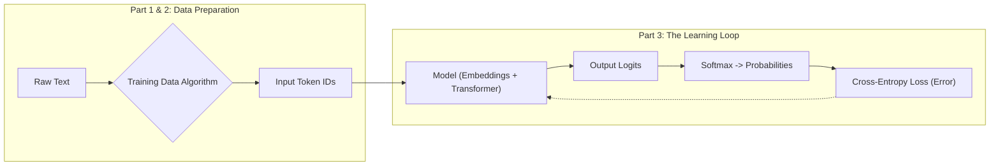

# **30분 만에 배우는 LLM 사전 학습**

## 0. 서론: 마법은 그저 수학일 뿐입니다
여러분은 신경망이 어떻게 학습하는지 이미 숙달했습니다. 기울기 하강(gradient descent)과 역전파(backpropagation)의 우아한 움직임, 즉 기계가 오류를 최소화하여 특정 작업에서 점진적으로 향상되도록 하는 수학적 엔진을 보셨을 겁니다. 하지만 그것은 깔끔하고 예측 가능하며 논리적인 숫자와 관련된 이야기였습니다.

이제 우리는 언어를 다룰 것입니다.

ChatGPT와 같은 모델이 코드를 작성하고, 양자 물리학을 설명하거나, 소네트를 작곡할 때 마법처럼 보입니다. 하지만 그 비밀은 이렇습니다: 그것은 **정확히 동일한 학습 과정**이며, **다음 토큰을 예측하는** 하나의 겉보기에는 간단한 작업에 끊임없이 적용된 결과입니다.

이 튜토리얼에서는 GPT-2 사전 학습 파이프라인을 단계별로 분석할 것입니다. 여러분은 기계가 인터넷의 원시적이고 레이블이 없는 텍스트로부터 스스로 학습할 수 있도록 하는 정확한 알고리즘과 수학적 원리를 배우게 될 것입니다. 우리는 "The cat sat on the"가 어떻게 "mat"이라는 예측이 되는지, 그리고 이러한 작업을 수십억 번 수행하는 것이 오늘날 여러분이 보는 창발적 지능을 어떻게 만들어내는지 정확히 보여주면서 전체 개념 파이프라인을 구축할 것입니다.

우리는 다음 로드맵에 따라 세 가지 핵심 단계를 다룰 것입니다.


이 튜토리얼을 마치면, 다음을 이해하게 될 것입니다:
1.  **데이터 준비 (Data Preparation):** 전체 인터넷을 무한한 무료 학습 예제 소스로 바꾸는 방법.
2.  **학습 루프 (The Learning Loop):** 모델이 어떻게 예측하고, 자신의 오류를 측정하며, 체계적으로 스스로를 수정하는지.

AI 역사상 가장 큰 병목 현상인 '데이터' 문제부터 다뤄봅시다.

## **1. 데이터 혁명 – 레이블 없이 학습하기**

### 1.1 문제점: 지도 학습의 값비싼 현실
여러분은 신경망이 지도 학습(supervised learning)을 통해 작업을 숙달하는 것을 보셨을 것입니다. 그 방식은 간단합니다: 모델에 입력(예: 이미지)과 올바른 출력(레이블 "cat")을 제공하고, 모델은 이 둘을 서로 매핑하는 방법을 학습합니다.

하지만 여기에는 엄청난 병목 현상이 있습니다: 레이블이 지정된 훈련 데이터를 얻는 것은 엄청나게 비싸고 근본적으로 한계가 있습니다. 실제 비용을 고려해봅시다:

*   **의료 영상:** 시간당 수백 달러를 청구하는 방사선 전문의들이 MRI 스캔에서 종양에 레이블을 지정하는 데 필요합니다.
*   **법률 문서:** 훨씬 더 많은 비용을 청구하는 변호사들이 계약을 분류하거나 증거 수집 문서에서 증거를 찾아내는 데 필요합니다.
*   **과학 연구:** 박사 학위 연구원들은 실험을 위한 데이터셋에 세심하게 주석을 달기 위해 몇 달 또는 몇 년을 보낼 수 있습니다.

이것은 두 가지 근본적인 문제를 야기합니다:
1.  **확장성의 한계 (The Scale Ceiling):** 유명한 ImageNet 데이터셋은 1,400만 개의 레이블이 지정된 이미지를 포함하며, 이를 만드는 데 수년과 수백만 달러가 소요되었습니다. 하지만 이는 우리가 사용할 수 없는 인터넷상의 수십억 개의 레이블 없는 이미지 중 극히 일부에 불과합니다.

2.  **"쓰레기를 넣으면 쓰레기가 나온다 (Garbage In, Garbage Out)" 문제:** 모델의 품질은 레이블의 품질에 의해 제한됩니다. 고품질 주석을 얻으려면 진정한 전문가가 필요하며, 이는 프로세스를 더욱 비싸고 확장성이 떨어지게 만듭니다.

지도 학습은 그 모든 힘에도 불구하고 한계에 부딪힙니다. 모든 예제에 값비싼 인간 전문가가 필요한 경우, 어떻게 수십억 또는 수조 개의 훈련 예제를 얻을 수 있을까요?

### 1.2 돌파구: 자기 지도 학습 엔진
GPT-2와 같은 모델의 천재성은 단순히 더 큰 아키텍처에 있었던 것이 아니라, 인간 레이블의 필요성을 완전히 포기했다는 점입니다. 인간에게 "정답이 무엇인가요?"라고 묻는 대신, 텍스트 자체에 묻습니다.

그 과제는 겉보기에는 간단합니다: **다음 단어를 예측하는 것**입니다.

이게 전부입니다. 인간의 주석은 필요 없습니다. 텍스트 자체가 입력(지금까지의 단어 시퀀스)과 "레이블"(시퀀스의 바로 다음 단어)을 모두 제공합니다. 이것이 바로 **자기 지도 학습(self-supervised learning)**의 핵심입니다.

우리는 여러분에게 알고리즘을 약속했습니다. 여기 어떤 문서든 거의 무제한의 훈련 데이터로 전환하는 간단하면서도 강력한 엔진이 있습니다.
```
// ALGORITHM: CreateTrainingData

INPUT: A document of text, broken into a list of words/tokens T.
       T = [t_1, t_2, t_3, ..., t_n]

OUTPUT: A set of (input, output) pairs for training.

FOR k FROM 1 TO n-1:
  input_sequence = [t_1, ..., t_k]
  target_word = t_{k+1}
  
  ADD (input_sequence, target_word) TO output_set

RETURN output_set
```

### 1.3 단계별 예시: 문장 자르기
이 알고리즘이 실제로 어떻게 작동하는지 봅시다. 간단한 문장 "**The cat sat on the mat.**"을 예로 들어보겠습니다.
훈련 과정은 이 문장을 한 번만 보지 않습니다. 시스템적으로 문장 전체에 걸쳐 윈도우를 슬라이드하며, 하나의 문장을 완전한 커리큘럼으로 만듭니다.

| | 입력 시퀀스 (모델이 보는 것) | 목표 출력 (모델이 예측해야 하는 것) |
| :------- | :---------------------------------- | :------------------------- |
| **예시 1** | ["The"] | cat |
| **예시 2** | ["The", "cat"] | sat |
| **예시 3** | ["The", "cat", "sat"] | on |
| **예시 4** | ["The", "cat", "sat", "on"] | the |
| **예시 5** | ["The", "cat", "sat", "on", "the"] | mat |


단 하나의 문장이 무료로 다섯 개의 고품질, 완벽하게 레이블링된 훈련 예제를 생성했습니다.

### 1.4 다음 단어 예측이 왜 지능을 만들어낼까요?
처음에는 너무 단순해 보일 수 있습니다. 다음 단어를 추측하는 것이 어떻게 모델에게 추론하고, 코드를 작성하고, 과학을 설명하는 방법을 가르칠 수 있을까요?

수십억 개의 예제를 통해 이 작업에서 **지속적으로 우수해지려면**, 모델은 세상에 대한 깊고 내적인 이해를 구축할 수밖에 없기 때문입니다. 모델이 다음 입력 텍스트를 받고 그 다음 단어를 예측해야 한다고 상상해 봅시다:

**"In Paris, the capital of France, the primary language spoken is..."**

모델이 "French(프랑스어)"라는 단어를 정확하게 예측하기 위해 무엇을 배워야 할까요?
1.  **문법을 이해해야 합니다:** 동사 "is" 다음에 명사 또는 형용사가 올 가능성이 높다는 것을 인식해야 합니다.
2.  **장거리 맥락을 처리해야 합니다:** 문장 끝을 여러 단어 이전에 나타난 주어 "Paris"와 연결해야 합니다.
3.  **세상에 대한 사실을 학습해야 합니다:** 파리가 프랑스의 수도이며, 프랑스에서 사용되는 언어가 프랑스어라는 것을 알아야 합니다.
4.  **방해 요소를 무시해야 합니다:** "primary(주요한)"라는 단어가 언어를 결정하는 데 "France(프랑스)"보다 덜 중요하다는 것을 깨달아야 합니다.

모델이 이와 같은 수조 개의 예제에서 예측 오류를 최소화하는 유일한 방법은 개념, 사실 및 그들 간의 관계에 대한 풍부한 내부 모델을 개발하는 것입니다. 이것은 암기가 아니라, 인간 언어에 반영된 현실의 근본적인 패턴을 학습하는 것입니다.

### 1.5 현실과 연결하기: 규모의 힘
이러한 자기 지도 학습 접근 방식은 AI 규모에서 패러다임 전환을 일으켰습니다.

| 시대 | 데이터셋 예시 | 크기 | 파라미터 | 인간 레이블링 필요? |
| :---------- | :------------ | :-------------------------- | :----------- | :------------- |
| **전통적 ML** | MNIST 숫자 | 약 6만 개의 이미지 (메가바이트) | 1백만~1천만 | **예** |
| **딥러닝** | ImageNet | 1,400만 개의 이미지 (기가바이트) | 2천5백만~1억5천만 | **예** |
| **GPT-2 시대** | WebText | 40GB의 텍스트 (약 8백만 페이지) | **15억** | **아니요** |


이러한 도약은 엄청납니다. 단 2,000단어의 위키피디아 문서 하나가 **1,999개**의 개별 훈련 예제로 자동 변환됩니다. GPT-2가 훈련된 40GB의 텍스트 전체로 확장하면, **수십억 개**의 학습 기회가 무료로 제공됩니다.

우리는 인터넷을 무한히 크고 스스로 레이블을 지정하는 교과서로 만듦으로써 데이터 문제를 해결했습니다.

이제 **작업**을 이해했으니, 다음 중요한 단계로 넘어가 봅시다: 이 단어들을 우리의 신경망이 실제로 처리할 수 있는 숫자로 어떻게 바꿀까요? 이것이 바로 **토큰화(Tokenization)**로 넘어가는 부분입니다.

## **2. 토큰화 – 언어를 레고 브릭으로 바꾸기**

우리는 학습 작업을 확립했습니다: 다음 텍스트 조각을 예측하는 것입니다. 하지만 우리의 신경망은 "텍스트"를 이해하지 못합니다; 숫자를 이해합니다. 원시 텍스트를 모델이 처리할 수 있는 숫자 목록으로 변환하는 과정을 **토큰화(Tokenization)**라고 합니다.

언뜻 보면 간단해 보입니다. 공백으로 문장을 나누면 어떨까요? 아니면 더 작게 개별 문자를 사용할까요? 이러한 순진한 접근 방식이 왜 실패하는지 알아보겠습니다.

문장 "**The cat quickly jumped.**"를 생각해 봅시다.
*   **단어 수준 토큰화**는 다음과 같이 나타낼 것입니다: $\[$"The", "cat", "quickly", "jumped."$\]$
*   **문자 수준 토큰화**는 다음과 같이 나타낼 것입니다: $\[$"T", "h", "e", " ", "c", "a", "t", ...$\]$

이 두 가지 간단한 방법 모두 즉각적이고 심각한 문제를 야기합니다.

| 문제점 | 단어 수준 문제점 | 문자 수준 문제점 |
| :--------- | :---------------------------------------------------------------------------------------------------------------------------------------------------- | :------------------------------------------------------------------- |
| **방대한 어휘집** | "The"와 "the"는 다른가요? "jump", "jumps", "jumping"이 모두 고유한 단어인가요? 어휘집은 모든 변형을 저장해야 하므로 엄청나게 커질 것입니다. | 해결됨. 어휘집은 매우 작습니다 (A-Z, 0-9, 구두점). |
| **알 수 없는 단어** | "hyper-threading"과 같은 새로운 단어나 "awesommmme"와 같은 오타는 어떻게 될까요? 모델에는 해당 단어에 대한 항목이 없습니다. 이는 **어휘 외 단어(Out-of-Vocabulary, OOV)** 문제로 알려진 치명적인 실패 지점입니다. | 해결됨. 어떤 단어든 문자로 구성될 수 있습니다. |
| **시퀀스 길이** | 시퀀스가 짧고 관리하기 쉽습니다. "The cat jumped."는 4개의 토큰입니다. | **막대한 비효율성.** 4단어 문장이 20개 이상의 토큰이 됩니다. 단락은 수천 개가 됩니다. 모델은 각 문자를 하나씩 처리해야 하므로 장거리 패턴 학습이 느리고 어려워집니다. |


우리는 두 가지 장점을 모두 제공하는 해결책이 필요합니다: 터무니없이 긴 시퀀스를 만들지 않으면서 어떤 단어든 표현할 수 있는 관리 가능한 어휘집입니다. 현대 언어 모델은 **서브워드 토큰화(Subword Tokenization)**라는 영리한 기술로 이 문제를 해결합니다.

### 2.1 레고 브릭 접근 방식: 서브워드 토큰화
핵심 아이디어는 훌륭합니다: **단어를 가장 작은 단위로 취급하지 마세요.** 대신, 레고 브릭으로 무언가를 만드는 것처럼, 단어를 더 작고 일반적인 조각으로 분해하세요. 토크나이저는 이러한 일반적인 조각들을 훈련 데이터 자체에서 학습합니다.

실제 서브워드 토크나이저가 우리의 예시를 어떻게 처리하는지 봅시다:

*   흔한 단어 "cat"은 단일 토큰으로 취급됩니다: $\[$"cat"$\]$
*   "quickly"라는 단어는 두 개의 일반적인 조각으로 분해됩니다: $\[$"quick", "##ly"$\]$
*   "jumping"이라는 단어는 두 개의 익숙한 부분으로 바뀝니다: $\[$"jump", "##ing"$\]$

"##"는 단순히 "이 토큰은 이전 토큰에 붙어있다"는 것을 의미하는 특수 기호입니다. 이 우아한 해결책은 이전에 언급된 모든 문제를 해결합니다:

1.  **효율적인 어휘집을 생성합니다:** jump, jumps, jumping, jumper에 대해 각각의 항목을 가질 필요 없이, 토크나이저는 공통 어간인 jump와 일반적인 서브워드인 ##s, ##ing, ##er만 알면 됩니다. 이는 어휘집 크기를 관리 가능한 수준으로 유지합니다 (GPT-2는 약 50,000개의 토큰을 사용합니다).
2.  **알 수 없는 단어를 제거합니다:** "hyper-threading"과 같은 새롭고 복잡한 단어는 어떻게 처리할까요? $\[$"hyper", "-", "thread", "##ing"$\]$처럼 레고 브릭으로 만들 수 있습니다. "awesommmme"와 같은 오타는 어떻게 될까요? $\[$"awesome", "##m", "##m", "##e"$\]$로 분해할 수 있습니다. 모델은 알려진 서브워드와, 최악의 경우 개별 문자의 조합으로 **어떤** 단어든 표현할 수 있습니다.

### 2.2 최종 출력: 정수 ID
텍스트가 이러한 서브워드 토큰으로 분해된 후, 토크나이저는 어휘집에서 각 토큰을 찾아 고유한 정수 ID를 얻습니다. 이 ID들이 우리의 아키텍처 다이어그램에서 **입력 토큰(Input Tokens)**으로 모델에 실제로 공급되는 것입니다.
학습된 어휘집의 작은 부분을 상상해 봅시다:

| 토큰 | 토큰 ID |
| :------- | :------- |
| "The" | 5 |
| "cat" | 8 |
| "quick" | 73 |
| "##ly" | 152 |
| "jump" | 311 |
| "##ed" | 94 |


"The cat quickly jumped"에 대한 전체 토큰화 과정은 다음과 같습니다:
1.  **입력 텍스트:** "The cat quickly jumped"
2.  **서브워드 분할:** $\[$"The", "cat", "quick", "##ly", "jump", "##ed"$\]$
3.  **최종 출력 (토큰 ID):**

이 최종 숫자 목록이 우리의 문장을 나타냅니다. 하지만 이 숫자들은 단지 레이블일 뿐입니다. ID 73은 ID 8과 어떤 수학적 관계도 없습니다. 그들은 단지 임의의 포인터일 뿐입니다.

빠른 설명: 파트 1에서 모델이 다음 "단어"를 예측한다고 말했을 때, 다음 **토큰**을 예측한다고 말하는 것이 더 정확합니다. 과정은 동일하지만, 모델은 종종 전체 단어가 아닌 이러한 서브워드 조각으로 작업합니다. 이는 훨씬 더 유연하고 강력한 시스템을 가능하게 합니다.


### 2.3 토큰화의 은밀한 비밀
토큰화는 훌륭한 엔지니어링 타협이지만, 모델을 예상치 못한 방식으로 혼란스럽게 할 수 있습니다. 예를 들어, 강력한 LLM에게 "strawberry"라는 단어에 'r'이 몇 개 있는지 물어보면 어려움을 겪을 수 있습니다.

왜일까요?

인간은 "strawberry"라는 단어를 하나의 완전한 객체로 보며, 그 안에서 'r'이 세 개 있음을 쉽게 셀 수 있습니다.

하지만 모델은 세 가지 추상적이고 낯선 기호인 $\[$ \\$, %, & $]$를 볼 수 있습니다. 여기서:
*   $는 "str"을 의미합니다.
*   %는 "aw"를 의미합니다.
*   &는 "berry"를 의미합니다.

이제 누군가 여러분에게 이렇게 묻는다고 상상해보세요: "$ % &" 안에 'r'이 몇 개 있나요?

여러분은 각 기호를 문자로 다시 디코딩하고, 기호 경계를 넘어 'r'이 어디에 있는지 추적한 다음, 그것들을 세어야 할 것입니다. 이것이 모델이 해야 하는 일과 정확히 같습니다. 'r' 문자는 토큰 $와 & 안에 숨겨져 있으며, 토큰 경계를 가로질러 분리되어 있습니다. 모델은 개별 문자를 자연스럽게 "보지" 않습니다. 학습된 이 조각들을 봅니다.

이것이 언어 모델이 딸기에 대한 아름다운 시를 쓸 수 있지만, 단어 안의 글자를 셀 때는 비틀거릴 수 있는 이유입니다. 효율성을 높이는 토큰화는 또한 맹점을 만듭니다.

이제 텍스트를 깔끔한 토큰 ID 시퀀스로 변환했으므로, 이 의미 없는 ID들을 신경망이 실제로 이해할 수 있는 풍부하고 의미 있는 벡터로 변환해야 합니다. 이것이 트랜스포머 모델 자체의 입력이 되는 **임베딩(Embeddings)** 계층입니다. 이제 모델의 내부 작동을 넘어 어떻게 출력을 생성하는지 살펴보겠습니다.

## **3. 출력 – 확률에서 실제 단어로**

우리는 텍스트를 토큰 ID로 변환하고 거대한 신경망에 공급했습니다. 이제 진실의 순간입니다: 모델이 예측을 해야 합니다. 여기서 우리는 학습과 창의성을 모두 이끄는 최종적이고 우아한 수학적 원리를 보게 됩니다.

### 3.1 중요한 차이점: 훈련 vs. 생성
이 모델들이 어떻게 작동하는지에 대해 90%의 사람들이 오해하는 부분이 있습니다. 두 가지 뚜렷한 과정이 존재합니다:
1.  **훈련 중에는**, 모델의 목표는 가능한 50,257개의 모든 토큰에 대한 **확률 분포**를 출력하는 것입니다. 이 분포는 단 하나의 정답과 비교되어 오류(손실)를 계산하고, 이 오류는 모델의 가중치를 업데이트하는 데 사용됩니다. 목표는 더 나아지는 것입니다.
2.  **생성 중에는** (ChatGPT나 API를 사용할 때), 모델은 여전히 이 확률 분포를 생성하지만, 오류를 계산하는 대신 이 분포에서 **샘플링**하여 다음 단어를 선택합니다. 목표는 새로운 텍스트를 만드는 것입니다.

각 단계를 공통 부분부터 시작하여 자세히 살펴보겠습니다.

### **3.2 섹션 1: 예측하기 – 소프트맥스 함수**
모든 복잡한 내부 계산을 거친 후, 모델의 최종 계층은 어휘집에 있는 모든 토큰에 대한 원시 출력 점수, 즉 **로짓(logit)**을 생성합니다. 50,257개의 토큰 어휘집을 가진 GPT-2의 경우, 50,257개의 로짓을 얻게 됩니다.

이것들은 단지 원시 숫자일 뿐입니다. 아직 확률이 아닙니다.
*   양수 또는 음수일 수 있습니다.
*   합이 1이 되지 않습니다.

예를 들어, "The cat sat on the"를 본 후 로짓은 다음과 같을 수 있습니다:

{"mat": 3.2, "rug": 1.3, "floor": 0.5, "moon": -2.1, ... (and 50,253 other scores)}

이 지저분한 로짓을 깔끔한 확률로 바꾸기 위해, 우리는 **소프트맥스(Softmax)**라고 불리는 중요한 함수를 사용합니다.

소프트맥스 공식은 다음과 같습니다: \\
`probability_of_token_i = exponent(logit_i) / sum_of_all_exponentiated_logits`

각 토큰에 대해 우리는 로짓의 거듭제곱으로 *e*를 올린 다음, 모든 지수화된 로짓의 합으로 나눕니다. 이 연산은 두 가지를 보장합니다:
1.  모든 확률은 0과 1 사이가 될 것입니다.
2.  모든 확률의 합은 정확히 100%가 될 것입니다.

간단한 예시 어휘집으로 이것이 어떻게 작동하는지 봅시다:

| 토큰 | 1단계: 로짓 점수 | 2단계: 지수화 (e^logit) | 3단계: 합계로 나누기 (28.32) | 최종 확률 |
| :----- | :----------- | :---------------------- | :-------------------- | :--------- |
| "mat" | **3.2** | 24.53 | 24.53 / 28.32 | **86.6%** |
| "rug" | **1.3** | 3.67 | 3.67 / 28.32 | **13.0%** |
| "moon" | **-2.1** | 0.12 | 0.12 / 28.32 | **0.4%** |
| **총합** | | **28.32** | | **100%** |

모델의 공식 예측은 이제 깔끔한 확률 분포가 됩니다. 우리는 다이어그램에서 **출력 확률(Output Probabilities)** 단계에 도달했습니다. 이제 이것을 가지고 무엇을 할지는 우리가 훈련 중인지 또는 생성 중인지에 따라 달라집니다.

### **3.3 섹션 2: 학습 과정 (훈련 시에만 해당)**
훈련 중에는 정답이 "mat"이었다는 것을 알고 있습니다. 우리 모델은 "mat"에 86.6%의 확률을 할당했습니다. 그것이 좋은 예측이었을까요? 이것을 학습을 유도하는 단일 오류 숫자로 어떻게 바꿀까요?

우리는 **크로스 엔트로피(Cross-Entropy)**라는 손실 함수를 사용합니다.

크로스 엔트로피의 직관은 **"놀람(surprise)"**을 측정하는 것입니다.
*   만약 높은 확신으로 정답을 예측했다면, 여러분은 놀라지 않습니다 (낮은 손실).
*   만약 낮은 확신으로 정답을 예측했다면, 여러분은 매우 놀랍니다 (높은 손실).

전체 크로스 엔트로피 공식은 복잡해 보이지만, 다음 토큰 예측의 경우 아름답게 단순화됩니다:

`Loss = -log(probability_of_the_correct_token)`

이게 전부입니다. 우리는 모델이 단 하나의 정답에 할당한 확률에만 신경 씁니다. 다른 모든 확률은 "진정한" 확률이 0이었기 때문에 무시됩니다.

두 가지 시나리오에 대해 계산해 봅시다:
1.  **좋은 예측:**
    *   모델은 올바른 토큰("mat")에 **86.6%**를 할당했습니다.
    *   Loss = -log(0.866) ≈ **0.14**
    *   이것은 작은 숫자이며, 좋은 결과입니다! 네트워크에 좋은 일을 했다고 알려줍니다.
2.  **형편없는 예측:**
    *   모델이 "mat"에 단지 **1%**만 할당했다고 상상해 보세요.
    *   Loss = -log(0.01) ≈ **4.6**
    *   이것은 훨씬 더 큰 숫자이며, 높은 놀라움을 반영하고 학습을 유도하는 큰 오류 신호를 생성합니다.

이 단일 손실 숫자는 역전파(backpropagation)의 시작점입니다. 소프트맥스와 결합될 때, 초기 기울기(수정 방향)는 `Predicted_Probability - True_Probability`로 단순화됩니다. 이 깨끗하고 간단한 오류 신호는 전체 네트워크를 통해 역방향으로 흐르며, 다음 번에 약간 더 나은 예측을 할 수 있도록 수십억 개의 가중치를 업데이트합니다.

### **3.4 섹션 3: 텍스트 생성 (생성 시에만 해당)**
실제로 ChatGPT를 사용하거나 OpenAI API를 호출할 때는 훈련하는 것이 아니라 텍스트를 생성하는 것입니다. 모델은 동일한 확률을 생성하지만, 손실을 계산하는 대신 단어 하나를 선택해야 합니다.

단순히 매번 가장 높은 확률을 가진 단어를 선택한다면 결정론적이고, 지루하며, 반복적인 텍스트가 나올 것입니다. 흥미롭고 창의적인 출력을 만들기 위해 모델은 확률 분포에서 **샘플링**하며, 우리는 매개변수를 통해 이 샘플링을 제어할 수 있습니다.

다음은 일반적인 API 호출입니다:
```python
import openai

response = openai.ChatCompletion.create(
    model="gpt-4",
    messages=[{"role": "user", "content": "The weather today is"}],
    temperature=0.7,      # Controls randomness
    top_p=0.9,            # Controls diversity
)
```

이 매개변수들은 실제로 어떤 역할을 할까요?

**온도 (Temperature) (범위: 0 ~ 2)**
*   **직관:** 출력의 "창의성" 또는 무작위성을 제어합니다.
*   **메커니즘:** 소프트맥스 함수 *전에* 로짓을 수정합니다: `adjusted_logits = logits / temperature`.
    *   temperature < 1.0 (예: 0.5): 더 작은 숫자로 나누어 로짓 간의 간격을 더 크게 만듭니다. 이는 확률을 **선명하게(sharpens)** 만들어 모델을 더 확신하고 결정론적으로 만듭니다. 사실적 답변에 적합합니다.
    *   temperature > 1.0 (예: 1.5): 더 큰 숫자로 나누어 로짓 간의 간격을 줄입니다. 이는 확률을 **평탄하게(flattens)** 만들어 덜 가능성이 있지만 더 "창의적인" 단어를 선택할 가능성을 높입니다.

**Top-p (핵심 샘플링, Nucleus Sampling) (범위: 0 ~ 1)**
*   **직관:** 모델이 정말 무의미한 단어를 선택하는 것을 방지하여 출력의 다양성을 제어합니다.
*   **메커니즘:** 50,257개의 모든 토큰을 고려하는 대신, 누적 확률이 top_p 값을 초과하는 가장 작은 가능한 토큰 집합에서 샘플링합니다.
    *   top_p = 0.1: 확률 질량의 상위 10%를 구성하는 가장 가능성 있는 토큰들 중에서만 샘플링합니다. 이는 매우 집중적이고 안전합니다.
    *   top_p = 0.9: 훨씬 더 넓은 "핵심(nucleus)"의 그럴듯한 토큰들에서 샘플링합니다. 이는 분포의 긴 꼬리에 있는 쓸모없는 토큰들을 고려하지 않고 더 많은 다양성을 허용합니다.

"오늘 날씨는 (The weather today is)"이라는 프롬프트에 대해 온도가 어떻게 출력을 변화시키는지 봅시다:

| 토큰 | 기본 확률 (temp=1.0) | temp=0.5일 때 확률 (더 선명) | temp=2.0일 때 확률 (더 평탄) |
| :-------- | :-------------------- | :-------------------------- | :------------------------ |
| sunny | 40% | **~63%** | ~25% |
| cloudy | 30% | ~28% | ~22% |
| rainy | 20% | ~7% | ~19% |
| beautiful | 10% | ~2% | ~14% |


보시다시피, 온도를 낮추면 "sunny"가 거의 확실한 선택이 됩니다. 온도를 높이면 확률이 더 균등해져서 "beautiful"과 같은 창의적인 단어가 선택될 실제 기회를 얻게 됩니다.

그리고 이것이 완전한 출력 파이프라인입니다: 원시 로짓부터 훈련 중 자기 수정과 추론 중 창의적인 텍스트 생성을 모두 이끄는 확률에 이르기까지 말입니다.

## **4. 결론: 원시 지식에서 유용한 비서로**

이제 여러분은 **사전 학습(pre-training)**의 기본을 마스터했습니다. 인터넷의 원시 텍스트 파일에서 다음 토큰을 놀라운 정확도로 예측할 수 있는 정교한 모델에 이르기까지 전체 파이프라인을 거쳐왔습니다.

핵심 개념을 다시 정리해봅시다:
1.  **자기 지도 학습 엔진:** 우리는 AI의 가장 큰 문제였던 값비싼 인간 레이블 데이터의 필요성을 해결하는 것부터 시작했습니다. 작업을 간단한 **다음 토큰 예측**으로 구성함으로써, 인터넷의 방대한 레이블 없는 텍스트를 무한하고 무료인 훈련 예제 소스로 바꾸었습니다.
2.  **언어-숫자 다리:** 우리는 **서브워드 토큰화**가 레고 브릭 세트처럼 작동하여, 어떤 단어든 모델이 처리할 수 있는 관리 가능한 조각들로 효율적으로 분해하고, 이를 간단한 정수 ID 목록으로 표현하는 방법을 살펴보았습니다.
3.  **학습 및 생성 루프:** 마지막으로, 우리는 모델의 출력을 해체했습니다. **소프트맥스** 함수가 원시 로짓으로부터 깔끔한 확률을 어떻게 생성하는지, **크로스 엔트로피 손실**이 그 확률을 사용하여 학습을 유도하는 "놀람" 점수를 어떻게 계산하는지, 그리고 **온도(Temperature)**와 **Top-p**와 같은 샘플링 매개변수가 동일한 확률을 사용하여 창의적이고 일관된 텍스트를 어떻게 생성하는지 배웠습니다.

여러분은 언어 모델을 마법처럼 여기며 이 여정을 시작했습니다. 하지만 이제 진실을 알게 되었습니다. 그것은 엄청난 규모로 실수로부터 학습하는 간단하고 우아한 과정으로 구동되는, 서로 연결된 일련의 뛰어난 아이디어들입니다.

하지만 우리의 여정은 끝나지 않았습니다. 이 사전 학습된 모델은 지식의 원시 엔진이지, 도움이 되는 비서가 아닙니다. 이는 다음에 무엇이 올지에 대한 두 가지 중요한 질문으로 이어집니다.

**다음은 무엇인가 1: 블랙박스를 열다 – 트랜스포머** \\
이 튜토리얼 내내 우리는 네트워크의 핵심, 즉 입력 토큰을 출력 로짓으로 바꾸는 부분을 "블랙박스"로 취급했습니다.
*   모델은 어떻게 10개의 토큰 이전에 나온 "Paris"라는 단어를 기억하여 "French"를 정확하게 예측할까요?
*   문장의 진정한 맥락을 이해하기 위해 모델은 문장 내 다른 단어들의 중요성을 어떻게 평가할까요?

다음 튜토리얼에서는 드디어 그 블랙박스를 열고 혁신적인 **트랜스포머 아키텍처**와 그 핵심 메커니즘인 **셀프 어텐션(Self-Attention)**을 탐구할 것입니다. 이것이 진정으로 맥락을 이해하는 엔진이며, 아키텍처 퍼즐의 마지막 조각이다.

**다음은 무엇인가 2: 예측자에서 비서로 – 사후 학습**\\
다음 토큰 예측기는 챗봇이 아닙니다. 만약 사전 학습된 모델에 "프랑스의 수도는 무엇인가요?"라는 프롬프트를 준다면, 인터넷 텍스트 훈련 때문에 "...그리고 인구는 얼마나 되나요?"와 같은 또 다른 흔한 질문으로 문장을 완성할 수 있습니다. 이것은 질문에 답하는 것이 아니라 패턴을 완성하는 것입니다.

이 강력하지만 원시적인 모델을 지시를 따르고, 질문에 답하며, 해로운 작업을 거부할 수 있는 유용한 비서로 어떻게 바꿀까요?

그것은 **사후 학습(Post-Training)**이라는 두 번째의 중요한 단계를 필요로 합니다. 여기에는 다음과 같은 기술들이 포함됩니다:
*   **지도 미세 조정 (Supervised Fine-Tuning, SFT):** 인간이 작성한 지시사항과 그에 대한 이상적인 응답으로 구성된 더 작고 고품질의 데이터셋으로 모델을 훈련하는 것입니다.
*   **인간 피드백 기반 강화 학습 (Reinforcement Learning from Human Feedback, RLHF):** 인간이 모델의 다양한 답변에 순위를 매기도록 허용하여, 시행착오를 통해 "유용성"과 "안전성"이 실제로 무엇을 의미하는지 가르치는 것입니다.

이것이 모델을 인간의 가치와 일치시키는 과정이며, 이는 향후 튜토리얼에서 다룰 주제입니다.

이제 여러분은 이 놀라운 모델들이 어떻게 구축되는지에 대한 확고한 기반을 갖게 되었습니다. 마법은 이해로 대체되었고, 여러분은 현대 인공지능의 더 깊은 층을 탐구할 준비가 되었습니다.