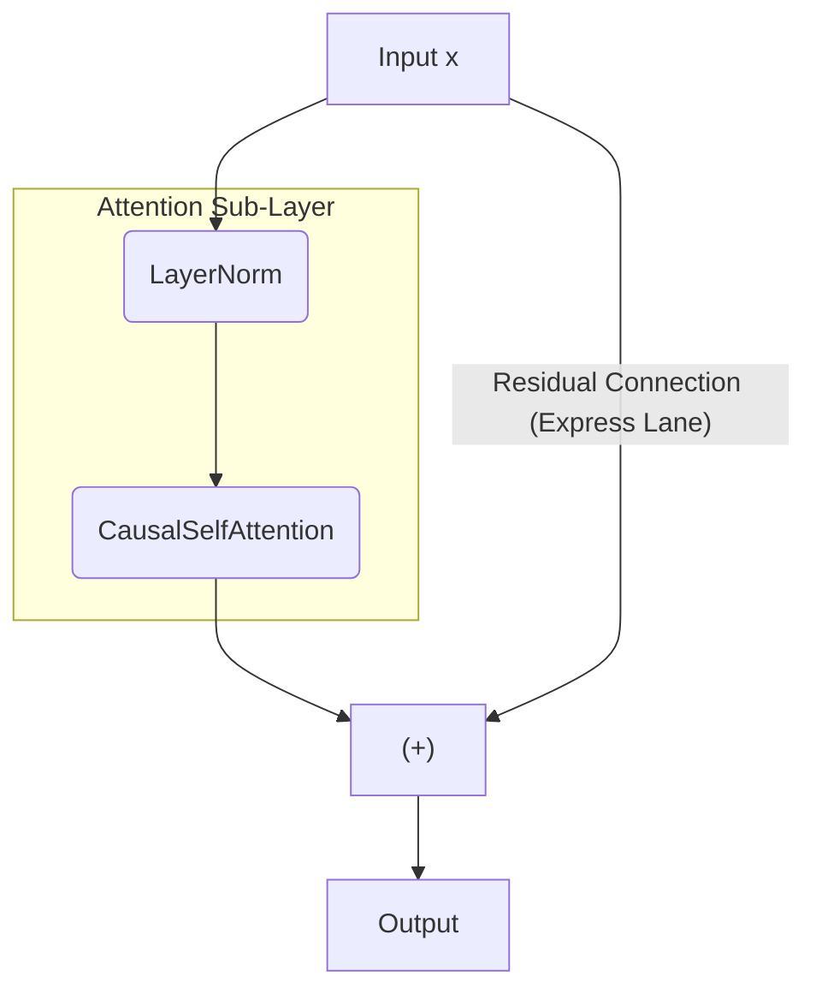
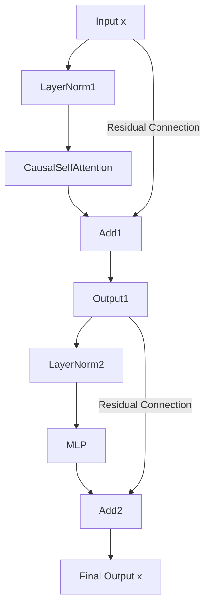
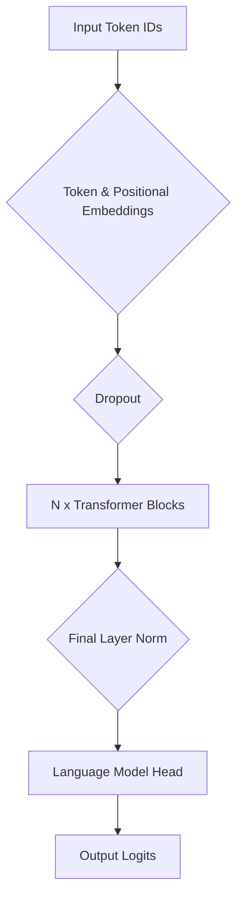

## **8장: "사고" 레이어: MLP**
우리는 CausalSelfAttention 모듈을 성공적으로 구축했습니다. 이것은 트랜스포머의 "**통신**" 레이어입니다. 토큰들이 자신들의 문맥으로부터 정보를 수집하고 통합할 수 있게 해줍니다.

하지만 정보를 수집하는 것은 절반에 불과합니다. 각 토큰이 필요한 문맥을 수집한 후에는, 그것에 대해 "생각"할 시간이 필요합니다. 이 새롭고 문맥이 풍부한 정보를 처리해야 합니다. 이것이 **MLP**, 즉 다층 퍼셉트론의 역할입니다. 때로는 위치별 피드포워드 네트워크(FFN)라고도 불립니다.

우리가 곧 구축할 `gpt2_min.py` 코드를 봅시다. 그것은 놀랍도록 간단합니다.
```python
# gpt2_min.py (lines 56-65)
class MLP(nn.Module):
    def __init__(self, config: GPTConfig):
        super().__init__()
        self.fc = nn.Linear(config.n_embd, 4 * config.n_embd)
        self.proj = nn.Linear(4 * config.n_embd, config.n_embd)
        self.drop = nn.Dropout(config.dropout)

    def forward(self, x):
        x = self.fc(x)
        x = F.gelu(x)  # GPT-2 uses GELU
        x = self.drop(self.proj(x))
        return x
```

### 8.1 목표: 정보를 로컬에서 처리하기
MLP는 매우 간단하지만 중요한 역할을 합니다. 어텐션 레이어가 토큰들이 **서로** 상호작용하도록 허용하는 반면, MLP는 **각 토큰에 대해 독립적으로** 정보를 처리합니다.

어텐션 레이어가 모두가 아이디어를 공유하는 그룹 회의였다고 상상해 보세요. MLP는 각 사람이 책상으로 돌아가서 방금 들은 내용에 대해 앉아서 생각하는 것과 같습니다. 그들은 다음 그룹 회의(다음 트랜스포머 블록) 전에 다른 사람과 이야기하지 않고 스스로 정보를 처리합니다.

이러한 구조—통신에 이어 개별 계산이 여러 레이어에 걸쳐 반복되는 것—가 트랜스포머에 그 힘을 부여합니다.

### 8.2 아키텍처: 확장 및 축소
트랜스포머의 MLP는 표준적인 두 층 아키텍처를 가집니다:

1.  **확장 레이어 (`fc`):** 첫 번째 선형 레이어는 `n_embd` 크기의 입력 벡터를 훨씬 더 큰 중간 차원(일반적으로 `4 * n_embd`)으로 투영합니다.
2.  **비선형성 (`gelu`):** 활성화 함수가 적용됩니다. GPT-2는 GELU(Gaussian Error Linear Unit)를 사용하며, 이는 더 흔한 ReLU의 부드러운 대안입니다. 이것이 네트워크가 복잡하고 비선형적인 함수를 학습할 수 있게 해주는 요소입니다.
3.  **축소 레이어 (`proj`):** 두 번째 선형 레이어는 큰 중간 벡터를 다시 원래의 `n_embd` 차원으로 투영합니다.
4.  **드롭아웃 (`drop`):** 과적합을 방지하기 위한 정규화 목적으로 드롭아웃 레이어가 적용됩니다.

### 8.3 `nn.Linear`에 대한 심층 분석
전체 MLP를 구축하기 전에, 그 핵심 구성 요소인 `nn.Linear` 레이어를 명확히 해봅시다. 생각보다 간단합니다. 핵심적으로, 이것은 단순히 행렬 곱셈 뒤에 바이어스 벡터의 덧셈이 따르는 것입니다.

**수식:** $$ \text{output} = \text{input} @ W^T + b $$ \\
각 출력 요소에 대해, 이 레이어는 모든 입력 요소의 가중 합을 계산하고 바이어스를 더합니다.

작은 예제를 통해 이것을 봅시다. 우리는 크기 2의 벡터를 크기 4의 벡터로 투영할 것입니다.
```python
import torch
import torch.nn as nn

C_in = 2
C_out = 4
linear_layer = nn.Linear(C_in, C_out)
```

**학습 가능한 매개변수는 무엇인가요?** \\
이 레이어는 훈련 중에 업데이트되는 두 세트의 학습 가능한 매개변수를 가집니다:
1.  **가중치 (`.weight`):** 모양이 (`C_out`, `C_in`)인 행렬입니다. 우리의 경우 (4, 2)입니다. 총 가중치: 4 * 2 = 8개.
2.  **바이어스 (`.bias`):** 모양이 (`C_out`)인 벡터입니다. 우리의 경우 (4)입니다. 총 바이어스: 4개.

수학을 명확하게 보기 위해 이러한 매개변수를 간단한 정수로 수동으로 설정해 봅시다. 
```python
# Manually set the weights
linear_layer.weight.data = torch.tensor([
    [1., 0.],  # Weights for output element 0
    [-1., 0.], # Weights for output element 1
    [0., 2.],  # Weights for output element 2
    [0., -2.]  # Weights for output element 3
])

# Manually set the biases
linear_layer.bias.data = torch.tensor([1., 1., -1., -1.])
```

이제 단일 입력 벡터를 통과시켜 봅시다.
```python
# Our input vector
input_vector = torch.tensor([0.5, -0.5])

# The forward pass
output_vector = linear_layer(input_vector)
```

논리를 이해했음을 증명하기 위해 첫 번째 출력 요소를 수동으로 계산해 봅시다.
*   output = (input * weight) + (input * weight) + bias
*   output = (0.5 * 1.0) + (-0.5 * 0.0) + 1.0
*   output = 0.5 + 0.0 + 1.0 = 1.5

PyTorch의 전체 결과를 봅시다:
```python
print("Input vector:", input_vector)
print("Output vector:", output_vector)
```

**출력:**
```
Input vector: tensor([ 0.5000, -0.5000])
Output vector: tensor([ 1.5000,  0.5000, -2.0000,  0.0000], grad_fn=<AddBackward0>)
```

출력은 첫 번째 요소에 대한 우리의 수동 계산과 일치합니다. `nn.Linear` 레이어는 4개의 출력 요소 각각에 대해 단순히 이 가중 합을 수행합니다. 이제 이것이 명확해졌으니, 전체 MLP를 구축할 수 있습니다.

### 8.4 숫자로 보는 전체 MLP 상세 설명
이제 `nn.Linear` 레이어가 어떻게 작동하는지 이해했으니, 전체 MLP 순방향 전달을 통해 단일 토큰의 벡터를 추적해 봅시다. MLP는 각 토큰에 독립적으로 작동하므로, 전체 프로세스를 이해하기 위해 하나의 벡터만 살펴보면 됩니다.

**우리의 설정:**
*   작은 임베딩 차원 `C=2`를 사용할 것입니다.
*   MLP는 이것을 중간 차원인 `4*C=8`로 확장할 것입니다.
*   우리의 입력 `x`는 단일 토큰(T=1)에 대한 벡터가 될 것이며, 배치 크기는 1(B=1)입니다.

```python
# Our input vector for one token. Shape (B, T, C) -> (1, 1, 2)
x = torch.tensor([[[0.5, -0.5]]])
```

**단계 1: 확장 레이어 (`fc`)** \\
이것은 `C=2`에서 `4*C=8`로 투영하는 `nn.Linear` 레이어입니다.
```python
# Create the layer
fc = nn.Linear(2, 8)

# Manually set its weights and biases for a clear example
fc.weight.data = torch.randn(8, 2) * 2 # Scale up for more interesting GELU results
fc.bias.data = torch.ones(8) # Set all biases to 1

# --- Pass the input through the layer ---
x_expanded = fc(x)

print("--- After Expansion Layer ---")
print("Shape:", x_expanded.shape)
print("Values:\n", x_expanded.data.round(decimals=2))
```

**출력:**
```
--- After Expansion Layer ---
Shape: torch.Size([1, 1, 8])
Values:
 tensor([[[ 2.4000, -0.5000,  1.8800, -1.9100,  2.0800,  1.1600,  0.4100, -2.1200]]])
```

우리의 2차원 벡터는 성공적으로 8차원 벡터로 확장되었습니다.

**단계 2: GELU 활성화** \\
다음으로, 비선형 GELU 활성화 함수를 적용합니다. 직관적으로, GELU는 ReLU의 더 부드러운 버전입니다. 음수 값을 0에 가깝게 만들지만, 소량의 음수 신호는 통과시킵니다. 양수 값은 거의 변경되지 않습니다.

| 입력 | GELU(입력) |
| ------ | ------ |
| 2.4 | ~2.39 |
| 1.0 | ~0.84 |
| 0.0 | 0.0 |
| -0.5 | ~ -0.15 |
| -2.0 | ~ -0.00 |

확장된 벡터에 이를 적용해 봅시다:
```python
import torch.nn.functional as F

# --- Apply GELU ---
x_activated = F.gelu(x_expanded)

print("\n--- After GELU Activation ---")
print("Shape:", x_activated.shape)
print("Values:\n", x_activated.data.round(decimals=2))
```

**출력:**
```
--- After GELU Activation ---
Shape: torch.Size([1, 1, 8])
Values:
 tensor([[[ 2.3900, -0.1500,  1.8700, -0.0100,  2.0600,  1.0300,  0.3100, -0.0000]]])
```

예상대로, 큰 양수 값(2.40, 1.88)은 거의 손대지 않았고, 큰 음수 값(-1.91, -2.12)은 거의 0으로 압축되었습니다. 이 비선형 단계는 모델이 복잡한 패턴을 학습하는 데 필수적입니다.

**단계 3: 축소 레이어 (`proj`)** \\
이제 8차원의 활성화된 벡터를 다시 원래의 `C=2` 차원으로 투영합니다.
```python
# Create the layer
proj = nn.Linear(8, 2)

# Manually set its weights and biases
proj.weight.data = torch.randn(2, 8)
proj.bias.data = torch.zeros(2) # No bias for simplicity

# --- Pass the activated vector through the layer ---
x_projected = proj(x_activated)

print("\n--- After Contraction Layer ---")
print("Shape:", x_projected.shape)
print("Values:\n", x_projected.data.round(decimals=2))
```

**출력:**
```
--- After Contraction Layer ---
Shape: torch.Size([1, 1, 2])
Values:
 tensor([[[ 1.0900, -1.3800]]])
```

우리는 원래의 (1, 1, 2) 모양으로 돌아왔습니다.

**단계 4: 드롭아웃** \\
MLP의 마지막 단계는 드롭아웃입니다.
```python
drop = nn.Dropout(0.1)
final_output = drop(x_projected)
```

**훈련 중**에는 이 레이어가 `x_projected`의 요소 중 10%를 무작위로 0으로 설정합니다. 이것은 모델이 어떤 단일 기능에 너무 의존하는 것을 방지하는 데 도움이 되는 정규화 기술입니다. 

**추론/평가 중** (`model.eval()`을 호출할 때)에는 드롭아웃 레이어가 아무것도 하지 않고 단순히 데이터를 변경 없이 통과시킵니다. 우리의 숫자 예제에서는 아무것도 하지 않는다고 가정할 수 있습니다.

**최종 결과** \\
우리의 초기 입력 벡터 `[[[0.5, -0.5]]]`는 MLP에 의해 `[[[ 1.09, -1.38]]]`로 변환되었습니다. 이 새롭고 비선형적인 "사고" 과정을 거친 벡터는 이제 다음 단계에 대한 준비가 되었습니다.

핵심은 MLP가 입력 벡터의 모양(B, T, C)을 유지하면서 변환한다는 것입니다. 이는 이 출력을 원래 입력에 다시 추가하는 것("잔차 연결")과 여러 트랜스포머 블록을 서로 쌓는 것을 가능하게 하므로 중요합니다.

이제 우리는 트랜스포머 블록의 두 가지 주요 구성 요소인 CausalSelfAttention(통신)과 MLP(사고)를 모두 구축했습니다. 마지막 단계는 이들을 완전한 블록으로 조립하는 것입니다.

## **9장: 고속 도로: 잔차 연결**
우리는 모델의 두 가지 주요 계산 엔진을 성공적으로 구축했습니다:
1.  **CausalSelfAttention:** 토큰들이 정보를 교환하는 "**통신**" 레이어입니다.
2.  **MLP:** 각 토큰이 수집한 정보를 처리하는 "**사고**" 레이어입니다.

이제 우리는 이들을 견고하고 반복 가능한 블록으로 조립해야 합니다. 이를 위해 딥러닝을 가능하게 하는 아키텍처적 접착제를 도입해야 합니다. 이 장에서는 그 접착제의 첫 번째이자 가장 중요한 부분인 **잔차 연결(Residual Connection)**에 집중할 것입니다.

`gpt2_min.py`의 전체 `Block` 클래스를 봅시다. 이 장에서 우리의 전체 초점은 `forward` 메서드의 `+` 연산에 있습니다.

```python
class Block(nn.Module):
    def __init__(self, config: GPTConfig):
        super().__init__()
        # We will discuss these LayerNorm layers in the next chapter
        self.ln_1 = nn.LayerNorm(config.n_embd)
        self.attn = CausalSelfAttention(config)
        self.ln_2 = nn.LayerNorm(config.n_embd)
        self.mlp = MLP(config)

    def forward(self, x):
        """
        The forward pass of a single Transformer Block.
        """
        # --- This is our focus: the addition operation ---
        # The output of the attention layer is ADDED to the original input 'x'.
        x = x + self.attn(self.ln_1(x))
        
        # --- And this one too ---
        # The output of the MLP is ADDED to the result of the first step.
        x = x + self.mlp(self.ln_2(x))
        return x
```

이 간단한 `x = x + ...` 패턴은 잔차 연결 또는 스킵 연결(skip connection)로 알려져 있으며, 딥러닝 역사상 가장 중요한 혁신 중 하나라고 할 수 있습니다.

### 9.1 문제: 간단한 스태킹이 실패하는 이유 (기울기 소실)
깊은 모델을 구축할 때 자연스러운 첫 번째 본능은 단순히 레이어를 순차적으로 쌓는 것입니다: `x -> layer1 -> layer2 -> layer3 -> ...`. 그러나 네트워크가 매우 깊어지면(예: 12개 이상의 레이어), 이 간단한 접근 방식은 종종 실패합니다.

그 이유는 **기울기 소실 문제(vanishing gradient problem)**라는 현상 때문입니다. 훈련 중에 학습 신호(기울기)는 최종 출력에서부터 첫 번째 레이어의 가중치까지 역방향으로 이동해야 합니다. 레이어를 거쳐 역방향으로 한 단계씩 이동할 때마다 이 신호는 레이어의 가중치에 곱해집니다. 많은 경우, 이로 인해 신호가 기하급수적으로 줄어듭니다. 초기 레이어에 도달할 때쯤에는 너무 미미해서 해당 레이어는 거의 학습하지 못합니다.

### 9.2 해결책: 잔차 "고속 도로"
잔차 연결은 데이터, 그리고 더 중요하게는 기울기에 대한 "**지름길**" 또는 "**고속 도로**"를 만들어 우아한 해결책을 제공


원래 입력 `x`를 하위 레이어(`self.attn(...)`)의 출력에 직접 추가함으로써, 우리는 끊김 없는 고속도로를 만듭니다. 역전파 중에 기울기는 이 덧셈 연산자를 통해 직접 흐를 수 있으며, `attn` 레이어 내부의 복잡한 변환을 완전히 우회합니다.

이것은 학습 목표를 변경합니다. 네트워크는 더 이상 전체의 복잡한 변환을 처음부터 학습할 필요가 없습니다. 대신, `attn` 레이어는 **잔차**—입력에 적용되어야 하는 차이 또는 "델타"—만 학습하면 됩니다.

**직관:** 화가에게 그림을 가르친다고 상상해 보세요.
*   **잔차 없음 (어려움):** "여기 빈 캔버스가 있습니다. 걸작을 그리세요."
*   **잔차 있음 (쉬움):** "여기 현재 그림(`x`)이 있습니다. 이 작은, 점진적인 조정(`attn(self.ln_1(x))`)을 해주세요."

최종 결과는 `x + attn(self.ln_1(x))`입니다. 네트워크가 모든 레이어에서 전체 변환을 학습하는 것보다 작고 반복적인 조정을 하는 방법을 학습하는 것이 훨씬 쉽습니다.

### 9.3 숫자로 보는 상세 설명
이것이 실제로 작동하는 것을 봅시다. 연산은 간단한 요소별 덧셈입니다. 명확성을 위해 단일 토큰(B=1, T=1)에 임베딩 차원 C=4를 사용하여 집중할 것입니다.
```python
import torch

# Our input vector for a single token, 'x' at the start of the forward pass
x_initial = torch.tensor([[[0.2, 0.1, 0.3, 0.4]]])
print("Original input x:\n", x_initial)

# Let's pretend this is the output of `self.attn(self.ln_1(x))`.
# It represents the "change" or "adjustment" to be made.
attention_output = torch.tensor([[[0.1, -0.1, 0.2, -0.3]]])
print("\nOutput from the Attention sub-layer (the 'adjustment'):\n", attention_output)

# The residual connection is the first line of the forward pass: x = x + ...
x_after_attn = x_initial + attention_output
print("\nValue of x after the first residual connection:\n", x_after_attn)
```

**출력:**
```
Original input x:
 tensor([[[0.2000, 0.1000, 0.3000, 0.4000]]])

Output from the Attention sub-layer (the 'adjustment'):
 tensor([[[ 0.1000, -0.1000,  0.2000, -0.3000]]])

Value of x after the first residual connection:
 tensor([[[0.3000, 0.0000, 0.5000, 0.1000]]])
```

정말 간단합니다. 어텐션 하위 레이어의 출력은 원래 벡터에 대한 업데이트일 뿐입니다. 텐서의 모양은 변하지 않는데, 이는 중요한 속성입니다.

| 순방향 단계 | 연산 | 입력 모양 | 출력 모양 | 의미 |
| ------ | ------ | ------ | ------ | ------ |
| 1 | `self.attn(self.ln_1(x))` | (B, T, C) | (B, T, C) | 업데이트/잔차 계산 |
| 2 | `x + ...` | (B, T, C) | (B, T, C) | 원래 입력에 업데이트 적용 |

우리는 이제 블록에 첫 번째 "접착제"를 추가했습니다. 이 고속 도로는 훨씬 더 깊고 강력한 모델을 구축할 수 있게 해줍니다. 이 고속 도로에서 데이터가 원활하게 흐르도록 유지하는 데 필요한 다음 접착제는 안정화 장치인 레이어 정규화(Layer Normalization)입니다.

## **10장: 안정성 유지: 레이어 정규화**
지난 장에서 우리는 트랜스포머 블록의 "고속 도로"인 잔차 연결을 도입했습니다. 이를 통해 깊은 네트워크를 구축할 수 있습니다. 그러나 규칙이 없는 고속 도로는 혼란을 초래할 수 있습니다. 네트워크를 통해 흐르는 데이터가 잘 작동하도록 보장하는 "안정화 장치"가 필요합니다. 이것이 바로 **레이어 정규화(Layer Normalization)**의 역할입니다.

`gpt2_min.py`의 전체 `Block` 클래스를 다시 봅시다. 이제 우리의 초점은 `self.ln_1` 및 `self.ln_2` 레이어와 `forward` 전달에서 이들이 적용되는 위치에 있습니다.

```python
# gpt2_min.py (lines 67-76)
class Block(nn.Module):
    def __init__(self, config: GPTConfig):
        super().__init__()
        # --- We define the LayerNorm layers here ---
        self.ln_1 = nn.LayerNorm(config.n_embd)
        self.attn = CausalSelfAttention(config)
        self.ln_2 = nn.LayerNorm(config.n_embd)
        self.mlp = MLP(config)

    def forward(self, x):
        """
        The forward pass of a single Transformer Block.
        """
        # --- LayerNorm is applied BEFORE the sub-layer ---
        x = x + self.attn(self.ln_1(x))
        
        # --- And here again ---
        x = x + self.mlp(self.ln_2(x))
        return x
```

### 10.1 문제: 내부 공변량 변화
데이터가 깊은 네트워크를 통해 흐를 때, 각 레이어의 활성화 분포는 훈련 중에 끊임없이 변화합니다. 주어진 레이어에 대한 입력의 평균과 분산은 하나의 훈련 배치에서 다음 배치로 크게 이동할 수 있습니다. 이 현상을 **내부 공변량 변화(internal covariate shift)**라고 합니다.

이것은 훈련을 매우 어렵게 만듭니다. 마치 움직이는 목표물을 맞추려는 것과 같습니다. 각 레이어는 이전 레이어로부터의 새로운 입력 분포에 지속적으로 적응해야 하며, 이는 훈련 프로세스를 불안정하고 느리게 만들 수 있습니다.

### 10.2 해결책: 레이어 정규화
레이어 정규화는 각 하위 레이어에 대한 입력이 일관된 분포를 갖도록 강제하는 기술입니다. 이는 안정화 장치 역할을 합니다. 우리의 (B, T, C) 텐서에서 **각 개별 토큰의 벡터**에 대해 다음과 같은 단계를 **독립적으로** 수행합니다:
1.  해당 단일 벡터의 C (임베딩) 차원에 걸쳐 평균($\mu$)과 분산($\sigma^2$)을 계산합니다.
2.  벡터를 정규화합니다: $\hat{x} = \frac{x - \mu}{\sqrt{\sigma^2 + \epsilon}}$.
3.  학습 가능한 매개변수를 적용합니다: $y = \gamma \cdot \hat{x} + \beta$, 여기서 $\gamma$는 이득(gain)이고 $\beta$는 바이어스(bias)입니다.

이러한 학습 가능한 매개변수는 매우 중요합니다. 분포를 표준 정규분포(평균 0, 표준편차 1)로 강제한 후, 모델은 $\gamma$와 $\beta$를 통해 이 분포를 다음 레이어에 최적인 무엇이든 스케일링하고 이동하는 방법을 학습할 수 있습니다.

### 10.3 숫자로 보는 상세 설명
정확히 무슨 일이 일어나는지 보기 위해 단일 토큰 벡터에 대한 전체 레이어 정규화 프로세스를 추적해 봅시다. 우리의 벡터는 C=4를 가질 것입니다.

**단계 1: 입력 벡터** \\
이것이 잔차 연결 후의 한 토큰에 대한 벡터라고 상상해 봅시다. 훈련 중에 그 값은 깨끗한 분포에서 벗어났습니다.
```python
import torch
import torch.nn as nn

# A sample vector for one token, with shape (B, T, C)
x_token = torch.tensor([[[0.3, -0.2, 0.8, 0.5]]])
print("Input to LayerNorm (x):\n", x_token)

# Let's calculate its current mean and standard deviation
mean = x_token.mean(dim=-1, keepdim=True)
std = x_token.std(dim=-1, keepdim=True)
print(f"\nMean of input: {mean.item():.2f}")
print(f"Std Dev of input: {std.item():.2f}")
```

**출력:**
```
Input to LayerNorm (x):
 tensor([[[ 0.3000, -0.2000,  0.8000,  0.5000]]])

Mean of input: 0.35
Std Dev of input: 0.41
```

벡터는 0을 중심으로 하지 않고 그 값도 표준편차 1로 스케일링되지 않았습니다.

**단계 2: 정규화 (핵심 $\hat{x}$ 계산)** \\
LayerNorm의 첫 번째 부분은 벡터가 평균 0과 표준편차 1을 갖도록 강제하는 것입니다. 이것이 정규화 단계이며, $\hat{x}$를 생성합니다.

```python
# A small value to prevent division by zero
epsilon = 1e-5

# Manually normalize
x_hat = (x_token - mean) / torch.sqrt(std**2 + epsilon)

print("Normalized vector (x_hat):\n", x_hat.data.round(decimals=2))
print(f"\nMean of x_hat: {x_hat.mean().item():.2f}")
print(f"Std Dev of x_hat: {x_hat.std().item():.2f}")
```

**출력:**
```
Normalized vector (x_hat):
 tensor([[[-0.1200, -1.3300,  1.0900,  0.3600]]])

Mean of x_hat: 0.00
Std Dev of x_hat: 1.00
```

완벽합니다. 이것이 핵심 안정화 연산입니다.

**단계 3: 학습 가능한 매개변수 ($\gamma$ 및 $\beta$) 적용** \\
마지막 단계는 학습 가능한 이득($\gamma$)과 바이어스($\beta$)를 적용하는 것입니다. 이 매개변수는 `nn.LayerNorm`을 인스턴스화할 때 자동으로 생성됩니다. 초기에는 $\gamma$는 모두 1인 벡터이고 $\beta$는 모두 0인 벡터입니다.

```python
C = 4
ln = nn.LayerNorm(C)
print("--- Initial Parameters ---")
print(f"LayerNorm.weight (gamma) initial:\n {ln.weight.data}")
print(f"LayerNorm.bias (beta) initial:\n {ln.bias.data}")
```

**출력:**
```
--- Initial Parameters ---
LayerNorm.weight (gamma) initial:
 tensor([1., 1., 1., 1.])
LayerNorm.bias (beta) initial:
 tensor([0., 0., 0., 0.])
```

훈련 중에 모델이 다른 스케일링 및 시프팅이 최적이라고 학습했다고 가정해 봅시다. 이러한 매개변수를 수동으로 설정하여 그 효과를 볼 수 있습니다.

```python
gamma = torch.tensor([1.5, 1.0, 1.0, 1.0])
beta = torch.tensor([0.5, 0.0, 0.0, 0.0])

# --- Manually apply gamma and beta ---
y = gamma * x_hat + beta

print("\n--- After Applying Learned Gamma and Beta ---")
print("Final output vector (y):\n", y.data.round(decimals=2))
print(f"\nMean of y: {y.mean().item():.2f}")
print(f"Std Dev of y: {y.std().item():.2f}")
```

**출력:**
```
--- After Applying Learned Gamma and Beta ---
Final output vector (y):
 tensor([[[ 0.3200, -1.3300,  1.0900,  0.3600]]])

Mean of y: 0.11
Std Dev of y: 0.94
```

최종 `nn.LayerNorm` 모듈은 이 모든 단계를 하나의 효율적인 호출로 수행합니다. 모델은 학습 가능한 $\gamma$와 $\beta$를 사용하여 다음 레이어에 가장 유용한 분포를 찾았습니다.

### 10.4 Pre-Norm 대 Post-Norm
잔차 연결에 대한 레이어 정규화의 정확한 배치는 중요한 아키텍처적 선택입니다.

| 특징 | Pre-Norm (GPT-2 스타일) | Post-Norm (원래 트랜스포머 스타일) |
| ------ | ------ | ------ |
| **수식** | `x + Sublayer( LayerNorm(x) )` | `LayerNorm( x + Sublayer(x) )` |
| **안정성** | 일반적으로 매우 깊은 네트워크에 대해 **더 안정적인 훈련**으로 이어집니다. 웜업 스케줄 없이 처음부터 훈련하기 더 쉽습니다. | 매우 깊은 모델의 경우 훈련하기 더 어려울 수 있습니다. 종종 학습률 웜업이 필요합니다. |
| **예시 코드** | `x = x + self.attn(self.ln_1(x))` | `x = self.ln_1(x + self.attn(x))` |

**GPT-2가 Pre-Norm을 사용하는 이유:** \\
Pre-Norm은 내부 활성화가 너무 커지는 것을 방지하는 데 도움이 됩니다. 각 하위 레이어(Attention 또는 MLP)의 입력이 항상 정규화되기 때문에 값의 크기를 조절하여 특히 GPT와 같은 매우 깊은 모델의 훈련 프로세스를 **더 안정적**으로 만듭니다.

잔차 연결이 "고속 도로"를 제공하고 레이어 정규화가 "안정화 장치" 역할을 함으로써, 우리는 이제 완전하고 견고하며 훈련 가능한 트랜스포머 블록을 조립하는 데 필요한 모든 구성 요소를 갖추었습니다. 다음 장에서는 이 모든 것을 함께 결합할 것입니다.

## **11장: 하나의 완전한 트랜스포머 블록 조립하기**
이 장은 Part 3에서 구축한 모든 구성 요소에 대한 대단원의 막입니다. 이제 우리는 CausalSelfAttention 및 MLP 모듈을 가져와 잔차 연결과 레이어 정규화라는 아키텍처적 접착제를 사용하여 완전하고 강력하며 쌓을 수 있는 블록(Block) 하나로 조립할 것입니다.

이 블록은 전체 GPT-2 모델의 **기본적인 반복 단위**입니다. 먼저, 우리의 최종 목적지인 블록 자체의 코드와 전체 모델을 구축하기 위해 블록을 쌓는 코드를 살펴봅시다.

```python
# The Lego Brick: One complete Transformer Block
# We will assemble this in this chapter.
class Block(nn.Module):
    def __init__(self, config: GPTConfig):
        super().__init__()
        self.ln_1 = nn.LayerNorm(config.n_embd)
        self.attn = CausalSelfAttention(config)
        self.ln_2 = nn.LayerNorm(config.n_embd)
        self.mlp = MLP(config)

    def forward(self, x):
        x = x + self.attn(self.ln_1(x))
        x = x + self.mlp(self.ln_2(x))
        return x

# Stacking the Bricks: How the Block is used in the full GPT2 model
# We will build this in the next chapter.
class GPT2(nn.Module):
    def __init__(self, config: GPTConfig):
        # ... (other layers)
        self.h = nn.ModuleList([Block(config) for _ in range(config.n_layer)])
        # ... (other layers)
```

### 11.1 `Block`의 청사진
우리 `Block`의 생성자는 우리가 이미 구축한 복잡한 부분들을 단순히 조립한 것이기 때문에 간단합니다.
```python
def __init__(self, config: GPTConfig):
    super().__init__()
    self.ln_1 = nn.LayerNorm(config.n_embd)
    self.attn = CausalSelfAttention(config)
    self.ln_2 = nn.LayerNorm(config.n_embd)
    self.mlp = MLP(config)
```

*   `self.ln_1`: 첫 번째 "**안정화 장치**"(LayerNorm)로, 어텐션 레이어 바로 전에 적용됩니다.
*   `self.attn`: "**통신**" 레이어(CausalSelfAttention)로, 토큰들이 정보를 교환하는 곳입니다.
*   `self.ln_2`: 두 번째 "**안정화 장치**"로, MLP 레이어 바로 전에 적용됩니다.
*   `self.mlp`: "**사고**" 레이어(MLP)로, 각 토큰이 수집한 정보를 처리하는 곳입니다.

### 11.2 블록을 통한 데이터의 여정 (`forward`)
`forward` 메서드는 "Pre-Norm" 아키텍처를 따라 이 구성 요소들을 통한 데이터의 흐름을 조율합니다.
```python
def forward(self, x):
    # First sub-layer: Attention
    x = x + self.attn(self.ln_1(x))
    
    # Second sub-layer: MLP
    x = x + self.mlp(self.ln_2(x))
    
    return x
```

각 하위 레이어의 로직은 동일하고 아름답게 간단합니다: **정규화, 처리, 추가**.
1.  **정규화:** 입력 `x`는 먼저 `self.ln_1`을 통과합니다.
2.  **처리:** 안정화된 출력은 `self.attn` 레이어를 통과합니다.
3.  **추가:** 어텐션 레이어의 출력은 잔차 연결을 통해 **원래의, 수정되지 않은 입력 `x`**에 다시 추가됩니다.

이 과정은 MLP 하위 레이어에 대해서도 반복됩니다.


이 전체 블록의 가장 중요한 속성은 출력 텐서의 모양이 **입력 텐서의 모양과 동일하다는 것 (B, T, C)** 입니다. 이것이 블록을 "**쌓을 수 있게**" 만드는 이유입니다.

### 11.3 깊이를 위한 블록 쌓기: 단일 회의에서 심포지엄까지
이러한 "쌓을 수 있는" 특성이 트랜스포머의 힘의 핵심입니다. 단일 블록은 한 번의 "통신"(어텐션)과 "사고"(MLP)만 수행할 수 있습니다. 이것은 단일 프로젝트 회의와 같습니다. 팀은 모여 정보를 공유하고, 각자 자신의 책상으로 돌아가서 그것을 처리합니다. 좋은 첫 단계이지만, 복잡한 문제에는 한 번 이상의 회의가 필요합니다.

언어에 대한 진정한 깊은 이해를 구축하기 위해서는 이러한 회의를 연속적으로 개최해야 합니다—심포지엄처럼 말이죠.

*   **1차 회의 (Block 0):** 팀은 원시 프로젝트 제안(토큰 임베딩)으로 시작합니다. 그들은 그것을 논의하고, 각 멤버는 프로젝트에 대한 정제된 첫 번째 수준의 이해를 가지고 떠납니다.
*   **2차 회의 (Block 1):** 팀은 다시 모입니다. 그들은 원시 제안에서 다시 시작하지 않습니다. 대신, 그들은 **첫 번째 회의에서 얻은 정제된 이해**로 시작합니다. 이것은 그들이 더 높은 수준의 개념과 전략을 논의할 수 있게 해줍니다.
*   **12차 회의 (Block 11):** 이러한 일련의 회의를 오랫동안 거친 후, 팀의 이해는 엄청나게 깊고 미묘해집니다. 그들은 기본적인 구문에서 깊은 의미론적 의미로 발전했습니다.

이것이 바로 트랜스포머 블록을 쌓는 것이 하는 일입니다. 한 블록의 출력이 다음 블록의 입력이 되어, 모델이 텍스트에 대한 **계층적인 이해**를 구축할 수 있게 해줍니다.

**깊이와 너비 구분하기** \\
이제 회의 **내부에서** 일어나는 일과 일련의 회의 **전반에 걸쳐** 일어나는 일을 명확하게 구분할 수 있습니다.

| 개념 | 하는 일 | 비유 | 이유 |
| ------ | ------ | ------ | ------ |
| **너비** (Multi-Head) | 레이어 내에서의 병렬 처리. | **한 회의에서** 12명의 전문가로 구성된 위원회. | 추상화의 동일한 수준에서 여러 관점에서 입력을 분석하기 위함. |
| **깊이** (Multi-Layer) | 레이어에 걸친 순차적 처리. | **12번의 연속적인 회의**, 각 회의에서 이전 내용을 정제함. | 간단한 구문에서 추상적 의미론까지 계층적인 이해를 구축하기 위함. |

### 11.4 `nn.ModuleList`로 깊이 구현하기
이제 이러한 일련의 회의를 구현하는 코드를 살펴봅시다. 이 줄은 메인 `GPT2` 모델의 `__init__` 메서드에서 가져온 것입니다.
```python
# From the GPT2 class __init__ method
self.h = nn.ModuleList([Block(config) for _ in range(config.n_layer)])
```

*   `[...] for _ in range(config.n_layer):` 이것은 `n_layer` (예: 12)개의 독립적인 `Block` 인스턴스를 생성합니다.
*   `nn.ModuleList([...]):` 이 특별한 PyTorch 컨테이너는 12개의 모든 블록을 우리 모델의 일부로 등록하여, PyTorch가 모든 매개변수를 추적할 수 있도록 합니다.

**블록 간에 가중치가 공유되나요?** \\
**아니요, 공유되지 않습니다.** 이것이 심포지엄 비유를 가능하게 하는 중요한 구현 세부 사항입니다. 코드가 `Block(config)`를 12번 호출할 때, 12개의 완전히 새로운 `Block` 객체를 생성합니다. 각 블록은 `attn` 및 `mlp` 레이어에 대해 고유한 가중치 세트를 가집니다.

이것은 필수적입니다. 첫 번째 회의(원시 임베딩 처리)에 필요한 "기술"은 마지막 회의(추상적인 표현에 대한 최종 정제 수행)에 필요한 기술과 다릅니다. 각 블록에 자체 가중치 세트를 부여함으로써, 스택의 각 레이어가 처리 파이프라인의 특정 단계에 특화될 수 있도록 합니다.

이제 우리는 기본 레고 블록 구축을 공식적으로 완료했으며, 이들을 쌓는 전략을 이해했습니다. 이제 최종 모델 아키텍처를 구축할 준비가 되었습니다.

## **12장: 블록 쌓기: 전체 GPT 모델**
이제 우리는 산의 정상에 도달했습니다. 우리는 GPT 모델에 필요한 모든 사용자 정의 구성 요소를 구축했습니다. 이제 남은 것은 `GPT2` 클래스에 제시된 청사진을 따라 올바른 순서로 조립하는 것뿐입니다. 이 장은 여러분이 모든 줄을 인식할 것이기 때문에 승리감으로 가득할 것입니다.

최종 모델의 `__init__` 메서드를 살펴보는 것부터 시작합시다. 이것은 우리가 논의한 모든 레이어를 정의하고 조직하는 생성자입니다.

```python
# gpt2_min.py (lines 78-90)
class GPT2(nn.Module):
    def __init__(self, config: GPTConfig):
        super().__init__()
        self.config = config
        
        # --- Part 1: The Input Layers ---
        self.wte = nn.Embedding(config.vocab_size, config.n_embd)  # token embeddings
        self.wpe = nn.Embedding(config.block_size, config.n_embd)  # positional embeddings
        self.drop = nn.Dropout(config.dropout)
        
        # --- Part 2: The Core Processing Layers ---
        self.h = nn.ModuleList([Block(config) for _ in range(config.n_layer)])
        
        # --- Part 3: The Output Layers ---
        self.ln_f = nn.LayerNorm(config.n_embd)

        # ... (Language Model Head will be in the next chapter)
```

### 12.1 전체 모델의 아키텍처
이 `__init__` 메서드는 우리가 처음부터 구축하고자 했던 상위 수준 아키텍처를 완벽하게 따릅니다.


`__init__` 메서드를 섹션별로 살펴보겠습니다.

**Part 1: 입력 레이어**
```python
self.wte = nn.Embedding(config.vocab_size, config.n_embd)
self.wpe = nn.Embedding(config.block_size, config.n_embd)
self.drop = nn.Dropout(config.dropout)
```

이것은 우리 모델의 "진입점"입니다. 원시 토큰 ID를 의미 있는 벡터로 초기 변환하는 것을 처리합니다.
*   `self.wte` (Word Token Embedding): 토큰의 ID를 초기 벡터 표현으로 매핑하는 학습 가능한 사전입니다 (2장).
*   `self.wpe` (Word Position Embedding): 시퀀스 내 각 토큰의 위치를 나타내는 벡터를 제공하는 학습 가능한 조회 테이블입니다 (3장).
*   `self.drop`: 이러한 임베딩의 합에 적용되는 드롭아웃 레이어입니다. 이것은 훈련 중에 입력 특징의 일부를 무작위로 0으로 설정하여 모델이 과적합되는 것을 방지하는 데 도움이 되는 정규화 기술입니다.

**Part 2: 핵심 처리 레이어**
```python
self.h = nn.ModuleList([Block(config) for _ in range(config.n_layer)])
```
이것은 모델의 핵심입니다—딥러닝의 "깊은" 부분입니다. 지난 장에서 논의했듯이, 이 줄은 `n_layer` (예: 12)개의 독립적인 `Block` 인스턴스를 생성하고 `nn.ModuleList`에 등록합니다. 데이터는 이러한 블록들을 순차적으로 통과하면서 각 단계에서 더욱 문맥적으로 정제될 것입니다.

**Part 3: 최종 출력 레이어**
```python
self.ln_f = nn.LayerNorm(config.n_embd)
```

*   `self.ln_f` (Final Layer Norm): 데이터가 전체 트랜스포머 블록 스택을 통과한 후, 최종 레이어 정규화가 적용됩니다. 이것은 마지막 안정화 단계를 제공하여 출력 벡터가 최종 예측 레이어에 전달되기 전에 잘 작동하도록 보장합니다.


이제 우리는 모델의 거의 모든 구조적 구성 요소를 정의했습니다. 우리는 입구, 주요 처리 타워, 그리고 최종 안정화 단계를 구축했습니다.

누락된 유일한 부분은 언어 모델에게 가장 중요한 부분입니다: 실제로 예측을 하는 레이어입니다. 이러한 고도로 처리된 벡터를 전체 어휘에 대한 확률 분포로 어떻게 다시 변환할까요? 그것이 바로 다음 장에서 구축할 언어 모델 헤드(Language Model Head)의 역할입니다.

## **13장: 대단원의 막: 언어 모델 헤드**
우리는 GPT 모델의 마지막 아키텍처 구성 요소에 도달했습니다. 우리의 데이터는 임베딩으로 변환되었고, 깊은 트랜스포머 블록 스택을 통해 처리되었으며, 최종 레이어 정규화에 의해 안정화되었습니다. 우리는 시퀀스의 각 토큰에 대해 하나씩, 고도로 문맥 인식 벡터로 구성된 텐서를 얻었습니다.

**문제:** \\
우리의 최종 처리된 텐서는 (B, T, C) 모양을 가집니다. 예를 들어 (1, 4, 768)과 같습니다. 이는 "A crane ate fish"라는 입력에서 4개의 토큰 각각에 대해 풍부한 768차원 벡터를 가지고 있음을 의미합니다. 이것은 내부 표현이지, 예측이 아닙니다. 이 벡터들을 사용하여 **하나의 다음 단어**를 예측하는 데 어떻게 사용할까요?

자연스러운 가정은 마지막 토큰("fish")에 대한 벡터를 사용하여 하나의 예측을 하는 것일 수 있습니다. 그러나 트랜스포머 아키텍처는 훨씬 더 영리하고 효율적인 작업을 수행합니다. GPT2 모델의 `__init__` 메서드의 마지막 부분을 살펴보면서 어떻게 작동하는지 봅시다.

```python
# gpt2_min.py (lines 78-94, abbreviated)
class GPT2(nn.Module):
    def __init__(self, config: GPTConfig):
        super().__init__()
        # ... (wte, wpe, drop)
        self.h = nn.ModuleList([Block(config) for _ in range(config.n_layer)])
        self.ln_f = nn.LayerNorm(config.n_embd)

        # --- The final projection layer ---
        self.lm_head = nn.Linear(config.n_embd, config.vocab_size, bias=False)
        self.lm_head.weight = self.wte.weight
```

### 13.1 `lm_head`: 병렬 예측 레이어
`lm_head`는 우리의 내부 벡터 공간(C 차원)을 어휘 공간(`vocab_size` 차원)으로 투영하는 간단한 `nn.Linear` 레이어입니다. 핵심 통찰은 이 투영이 T 차원을 따라 **모든 단일 토큰의 벡터에 독립적으로 병렬로** 적용된다는 것입니다.

하나의 예측을 하는 대신, T개의 예측을 합니다. 이것은 다음과 같은 모양 변환을 초래합니다:

| 변수 | 입력 모양 (B, T, ...) | 출력 모양 (B, T, ...) | 출력의 의미 |
| ------ | ------ | ------ | ------ |
| `logits` | (B, T, C) | (B, T, `vocab_size`) | T개의 입력 위치 각각에 대한 가능한 모든 다음 토큰에 대한 원시 점수입니다. |

이것은 "반전"을 드러냅니다: 출력 `logits` 텐서는 하나의 예측을 포함하는 것이 아니라 T개의 예측을 포함합니다. 이것은 새로운 중요한 질문으로 이어집니다.

### 13.2 "왜 T개의 예측을 만드나요? 낭비 아닌가요?"
이것은 GPT 모델을 훈련에 효율적이고 생성에 효과적으로 만드는 훌륭한 설계 선택입니다. 이러한 병렬 예측의 목적은 당면한 작업에 전적으로 달려 있습니다.

**1. 효율적인 훈련을 위해:** \\
훈련 중에는 모델이 시퀀스의 **모든 위치에서** 다음 단어를 한 번에 예측하도록 가르치고 싶습니다.
*   **입력:** "A crane ate fish" (T=4)
*   **목표:** 모델은 다음을 학습해야 합니다:
    *   "A"가 주어졌을 때, "crane"을 예측합니다.
    *   "A crane"이 주어졌을 때, "ate"를 예측합니다.
    *   "A crane ate"가 주어졌을 때, "fish"를 예측합니다.

`logits` 텐서는 단일 순방향 전달에서 필요한 모든 예측을 제공합니다:
*   `logits[:, 0, :]`는 문맥 "A"를 기반으로 한 모델의 예측입니다. 우리는 이것을 목표 "crane"과 비교할 것입니다.
*   `logits[:, 1, :]`는 문맥 "A crane"을 기반으로 한 예측입니다. 우리는 이것을 "ate"와 비교할 것입니다.
*   `logits[:, 2, :]`는 문맥 "A crane ate"를 기반으로 한 예측입니다. 우리는 이것을 "fish"와 비교할 것입니다.

(우리의 인과적 마스크 덕분에, 위치 `t`에서의 예측은 토큰 0부터 `t`까지만 의존한다는 것을 압니다). 이 병렬 접근 방식은 훈련에 엄청나게 효율적입니다.

**2. 생성 (추론)을 위해:** \\
새로운 텍스트를 생성할 때, 이 관찰은 옳습니다: 우리는 겉보기에 "낭비"하는 것처럼 보입니다.
*   **입력:** 프롬프트, 예를 들어 "A crane ate" (T=3)
*   모델은 모양이 (1, 3, `vocab_size`)인 `logits` 텐서를 생성합니다.
*   우리는 처음 두 위치에서의 예측(`logits[:, 0, :]` 및 `logits[:, 1, :]`)을 **무시**합니다.
*   우리는 **마지막 위치에서의 예측**, `logits[:, -1, :]`만 사용하여 다음 단어를 샘플링합니다.

이것은 비효율적으로 보일 수 있지만, 이 설계는 트레이드오프입니다. 아키텍처는 훈련에 필요한 대규모 병렬 계산에 크게 최적화되어 있습니다. 추론 중에는, 비록 최종 시간 단계의 결과만 필요하더라도, 이 동일한 강력한 병렬 아키텍처를 활용합니다. 많은 최신 추론 최적화는 이러한 "낭비되는" 중간 단계의 재계산을 피하는 데 중점을 둡니다.

### 13.3 마지막 트릭: 가중치 공유 (Weight Tying)
모델의 `__init__` 메서드에서 언어 모델 헤드를 정의하는 마지막 두 줄을 자세히 살펴봅시다.

```python
# From the GPT2 class __init__ method
self.lm_head = nn.Linear(config.n_embd, config.vocab_size, bias=False)
self.lm_head.weight = self.wte.weight
```

첫 번째 줄은 간단합니다: 표준 선형 레이어를 생성합니다. 그러나 두 번째 줄은 **가중치 공유(weight tying)**라고 알려진 간단하지만 심오한 최적화입니다.

**코드가 실제로 무엇을 하고 있나요?** \\
`lm_head`가 훈련 중에 학습될 자체의 무작위로 초기화된 가중치 행렬을 갖도록 허용하는 대신, 이 코드 줄은 문자 그대로 그 행렬을 버립니다. 그런 다음 `lm_head`의 `.weight` 속성을 `wte`(우리의 토큰 임베딩 레이어)의 `.weight` 속성에 대한 **참조**로 할당합니다.

이 시점부터 이 두 레이어는 **정확히 동일한 가중치 행렬을 공유**합니다. 역전파가 `lm_head`의 가중치를 업데이트할 때, 동시에 `wte`의 가중치도 업데이트되며 그 반대도 마찬가지입니다. 그것들은 우연히 동일한 두 개의 행렬이 아니라, 메모리상에서 바로 **동일한 객체**입니다.

**왜 이것이 타당한가요?** \\
두 가중치 행렬의 역할과 모양을 분석해 봅시다:

| 레이어 | 속성 | 모양 (행, 열) | 역할 |
| ------ | ------ | ------ | ------ |
| `wte` | `self.wte.weight` | (`vocab_size`, `n_embd`) | 토큰 ID(행 인덱스)를 `n_embd` 차원 벡터로 변환합니다. |
| `lm_head` | `self.lm_head.weight` | (`vocab_size`, `n_embd`) | `n_embd` 차원 벡터를 `vocab_size` 토큰 각각에 대한 점수로 변환합니다. |

그들은 정확히 동일한 모양을 가집니다! 그들의 기능을 직관적으로 생각해 봅시다:
*   **토큰 임베딩** 행렬(`wte.weight`)은 "**ID-의미**" 조회 테이블로 생각할 수 있습니다. 이 행렬의 `i`번째 행은 어휘에서 `i`번째 단어의 "의미"를 나타내는 학습된 벡터입니다.
*   **언어 모델 헤드** 행렬(`lm_head.weight`)은 "**의미-ID**" 조회 테이블로 생각할 수 있습니다. 최종 처리된 벡터를 이 행렬과 곱할 때, 우리는 본질적으로 벡터의 "의미"를 어휘의 모든 단어의 "의미" 벡터(행렬의 각 행)와 비교합니다. 의미 벡터가 가장 잘 일치하는 단어들이 가장 높은 점수(`logits`)를 얻습니다.

가중치 공유의 핵심 통찰은 이러한 두 가지 연산—ID에서 의미로 매핑하는 것과 의미에서 다시 ID로 매핑하는 것—이 **대칭적**이어야 한다는 것입니다. 단어의 표현은 입력이든 출력이든 동일해야 합니다. 동일한 가중치 행렬을 공유하도록 강제함으로써, 우리는 이 강력하고 논리적인 가정을 모델의 아키텍처에 직접 구축합니다.

**이점:**
1.  **매개변수 대폭 감소:** `lm_head`는 모델에서 가장 큰 레이어 중 하나입니다. GPT-2 small의 경우, 이 행렬은 50257 * 768 ≈ 3850만 개의 매개변수를 가집니다. 가중치를 공유함으로써, 이 크기의 두 번째 별도 행렬을 저장하고 훈련할 필요를 없앨 수 있습니다.
2.  **성능 향상:** 이 기술은 종종 강력한 형태의 정규화 역할을 합니다. 합리적인 아키텍처적 제약을 강제함으로써, 과적합을 방지하고 더 나은 모델 성능으로 이어질 수 있습니다.

이제 우리는 이 우아한 최적화를 포함하여 완전한 엔드투엔드 GPT 모델 아키텍처를 마침내 구축했습니다. 다음 단계는 훈련을 위해 손실이 어떻게 계산되는지 보기 위해 전체 순방향 전달을 살펴보는 것입니다.

## **14장: 모델 훈련: 순방향 전달과 손실 계산**
우리는 완전한 GPT2 모델 아키텍처를 성공적으로 구축했습니다. 우리는 무작위로 초기화된 가중치로 가득 찬 미숙한 기계를 가지고 있습니다. 이제 우리는 그것을 가르쳐야 합니다. 이 장은 순방향 전달—데이터가 모델을 통해 이동하여 단일하고 중요한 숫자: **손실(loss)**을 생성하는 과정에 초점을 맞춥니다. 이 손실 값은 모델의 예측이 얼마나 "틀렸는지"를 정량화하며, 역전파를 통해 모든 가중치를 업데이트하는 데 사용되는 신호입니다.

이제 우리가 완전히 이해할 `gpt2_min.py`의 `forward` 메서드를 살펴봅시다.
```python
# gpt2_min.py (lines 104-121)
class GPT2(nn.Module):
    # ... (__init__ method from previous chapters) ...

    def forward(self, idx, targets=None):
        B, T = idx.size()
        assert T <= self.config.block_size, "Sequence length exceeds block size."

        pos = torch.arange(0, T, dtype=torch.long, device=idx.device).unsqueeze(0)

        x = self.wte(idx) + self.wpe(pos)
        x = self.drop(x)
        for block in self.h:
            x = block(x)
        x = self.ln_f(x)
        logits = self.lm_head(x)

        loss = None
        if targets is not None:
            loss = F.cross_entropy(logits.view(-1, logits.size(-1)), targets.view(-1))

        return logits, loss
```

### 14.1 훈련 목표: 다음 토큰 예측
GPT의 훈련 프로세스는 간단한 원칙에 기반합니다: **단어 시퀀스가 주어졌을 때, 바로 다음 단어를 예측합니다.** 이를 위해, 우리는 훈련 데이터—방대한 텍스트 코퍼스—를 우리가 논의했던 **간단한 청킹** 방법을 사용하여 (입력, 목표) 쌍으로 준비해야 합니다. 각 청크에 대해 `idx`는 입력이고, `targets`는 한 위치만큼 이동된 입력입니다.

### 14.2 `forward` 메서드 상세 설명
이러한 청크 중 하나에 대한 데이터 흐름을 단계별로 추적해 봅시다.
1.  **임베딩 가져오기:**
    ```python
    pos = torch.arange(0, T, dtype=torch.long, device=idx.device).unsqueeze(0)
    x = self.wte(idx) + self.wpe(pos)
    ```

    이것이 우리가 2장과 3장에서 구축한 내용과 정확히 일치합니다. 우리는 토큰 임베딩을 생성하고 위치 임베딩을 추가하여 초기 (B, T, C) 텐서를 얻습니다.
2.  **블록을 통한 처리:**
    ```python
    x = self.drop(x)
    for block in self.h:
        x = block(x)
    ```

    초기 텐서는 드롭아웃 레이어를 통과한 다음, `self.h` `ModuleList`의 모든 블록을 순차적으로 통과합니다. 블록을 한 번 통과할 때마다 토큰 벡터는 점점 더 문맥을 인식하게 됩니다.
3.  **Logits 가져오기:**
    ```python
    x = self.ln_f(x)
    logits = self.lm_head(x)
    ```

    최종 블록의 출력은 LayerNorm으로 안정화된 다음, `lm_head`에 의해 투영되어 (B, T, `vocab_size`) 모양의 최종 `logits` 텐서를 얻습니다. 이 텐서는 입력 시퀀스의 각 위치에 대한 하나씩, T개의 예측을 포함합니다.

### 14.3 손실 계산: 모든 것을 지배하는 하나의 숫자
이제 `logits`(모델의 T개 예측)와 `targets`(T개의 정답)를 가지고 있습니다. 마지막 단계는 이들을 비교하여 단일 손실 값을 얻는 것입니다. 이것은 `F.cross_entropy`를 사용하여 수행됩니다.
```python
loss = F.cross_entropy(logits.view(-1, logits.size(-1)), targets.view(-1))
```

이 줄은 복잡해 보이지만, 매우 체계적인 작업을 수행합니다. PyTorch의 `F.cross_entropy`는 입력을 특정 2D 형식으로 예상하므로, 먼저 텐서의 모양을 변경해야 합니다.
*   `logits`는 (B, T, `vocab_size`) 모양을 가집니다.
*   `targets`는 (B, T) 모양을 가집니다.
*   `.view(-1, ...)` 함수는 PyTorch의 모양 변경 방식입니다. 우리는 배치(Batch) 및 시간(Time) 차원을 함께 압축하고 있습니다.

**손실 함수를 위한 모양 변환**

| 변수 | 원래 모양 | `.view()`로 변경된 모양 | 목적 |
| ------ | ------ | ------ | ------ |
| `logits` | (B, T, `vocab_size`) | (B*T, `vocab_size`) | 각 행이 한 위치에 대한 예측인 2D 텐서입니다. |
| `targets` | (B, T) | (B*T) | 예측과 정렬된 올바른 토큰 ID의 1D 텐서입니다. |

**`cross_entropy`는 손실을 어떻게 평균화하나요?** \\
`F.cross_entropy`가 `B*T`개의 예측 각각에 대해 손실을 개별적으로 계산한 다음, 이들을 **평균하여** 단일하고 최종적인 스칼라 손실 값을 생성한다는 것이 중요한 포인트입니다.

그것들을 더하는 것이 아니라, 평균을 취합니다. 이것은 배치 크기나 시퀀스 길이에 관계없이 손실을 일관된 스케일로 유지하므로 중요합니다.

### 14.4 전체 훈련 루프: 텍스트 스트림에서 가중치 업데이트까지
모든 것을 종합해 봅시다. "훈련 단계"는 하나의 "배치" 데이터를 처리하는 것으로 구성됩니다. 배치가 무엇인지 이해하려면, 먼저 원시 텍스트 데이터가 어떻게 준비되는지 알아야 합니다.

우리의 훈련 데이터가 긴 토큰 ID 스트림이라고 상상해 봅시다. 이 예에서는 `block_size` (또는 T)가 4라고 가정합시다.

**단계 1: 데이터 스트림 준비** \\
먼저, 연속적인 텍스트 토큰 스트림을 배치합니다.
*   **텍스트 스트림 (토큰 ID):** `[5, 12, 8, 21, 6, 33, 9, 4, 15, 7, 2, ...]`

**단계 2: (입력, 목표) 쌍 생성** \\
이 스트림에서 (idx, targets) 쌍을 생성합니다. `targets`는 단순히 `idx`를 한 위치 오른쪽으로 이동시킨 것입니다.
*   **샘플 1:** `idx=`, `targets=`
*   **샘플 2:** `idx=`, `targets=`

**단계 3: 배치 형성** \\
**배치(batch)**는 이러한 훈련 샘플을 쌓은 것입니다. GPU에서 훈련을 매우 효율적으로 만들기 위해 여러 샘플을 한 번에 처리합니다. 배치 크기 B=2로 배치를 생성해 봅시다.
*   **입력 `idx` (모양 (2, 4)):**
    ```
    [[ 5, 12,  8, 21],  <-- Sample 1
    [ 6, 33,  9,  4]]   <-- Sample 2
    ```
*   **목표 `targets` (모양 (2, 4)):**
    ```
    [[12,  8, 21,  6],  <-- Targets for Sample 1
    [33,  9,  4, 15]]   <-- Targets for Sample 2
    ```
이 배치는 하나의 훈련 단계에서 처리될 단일 데이터 단위입니다.

**단계 4: 훈련 단계 - 상세 설명** \\
이제 이 배치를 단일 훈련 단계의 다섯 단계에 걸쳐 추적해 봅시다.

| 단계 | 발생 내용 | 상세 분석 |
| ------ | ------ | ------ |
| **1. 순방향 전달 (Forward Pass)** | 배치가(`idx`) 모델의 `forward` 메서드로 공급됩니다. | 모델은 두 샘플을 병렬로 처리합니다. 여기에는 임베딩, 12개의 어텐션 및 MLP 블록 등이 포함됩니다. 최종 출력은 모양이 (2, 4, `vocab_size`)인 `logits` 텐서입니다. |
| **2. 손실 계산 (Part A - 모양 변경)** | `logits`와 `targets`를 손실 함수용으로 준비합니다. | `logits.view(-1, vocab_size)`는 `logits` 모양을 (8, `vocab_size`)로 변경합니다. `targets.view(-1)`는 `targets` 모양을 (8)의 1D 텐서로 변경하며, 이는 ``와 같습니다. |
| **3. 손실 계산 (Part B - 교차 엔트로피)** | `F.cross_entropy`는 8개의 예측/목표 쌍 각각에 대해 손실을 계산합니다. | 개별 (음의 로그 우도) 손실이 다음과 같다고 상상해 봅시다: <br> • (pred_0, target_0=12)에 대한 손실 = 2.5 <br> • (pred_1, target_1=8)에 대한 손실 = 3.1 <br> • (pred_2, target_2=21)에 대한 손실 = 1.9 <br> • (pred_3, target_3=6)에 대한 손실 = 4.2 <br> • (pred_4, target_4=33)에 대한 손실 = 2.8 <br> • (pred_5, target_5=9)에 대한 손실 = 3.5 <br> • (pred_6, target_6=4)에 대한 손실 = 2.2 <br> • (pred_7, target_7=15)에 대한 손실 = 3.8 |
| **4. 손실 계산 (Part C - 평균화)** | `F.cross_entropy`는 이러한 개별 손실을 하나의 최종 숫자로 **평균화**합니다. | `final_loss = (2.5 + 3.1 + 1.9 + 4.2 + 2.8 + 3.5 + 2.2 + 3.8) / 8` <br> `final_loss = 24.0 / 8 = 3.0` <br> 우리의 단일 스칼라 손실 값은 3.0입니다. |
| **5. 역전파 (Backpropagation)** | 전체 배치에 대해 **한 번의** 역전파가 수행됩니다. | `loss.backward()`가 단일 스칼라 값 3.0에 대해 호출됩니다. PyTorch는 이 **평균 손실**의 기울기를 전체 모델의 모든 매개변수에 대해 계산합니다. |
| **6. 가중치 업데이트 (Weight Update)** | 옵티마이저가 한 단계를 수행합니다. | `optimizer.step()`은 이러한 기울기를 사용하여 모델의 모든 가중치를 업데이트하고, 평균 손실 3.0을 낮추는 방향으로 가중치를 미세 조정합니다. |

이 전체 6단계 과정이 하나의 훈련 단계입니다. 이것은 수백만 번 다른 데이터 배치로 반복됩니다. 핵심은 각 배치에 대해, 해당 배치에 있는 모든 토큰 예측의 **평균** 성능에 의해 구동되는 **단 한 번의 역방향 전달과 한 번의 가중치 업데이트**만 있다는 것입니다.

이제 우리는 원시 텍스트 스트림에서 훈련된 모델까지의 루프를 닫았습니다. 남은 것은 가장 흥미로운 부분입니다: 이 훈련된 모델이 새로운 텍스트를 생성하는 데 어떻게 사용될 수 있는지 보는 것입니다.

## **15장: 생명을 불어넣기: 자기회귀 생성**
우리는 전체 GPT 아키텍처를 구축하고 그것이 어떻게 훈련되는지 이해했습니다. 이제 우리는 그 진정한 목적: 새롭고 일관성 있는 텍스트를 생성하는 것을 해제합니다. 이 과정은 **자기회귀 생성(autoregressive generation)**이라고 불리며, 복잡하게 들리지만 아름답게 간단한 루프에 기반합니다.

`gpt2_min.py`의 `generate` 메서드를 살펴봅시다. 이것이 마법을 수행하는 코드입니다.

```python
# gpt2_min.py (lines 123-143)
class GPT2(nn.Module):
    # ... (__init__ and forward methods) ...

    @torch.no_grad()
    def generate(self, idx, max_new_tokens=50, temperature=1.0, top_k=None):
        for _ in range(max_new_tokens):
            idx_cond = idx[:, -self.config.block_size:]
            logits, _ = self(idx_cond)
            logits = logits[:, -1, :] / max(temperature, 1e-8)

            if top_k is not None:
                v, _ = torch.topk(logits, min(top_k, logits.size(-1)))
                thresh = v[:, -1].unsqueeze(-1)
                logits = torch.where(logits < thresh, torch.full_like(logits, -float("inf")), logits)

            probs = F.softmax(logits, dim=-1)
            next_token = torch.multinomial(probs, num_samples=1)
            idx = torch.cat((idx, next_token), dim=1)
        return idx
```

### 15.1 핵심 아이디어: 생성 루프
생성 과정은 한 번에 한 토큰씩 진행되는 루프입니다:
1.  **예측 (PREDICT):** 다음 토큰에 대한 `logits`를 얻기 위해 현재 토큰 시퀀스를 모델에 입력합니다.
2.  **샘플 (SAMPLE):** `logits`를 확률로 변환하고 해당 분포에서 하나의 토큰을 샘플링합니다. 이것이 새로 생성될 토큰이 될 것입니다.
3.  **추가 (APPEND):** 새로 샘플링된 토큰을 시퀀스의 끝에 추가합니다.
4.  **반복 (REPEAT):** 새로운, 더 긴 시퀀스로 1단계로 돌아갑니다.

구체적인 예제를 통해 이 루프를 살펴보겠습니다. 모델에 "A crane"이라는 시작 프롬프트를 주었다고 상상해 봅시다.
*   **초기 `idx`:** `[5, 12]`

**1차 반복:**
1.  **예측:** `idx =`를 `model.forward()`에 입력합니다. 이것은 (1, 2, `vocab_size`) 모양의 `logits`를 생성합니다. 우리는 **마지막** 토큰에 대한 예측에만 관심이 있으므로 `logits[:, -1, :]`를 선택합니다. 이것은 "crane" 다음에 올 단어에 대한 점수 벡터입니다.
2.  **샘플:** 이 `logits`에 소프트맥스를 적용하여 확률을 얻습니다. 모델이 "ate"에 40%, "lifted"에 35% 등의 확률을 주었다고 가정합시다. 우리는 이 분포에서 샘플링하여 "ate"(ID 8) 토큰을 얻습니다.
3.  **추가:** 이 새 토큰을 시퀀스에 연결합니다. `idx`는 이제 ``입니다.

**2차 반복:**
1.  **예측:** **새로운** `idx =`를 모델에 입력합니다. 이것은 "ate" 다음에 올 단어에 대한 `logits`를 제공합니다.
2.  **샘플:** 확률로 변환합니다. 모델은 "A crane ate"를 본 후, 이제 "fish"에 매우 높은 확률을 줍니다. 우리는 샘플링하여 "fish"(ID 21) 토큰을 얻습니다.
3.  **추가:** `idx`는 ``이 됩니다.

이 루프는 원하는 `max_new_tokens`에 도달할 때까지 계속됩니다.

### 15.2 `generate` 코드 심층 분석
이제 이 루프를 실제 코드에 연결해 봅시다.
1.  **`@torch.no_grad()`:** 이것은 PyTorch 데코레이터로, 모델에게 기울기를 계산하지 말라고 지시합니다. 추론을 위한 중요한 최적화이며, 많은 메모리와 계산을 절약합니다.

2.  **문맥 자르기 (Context Cropping):**
    ```python
    idx_cond = idx[:, -self.config.block_size:]
    ```
    우리 모델은 고정된 문맥 창(`block_size`)을 가집니다. 만약 `idx` 시퀀스가 이것보다 길어지면, 우리는 마지막 `block_size` 토큰만 포함하도록 잘라야 합니다. 이것이 모델의 "기억"입니다.
3.  **최종 Logits 가져오기:**
    ```python
    logits, _ = self(idx_cond)
    logits = logits[:, -1, :] / max(temperature, 1e-8)
    ```
    *   `self(idx_cond)`는 단순히 우리의 `forward` 메서드를 호출하는 것입니다.
    *   `logits[:, -1, :]`는 **마지막 하나를 제외한 모든 예측을 버리는** 핵심 단계입니다.
    *   `/ temperature`: 이것은 출력의 "창의성"을 제어하는 조절 장치입니다. 아래에서 논의할 것입니다.
4.  **다음 토큰 샘플링:**
    ```python
    probs = F.softmax(logits, dim=-1)
    next_token = torch.multinomial(probs, num_samples=1)
    ```
    *   `F.softmax`는 최종 `logits`를 확률 분포로 변환합니다.
    *   `torch.multinomial`은 샘플링을 수행합니다. 확률을 가져와 무작위로 하나의 토큰을 선택하며, 확률이 높은 토큰이 선택될 가능성이 더 높습니다.
5.  **추가:**
    ```python
    idx = torch.cat((idx, next_token), dim=1)
    ```
    새로 샘플링된 `next_token`은 `idx` 시퀀스의 끝에 연결되어 다음 루프 반복을 준비합니다.

### 15.3 마법 제어하기: `temperature`와 `top_k`
전체 확률 분포에서 무작위로 샘플링하는 것은 때때로 이상하거나 무의미한 단어가 선택되는 것으로 이어질 수 있습니다. 이를 제어하는 두 가지 조절 장치가 있습니다:

| 매개변수 | 하는 일 | 효과 |
| ------ | ------ | ------ |
| **`temperature`** | 소프트맥스 전에 `logits`를 재조정합니다. `logits / temp`. | **낮은 온도 (<1.0):** 분포를 "더 뾰족하게" 만듭니다. 높은 확률의 토큰이 훨씬 더 가능성이 높아집니다. 모델은 더 자신감 있고 결정적이 되지만, 더 반복적이기도 합니다. **높은 온도 (>1.0):** 분포를 평평하게 만듭니다. 낮은 확률의 토큰이 더 가능성이 높아집니다. 모델은 더 무작위적이고 창의적이 되지만, 오류에 더 취약해집니다. **참고:** 코드는 0으로 나누는 것을 피하기 위해 `temperature`를 `max(temperature, 1e-8)`로 고정하므로, `temp→0`은 정확히 그리디 샘플링에 도달하지 않고 근접합니다. |
| **`top_k`** | 분포를 잘라냅니다. `k`개의 가장 가능성 있는 토큰만 고려합니다. | `top_k=50`이면, 모델은 모든 50257개 토큰에 대한 확률을 계산하지만, 가장 가능성 있는 50개를 제외한 모든 것을 버립니다. 그런 다음 해당 50개 토큰 사이에서 확률을 재정규화하고 그 작은 세트에서 샘플링합니다. 이것은 매우 드물거나 무의미한 단어가 선택되는 것을 효과적으로 방지합니다. |

**결론: 트랜스포머가 이해되다** 

우리는 90분 여정의 끝에 도달했습니다. 우리가 성취한 것을 되돌아보는 시간을 가집시다.

우리는 조밀하고 마법 같은 블랙박스처럼 보이는 `gpt2_min.py` 파일로 시작했습니다. 우리는 그 박스를 하나씩 분해하여 마법이 이해할 수 있고 우아한 공학으로 녹아들게 하겠다고 약속했습니다.

그리고 우리는 정확히 그렇게 했습니다.
*   우리는 토큰 ID를 **토큰 및 위치 임베딩**으로 의미 있는 벡터로 바꾸는 기초부터 시작했습니다.
*   우리는 간단한 비유를 통해 **셀프 어텐션**에 대한 직관을 구축한 다음, 그것을 쿼리, 키, 값의 구체적인 수학으로 번역하면서 기계의 심층부로 파고들었습니다.
*   우리는 모델을 실용적으로 만들었고, 미래를 보는 것을 방지하기 위해 **인과적 마스크**를 구현했으며, **멀티 헤드 어텐션**으로 그 힘을 확장했습니다.
*   우리는 "사고" 레이어인 **MLP**를 추가했으며, **잔차 연결**과 **레이어 정규화**라는 중요한 개념을 사용하여 모든 것을 함께 연결하여 완전하고 쌓을 수 있는 블록을 형성했습니다.
*   마지막으로, 우리는 전체 아키텍처를 조립하고, **언어 모델 헤드**와 병렬화된 손실 함수로 어떻게 훈련되는지 이해했으며, **자기회귀 생성** 루프로 생명을 불어넣었습니다.

`gpt2_min.py` 파일은 더 이상 미스터리가 아닙니다. 모든 `@torch.no_grad()`, 모든 `.view()`, 모든 `+` 부호는 이제 목적과 이야기를 가집니다. 트랜스포머가 이해되었습니다.