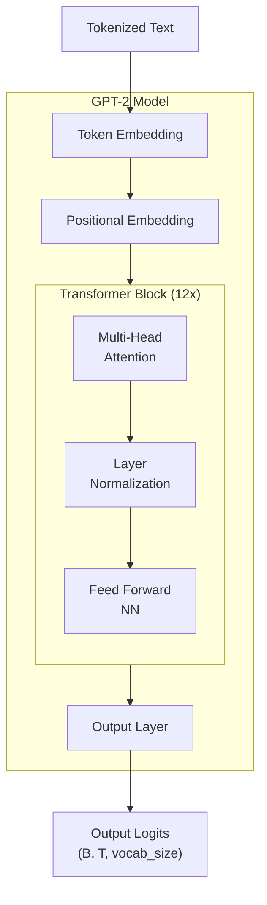

# 90분만에 Transformer 이해하기

## **1장: 큰 그림과 우리의 청사진**

여러분은 아마 ChatGPT나 유사한 대규모 언어 모델을 사용해 보셨을 것입니다. 질문을 입력하면, 일관성 있고 잘 작성된 답변이 나타납니다. 마법처럼 느껴질 수 있습니다. 시를 쓰고, 코드를 디버깅하고, 복잡한 주제를 설명할 수 있습니다. 하지만 이 겉으로 보이는 지능 뒤에 있는 **핵심 엔진이 알 수 없는 블랙박스가 아니라고** 말한다면 어떨까요?

**이것이 전체 비밀이라고 말한다면 어떨까요?**
```python
# gpt2_min.py
import math
from dataclasses import dataclass
import torch
import torch.nn as nn
import torch.nn.functional as F

@dataclass
class GPTConfig:
    vocab_size: int
    block_size: int
    n_layer: int = 12
    n_head: int = 12
    n_embd: int = 768
    dropout: float = 0.1

class CausalSelfAttention(nn.Module):
    def __init__(self, config: GPTConfig):
        super().__init__()
        assert config.n_embd % config.n_head == 0
        self.n_head, self.n_embd = config.n_head, config.n_embd
        self.c_attn = nn.Linear(config.n_embd, 3 * config.n_embd)
        self.c_proj = nn.Linear(config.n_embd, config.n_embd)
        self.resid_drop = nn.Dropout(config.dropout)
        self.register_buffer("bias", torch.tril(torch.ones(config.block_size, config.block_size)).view(1, 1, config.block_size, config.block_size))
    def forward(self, x):
        B, T, C = x.size()
        qkv = self.c_attn(x)
        q, k, v = qkv.split(self.n_embd, dim=2)
        head_dim = C // self.n_head
        q = q.view(B, T, self.n_head, head_dim).transpose(1, 2)
        k = k.view(B, T, self.n_head, head_dim).transpose(1, 2)
        v = v.view(B, T, self.n_head, head_dim).transpose(1, 2)
        att = (q @ k.transpose(-2, -1)) * (1.0 / math.sqrt(head_dim))
        att = att.masked_fill(self.bias[:, :, :T, :T] == 0, float("-inf"))
        att = F.softmax(att, dim=-1)
        y = att @ v
        y = y.transpose(1, 2).contiguous().view(B, T, C)
        return self.resid_drop(self.c_proj(y))

class MLP(nn.Module):
    def __init__(self, config: GPTConfig):
        super().__init__()
        self.fc = nn.Linear(config.n_embd, 4 * config.n_embd)
        self.proj = nn.Linear(4 * config.n_embd, config.n_embd)
        self.drop = nn.Dropout(config.dropout)
    def forward(self, x):
        return self.drop(self.proj(F.gelu(self.fc(x))))

class Block(nn.Module):
    def __init__(self, config: GPTConfig):
        super().__init__()
        self.ln_1 = nn.LayerNorm(config.n_embd)
        self.attn = CausalSelfAttention(config)
        self.ln_2 = nn.LayerNorm(config.n_embd)
        self.mlp = MLP(config)
    def forward(self, x):
        x = x + self.attn(self.ln_1(x))
        x = x + self.mlp(self.ln_2(x))
        return x

class GPT2(nn.Module):
    def __init__(self, config: GPTConfig):
        super().__init__()
        self.config = config
        self.wte = nn.Embedding(config.vocab_size, config.n_embd)
        self.wpe = nn.Embedding(config.block_size, config.n_embd)
        self.drop = nn.Dropout(config.dropout)
        self.h = nn.ModuleList([Block(config) for _ in range(config.n_layer)])
        self.ln_f = nn.LayerNorm(config.n_embd)
        self.lm_head = nn.Linear(config.n_embd, config.vocab_size, bias=False)
        self.lm_head.weight = self.wte.weight
    def forward(self, idx, targets=None):
        B, T = idx.size()
        pos = torch.arange(0, T, dtype=torch.long, device=idx.device).unsqueeze(0)
        x = self.wte(idx) + self.wpe(pos)
        x = self.drop(x)
        for block in self.h:
            x = block(x)
        x = self.ln_f(x)
        logits = self.lm_head(x)
        loss = F.cross_entropy(logits.view(-1, logits.size(-1)), targets.view(-1)) if targets is not None else None
        return logits, loss
```

이것이 전부입니다. 이 약 80줄의 Python 및 PyTorch 코드에는 ChatGPT와 같은 수십억 달러 규모 모델의 **모든 근본적인 아키텍처 원리**가 담겨 있습니다. 숨겨진 마법은 없습니다.

이 튜토리얼에서는 이 파일을 **줄 별로** 살펴보겠습니다. 각 줄이 **무엇을** 하는지뿐만 아니라 **왜** 거기에 있는지, 즉 그 뒤에 숨겨진 핵심 직관을 이해하게 될 것입니다. 끝에 가면 마법은 이해하기 쉬운 **우아한 공학**으로 바뀔 것입니다.

### 1.1 우리의 약속과 로드맵
우리의 약속은 간단합니다. 다음 90분 안에 트랜스포머가 여러분에게 **영원히** 이해될 것입니다. 우리의 여정은 다음 아키텍처를 정확히 따를 것입니다.



이 다이어그램이 우리의 로드맵입니다.
1.  **입력 (Input):** 바닥에 있는 "토큰화된 텍스트(Tokenized Text)"부터 시작합니다.
2.  **임베딩 (Embeddings):** 먼저 단어와 그 위치를 벡터로 변환하는 "토큰 임베딩(Token Embedding)" 및 "위치 임베딩(Positional Embedding)" 레이어를 구축할 것입니다.
3.  **핵심 엔진 (The Core Engine):** 다음으로 "트랜스포머 블록(Transformer Block)"을 구축할 것입니다. 이것은 "멀티 헤드 어텐션(Multi-Head Attention)"과 "피드 포워드 신경망(Feed Forward NN)"을 포함하는 모델의 핵심입니다. "12 X"가 나타내듯이, 모델의 힘은 이 블록들을 반복적으로 쌓는 것에서 나옵니다.
4.  **출력 (Output):** 마지막으로, 최종 처리된 벡터를 다시 예측으로 변환하는 "출력 레이어(Output Layer)"를 구축할 것입니다.

우리가 구축할 가장 중요한 구성 요소는 **인과적 셀프 어텐션(Causal Self-Attention)** 메커니즘입니다.

$ \text{Attention}(Q, K, V) = \text{softmax}\left(\frac{QK^T}{\sqrt{d_k}} + M\right)V $

이것이 위협적으로 보일지라도 걱정하지 마세요. 익숙해질 때까지 천천히 만들어 나갈 것입니다.

### 1.2 우리의 청사진: GPTConfig
모든 건설 프로젝트는 청사진으로 시작합니다. 우리 모델의 경우, 그 청사진은 `GPTConfig` 클래스입니다. 이것은 모든 주요 아키텍처 매개변수를 담는 간단한 컨테이너입니다.

이것들은 모델의 크기와 성능을 변경하기 위해 **조정할 수 있는 손잡이**입니다.

| 매개변수 | 제어하는 것 | 직관 | 실제 GPT-2 (Small) 값 |
| ------ | ------ | ------ | ------ |
| `vocab_size` | 어휘 크기 | 모델이 아는 고유한 단어/토큰의 수. | 50257 |
| `block_size` | 컨텍스트 윈도우 | 모델이 동시에 볼 수 있는 최대 토큰 수. | 1024 |
| `n_layer` | 모델 **깊이** | 서로 쌓인 블록의 수. 레이어가 많을수록 강력해집니다. | 12 |
| `n_head` | 모델 **폭** | 어텐션이 가질 수 있는 병렬 "대화"의 수. 헤드가 많을수록 더 많은 관점을 가집니다. | 12 |
| `n_embd` | 임베딩 차원 | 각 토큰을 나타내는 벡터의 "크기". | 768 |


단순히 이 숫자들을 변경함으로써, 작은 장난감 모델이나 전체 규모의 GPT-2를 만들 수 있습니다. 아키텍처의 기본 코드는 **정확히 동일하게 유지됩니다**.

청사진을 손에 들고, 이제 첫 번째 벽돌을 놓을 준비가 되었습니다. 다음 장에서는 간단한 숫자를 모델이 이해할 수 있는 풍부한 벡터로 바꾸는 임베딩 레이어를 구축할 것입니다.

## **2장: 단어-벡터 사전: 토큰 임베딩**
우리의 여정은 첫 번째 기능 레이어부터 시작됩니다. 우리는 원시 입력인 토큰 ID 시퀀스를 신경망이 처리할 수 있는 형태로 변환해야 합니다.

우리의 청사진을 보고 우리가 구축하고 있는 구성 요소를 정확히 찾아봅시다.
```python
class GPT2(nn.Module):
    def __init__(self, config):
        # We are building THIS line now.
        self.wte = nn.Embedding(config.vocab_size, config.n_embd) # Word Token Embedding
        self.wpe = nn.Embedding(...) # (Next chapter)

        # The rest of the model
        self.h = nn.ModuleList(...)
        self.ln_f = nn.LayerNorm(...)
        self.lm_head = nn.Linear(...)
```
### 2.1 입력 문제: 의미 없는 숫자
우리 모델의 입력은 `torch.tensor([])`와 같은 **토큰 ID의 텐서**입니다. 이것들은 **범주형 숫자**입니다. ID 21이 ID 5보다 4.2배의 "값"을 가지는 것은 아닙니다. 그들 사이의 숫자적 거리는 **임의적이고 의미가 없습니다**. 행렬 곱셈과 경사 하강법에 의존하는 신경망은 이러한 원시 ID로부터 학습할 수 없습니다. 그것들은 단지 포인터일 뿐입니다.

### 2.2 목표: 단어를 "의미 공간"에 매핑하기
우리의 목표는 각 토큰에 대해 **학습 가능한 표현**을 만드는 것입니다. 각 토큰 ID를 **벡터**—고차원 공간의 한 점—로 매핑하기를 원합니다. 핵심 아이디어는 이 점들의 **위치가 의미가 있어야 한다는 것**입니다.

**비유: 색 공간.** 색상을 표현하고 싶다고 상상해 봅시다.
*   **나쁜 방법 (범주형 ID):** `{"빨강": 1, "주황": 2, "파랑": 8}`. "파랑"에 대한 숫자 8은 "빨강"에 대한 숫자 1과 아무런 관련이 없습니다.
*   **좋은 방법 (벡터/좌표):** x축이 "빨강색"이고 y축이 "파랑색"인 2D 공간에서 색상을 표현합니다.
    *   빨강은 (0.9, 0.1)일 수 있습니다.
    *   주황은 (0.8, 0.2)일 수 있습니다 (빨강에 가깝습니다!).
    *   파랑은 (0.1, 0.9)일 수 있습니다 (빨강에서 멀리 떨어져 있습니다!).

이제 점들 사이의 **거리가 의미가 있습니다!** 우리는 이와 동일한 작업을 단어에 대해, `n_embd` (예: 768) 차원의 공간에서 수행할 것입니다.

### 2.3 메커니즘: 학습 가능한 좌표책
`nn.Embedding` 레이어는 바로 이 좌표책입니다. 이것은 단일 가중치 행렬로 저장된 간단한 **조회 테이블**입니다. 이를 구축하고 내용을 살펴보겠습니다.
```python
import torch
import torch.nn as nn

# A tiny config for our example
vocab_size = 10
n_embd = 3 # The number of dimensions in our "semantic space"

# The layer is our coordinate book
token_embedding_table = nn.Embedding(vocab_size, n_embd)

# The book itself is the `.weight` attribute. Each row is a word's coordinate.
print("Shape of our coordinate book:", token_embedding_table.weight.shape)
print("Content of the book (initially random coordinates):")
print(token_embedding_table.weight)
```
**출력:**
```
Shape of our coordinate book: torch.Size([10, 3])
Content of the book (initially random coordinates):
Parameter containing:
tensor([[-0.2185, -0.2291, -0.5435],  # Coordinate for token 0
        [ 0.6508,  0.4734, -0.4439],  # Coordinate for token 1
        [-0.3129,  1.6141,  0.2889],  # Coordinate for token 2
        ...
        [-1.0223, -0.2543, -0.3288]], # Coordinate for token 9
       requires_grad=True)
```
이것이 핵심입니다. 우리는 (`vocab_size`, `n_embd`) 행렬을 가지고 있습니다. `requires_grad=True` 부분은 중요합니다. 이는 훈련 중에 모델이 예측 오류를 최소화하기 위해 각 단어에 대한 **최고의 가능한 좌표를 학습할 것**을 의미

### 2.4 힘과 부족함
조회(lookup)가 실제로 어떻게 작동하는지 보고, 이 새로운 표현이 우리에게 무엇을 제공하는지, 그리고 무엇이 부족한지 논의해 봅시다.
```python
B, T = 2, 4 # Batch, Time
idx = torch.randint(0, vocab_size, (B, T)) # A batch of token ID sequences

# --- The Lookup ---
# For each ID in `idx`, we retrieve its coordinate vector from the table
tok_emb = token_embedding_table(idx)

print("Input IDs shape:", idx.shape)
print("Output Vectors (Coordinates) shape:", tok_emb.shape)
```

**출력:**
```
Input IDs shape: torch.Size([2, 4])
Output Vectors (Coordinates) shape: torch.Size([2, 4, 3])
```

우리는 우리의 (B, T) 정수 텐서를 (B, T, `n_embd`) 부동 소수점 텐서로 변환했습니다.

**그래서 무엇을 얻었을까요?** \\
우리는 이제 각 단어의 **컨텍스트에 독립적인 표현**을 가집니다. 훈련 중에 모델은 유사한 의미를 가진 단어들을 서로 가깝게 배치하는 것을 학습합니다. 이것이 `vector('King') - vector('Man') + vector('Woman') ≈ vector('Queen')`와 같은 유명한 유추를 가능하게 합니다. 'King'에 대한 벡터는 수학적으로 조작될 수 있는 "남성성"과 "왕족"의 개념을 포착합니다.

**하지만 무엇이 부족할까요?** \\
이 표현에는 한 가지 거대한 결함이 있습니다: **정적이고 컨텍스트에 독립적**이라는 것입니다. "bank"라는 단어의 벡터는 다음 두 문장에서 동일합니다.
1. "나는 강 **둑(bank)**에 앉았다."
2. "나는 **은행(bank)**에서 돈을 인출했다."

조회 테이블은 강력한 시작점을 제공하지만, 그것은 단지 사전일 뿐입니다. 주변 단어에 대해서는 알지 못한다.

이것이 트랜스포머 아키텍처가 해결하고자 설계된 **핵심 문제**입니다. **토큰의 벡터 표현이 그 컨텍스트에 따라 동적으로 어떻게 조정될 수 있을까요?**

이 질문에 답을 시작하기 위해서라도, 우리는 먼저 모델에게 **순서 감각**을 주어야 합니다. 그것이 다음 장의 주제인 위치 임베딩(Positional Embeddings)입니다.

## **3장: 모델에 순서 감각 부여하기: 위치 임베딩**
지난 장에서 우리는 각 단어를 컨텍스트에 독립적인 벡터로 매핑하는 "사전"을 만들었습니다. 이 벡터는 단어의 일반적인 의미를 나타냅니다. 하지만 우리 모델은 여전히 입력을 이러한 벡터들의 단순한 집합—"단어 가방(bag)"—으로 봅니다. **그 순서에 대해서는 아무것도 알지 못합니다**.

언어는 순서에 관한 모든 것입니다. "개는 사람을 문다(Dog bites man)"는 "사람은 개를 문다(Man bites dog)"와 같지 않습니다. 우리는 이 중요한 순서 정보를 모델에 제공해야 합니다.

청사진에서 다음 구성 요소를 찾아봅시다.
```python
class GPT2(nn.Module):
    def __init__(self, config):
        self.wte = nn.Embedding(...) # (Done)

        # We are building THIS line now.
        self.wpe = nn.Embedding(config.block_size, config.n_embd) # Positional Embedding

        self.h = nn.ModuleList(...)
        self.ln_f = nn.LayerNorm(...)
        self.lm_head = nn.Linear(...)
```

### 3.1 문제: 단어 가방(A Bag of Words)
우리의 현재 출력은 C가 `n_embd`인 (B, T, C) 형태의 텐서입니다. $\[$"Man", "bites", "dog"$\]$와 같은 시퀀스의 경우, 모델은 {vector("Man"), vector("bites"), vector("dog")}의 세 벡터 집합을 받습니다. 입력을 섞어도 모델은 T 차원을 따라 다른 순서로만 정확히 동일한 벡터 집합을 받게 될 것입니다. 핵심 처리 레이어(트랜스포머 블록)는 순서에 불변하도록 설계되었으므로, 수정 없이는 동일한 결과를 생성할 것입니다.

우리는 각 토큰의 벡터에 **그 위치를 명시적으로 "찍어"** 주어야 합니다.

### 3.2 해결책: 학습 가능한 "위치 벡터"
GPT에서 사용되는 해결책은 놀랍도록 간단합니다. 우리가 각 **단어**에 대해 고유한 벡터를 학습했듯이, 각 **위치**에 대해서도 고유한 벡터를 학습할 것입니다.
*   우리는 "나는 1번째 위치에 있어"라는 의미를 가지는 벡터를 가질 것입니다.
*   우리는 "나는 2번째 위치에 있어"라는 의미를 가지는 또 다른 벡터를 가질 것입니다.
*   ...그리고 최대 시퀀스 길이 (`block_size`)까지 계속됩니다.

이것은 또 다른 `nn.Embedding` 레이어이지만, 이번에는 단어가 아닌 **위치에 대한 조회 테이블**입니다. 그것의 "어휘 크기"는 `block_size`입니다. 그런 다음 이 위치 벡터를 해당 토큰 벡터에 **더합니다**.

**왜 더하는 것이 효과가 있을까요?** \\
토큰 임베딩과 위치 임베딩이 동일한 고차원 공간에 존재하기 때문에, 모델은 결합된 벡터를 해석하는 방법을 학습할 수 있습니다. 훈련 중에, 모델은 `vector(pos=N)`을 `vector(word=W)`에 더하는 것이 다른 위치에 있는 동일한 단어와 구별되는 고유한 표현을 생성하도록 위치 벡터를 만드는 방법을 학습합니다. 네트워크는 이 구성을 "이해"하는 방법을 학습합니다.

### 3.3 코드: 구축 및 결합
이를 구현해 봅시다. 핵심은 위치 인덱스 시퀀스 (0, 1, 2, ...)를 생성하고 이를 사용하여 위치 벡터를 조회하는 것입니다.
```python
import torch
import torch.nn as nn

# --- Our Config ---
B, T, C = 2, 5, 3  # Batch, Time (sequence length), Channels (n_embd)
vocab_size = 10
block_size = 8     # Our model's max sequence length is 8

# --- The Layers ---
token_embedding_table = nn.Embedding(vocab_size, C)
position_embedding_table = nn.Embedding(block_size, C)

# --- The Input Data ---
idx = torch.randint(0, vocab_size, (B, T)) # Shape (2, 5)

# --- Step 1: Get Token Embeddings (as before) ---
tok_emb = token_embedding_table(idx) # Shape (B, T, C) -> (2, 5, 3)

# --- Step 2: Get Positional Embeddings ---
# Note: Our input sequence length T=5, but block_size=8. This is fine.
# We just need the positions for our current sequence.
pos = torch.arange(0, T, dtype=torch.long) # Shape (T) -> tensor([0, 1, 2, 3, 4])
pos_emb = position_embedding_table(pos) # Shape (T, C) -> (5, 3)

# --- Step 3: Combine them via addition ---
# (B, T, C) + (T, C) --(broadcasts)--> (B, T, C)
x = tok_emb + pos_emb
print("Shape of token embeddings:", tok_emb.shape)
print("Shape of positional embeddings:", pos_emb.shape)
print("Shape of final combined embeddings:", x.shape)
```
**출력:**
```
Shape of token embeddings: torch.Size([2, 5, 3])
Shape of positional embeddings: torch.Size([5, 3])
Shape of final combined embeddings: torch.Size([2, 5, 3])
```

**핵심 질문에 대한 답변: 입력 시퀀스가 `block_size`보다 짧으면 어떻게 될까요?** \\
이것이 정상적인 경우입니다! 위에서 보듯이, 우리의 `block_size`는 8이지만, 우리의 입력 시퀀스 길이 T는 5에 불과합니다. `torch.arange(0, T, ...)` 코드는 이를 완벽하게 처리합니다. 우리는 현재 처리하고 있는 시퀀스 길이에 대해서만 위치 임베딩을 생성하고 조회합니다. 입력이 그만큼 길지 않으면 전체 `block_size`를 사용하지 않습니다.

이제 메인 이벤트를 위한 입력을 준비했습니다. 우리의 텐서 `x`는 토큰의 **정체성**과 시퀀스 내에서의 **절대 위치**를 모두 알고 있는 벡터를 포함합니다.

이것이 트랜스포머 블록 스택으로 흘러 들어갈 입력입니다. 이제 기계의 심장인 **셀프 어텐션**을 구축할 시간입니다.

## **4장: 트랜스포머의 심장: 셀프 어텐션 직관**

지난 장에서 우리는 모델이 컨텍스트와 상관없이 단어에 동일한 시작 벡터를 부여한다는 것을 확인했습니다. 이것은 모호한 단어들에게는 문제입니다. 이를 명확히 하기 위해 간단한 문장을 사용하겠습니다.

**문제:** "crane"이라는 단어를 생각해 봅시다.
1.  "**Crane** ate fish." (크레인 = 새)
2.  "**Crane** lifted steel." (크레인 = 기계)

"crane"에 대한 초기 벡터는 두 문장에서 동일합니다. 셀프 어텐션은 이 모호성을 해결하기 위해 이 벡터를 이웃(ate vs. lifted)을 기반으로 업데이트해야 합니다.

어텐션 수식을 우리의 지도 삼아 이것이 어떻게 작동하는지 봅시다.
$$ \text{Attention}(Q, K, V) = \text{softmax}\left(\frac{QK^T}{\sqrt{d_k}}\right)V $$

### 4.1 Q, K, V 벡터 공간
시작하기 전에 Q, K, V가 무엇을 나타내는지 명확히 해봅시다.
*   **쿼리(Query, Q) 및 키(Key, K) 공간:** 
    -   이것은 "매칭" 또는 "검색" 공간이라고 생각하십시오. Q는 탐침이고, K는 레이블입니다. **반드시** 동일한 차원 수를 가져야 점곱(dot product)을 계산하여 유사도 점수를 얻을 수 있습니다.
*   **값(Value, V) 공간:** 
    -   이것은 "정보" 또는 "페이로드" 공간이라고 생각하십시오. 이것은 매칭이 발견되면 실제로 전달되는 실제 내용입니다. 우리 GPT-2 아키텍처에서는 단순화를 위해 `d_v = d_k = C/n_head`로 설정합니다. `d_v`가 `d_k`와 같을 필요는 없으며—모든 헤드를 연결한 후 총 차원이 C와 같도록 (`n_head * d_v = C`) 출력도 입력과 동일한 차원을 가지는 것이 중요합니다.

이것은 중요한 질문을 제기합니다: \\
**우리는 이미 각 토큰에 대한 입력 벡터 `x`를 가지고 있습니다. 왜 별도의 값 (V) 벡터를 만들어야 할까요? `x`가 이미 '정보'가 아닌가요?**

답은 원시 정보가 항상 공유하기에 가장 좋은 정보는 아니라는 것입니다. V 벡터는 `x`의 **변형된 버전**으로, 다른 토큰이 소비할 수 있도록 특별히 **패키징된** 것입니다.

비유를 사용해 봅시다. 토큰이 컨퍼런스의 전문가라고 상상해 보십시오.

| 측면 | 입력 벡터 (x) | 값 벡터 (V) |
| ------ | ------ | ------ |
| **역할** | 원시, 완전한 정보 | 패키징된, 소비 가능한 정보 |
| **비유** | 당신의 전체 지식 & 이력서 | 당신이 준비한 "엘리베이터 피치" |
| **목적** | 계산의 시작점 | 다른 토큰에 의해 집계될 페이로드 |
| **만들어지는 방법** | 임베딩 레이어의 출력 | `x`의 **학습된 변환** (`V = x @ W_v`) |


모델은 각 단어에 대한 최고의 "엘리베이터 피치"(V)를 **학습합니다**. 이는 모델이 원시 지식(x)의 일부를 강조하거나 약화하여 이웃에게 가장 도움이 되도록 유연성을 제공합니다.

이제 우리의 예시를 진행해 봅시다. 우리는 차원이 매우 간단한 2D 공간을 사용할 것입니다.
*   **차원 1:** "그것은 **동물**인가?"를 나타냅니다.
*   **차원 2:** "그것은 **기계**인가?"를 나타냅니다.

모호한 단어 "crane"은 이러한 가능성들 사이에서 균형 잡힌 벡터를 가질 것입니다.

| Token | Q - "I'm looking for..." | K - "I am..." | V - "I offer this info..." |
| :--- | :--- | :--- | :--- |
| **ate** | ... | `[0.9, 0.1]` (High Animal) | `[0.9, 0.1]` |
| **fish** | ... | `[0.9, 0.1]` (High Animal) | `[0.8, 0.2]` |
| **lifted** | ... | `[0.1, 0.9]` (High Machine)| `[0.1, 0.9]` |
| **steel** | ... | `[0.1, 0.9]` (High Machine)| `[0.2, 0.8]` |
| **crane** | **`[0.7, 0.7]`** | **`[0.7, 0.7]`** | **`[0.5, 0.5]`** (Ambiguous)|


> **문장 1: "Crane ate fish"**

**1. 점수 계산 (QK^T):** crane 토큰은 자신의 쿼리 $\[0.7, 0.7\]$을 사용하여 문장 내의 모든 키를 탐색합니다.
*   **Score(crane -> crane):** $\[0.7, 0.7\] ⋅ \[0.7, 0.7\]$ = 0.49 + 0.49 = **0.98**
*   **Score(crane -> ate):** $\[0.7, 0.7\] ⋅ \[0.9, 0.1\]$ = 0.63 + 0.07 = **0.70**
*   **Score(crane -> fish):** $\[0.7, 0.7\] ⋅ \[0.9, 0.1\]$ = 0.63 + 0.07 = **0.70**

**2. 정규화 (softmax):** 원시 점수 $\[0.98, 0.70, 0.70\]$는 백분율로 변환됩니다.
*   **어텐션 가중치:** $\[0.4, 0.3, 0.3\]$ *이것은 crane이 자신의 새로운 자아를 구축하기 위해 원래의 자신에게 40%, ate에 30%, fish에 30% 귀 기울일 것임을 의미합니다.*

**3. 집계 (...V):** crane의 새로운 벡터는 **값(Values)**의 가중치 합입니다.
*   New_Vector(crane) = 0.4*V(crane) + 0.3*V(ate) + 0.3*V(fish)
*   New_Vector(crane) = 0.4*$\[0.5, 0.5\]$ + 0.3*$\[0.9, 0.1\]$ + 0.3*$\[0.8, 0.2\]$
*   New_Vector(crane) = $\[0.20, 0.20\]$ + $\[0.27, 0.03\]$ + $\[0.24, 0.06\]$ = **$\[0.71, 0.29\]$**

결과는 **차원 1 (동물)** 쪽으로 크게 치우친 새로운 "crane" 벡터입니다. `ate`와 `fish`의 컨텍스트가 모호성을 해결했습니다. 그것은 새입니다.

> **문장 2: "Crane lifted steel"**

**1. 점수 계산 (QK^T):** crane은 **정확히 동일한 쿼리** $\[0.7, 0.7\]$을 새로운 이웃들에게 사용합니다.
*   **Score(crane -> crane):** $\[0.7, 0.7\]$ ⋅ $\[0.7, 0.7\]$ = **0.98**
*   **Score(crane -> lifted):** $\[0.7, 0.7\]$ ⋅ $\[0.1, 0.9\]$ = 0.07 + 0.63 = **0.70**
*   **Score(crane -> steel):** $\[0.7, 0.7\]$ ⋅ $\[0.1, 0.9\]$ = 0.07 + 0.63 = **0.70**

**2. 정규화 (softmax):** 원시 점수 $\[0.98, 0.70, 0.70\]$는 이전과 동일합니다.
*   **어텐션 가중치:** $\[0.4, 0.3, 0.3\]$ *백분율은 동일하지만, 이제 다른 토큰 집합에 적용됩니다!*

**3. 집계 (...V):**
*   New_Vector(crane) = 0.4*V(crane) + 0.3*V(lifted) + 0.3*V(steel)
*   New_Vector(crane) = 0.4*$\[0.5, 0.5\]$ + 0.3*$\[0.1, 0.9\]$ + 0.3*$\[0.2, 0.8\]$
*   New_Vector(crane) = $\[0.20, 0.20\]$ + $\[0.03, 0.27\]$ + $\[0.06, 0.24\]$ = **$\[0.29, 0.71\]$**

결과는 이제 **차원 2 (기계)** 쪽으로 크게 치우친 벡터입니다. 정확히 동일한 초기 "crane" 벡터가 다른 우세한 이웃에 귀 기울였기 때문에 완전히 다른, 컨텍스트 인식 벡터로 변환되었습니다.

이것이 셀프 어텐션의 힘입니다. 이제 직관이 확고해졌으니, 행렬로 구현해 볼 수 있습니다.

## **5장: 스케일드 닷 프로덕트 어텐션 구현하기**
셀프 어텐션에 대한 직관을 구축했습니다. 이제 그 정확한 프로세스를 PyTorch를 사용하여 행렬 연산으로 변환할 것입니다. 이 장이 끝날 때까지 핵심 어텐션 수식을 구현하고 재사용 가능한 `nn.Module`에 캡슐화할 것입니다.

이 장의 지도는 수식 자체입니다.
$$ \text{Attention}(Q, K, V) = \text{softmax}\left(\frac{QK^T}{\sqrt{d_k}}\right)V $$

먼저, 모든 숫자를 보기 위해 원시 텐서로 이를 구축할 것입니다. 그런 다음, 그 로직을 공식 `CausalSelfAttention` 클래스 안에 넣을 것입니다.

###  5.1 원시 텐서 상세 설명
"**A crane ate fish**"라는 간단한 문장을 사용해 봅시다. \\
이제 4개의 토큰 (T=4)이 있고 우리의 장난감 임베딩 차원은 2 (C=2)입니다. 우리는 한 번에 한 문장 (B=1)을 처리할 것입니다.

**입력 (`x`): 원시, 컨텍스트에 독립적인 임베딩** \\
이것은 우리의 임베딩 레이어에서 온 텐서입니다. Dim1="객체 유사", Dim2="액션 유사".

```python
import torch
import torch.nn as nn
import torch.nn.functional as F
import math
from dataclasses import dataclass

B, T, C = 1, 4, 2  # Batch, Time (sequence length), Channels (embedding dim)
x = torch.tensor([
    [[0.1, 0.1],   # A
     [1.0, 0.2],   # crane (mostly object, slightly action)
     [0.1, 0.9],   # ate (mostly action)
     [0.8, 0.0]]   # fish (purely object)
]).float()
```

**단계 1: `x`를 Q, K, V로 투영** 
*   우리의 쿼리, 키, 값 벡터를 얻기 위해 **학습 가능한** 선형 변환을 사용합니다. 이 `nn.Linear` 레이어들은 연산의 "두뇌"이며; 그들의 가중치는 훈련 중에 업데이트됩니다. 이 튜토리얼에서는 로직을 명확하게 보기 위해 수동으로 설정할 것입니다.

```python
# The learnable components
q_proj = nn.Linear(C, C, bias=False)
k_proj = nn.Linear(C, C, bias=False)
v_proj = nn.Linear(C, C, bias=False)

# Manually set weights for this tutorial
torch.manual_seed(42)
q_proj.weight.data = torch.randn(C, C)
k_proj.weight.data = torch.randn(C, C)
v_proj.weight.data = torch.randn(C, C)

# --- Perform the projections ---
q = q_proj(x)
k = k_proj(x)
v = v_proj(x)
```

우리의 텐서 모양과 그 의미를 추적해 봅시다.

| 변수 | 모양 (B, T, C) | 의미 |
| ------ | ------ | ------ |
| `x` | (1, 4, 2) | 원시 입력 벡터의 배치. |
| `q` | (1, 4, 2) | 4개 토큰 각각의 "쿼리" 벡터. |
| `k` | (1, 4, 2) | 4개 토큰 각각의 "키" 벡터. |
| `v` | (1, 4, 2) | 4개 토큰 각각의 "값" 벡터. |


**단계 2: 어텐션 점수 계산 (`q @ k.transpose`)**
*   이것이 통신의 핵심입니다. 우리는 모든 토큰의 쿼리와 다른 모든 토큰의 키의 점곱을 계산해야 합니다. 이것은 단일하고 효율적인 행렬 곱셈으로 수행할 수 있습니다.
    *   `q`의 모양은 (1, 4, 2)입니다.
    *   `k`의 모양은 (1, 4, 2)입니다.
    *   이들을 곱하기 위해, 우리는 내부 차원을 일치시켜야 합니다. 우리는 `k`의 마지막 두 차원을 바꾸기 위해 `.transpose(-2, -1)`를 사용합니다.
    *   `k.transpose(-2, -1)`는 (1, 2, 4)의 모양을 가집니다.
    *   곱셈은 (1, 4, 2) @ (1, 2, 4)이며, 이는 (1, 4, 4) 행렬을 생성합니다.

```python
# --- Score Calculation ---
scores = q @ k.transpose(-2, -1)

print("--- Raw Scores (Attention Matrix) ---")
print(scores.shape)
print(scores)
```

**출력:**
```
--- Raw Scores (Attention Matrix) ---
torch.Size([1, 4, 4])
tensor([[[ 0.0531,  0.4137,  0.1802,  0.2721],   # "A" scores for (A, crane, ate, fish)
         [ 0.1782,  1.3888,  0.6053,  0.9101],   # "crane" scores for (A, crane, ate, fish)
         [ 0.0618,  0.4815,  0.2098,  0.3151],   # "ate" scores for (A, crane, ate, fish)
         [ 0.1260,  0.9822,  0.4280,  0.6433]]])  # "fish" scores for (A, crane, ate, fish)
```

이 (4, 4) 행렬은 원시 호환성 점수를 담고 있습니다. 예를 들어, "crane" (행 1)에 대한 쿼리는 "crane" (열 1)에 대한 키와 가장 높은 호환성인 1.3888을 가집니다.

**단계 3 & 4: 스케일링 및 소프트맥스** 
*   우리는 안정성을 위해 점수를 스케일링한 다음, 소프트맥스를 사용하여 각 행에 대해 합이 1이 되는 어텐션 가중치로 변환합니다.

```python
d_k = k.size(-1)
scaled_scores = scores / math.sqrt(d_k)
attention_weights = F.softmax(scaled_scores, dim=-1) # Softmax along the rows
```
**단계 5: 값 집계 (`attention_weights @ v`)** 
*   이제 우리의 가중치를 사용하여 값 벡터의 가중 평균을 만듭니다.
    *   `attention_weights`의 모양은 (1, 4, 4)입니다.
    *   `v`의 모양은 (1, 4, 2)입니다.
    *   곱셈 (1, 4, 4) @ (1, 4, 2)는 (1, 4, 2) 모양의 최종 텐서를 생성합니다.

```python
# --- Value Aggregation ---
output = attention_weights @ v

print("\n--- Final Output (Context-Aware Vectors) ---")
print(output.shape)
print(output)
```
**출력:**
```
--- Final Output (Context-Aware Vectors) ---
torch.Size([1, 4, 2])
tensor([[[ 0.0652, -0.1691],
         [ 0.1147, -0.2974],
         [ 0.0768, -0.1991],
         [ 0.1005, -0.2607]]])
```

텐서 변환 요약은 다음과 같습니다.

| 단계 | 연산 | 입력 모양 | 출력 모양 (B, T, ...) | 의미 |
| ------ | ------ | ------ | ------ | ------ |
| 1 | `q_proj(x)` 등 | (1, 4, 2) | (1, 4, 2) | 각 토큰에 대한 Q, K, V 생성 |
| 2 | `q @ k.T` | (1, 4, 2) & (1, 2, 4) | (1, 4, 4) | 원시 호환성 점수 |
| 3 | `/ sqrt(d_k)` | (1, 4, 4) | (1, 4, 4) | 안정화된 점수 |
| 4 | `softmax` | (1, 4, 4) | (1, 4, 4) | 어텐션 확률 |
| 5 | `att @ v` | (1, 4, 4) & (1, 4, 2) | (1, 4, 2) | 컨텍스트 인식 출력 벡터 |


성공했습니다! 우리는 원시 입력 `x`를 취하여 정확히 동일한 모양의 새 텐서 출력을 생성했으며, 여기서 각 토큰의 벡터는 이웃의 정보로 업데이트되었습니다.

### 5.2  `nn.Module`에 로직 캡슐화하기
원시 텐서 상세 설명은 메커니즘을 이해하는 데 훌륭합니다. 실제로는 이 로직을 재사용 가능한 클래스에 패키징합니다. 이는 우리의 코드를 깨끗하고, 체계적이며, 더 큰 모델에 통합하기 쉽게 만듭니다.

다음은 단일 어텐션 헤드에 대한 완전하고 캡슐화된 코드입니다. 이 섹션이 끝날 때까지 모든 줄이 명확해질 것입니다.

```python
# The final, reusable PyTorch module
class SingleHeadSelfAttention(nn.Module):
    def __init__(self, config):
        """
        Initializes the layers needed for self-attention.
        """
        super().__init__()
        # The single, fused linear layer for Q, K, V
        self.c_attn = nn.Linear(config.n_embd, 3 * config.n_embd, bias=False)

    def forward(self, x):
        """
        Defines the data flow through the module.
        Input x shape: (B, T, C)
        """
        B, T, C = x.size()

        # 1. Get Q, K, V from a single projection and split them
        qkv = self.c_attn(x)
        q, k, v = qkv.split(C, dim=2)
        
        # 2. Calculate attention weights
        # (B, T, C) @ (B, C, T) -> (B, T, T)
        scaled_scores = (q @ k.transpose(-2, -1)) / math.sqrt(k.size(-1))
        attention_weights = F.softmax(scaled_scores, dim=-1)
        
        # 3. Aggregate values
        # (B, T, T) @ (B, T, C) -> (B, T, C)
        output = attention_weights @ v
        
        return output
```

이제 이 우아한 코드가 우리의 수동적이고 단계별 프로세스와 **정확히 동일한 결과**를 어떻게 달성하는지 분석해 봅시다.

**`__init__` 메서드: 융합된 선형 레이어** \\
`__init__` 메서드는 구성 요소를 설정합니다. 여기서는 단 하나만 필요합니다.

```python
self.c_attn = nn.Linear(config.n_embd, 3 * config.n_embd, bias=False)
```

우리의 수동 상세 설명에서는 세 개의 별도 `nn.Linear` 레이어를 사용했습니다. 이 한 줄은 동일한 목표를 달성하는 일반적이고 **고도로 효율적인 최적화**입니다.

| 우리의 수동 상세 설명 (개념적으로 명확) | 융합된 레이어 (계산적으로 효율적) |
| ------ | ------ |
| `q_proj = nn.Linear(C, C)` | |
| `k_proj = nn.Linear(C, C)` | `c_attn = nn.Linear(C, 3*C)` |
| `v_proj = nn.Linear(C, C)` | |


세 개의 작은 행렬 곱셈 대신, GPU는 하나의 더 크고 빠른 행렬 곱셈을 수행할 수 있습니다. `bias=False` 인수는 NanoGPT와 같은 최소 구현에서 사용되는 일반적인 단순화입니다. 원본 GPT-2 구현은 선형 투영에 바이어스를 포함한다는 점에 유의하십시오.

**`forward` 메서드: 융합된 것에서 최종 출력까지** \\
`forward` 메서드는 모듈의 핵심이며, 데이터의 여정을 정의합니다.

**1. 투영 및 분할**
```python
qkv = self.c_attn(x)
q, k, v = qkv.split(C, dim=2)
```

*   `self.c_attn(x)`: 우리는 입력 `x` (모양 B, T, C)를 융합된 레이어를 통해 전달하여 (B, T, 3*C) 모양의 `qkv` 텐서를 생성합니다.
*   `qkv.split(C, dim=2)`: 이것이 영리한 부분입니다. `.split()` 함수는 텐서를 조각냅니다. 우리는 "차원 2 (마지막 차원)를 따라, 크기가 C인 청크를 만들어라"라고 지시합니다. 총 차원이 3*C이므로, 이것은 정확히 세 개의 텐서를 제공하며, 각각은 (B, T, C)의 원하는 모양을 가지며, 이를 `q`, `k`, `v`에 할당합니다.


**2. 어텐션 가중치 계산**
```python
scaled_scores = (q @ k.transpose(-2, -1)) / math.sqrt(k.size(-1))
attention_weights = F.softmax(scaled_scores, dim=-1)
```

이것은 수학적 수식의 직접적이고 일대일 구현입니다.
*   `k.transpose(-2, -1)`는 키 텐서의 T와 C 차원을 교환하여 행렬 곱셈을 준비합니다.
*   `q @ ...`는 점곱을 수행하여 (B, T, T) 모양의 원시 점수 행렬을 생성합니다.
*   `/ math.sqrt(k.size(-1))`는 안정성을 위해 스케일링을 수행합니다.
*   `F.softmax(...)`는 원시 점수를 각 행을 따라 확률 분포로 변환합니다.

**3. 값 집계**
```python
output = attention_weights @ v
```

마지막으로, 마지막 행렬 곱셈을 수행합니다. 어텐션 가중치 (B, T, T)는 값 벡터 (B, T, C)와 곱해져 (B, T, C) 모양의 최종 출력 텐서를 생성합니다.

**동등성 증명** 

이 클래스가 우리의 수동 작업과 동일하다는 것을 증명하기 위해, 우리는 그것을 인스턴스화하고 우리의 `q_proj`, `k_proj`, `v_proj` 레이어의 가중치를 단일 `c_attn` 레이어로 수동으로 로드할 수 있습니다.
```python
# Let's verify the logic
@dataclass
class GPTConfig: n_embd: int
model = SingleHeadSelfAttention(GPTConfig(n_embd=C))

# The c_attn layer's weight matrix is shape (3*C, C). Our separate weights
# are each (C, C). We concatenate them along dim=0 to get (3*C, C).
model.c_attn.weight.data = torch.cat(
    [q_proj.weight.data, k_proj.weight.data, v_proj.weight.data], dim=0
)

# Run the model
model_output = model(x)

# 'output' is the tensor from our manual walkthrough in Part 1
print("Are the outputs the same?", torch.allclose(output, model_output))
```
**출력:**
```
Are the outputs the same? True
```

완벽하게 작동합니다. 우리는 셀프 어텐션의 핵심을 성공적으로 구현하고 깨끗하고 재사용 가능한 모듈로 공식화했다.

하지만 우리 모델에는 언어 생성에 있어 결함이 있습니다: **토큰이 미래를 볼 수 있습니다**. 우리의 현재 어텐션 행렬은 이를 허용합니다. 다음으로 인과적 마스크를 추가하여 이를 수정할 것입니다.

## **6장: 앞을 내다보지 마세요! 인과적 마스크 구현하기**
우리는 토큰들이 통신할 수 있도록 강력한 어텐션 메커니즘을 구축했습니다. 하지만 우리 목적에는 치명적인 결함이 있습니다: **시간 여행자**입니다.

**문제: 미래를 엿봄으로써 부정행위**

GPT는 **자기회귀(autoregressive)** 모델입니다. 즉, 한 번에 하나의 토큰씩 텍스트를 생성합니다. "A crane ate..."라는 문장에서 다음 단어를 예측하려고 할 때, 그 결정은 지금까지 본 토큰인 "A", "crane", "ate"에만 기반해야 합니다. 실제 답인 "fish"를 보도록 허용되어서는 안 됩니다.

지난 장에서 계산한 어텐션 가중치 행렬을 봅시다.
```
# From Chapter 5
tensor([[[0.37, 0.32, 0.31, ...],  # "A" attends to all 4 tokens
         [0.31, 0.37, 0.32, ...],  # "crane" attends to all 4 tokens
         [0.36, 0.31, 0.33, ...],  # "ate" attends to all 4 tokens
         ...                      # "fish" attends to all 4 tokens
        ]]])
```

이것은 문제입니다. 토큰 "A" (위치 0)는 "crane" (위치 1), "ate" (위치 2), "fish" (위치 3)로부터 정보를 수집하고 있습니다. "A" 다음에 오는 단어를 예측할 때, 이것은 **부정행위**입니다.

위치 `t`에 있는 토큰은 위치 0, 1, ..., `t`에 있는 토큰과만 통신할 수 있어야 합니다. `t+1`, `t+2`, ...에 있는 토큰을 볼 수 없습니다.

**해결책: 인과적 마스크** 

해결책은 우아합니다. 우리는 소프트맥스 함수를 적용하기 **전에** 어텐션 점수 행렬을 수정할 것입니다. 미래의 모든 위치의 점수를 **음의 무한대 (-inf)**로 설정하여 "마스킹"할 것입니다.

왜 -inf일까요? 소프트맥스 함수는 지수 함수 `e^x / sum(e^x)`를 포함하기 때문입니다. 음의 무한대의 지수, `e^-inf`는 사실상 0입니다. 이것은 모든 미래 토큰에 대한 어텐션 가중치를 0으로 만들고, 정보 흐름을 방지합니다.

### 6.1 원시 텐서 상세 설명
지난 5장에서 `scaled_scores` 행렬을 가지고 우리가 멈췄던 지점부터 시작해 봅시다.

```python
# This is the scaled_scores tensor from the end of the last chapter
# Shape (B, T, T) -> (1, 4, 4)
scaled_scores = torch.tensor([[
    [ 0.0375,  0.2925,  0.1274,  0.1924],
    [ 0.1260,  0.9822,  0.4280,  0.6433],
    [ 0.0437,  0.3405,  0.1484,  0.2228],
    [ 0.0891,  0.6945,  0.3023,  0.4549]
]])
```

**단계 1: 마스크 생성** \\
토큰이 자신과 과거를 볼 수 있지만 미래는 볼 수 없는 마스크가 필요합니다. 하삼각 행렬(lower-triangular matrix)이 이것에 완벽합니다. `torch.tril`로 쉽게 만들 수 있습니다.
```python
# T=4 for our sentence "A crane ate fish"
T = 4
mask = torch.tril(torch.ones(T, T))
print("--- The Mask ---")
print(mask)
```

**출력:**
```
--- The Mask ---
tensor([[1., 0., 0., 0.],
        [1., 1., 0., 0.],
        [1., 1., 1., 0.],
        [1., 1., 1., 1.]])
```

행을 보세요.
*   행 0 ("A")는 열 0 ("A")만 볼 수 있습니다.
*   행 1 ("crane")는 열 0 ("A")과 1 ("crane")을 볼 수 있습니다.
*   등등. 우상단 삼각행렬의 0들은 우리가 막아야 할 "미래" 연결을 나타냅니다.

**단계 2: 마스크 적용** \\
우리의 마스크를 적용하기 위해 PyTorch 함수 `masked_fill`를 사용합니다. 이 함수는 우리의 마스크에서 해당 위치가 0인 모든 곳에서 `scaled_scores`의 값을 -inf로 대체할 것입니다.

```python
masked_scores = scaled_scores.masked_fill(mask == 0, float('-inf'))
print("\n--- Scores After Masking ---")
print(masked_scores)
```
**출력:**
```
--- Scores After Masking ---
tensor([[[ 0.0375,    -inf,    -inf,    -inf],
         [ 0.1260,  0.9822,    -inf,    -inf],
         [ 0.0437,  0.3405,  0.1484,    -inf],
         [ 0.0891,  0.6945,  0.3023,  0.4549]]])
```

완벽합니다! 미래 위치에 해당하는 모든 점수가 대체되었습니다.

**단계 3: 소프트맥스 재실행** \\
이제 이 마스크된 점수에 소프트맥스를 적용하고 그 결과를 봅시다.

```python
attention_weights = F.softmax(masked_scores, dim=-1)
print("\n--- Final Causal Attention Weights ---")
print(attention_weights.data.round(decimals=2))
```
**출력:**
```
--- Final Causal Attention Weights ---
tensor([[[1.0000, 0.0000, 0.0000, 0.0000],
         [0.2995, 0.7005, 0.0000, 0.0000],
         [0.3129, 0.3807, 0.3064, 0.0000],
         [0.2186, 0.3999, 0.2445, 0.1370]]])
```

이것이 "아하!" 하는 순간입니다. 우리의 어텐션 행렬의 우상단 삼각행렬은 이제 모두 0입니다.
*   "A"는 자신에게만 주의를 기울일 수 있습니다 (100%).
*   "crane"은 "A" (30%)와 "crane" (70%)에 주의를 기울입니다.
*   "ate"은 "A", "crane", "ate"에 주의를 기울입니다. 

이제 정보는 과거에서 현재로만 흐를 수 있습니다.

| 어텐션 유형 | "crane"이 "fish"에 주의를 기울이는가? | "ate"이 "fish"에 주의를 기울이는가? |
| ------ | ------ | ------ |
| 마스크 없음 (5장) | 예 | 예 |
| **인과적 (6장)** | **아니오 (0%)** | **아니오 (0%)** |


### 6.2 `CausalSelfAttention`에 캡슐화하기

이제 `gpt2_min.py` 파일의 `CausalSelfAttention` 클래스에 이 로직을 추가해 봅시다.

**`__init__` 메서드: \\
`register_buffer`** 우리는 우리의 마스크를 모듈의 일부로 저장해야 합니다. 이를 위해 `register_buffer`를 사용

```python
class CausalSelfAttention(nn.Module):
    def __init__(self, config):
        super().__init__()
        # ... (c_attn layer from before)

        # We register the mask as a "buffer"
        self.register_buffer(
            "bias", # name of the buffer
            torch.tril(torch.ones(config.block_size, config.block_size))
            .view(1, 1, config.block_size, config.block_size)
        )
```

**왜 `register_buffer`일까요?** \\
버퍼는 모델의 상태 (가중치처럼)의 일부인 텐서이므로 `.to(device)`와 함께 GPU로 이동됩니다. 하지만 그것은 훈련 중에 최적화 프로그램에 의해 업데이트되는 **매개변수가 아닙니다**. 이것은 우리의 고정된 인과적 마스크에 완벽합니다.
`.view(1, 1, ...)` 부분은 브로드캐스팅을 위한 추가 차원을 추가하는 것이며, 다음 장에서 멀티 헤드 어텐션을 추가할 때 필수적일 것입니다.

**`forward` 메서드: 마스킹 단계 추가** \\
`forward` 패스는 소프트맥스 전에 하나의 중요한 줄로 업데이트됩니다.

```python
def forward(self, x):
        B, T, C = x.size()
        # ... (get q, k, v as before)
        
        scaled_scores = (q @ k.transpose(-2, -1)) / math.sqrt(k.size(-1))
        
        # --- THE NEW LINE ---
        # We slice the stored mask to match the sequence length T of our input
        scaled_scores = scaled_scores.masked_fill(self.bias[:, :, :T, :T] == 0, float("-inf"))
        
        attention_weights = F.softmax(scaled_scores, dim=-1)
        output = attention_weights @ v
        return output
```

이제 우리는 완전히 기능하는, **인과적인(causal)**, 단일 헤드 어텐션 메커니즘을 구축했습니다. 그것은 컨텍스트를 찾는 것을 배울 수 있지만, 더 이상 미래를 엿봄으로써 부정행위를 할 수는 없습니다.

마지막 퍼즐 조각은 여러 "대화"를 동시에 가능하게 하여 더욱 강력하게 만드는 것입니다. 이것이 다음 장의 목표입니다: 멀티 헤드 어텐션.

## **7장: 동시에 여러 대화: 멀티 헤드 어텐션**

지금까지 우리는 단일하고 인과적인 셀프 어텐션 메커니즘을 구축했습니다. 이것은 회의에서 단어들 간의 모든 관계를 파악하는 책임을 맡은 한 사람을 갖는 것과 같습니다. 이것은 많은 압력입니다. 단일 어텐션 메커니즘은 구문 관계 ("이것이 명사를 수식하는 형용사인가?"), 의미 관계 ("이 단어들이 의미상 관련이 있는가?"), 그리고 다른 패턴들을 동시에 모두 집중하는 법을 배워야 합니다.

**아이디어: 병렬 대화**\\
만약 과로한 하나의 어텐션 메커니즘 대신, 여러 개가 병렬로 작동할 수 있다면 어떨까요?

이것이 **멀티 헤드 어텐션(Multi-Head Attention)**의 핵심 아이디어입니다. 우리는 우리의 임베딩 차원 C를 "헤드(heads)"라고 불리는 더 작은 덩어리로 나눌 것입니다. 각 헤드는 자체 Q, K, V 투영을 포함하는 **자체 독립적인 어텐션 메커니즘**이 될 것입니다.
*   **헤드 1**은 동사-목적어 관계에 집중하는 것을 배울 수 있습니다.
*   **헤드 2**는 어떤 대명사가 어떤 명사를 참조하는지 추적하는 것을 배울 수 있습니다.
*   **헤드 3**은 텍스트에서 장거리 의존성을 추적하는 것을 배울 수 있습니다.
*   ...등등.

각 헤드는 자체 "대화"를 수행하고 자체 컨텍스트 인식 출력 벡터를 생성합니다. 마지막으로, 우리는 단순히 모든 헤드의 결과를 연결(concatenate)하고 최종 선형 레이어를 통해 통과시켜 통찰력을 결합합니다.

### 7.1 원시 텐서 상세 설명
5장의 `q`, `k`, `v` 텐서부터 시작해 봅시다.
*   **모양:** (B, T, C) -> (1, 4, 768) (이 예에서는 더 현실적인 C를 사용합시다).
*   **`n_head`:** 12개의 어텐션 헤드를 원한다고 가정해 봅시다.
*   **`head_dim`:** 각 헤드의 차원은 C / `n_head`가 될 것이며, 이는 768 / 12 = 64입니다.

**단계 1: C를 `n_head`와 `head_dim`으로 분할** \\
현재 우리의 `q` 텐서는 (1, 4, 768) 모양입니다. 12개의 헤드가 명시되도록 모양을 변경해야 합니다. 목표 모양은 (B, `n_head`, T, `head_dim`) 또는 (1, 12, 4, 64)입니다.

이것은 `view()`와 `transpose()` 연산의 시퀀스로 수행됩니다.
```python
# --- Configuration ---
B, T, C = 1, 4, 768
n_head = 12
head_dim = C // n_head # 768 // 12 = 64

# --- Dummy Q, K, V tensors with realistic shapes ---
q = torch.randn(B, T, C)
k = torch.randn(B, T, C)
v = torch.randn(B, T, C)

# --- Reshaping Q ---
# 1. Start with q: (B, T, C) -> (1, 4, 768)
# 2. Reshape to add the n_head dimension
q_reshaped = q.view(B, T, n_head, head_dim) # (1, 4, 12, 64)
# 3. Transpose to bring n_head to the front
q_final = q_reshaped.transpose(1, 2) # (1, 12, 4, 64)

print("Original Q shape:", q.shape)
print("Final reshaped Q shape:", q_final.shape)
```

**출력:**
```
Original Q shape: torch.Size([1, 4, 768])
Final reshaped Q shape: torch.Size([1, 12, 4, 64])
```

우리는 `k`와 `v`에 대해서도 정확히 동일한 모양 변경을 수행합니다. 이제 PyTorch의 브로드캐스팅 기능은 `n_head` 차원을 새로운 "배치" 차원으로 처리할 것입니다. 우리의 모든 후속 어텐션 계산은 12개의 모든 헤드에 대해 동시에 독립적으로 수행될 것입니다.

**단계 2: 어텐션을 병렬로 실행** \\
우리의 어텐션 수식은 동일하게 유지되지만, 이제 추가 `n_head` 차원을 가진 텐서에서 작동합니다.

```python
# Reshape k and v as well
k_final = k.view(B, T, n_head, head_dim).transpose(1, 2) # (1, 12, 4, 64)
v_final = v.view(B, T, n_head, head_dim).transpose(1, 2) # (1, 12, 4, 64)

# --- Attention Calculation ---
# (B, nh, T, hd) @ (B, nh, hd, T) -> (B, nh, T, T)
scaled_scores = (q_final @ k_final.transpose(-2, -1)) / math.sqrt(head_dim)

# (We would apply the causal mask here)

attention_weights = F.softmax(scaled_scores, dim=-1)

# (B, nh, T, T) @ (B, nh, T, hd) -> (B, nh, T, hd)
output_per_head = attention_weights @ v_final

print("Shape of output from each head:", output_per_head.shape)
```

**출력:**
```
Shape of output from each head: torch.Size([1, 12, 4, 64])
```

이제 12개의 각 헤드에서 4개의 각 토큰에 대해 (64차원의) 출력 벡터를 가집니다.

**단계 3: 헤드 병합** \\
마지막 단계는 12개의 모든 헤드에서 얻은 통찰력을 결합하는 것입니다. 우리는 모양 변경 연산을 역으로 수행함으로써 이를 수행합니다: 헤드들을 다시 단일 C차원 벡터로 연결한 다음, 최종 선형 투영 레이어 (`c_proj`)를 통해 전달하여 통찰력을 결합합니다.

```python
# 1. Transpose and reshape to merge the heads back together
# (B, nh, T, hd) -> (B, T, nh, hd)
merged_output = output_per_head.transpose(1, 2).contiguous()
# The .contiguous() is needed because transpose can mess with memory layout.
# It creates a new tensor with the elements in the correct memory order.

# (B, T, nh, hd) -> (B, T, C)
merged_output = merged_output.view(B, T, C)

print("Shape of merged output:", merged_output.shape)

# 2. Pass through the final projection layer
c_proj = nn.Linear(C, C)
final_output = c_proj(merged_output)

print("Shape of final output:", final_output.shape)
```

**출력:**
```
Shape of merged output: torch.Size([1, 4, 768])
Shape of final output: torch.Size([1, 4, 768])
```

우리는 성공적으로 원래의 (B, T, C) 모양으로 돌아왔습니다. 각 토큰의 벡터는 이제 12개의 모든 어텐션 헤드에서 얻은 **결합되고 컨텍스트 인식적인 정보**를 포함합니다.

| 구성 요소 | 모양 변환 | 목적 |
| ------ | ------ | ------ |
| **헤드 분할 (Split Heads)** | (B, T, C) -> (B, nh, T, hd) | 병렬 계산 준비 |
| **어텐션 (Attention)** | (B, nh, T, hd) -> (B, nh, T, hd) | 각 헤드가 컨텍스트를 독립적으로 계산 |
| **헤드 병합 (Merge Heads)** | (B, nh, T, hd) -> (B, T, C) | 모든 헤드의 통찰력 결합 |
| **최종 투영 (Final Projection)** | (B, T, C) -> (B, T, C) | 결합된 정보 혼합 |


### 7.2 `CausalSelfAttention`에 캡슐화하기
이제 `gpt2_min.py` 파일의 전체 `CausalSelfAttention` 클래스를 살펴보고 이 로직이 어떻게 구현되는지 봅시다.

**`__init__` 메서드** \\
`c_proj` 레이어와 차원 호환성을 보장하기 위한 어설션을 추가합니다.

```python
class CausalSelfAttention(nn.Module):
    def __init__(self, config: GPTConfig):
        super().__init__()
        assert config.n_embd % config.n_head == 0
        self.n_head = config.n_head
        self.n_embd = config.n_embd
        # ... (c_attn and bias buffer from before)
        self.c_proj = nn.Linear(config.n_embd, config.n_embd, bias=True)
```

**`forward` 메서드** \\
이것은 우리가 배운 모든 것을 결합한 완전한 구현입니다.

```python
def forward(self, x):
        B, T, C = x.size()

        # 1. Get QKV and split into heads
        qkv = self.c_attn(x)
        q, k, v = qkv.split(self.n_embd, dim=2)
        head_dim = C // self.n_head
        q = q.view(B, T, self.n_head, head_dim).transpose(1, 2)
        k = k.view(B, T, self.n_head, head_dim).transpose(1, 2)
        v = v.view(B, T, self.n_head, head_dim).transpose(1, 2)

        # 2. Run causal self-attention on each head
        att = (q @ k.transpose(-2, -1)) / math.sqrt(head_dim)
        att = att.masked_fill(self.bias[:, :, :T, :T] == 0, float("-inf"))
        att = F.softmax(att, dim=-1)
        y = att @ v

        # 3. Merge heads and project
        y = y.transpose(1, 2).contiguous().view(B, T, C)
        y = self.c_proj(y)
        
        return y
```

이 모듈의 모든 줄은 이제 명확해야 합니다. 우리는 트랜스포머의 가장 복잡하고 중요한 구성 요소를 밑바닥부터 구축했습니다.

나머지 모델은 놀랍도록 간단합니다. 우리는 단지 "사고(thinking)" 레이어(MLP)를 추가하고, 이 블록들을 함께 쌓기만 하면 됩니다.

