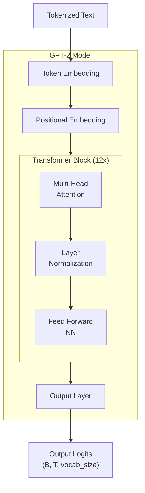

# Give me 90 minutes, I will make Transformer click forever

## **Chapter 1: The Big Picture & Our Blueprint**

You've likely used ChatGPT or a similar large language model. You type a question, and a coherent, well-written answer appears. It feels like magic. It can write poetry, debug code, and explain complex topics. But what if I told you that the core engine behind this apparent intelligence is not some unknowable black box?

What if I told you... this is the entire secret?

```python
# gpt2_min.py
import math
from dataclasses import dataclass
import torch
import torch.nn as nn
import torch.nn.functional as F

@dataclass
class GPTConfig:
    vocab_size: int
    block_size: int
    n_layer: int = 12
    n_head: int = 12
    n_embd: int = 768
    dropout: float = 0.1

class CausalSelfAttention(nn.Module):
    def __init__(self, config: GPTConfig):
        super().__init__()
        assert config.n_embd % config.n_head == 0
        self.n_head, self.n_embd = config.n_head, config.n_embd
        self.c_attn = nn.Linear(config.n_embd, 3 * config.n_embd)
        self.c_proj = nn.Linear(config.n_embd, config.n_embd)
        self.resid_drop = nn.Dropout(config.dropout)
        self.register_buffer("bias", torch.tril(torch.ones(config.block_size, config.block_size)).view(1, 1, config.block_size, config.block_size))
    def forward(self, x):
        B, T, C = x.size()
        qkv = self.c_attn(x)
        q, k, v = qkv.split(self.n_embd, dim=2)
        head_dim = C // self.n_head
        q = q.view(B, T, self.n_head, head_dim).transpose(1, 2)
        k = k.view(B, T, self.n_head, head_dim).transpose(1, 2)
        v = v.view(B, T, self.n_head, head_dim).transpose(1, 2)
        att = (q @ k.transpose(-2, -1)) * (1.0 / math.sqrt(head_dim))
        att = att.masked_fill(self.bias[:, :, :T, :T] == 0, float("-inf"))
        att = F.softmax(att, dim=-1)
        y = att @ v
        y = y.transpose(1, 2).contiguous().view(B, T, C)
        return self.resid_drop(self.c_proj(y))

class MLP(nn.Module):
    def __init__(self, config: GPTConfig):
        super().__init__()
        self.fc = nn.Linear(config.n_embd, 4 * config.n_embd)
        self.proj = nn.Linear(4 * config.n_embd, config.n_embd)
        self.drop = nn.Dropout(config.dropout)
    def forward(self, x):
        return self.drop(self.proj(F.gelu(self.fc(x))))

class Block(nn.Module):
    def __init__(self, config: GPTConfig):
        super().__init__()
        self.ln_1 = nn.LayerNorm(config.n_embd)
        self.attn = CausalSelfAttention(config)
        self.ln_2 = nn.LayerNorm(config.n_embd)
        self.mlp = MLP(config)
    def forward(self, x):
        x = x + self.attn(self.ln_1(x))
        x = x + self.mlp(self.ln_2(x))
        return x

class GPT2(nn.Module):
    def __init__(self, config: GPTConfig):
        super().__init__()
        self.config = config
        self.wte = nn.Embedding(config.vocab_size, config.n_embd)
        self.wpe = nn.Embedding(config.block_size, config.n_embd)
        self.drop = nn.Dropout(config.dropout)
        self.h = nn.ModuleList([Block(config) for _ in range(config.n_layer)])
        self.ln_f = nn.LayerNorm(config.n_embd)
        self.lm_head = nn.Linear(config.n_embd, config.vocab_size, bias=False)
        self.lm_head.weight = self.wte.weight
    def forward(self, idx, targets=None):
        B, T = idx.size()
        pos = torch.arange(0, T, dtype=torch.long, device=idx.device).unsqueeze(0)
        x = self.wte(idx) + self.wpe(pos)
        x = self.drop(x)
        for block in self.h:
            x = block(x)
        x = self.ln_f(x)
        logits = self.lm_head(x)
        loss = F.cross_entropy(logits.view(-1, logits.size(-1)), targets.view(-1)) if targets is not None else None
        return logits, loss
```

That's it. These ~80 lines of Python and PyTorch contain all the fundamental architectural principles of a multi-billion dollar model like ChatGPT. There is no hidden magic.

In this tutorial, we are going to go through this file, line by line. You will understand not only **what** each line does, but **why** it's there—the core intuition behind it. By the end, the magic will dissolve into understandable, elegant engineering.

#### Our Promise and Roadmap

Our promise is simple: in the next 90 minutes, the Transformer will click for you forever. Our journey will follow this exact architecture:



This diagram is our roadmap.
1.  **Input:** We start at the bottom with our "Tokenized Text".
2.  **Embeddings:** We will first build the "Token Embedding" and "Positional Embedding" layers, which turn words and their positions into vectors.
3.  **The Core Engine:** We will then build the "Transformer Block". This is the heart of the model, containing "Multi-Head Attention" and a "Feed Forward NN". As the "12 X" indicates, the model's power comes from stacking these blocks repeatedly.
4.  **Output:** Finally, we will build the "Output Layer" that converts the final processed vectors back into a prediction.

The most important component we will build is the **Causal Self-Attention** mechanism, which follows this formula:
$$ \text{Attention}(Q, K, V) = \text{softmax}\left(\frac{QK^T}{\sqrt{d_k}} + M\right)V $$
Don't worry if this looks intimidating. We will build up to it slowly until it becomes second nature.

#### Our Blueprint: The `GPTConfig`

Every construction project starts with a blueprint. For our model, that blueprint is the `GPTConfig` class. It's a simple container that holds all the key architectural parameters.

```python
@dataclass
class GPTConfig:
    vocab_size: int
    block_size: int         # max sequence length (context window)
    n_layer: int = 12       # Number of Transformer Blocks to stack
    n_head: int = 12        # Number of attention "heads"
    n_embd: int = 768       # The dimensionality of our vectors
    dropout: float = 0.1
```
These are the knobs you can turn to change the size and power of the model.

| Parameter | What it Controls | Intuition | Real GPT-2 (Small) Value |
| :--- | :--- | :--- | :--- |
| `vocab_size` | Vocabulary Size | How many unique words/tokens the model knows. | 50257 |
| `block_size` | Context Window | The maximum number of tokens the model can look at simultaneously. | 1024 |
| `n_layer` | Model **Depth** | The number of `Block`s stacked on top of each other. More layers = more powerful. | 12 |
| `n_head` | Model **Width** | The number of parallel "conversations" attention can have. More heads = more perspectives. | 12 |
| `n_embd` | Embedding Dimension | The "size" of the vectors representing each token. | 768 |

By simply changing these numbers, you can create a tiny, toy model or the full-scale GPT-2. The underlying code for the architecture remains exactly the same.

With our blueprint in hand, we're ready to lay the first brick. In the next chapter, we will build the embedding layers that turn simple numbers into the rich vectors our model can understand.

## **Chapter 2: The Word-Vector Dictionary: Token Embeddings**

Our journey begins with the first functional layer. We must convert the raw input—a sequence of token IDs—into something a neural network can process.

Let's look at our blueprint and pinpoint the component we're building.
```python
class GPT2(nn.Module):
    def __init__(self, config):
        # We are building THIS line now.
        self.wte = nn.Embedding(config.vocab_size, config.n_embd) # Word Token Embedding
        self.wpe = nn.Embedding(...) # (Next chapter)

        # The rest of the model
        self.h = nn.ModuleList(...)
        self.ln_f = nn.LayerNorm(...)
        self.lm_head = nn.Linear(...)
```
#### The Input Problem: Meaningless Numbers

The input to our model is a tensor of token IDs, like `torch.tensor([[5, 21]])`. These are categorical numbers. The ID `21` doesn't have 4.2 times the "value" of ID `5`. The numerical distance between them is arbitrary and meaningless. A neural network, which relies on matrix multiplication and gradient descent, cannot learn from these raw IDs. They are just pointers.

#### The Goal: Mapping Words to a "Semantic Space"

Our goal is to create a learnable representation for each token. We want to map each token ID to a vector—a point in a high-dimensional space. The key idea is that the *location* of these points should be meaningful.

**Analogy: A Color Space.** Imagine we want to represent colors.
*   **Bad way (Categorical ID):** `{"red": 1, "orange": 2, "blue": 8}`. The number `8` for "blue" has no relation to `1` for "red".
*   **Good way (Vector/Coordinate):** Represent colors in a 2D space where the `x-axis` is "redness" and the `y-axis` is "blueness".
    *   `red` might be `(0.9, 0.1)`
    *   `orange` might be `(0.8, 0.2)` (close to red!)
    *   `blue` might be `(0.1, 0.9)` (far from red!)

Now, the distance between points is meaningful! We are going to do the same thing, but for words, in a space with `n_embd` (e.g., 768) dimensions.

#### The Mechanism: A Learnable Coordinate Book

The `nn.Embedding` layer is this coordinate book. It is a simple lookup table stored as a single weight matrix. Let's build it and inspect its contents.

```python
import torch
import torch.nn as nn

# A tiny config for our example
vocab_size = 10
n_embd = 3 # The number of dimensions in our "semantic space"

# The layer is our coordinate book
token_embedding_table = nn.Embedding(vocab_size, n_embd)

# The book itself is the `.weight` attribute. Each row is a word's coordinate.
print("Shape of our coordinate book:", token_embedding_table.weight.shape)
print("Content of the book (initially random coordinates):")
print(token_embedding_table.weight)
```
**Output:**
```
Shape of our coordinate book: torch.Size([10, 3])
Content of the book (initially random coordinates):
Parameter containing:
tensor([[-0.2185, -0.2291, -0.5435],  # Coordinate for token 0
        [ 0.6508,  0.4734, -0.4439],  # Coordinate for token 1
        [-0.3129,  1.6141,  0.2889],  # Coordinate for token 2
        ...
        [-1.0223, -0.2543, -0.3288]], # Coordinate for token 9
       requires_grad=True)
```
This is the core. We have a `(vocab_size, n_embd)` matrix. The `requires_grad=True` part is crucial: it means that during training, the model will learn the best possible coordinates for each word to minimize its prediction error.

#### The Power and The Insufficiency

Let's see the lookup in action and then discuss what this new representation gives us, and what it lacks.

```python
B, T = 2, 4 # Batch, Time
idx = torch.randint(0, vocab_size, (B, T)) # A batch of token ID sequences

# --- The Lookup ---
# For each ID in `idx`, we retrieve its coordinate vector from the table
tok_emb = token_embedding_table(idx)

print("Input IDs shape:", idx.shape)
print("Output Vectors (Coordinates) shape:", tok_emb.shape)
```
**Output:**
```
Input IDs shape: torch.Size([2, 4])
Output Vectors (Coordinates) shape: torch.Size([2, 4, 3])
```
We transformed our `(B, T)` integer tensor into a `(B, T, n_embd)` float tensor.

**So what have we gained?**
We now have a **context-free representation** of each word. During training, the model learns to place words with similar meanings near each other. This is what enables the famous analogy `vector('King') - vector('Man') + vector('Woman') ≈ vector('Queen')`. The vector for 'King' captures a concept of "maleness" and "royalty" that can be manipulated mathematically.

**But what is the insufficiency?**
This representation has one massive flaw: it is **static and context-free**. The vector for the word "bank" is identical in these two sentences:
1.  "I sat on the river **bank**."
2.  "I withdrew money from the **bank**."

The lookup table gives us a powerful starting point, but it's just a dictionary. It doesn't know anything about the words surrounding it.

This is the central problem the Transformer architecture is designed to solve. **How can a token's vector representation be dynamically adjusted based on its context?**

To even begin to answer that, we first need to give the model a sense of order. That is the subject of the next chapter: Positional Embeddings.


## **Chapter 3: Giving the Model a Sense of Order: Positional Embeddings**

In the last chapter, we created a "dictionary" that maps each word to a context-free vector. This vector represents the word's general meaning. However, our model still sees the input as just a collection—a "bag"—of these vectors. It has no idea about their order.

Language is all about order. "Dog bites man" is not the same as "Man bites dog." We must provide this crucial ordering information to the model.

Let's locate our next component in the blueprint.

```python
class GPT2(nn.Module):
    def __init__(self, config):
        self.wte = nn.Embedding(...) # (Done)

        # We are building THIS line now.
        self.wpe = nn.Embedding(config.block_size, config.n_embd) # Positional Embedding

        self.h = nn.ModuleList(...)
        self.ln_f = nn.LayerNorm(...)
        self.lm_head = nn.Linear(...)
```

#### The Problem: A Bag of Words

Our current output is a tensor of shape `(B, T, C)`, where `C` is `n_embd`. For a sequence like `["Man", "bites", "dog"]`, the model receives a set of three vectors: `{vector("Man"), vector("bites"), vector("dog")}`. If we shuffled the input, the model would receive the exact same set of vectors, just in a different order along the `T` dimension. The core processing layers (the Transformer blocks) are designed to be order-invariant, so without modification, they would produce the same result.

We need to explicitly "stamp" each token's vector with its position.

#### The Solution: A Learnable "Position Vector"

The solution used in GPT is wonderfully simple. Just as we learned a unique vector for each *word*, we will also learn a unique vector for each *position*.

*   We'll have a vector that means "I am at the 1st position."
*   We'll have another vector that means "I am at the 2nd position."
*   ...and so on, up to the maximum sequence length (`block_size`).

This is another `nn.Embedding` layer, but this time it's a lookup table for positions, not words. Its "vocabulary size" is the `block_size`. We then add this position vector to the corresponding token vector.

**Why does adding them work?**
Because the token and positional embeddings exist in the same high-dimensional space, the model can learn to interpret the combined vector. During training, it learns to create positional vectors such that adding `vector(pos=N)` to `vector(word=W)` produces a unique representation that distinguishes it from the same word at a different position. The network learns to "understand" this composition.

#### The Code: Building and Combining

Let's implement this. The key is to generate a sequence of position indices `(0, 1, 2, ...)` and use those to look up the positional vectors.

```python
import torch
import torch.nn as nn

# --- Our Config ---
B, T, C = 2, 5, 3  # Batch, Time (sequence length), Channels (n_embd)
vocab_size = 10
block_size = 8     # Our model's max sequence length is 8

# --- The Layers ---
token_embedding_table = nn.Embedding(vocab_size, C)
position_embedding_table = nn.Embedding(block_size, C)

# --- The Input Data ---
idx = torch.randint(0, vocab_size, (B, T)) # Shape (2, 5)

# --- Step 1: Get Token Embeddings (as before) ---
tok_emb = token_embedding_table(idx) # Shape (B, T, C) -> (2, 5, 3)

# --- Step 2: Get Positional Embeddings ---
# Note: Our input sequence length T=5, but block_size=8. This is fine.
# We just need the positions for our current sequence.
pos = torch.arange(0, T, dtype=torch.long) # Shape (T) -> tensor([0, 1, 2, 3, 4])
pos_emb = position_embedding_table(pos) # Shape (T, C) -> (5, 3)

# --- Step 3: Combine them via addition ---
# (B, T, C) + (T, C) --(broadcasts)--> (B, T, C)
x = tok_emb + pos_emb
print("Shape of token embeddings:", tok_emb.shape)
print("Shape of positional embeddings:", pos_emb.shape)
print("Shape of final combined embeddings:", x.shape)
```

**Output:**
```
Shape of token embeddings: torch.Size([2, 5, 3])
Shape of positional embeddings: torch.Size([5, 3])
Shape of final combined embeddings: torch.Size([2, 5, 3])
```

**Answering a key question: What if the input sequence is shorter than `block_size`?**
This is the normal case! As you see above, our `block_size` is `8`, but our input sequence length `T` is only `5`. The code `torch.arange(0, T, ...)` handles this perfectly. We only generate and look up the positional embeddings for the sequence length we are currently processing. We never use the full `block_size` unless our input is that long.

We have now prepared the input for the main event. Our tensor `x` contains vectors that are aware of both the token's identity and its absolute position in the sequence.

This is the input that will flow into the stack of Transformer blocks. It's time to build the heart of the machine: Self-Attention.

## **Chapter 4: The Heart of the Transformer: Self-Attention Intuition**

In the last chapter, we established that our model gives the same starting vector to a word regardless of its context. This is a problem for ambiguous words. To make this crystal clear, we'll use simplified sentences.

**The Problem:** Consider the word "**crane**".
1.  "**Crane** ate fish." (crane = a bird)
2.  "**Crane** lifted steel." (crane = a machine)

The initial vector for "crane" is identical in both sentences. Self-attention must update this vector based on the neighbors (`ate` vs. `lifted`) to resolve the ambiguity.

Let's see how this works using the attention formula as our map:
$$ \text{Attention}(Q, K, V) = \text{softmax}\left(\frac{QK^T}{\sqrt{d_k}}\right)V $$

#### The Q, K, and V Vector Spaces

Before we jump in, let's clarify what Q, K, and V represent.
*   **Query (Q) and Key (K) Space:** Think of this as the "matching" or "searching" space. Q is the probe, K is the label. They **must** have the same number of dimensions so we can compute their dot product to get a similarity score.
*   **Value (V) Space:** Think of this as the "information" or "payload" space. This is the actual substance that gets passed along once a match is found. In our GPT-2 architecture, we set `d_v = d_k = C/n_head` for simplicity. Note that architecturally, `d_v` doesn't have to equal `d_k` - what matters is that after concatenating all heads, the total dimension equals `C` (i.e., `n_head * d_v = C`), ensuring the output has the same dimensions as the input for residual connections.

This raises a crucial question: **We already have an input vector `x` for each token. Why do we need to create a separate Value (`V`) vector? Isn't `x` already the 'information'?**

The answer is that the raw information is not always the best information to share. The `V` vector is a *transformed* version of `x`, specifically packaged for other tokens to consume.

Let's use an analogy. Imagine a token is a professional at a conference.

| Aspect | Input Vector (`x`) | Value Vector (`V`) |
| :--- | :--- | :--- |
| **Role** | Raw, Complete Information | Packaged, Consumable Information |
| **Analogy**| Your entire knowledge & resume | Your prepared "elevator pitch" |
| **Purpose**| The starting point for computation | The payload to be aggregated by other tokens |
| **How it's Made**| Output of embedding layers | A **learned transformation** of `x` (`V = x @ W_v`) |

The model *learns* the best "elevator pitch" (`V`) for each word. This gives it the flexibility to emphasize or de-emphasize parts of its raw knowledge (`x`) to be most helpful to its neighbors.

Now, let's proceed with our example. We'll use a 2D space where the dimensions are dead simple:
*   **Dimension 1:** Represents "Is it an **Animal**?"
*   **Dimension 2:** Represents "Is it a **Machine**?"

The ambiguous word "crane" will have vectors balanced between these possibilities.

| Token | Q - "I'm looking for..." | K - "I am..." | V - "I offer this info..." |
| :--- | :--- | :--- | :--- |
| **ate** | ... | `[0.9, 0.1]` (High Animal) | `[0.9, 0.1]` |
| **fish** | ... | `[0.9, 0.1]` (High Animal) | `[0.8, 0.2]` |
| **lifted** | ... | `[0.1, 0.9]` (High Machine)| `[0.1, 0.9]` |
| **steel** | ... | `[0.1, 0.9]` (High Machine)| `[0.2, 0.8]` |
| **crane** | **`[0.7, 0.7]`** | **`[0.7, 0.7]`** | **`[0.5, 0.5]`** (Ambiguous)|

---
**Sentence 1: "Crane ate fish"**

**1. Scoring (`QK^T`):** The `crane` token uses its query `[0.7, 0.7]` to probe all keys in the sentence.
*   **Score(`crane` -> `crane`):** `[0.7, 0.7] ⋅ [0.7, 0.7]` = 0.49 + 0.49 = **0.98**
*   **Score(`crane` -> `ate`):**   `[0.7, 0.7] ⋅ [0.9, 0.1]` = 0.63 + 0.07 = **0.70**
*   **Score(`crane` -> `fish`):**  `[0.7, 0.7] ⋅ [0.9, 0.1]` = 0.63 + 0.07 = **0.70**

**2. Normalizing (`softmax`):** The raw scores `[0.98, 0.70, 0.70]` are converted to percentages.
*   Attention Weights: `[0.4, 0.3, 0.3]`
    *This means `crane` will construct its new self by listening 40% to its original self, 30% to `ate`, and 30% to `fish`.*

**3. Aggregating (`...V`):** The new vector for `crane` is a weighted sum of the **Values**.
*   `New_Vector(crane)` = `0.4*V(crane)` + `0.3*V(ate)` + `0.3*V(fish)`
*   `New_Vector(crane)` = `0.4*[0.5, 0.5]` + `0.3*[0.9, 0.1]` + `0.3*[0.8, 0.2]`
*   `New_Vector(crane)` = `[0.20, 0.20]` + `[0.27, 0.03]` + `[0.24, 0.06]` = **`[0.71, 0.29]`**

The result is a new "crane" vector that is heavily skewed towards **Dimension 1 (Animal)**. The context from `ate` and `fish` has resolved the ambiguity. It's a bird.

---
**Sentence 2: "Crane lifted steel"**

**1. Scoring (`QK^T`):** `crane` uses the *exact same query* `[0.7, 0.7]` on its new neighbors.
*   **Score(`crane` -> `crane`):** `[0.7, 0.7] ⋅ [0.7, 0.7]` = **0.98**
*   **Score(`crane` -> `lifted`):** `[0.7, 0.7] ⋅ [0.1, 0.9]` = 0.07 + 0.63 = **0.70**
*   **Score(`crane` -> `steel`):** `[0.7, 0.7] ⋅ [0.1, 0.9]` = 0.07 + 0.63 = **0.70**

**2. Normalizing (`softmax`):** The raw scores `[0.98, 0.70, 0.70]` are identical to before.
*   Attention Weights: `[0.4, 0.3, 0.3]`
    *The percentages are the same, but they now apply to a different set of tokens!*

**3. Aggregating (`...V`):**
*   `New_Vector(crane)` = `0.4*V(crane)` + `0.3*V(lifted)` + `0.3*V(steel)`
*   `New_Vector(crane)` = `0.4*[0.5, 0.5]` + `0.3*[0.1, 0.9]` + `0.3*[0.2, 0.8]`
*   `New_Vector(crane)` = `[0.20, 0.20]` + `[0.03, 0.27]` + `[0.06, 0.24]` = **`[0.29, 0.71]`**

The result is a vector now heavily skewed towards **Dimension 2 (Machine)**. The exact same initial "crane" vector has been transformed into a completely different, context-aware vector because it listened to different dominant neighbors.

This is the power of self-attention. Now that the intuition is solid, we can finally implement it with matrices.


## **Chapter 5: Implementing Scaled Dot-Product Attention**

We've built the intuition for self-attention. Now, we will translate that exact process into matrix operations using PyTorch. By the end of this chapter, you will have implemented the core attention formula and encapsulated it into a reusable `nn.Module`.

Our map for this chapter is the formula itself:
$$ \text{Attention}(Q, K, V) = \text{softmax}\left(\frac{QK^T}{\sqrt{d_k}}\right)V $$

First, we will build this with raw tensors to see every number. Then, we will put that logic inside our official `CausalSelfAttention` class.

#### Part 1: The Raw Tensor Walkthrough

Let's use a simple sentence: "**A crane ate fish**". We now have 4 tokens (`T=4`) and our toy embedding dimension is 2 (`C=2`). We'll process one sentence at a time (`B=1`).

**The Input (`x`): Raw, Context-Free Embeddings**
This is the tensor from our embedding layers. Dim1="Object-like", Dim2="Action-like".

```python
import torch
import torch.nn as nn
import torch.nn.functional as F
import math
from dataclasses import dataclass

B, T, C = 1, 4, 2  # Batch, Time (sequence length), Channels (embedding dim)
x = torch.tensor([
    [[0.1, 0.1],   # A
     [1.0, 0.2],   # crane (mostly object, slightly action)
     [0.1, 0.9],   # ate (mostly action)
     [0.8, 0.0]]   # fish (purely object)
]).float()
```

**Step 1: Projecting `x` into Q, K, and V**
To get our Query, Key, and Value vectors, we use **learnable** linear transformations. These `nn.Linear` layers are the "brains" of the operation; their weights are updated during training. For this tutorial, we will set them manually to see the logic clearly.

```python
# The learnable components
q_proj = nn.Linear(C, C, bias=False)
k_proj = nn.Linear(C, C, bias=False)
v_proj = nn.Linear(C, C, bias=False)

# Manually set weights for this tutorial
torch.manual_seed(42)
q_proj.weight.data = torch.randn(C, C)
k_proj.weight.data = torch.randn(C, C)
v_proj.weight.data = torch.randn(C, C)

# --- Perform the projections ---
q = q_proj(x)
k = k_proj(x)
v = v_proj(x)
```
Let's track our tensor shapes and their meaning.

| Variable | Shape `(B, T, C)` | Meaning |
| :--- | :--- | :--- |
| `x` | `(1, 4, 2)` | The batch of raw input vectors. |
| `q` | `(1, 4, 2)` | The "Query" vector for each of the 4 tokens. |
| `k` | `(1, 4, 2)` | The "Key" vector for each of the 4 tokens. |
| `v` | `(1, 4, 2)` | The "Value" vector for each of the 4 tokens. |

**Step 2: Calculate Attention Scores (`q @ k.transpose`)**
This is the core of the communication. We need to compute the dot product of every token's query with every other token's key. We can do this with a single, efficient matrix multiplication.

*   `q` has shape `(1, 4, 2)`.
*   `k` has shape `(1, 4, 2)`.
*   To multiply them, we need to make their inner dimensions match. We use `.transpose(-2, -1)` to swap the last two dimensions of `k`.
*   `k.transpose(-2, -1)` results in a shape of `(1, 2, 4)`.
*   The multiplication is `(1, 4, 2) @ (1, 2, 4)`, which results in a `(1, 4, 4)` matrix.

```python
# --- Score Calculation ---
scores = q @ k.transpose(-2, -1)

print("--- Raw Scores (Attention Matrix) ---")
print(scores.shape)
print(scores)
```
**Output:**
```
--- Raw Scores (Attention Matrix) ---
torch.Size([1, 4, 4])
tensor([[[ 0.0531,  0.4137,  0.1802,  0.2721],   # "A" scores for (A, crane, ate, fish)
         [ 0.1782,  1.3888,  0.6053,  0.9101],   # "crane" scores for (A, crane, ate, fish)
         [ 0.0618,  0.4815,  0.2098,  0.3151],   # "ate" scores for (A, crane, ate, fish)
         [ 0.1260,  0.9822,  0.4280,  0.6433]]])  # "fish" scores for (A, crane, ate, fish)
```
This `(4, 4)` matrix holds the raw compatibility scores. For example, the query for "crane" (row 1) has the highest compatibility with the key for "crane" (column 1), which is `1.3888`.

**Step 3 & 4: Scale and Softmax**
We scale the scores for stability, then use `softmax` to turn them into attention weights that sum to 1 for each row.

```python
d_k = k.size(-1)
scaled_scores = scores / math.sqrt(d_k)
attention_weights = F.softmax(scaled_scores, dim=-1) # Softmax along the rows
```

**Step 5: Aggregate the Values (`attention_weights @ v`)**
Now we use our weights to create a weighted average of the `Value` vectors.
*   `attention_weights` has shape `(1, 4, 4)`.
*   `v` has shape `(1, 4, 2)`.
*   The multiplication `(1, 4, 4) @ (1, 4, 2)` produces a final tensor of shape `(1, 4, 2)`.

```python
# --- Value Aggregation ---
output = attention_weights @ v

print("\n--- Final Output (Context-Aware Vectors) ---")
print(output.shape)
print(output)
```
**Output:**
```
--- Final Output (Context-Aware Vectors) ---
torch.Size([1, 4, 2])
tensor([[[ 0.0652, -0.1691],
         [ 0.1147, -0.2974],
         [ 0.0768, -0.1991],
         [ 0.1005, -0.2607]]])
```

Here is a summary of the tensor transformations:

| Step | Operation | Input Shapes | Output Shape `(B, T, ...)` | Meaning |
| :--- | :--- | :--- | :--- | :--- |
| 1 | `q_proj(x)` etc. | `(1, 4, 2)` | `(1, 4, 2)` | Create Q, K, V for each token |
| 2 | `q @ k.T` | `(1, 4, 2)` & `(1, 2, 4)` | `(1, 4, 4)` | Raw compatibility scores |
| 3 | `/ sqrt(d_k)` | `(1, 4, 4)` | `(1, 4, 4)` | Stabilized scores |
| 4 | `softmax` | `(1, 4, 4)` | `(1, 4, 4)` | Attention probabilities |
| 5 | `att @ v` | `(1, 4, 4)` & `(1, 4, 2)` | `(1, 4, 2)` | Context-aware output vectors|

Success! We have taken our raw input `x` and produced a new tensor `output` of the exact same shape, where each token's vector has been updated with information from its neighbors.

#### Part 2: Encapsulating the Logic in an `nn.Module`

The raw tensor walkthrough is fantastic for understanding the mechanics. In practice, we package this logic into a reusable class. This makes our code clean, organized, and easy to integrate into a larger model.

Here is the complete, encapsulated code for a single attention head. By the end of this section, every single line will be crystal clear.

```python
# The final, reusable PyTorch module
class SingleHeadSelfAttention(nn.Module):
    def __init__(self, config):
        """
        Initializes the layers needed for self-attention.
        """
        super().__init__()
        # The single, fused linear layer for Q, K, V
        self.c_attn = nn.Linear(config.n_embd, 3 * config.n_embd, bias=False)

    def forward(self, x):
        """
        Defines the data flow through the module.
        Input x shape: (B, T, C)
        """
        B, T, C = x.size()

        # 1. Get Q, K, V from a single projection and split them
        qkv = self.c_attn(x)
        q, k, v = qkv.split(C, dim=2)
        
        # 2. Calculate attention weights
        # (B, T, C) @ (B, C, T) -> (B, T, T)
        scaled_scores = (q @ k.transpose(-2, -1)) / math.sqrt(k.size(-1))
        attention_weights = F.softmax(scaled_scores, dim=-1)
        
        # 3. Aggregate values
        # (B, T, T) @ (B, T, C) -> (B, T, C)
        output = attention_weights @ v
        
        return output
```

Now, let's break down how this elegant code achieves the exact same result as our manual, step-by-step process.

**The `__init__` Method: The Fused Linear Layer**

The `__init__` method sets up the building blocks. Here, we only need one.

```python
self.c_attn = nn.Linear(config.n_embd, 3 * config.n_embd, bias=False)
```

In our manual walkthrough, we used three separate `nn.Linear` layers. This single line is a common and highly efficient optimization that achieves the same goal.

| Our Manual Walkthrough (Conceptually Clear) | Fused Layer (Computationally Efficient) |
| :--- | :--- |
| `q_proj = nn.Linear(C, C)` | |
| `k_proj = nn.Linear(C, C)` | `c_attn = nn.Linear(C, 3*C)` |
| `v_proj = nn.Linear(C, C)` | |

Instead of three smaller matrix multiplications, the GPU can perform one larger, faster matrix multiplication. The `bias=False` argument is a common simplification used in minimal implementations like NanoGPT. Note that the original GPT-2 implementation does include biases in its linear projections.

**The `forward` Method: From Fused to Final Output**

The `forward` method is the heart of the module, defining the data's journey.

**1. Projection and Splitting**
```python
qkv = self.c_attn(x)
q, k, v = qkv.split(C, dim=2)
```
*   `self.c_attn(x)`: We pass our input `x` (shape `B, T, C`) through the fused layer, resulting in a `qkv` tensor of shape `(B, T, 3*C)`.
*   `qkv.split(C, dim=2)`: This is the clever part. The `.split()` function carves up the tensor. We tell it: "Along dimension 2 (the last dimension), create chunks of size `C`." Since the total dimension is `3*C`, this gives us exactly three tensors, each with the desired shape of `(B, T, C)`, which we assign to `q`, `k`, and `v`.

**2. Calculating Attention Weights**
```python
scaled_scores = (q @ k.transpose(-2, -1)) / math.sqrt(k.size(-1))
attention_weights = F.softmax(scaled_scores, dim=-1)
```
This is a direct, one-to-one implementation of the mathematical formula.
*   `k.transpose(-2, -1)` swaps the `T` and `C` dimensions of the Key tensor to prepare for matrix multiplication.
*   `q @ ...` performs the dot product, resulting in the raw score matrix of shape `(B, T, T)`.
*   `/ math.sqrt(k.size(-1))` performs the scaling for stability.
*   `F.softmax(...)` converts the raw scores into a probability distribution along each row.

**3. Aggregating Values**
```python
output = attention_weights @ v
```
Finally, we perform the last matrix multiplication. The attention weights `(B, T, T)` are multiplied with the Value vectors `(B, T, C)`, resulting in our final output tensor of shape `(B, T, C)`.

**Proof of Equivalence**

To prove this class is identical to our manual work, we can instantiate it and manually load the weights from our `q_proj`, `k_proj`, and `v_proj` layers into the single `c_attn` layer.

```python
# Let's verify the logic
@dataclass
class GPTConfig: n_embd: int
model = SingleHeadSelfAttention(GPTConfig(n_embd=C))

# The c_attn layer's weight matrix is shape (3*C, C). Our separate weights
# are each (C, C). We concatenate them along dim=0 to get (3*C, C).
model.c_attn.weight.data = torch.cat(
    [q_proj.weight.data, k_proj.weight.data, v_proj.weight.data], dim=0
)

# Run the model
model_output = model(x)

# 'output' is the tensor from our manual walkthrough in Part 1
print("Are the outputs the same?", torch.allclose(output, model_output))
```
**Output:**
```
Are the outputs the same? True
```
It works perfectly. We have successfully implemented the core of self-attention and formalized it in a clean, reusable module.

However, our model has a flaw for language generation: tokens can see into the future. Our current attention matrix allows this. We will fix this next by adding a causal mask.

## **Chapter 6: Don't Look Ahead! Implementing the Causal Mask**

We have built a powerful attention mechanism that allows tokens to communicate. However, it has a critical flaw for our purpose: it's a time-traveler.

**The Problem: Cheating by Looking at the Future**

GPT is an **autoregressive** model, meaning it generates text one token at a time. When it's trying to predict the next word in the sentence "A crane ate...", its decision should be based *only* on the tokens it has seen so far: "A", "crane", and "ate". It cannot be allowed to see the actual answer, "fish".

Let's look at the attention weight matrix we calculated in the last chapter:

```
# From Chapter 5
tensor([[[0.37, 0.32, 0.31, ...],  # "A" attends to all 4 tokens
         [0.31, 0.37, 0.32, ...],  # "crane" attends to all 4 tokens
         [0.36, 0.31, 0.33, ...],  # "ate" attends to all 4 tokens
         ...                      # "fish" attends to all 4 tokens
        ]]])
```
This is a problem. The token "A" (at position 0) is gathering information from "crane" (position 1), "ate" (position 2), and "fish" (position 3). When predicting the word that comes after "A", this is cheating.

A token at position `t` must only be allowed to communicate with tokens at positions `0, 1, ..., t`. It cannot see tokens at `t+1, t+2, ...`.

**The Solution: The Causal Mask**

The solution is elegant. We will modify the attention score matrix *before* applying the softmax function. We will "mask out" all the future positions by setting their scores to negative infinity (`-inf`).

Why `-inf`? Because the `softmax` function involves an exponential: `e^x / sum(e^x)`. The exponential of negative infinity, `e^-inf`, is effectively zero. This forces the attention weights for all future tokens to become `0`, preventing any information flow.

#### Part 1: The Raw Tensor Walkthrough

Let's pick up exactly where we left off, with our `scaled_scores` matrix from Chapter 5.

```python
# This is the scaled_scores tensor from the end of the last chapter
# Shape (B, T, T) -> (1, 4, 4)
scaled_scores = torch.tensor([[
    [ 0.0375,  0.2925,  0.1274,  0.1924],
    [ 0.1260,  0.9822,  0.4280,  0.6433],
    [ 0.0437,  0.3405,  0.1484,  0.2228],
    [ 0.0891,  0.6945,  0.3023,  0.4549]
]])
```

**Step 1: Create the Mask**
We need a mask that allows a token to see itself and the past, but not the future. A lower-triangular matrix is perfect for this. We can create one easily with `torch.tril`.

```python
# T=4 for our sentence "A crane ate fish"
T = 4
mask = torch.tril(torch.ones(T, T))
print("--- The Mask ---")
print(mask)
```
**Output:**
```
--- The Mask ---
tensor([[1., 0., 0., 0.],
        [1., 1., 0., 0.],
        [1., 1., 1., 0.],
        [1., 1., 1., 1.]])
```
Look at the rows.
*   Row 0 ("A") can only see column 0 ("A").
*   Row 1 ("crane") can see column 0 ("A") and 1 ("crane").
*   And so on. The zeros in the upper-right triangle represent the "future" connections that we must block.

**Step 2: Apply the Mask**
We use the PyTorch function `masked_fill` to apply our mask. This function will replace all values in `scaled_scores` with `-inf` wherever the corresponding position in our `mask` is `0`.

```python
masked_scores = scaled_scores.masked_fill(mask == 0, float('-inf'))
print("\n--- Scores After Masking ---")
print(masked_scores)
```
**Output:**
```
--- Scores After Masking ---
tensor([[[ 0.0375,    -inf,    -inf,    -inf],
         [ 0.1260,  0.9822,    -inf,    -inf],
         [ 0.0437,  0.3405,  0.1484,    -inf],
         [ 0.0891,  0.6945,  0.3023,  0.4549]]])
```
Perfect! All the scores corresponding to future positions have been replaced.

**Step 3: Re-run Softmax**
Now, let's apply softmax to these masked scores and see the result.

```python
attention_weights = F.softmax(masked_scores, dim=-1)
print("\n--- Final Causal Attention Weights ---")
print(attention_weights.data.round(decimals=2))
```
**Output:**
```
--- Final Causal Attention Weights ---
tensor([[[1.0000, 0.0000, 0.0000, 0.0000],
         [0.2995, 0.7005, 0.0000, 0.0000],
         [0.3129, 0.3807, 0.3064, 0.0000],
         [0.2186, 0.3999, 0.2445, 0.1370]]])
```
This is the "Aha!" moment. The upper-right triangle of our attention matrix is now all zeros.
*   "A" can only attend to itself (100%).
*   "crane" attends to "A" (30%) and "crane" (70%).
*   "ate" attends to "A", "crane", and "ate".
Information can now only flow from the past to the present.

| Attention Type | "crane" attends to "fish"? | "ate" attends to "fish"? |
| :--- | :--- | :--- |
| Unmasked (Ch 5) | Yes | Yes |
| **Causal (Ch 6)** | **No (0%)** | **No (0%)** |

#### Part 2: Encapsulating in the `nn.Module`

Now, let's add this logic to our `CausalSelfAttention` class from the `gpt2_min.py` file.

**The `__init__` Method: `register_buffer`**
We need to store our mask as part of the module. We use `register_buffer` for this.

```python
class CausalSelfAttention(nn.Module):
    def __init__(self, config):
        super().__init__()
        # ... (c_attn layer from before)

        # We register the mask as a "buffer"
        self.register_buffer(
            "bias", # name of the buffer
            torch.tril(torch.ones(config.block_size, config.block_size))
            .view(1, 1, config.block_size, config.block_size)
        )
```

**Why `register_buffer`?** A buffer is a tensor that is part of the model's state (like weights), so it gets moved to the GPU with `.to(device)`. However, it is **not** a parameter that gets updated by the optimizer during training. This is perfect for our fixed causal mask.

The `.view(1, 1, ...)` part is to add extra dimensions for broadcasting, which will be essential when we add Multi-Head Attention in the next chapter.

**The `forward` Method: Adding the Masking Step**
The `forward` pass is updated with one crucial line before the softmax.

```python
    def forward(self, x):
        B, T, C = x.size()
        # ... (get q, k, v as before)
        
        scaled_scores = (q @ k.transpose(-2, -1)) / math.sqrt(k.size(-1))
        
        # --- THE NEW LINE ---
        # We slice the stored mask to match the sequence length T of our input
        scaled_scores = scaled_scores.masked_fill(self.bias[:, :, :T, :T] == 0, float("-inf"))
        
        attention_weights = F.softmax(scaled_scores, dim=-1)
        output = attention_weights @ v
        return output
```

We have now built a fully functional, **causal**, single-headed attention mechanism. It can learn to find context, but it can no longer cheat by looking into the future.

The final piece of the puzzle is to make it even more powerful by allowing it to have multiple "conversations" at once. This is the goal of our next chapter: Multi-Head Attention.

## **Chapter 7: Many Conversations at Once: Multi-Head Attention**

So far, we have built a single, causal self-attention mechanism. It's like having one person in a meeting who is responsible for figuring out all the relationships between words. This is a lot of pressure. A single attention mechanism has to learn to focus on syntactic relationships ("is this an adjective modifying a noun?"), semantic relationships ("are these words related in meaning?"), and other patterns, all at once.

**The Idea: Parallel Conversations**

What if, instead of one overworked attention mechanism, we could have several working in parallel?

This is the core idea of **Multi-Head Attention**. We will split our embedding dimension `C` into smaller chunks, called "heads". Each head will be its own independent attention mechanism, complete with its own Q, K, and V projections.

*   **Head 1** might learn to focus on verb-object relationships.
*   **Head 2** might learn to focus on which pronouns refer to which nouns.
*   **Head 3** might learn to track long-range dependencies in the text.
*   ...and so on.

Each head conducts its own "conversation" and produces its own context-aware output vector. At the end, we simply concatenate the results from all the heads and pass them through a final linear layer to combine the insights.

#### Part 1: The Raw Tensor Walkthrough

Let's start with our `q`, `k`, and `v` tensors from Chapter 5.
*   **Shape:** `(B, T, C)` -> `(1, 4, 768)` (Let's use a more realistic `C` for this example).
*   **`n_head`:** Let's say we want `12` attention heads.
*   **`head_dim`:** The dimension of each head will be `C / n_head`, which is `768 / 12 = 64`.

**Step 1: Splitting `C` into `n_head` and `head_dim`**
Our current `q` tensor has shape `(1, 4, 768)`. We need to reshape it so that the 12 heads are explicit. The target shape is `(B, n_head, T, head_dim)` or `(1, 12, 4, 64)`.

This is done with a sequence of `view()` and `transpose()` operations.

```python
# --- Configuration ---
B, T, C = 1, 4, 768
n_head = 12
head_dim = C // n_head # 768 // 12 = 64

# --- Dummy Q, K, V tensors with realistic shapes ---
q = torch.randn(B, T, C)
k = torch.randn(B, T, C)
v = torch.randn(B, T, C)

# --- Reshaping Q ---
# 1. Start with q: (B, T, C) -> (1, 4, 768)
# 2. Reshape to add the n_head dimension
q_reshaped = q.view(B, T, n_head, head_dim) # (1, 4, 12, 64)
# 3. Transpose to bring n_head to the front
q_final = q_reshaped.transpose(1, 2) # (1, 12, 4, 64)

print("Original Q shape:", q.shape)
print("Final reshaped Q shape:", q_final.shape)
```
**Output:**
```
Original Q shape: torch.Size([1, 4, 768])
Final reshaped Q shape: torch.Size([1, 12, 4, 64])
```
We do the exact same reshaping for `k` and `v`. Now, PyTorch's broadcasting capabilities will treat the `n_head` dimension as a new "batch" dimension. All our subsequent attention calculations will be performed independently for all 12 heads at once.

**Step 2: Run Attention in Parallel**
Our attention formula remains the same, but now it operates on tensors with an extra `n_head` dimension.

```python
# Reshape k and v as well
k_final = k.view(B, T, n_head, head_dim).transpose(1, 2) # (1, 12, 4, 64)
v_final = v.view(B, T, n_head, head_dim).transpose(1, 2) # (1, 12, 4, 64)

# --- Attention Calculation ---
# (B, nh, T, hd) @ (B, nh, hd, T) -> (B, nh, T, T)
scaled_scores = (q_final @ k_final.transpose(-2, -1)) / math.sqrt(head_dim)

# (We would apply the causal mask here)

attention_weights = F.softmax(scaled_scores, dim=-1)

# (B, nh, T, T) @ (B, nh, T, hd) -> (B, nh, T, hd)
output_per_head = attention_weights @ v_final

print("Shape of output from each head:", output_per_head.shape)
```
**Output:**
```
Shape of output from each head: torch.Size([1, 12, 4, 64])
```
We now have a `(64-dimensional)` output vector for each of our 4 tokens, from each of our 12 heads.

**Step 3: Merging the Heads**
The last step is to combine the insights from all 12 heads. We do this by reversing the reshape operation: we concatenate the heads back together into a single `C`-dimensional vector and then pass it through a final linear projection layer (`c_proj`).

```python
# 1. Transpose and reshape to merge the heads back together
# (B, nh, T, hd) -> (B, T, nh, hd)
merged_output = output_per_head.transpose(1, 2).contiguous()
# The .contiguous() is needed because transpose can mess with memory layout.
# It creates a new tensor with the elements in the correct memory order.

# (B, T, nh, hd) -> (B, T, C)
merged_output = merged_output.view(B, T, C)

print("Shape of merged output:", merged_output.shape)

# 2. Pass through the final projection layer
c_proj = nn.Linear(C, C)
final_output = c_proj(merged_output)

print("Shape of final output:", final_output.shape)
```
**Output:**
```
Shape of merged output: torch.Size([1, 4, 768])
Shape of final output: torch.Size([1, 4, 768])
```
We have successfully returned to our original `(B, T, C)` shape. Each token's vector now contains the combined, context-aware information from all 12 attention heads.

| Component | Shape Transformation | Purpose |
| :--- | :--- | :--- |
| **Split Heads** | `(B, T, C) -> (B, nh, T, hd)` | Prepare for parallel computation |
| **Attention** | `(B, nh, T, hd) -> (B, nh, T, hd)` | Each head computes context independently|
| **Merge Heads** | `(B, nh, T, hd) -> (B, T, C)` | Combine the insights from all heads |
| **Final Projection**| `(B, T, C) -> (B, T, C)` | Mix the combined information |

#### Part 2: Encapsulating in the `nn.Module`

Let's now look at the full `CausalSelfAttention` class from `gpt2_min.py` and see how this logic is implemented.

**The `__init__` Method**
We add the `c_proj` layer and an assertion to ensure the dimensions are compatible.

```python
class CausalSelfAttention(nn.Module):
    def __init__(self, config: GPTConfig):
        super().__init__()
        assert config.n_embd % config.n_head == 0
        self.n_head = config.n_head
        self.n_embd = config.n_embd
        # ... (c_attn and bias buffer from before)
        self.c_proj = nn.Linear(config.n_embd, config.n_embd, bias=True)
```

**The `forward` Method**
This is the full implementation, combining everything we have learned.

```python
    def forward(self, x):
        B, T, C = x.size()

        # 1. Get QKV and split into heads
        qkv = self.c_attn(x)
        q, k, v = qkv.split(self.n_embd, dim=2)
        head_dim = C // self.n_head
        q = q.view(B, T, self.n_head, head_dim).transpose(1, 2)
        k = k.view(B, T, self.n_head, head_dim).transpose(1, 2)
        v = v.view(B, T, self.n_head, head_dim).transpose(1, 2)

        # 2. Run causal self-attention on each head
        att = (q @ k.transpose(-2, -1)) / math.sqrt(head_dim)
        att = att.masked_fill(self.bias[:, :, :T, :T] == 0, float("-inf"))
        att = F.softmax(att, dim=-1)
        y = att @ v

        # 3. Merge heads and project
        y = y.transpose(1, 2).contiguous().view(B, T, C)
        y = self.c_proj(y)
        
        return y
```
Every single line in this module should now be clear. We have built the most complex and important component of the Transformer from the ground up.

The rest of the model is surprisingly simple. We just need to add the "thinking" layer (the MLP) and then stack these blocks together.
